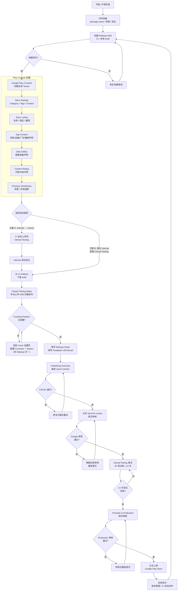
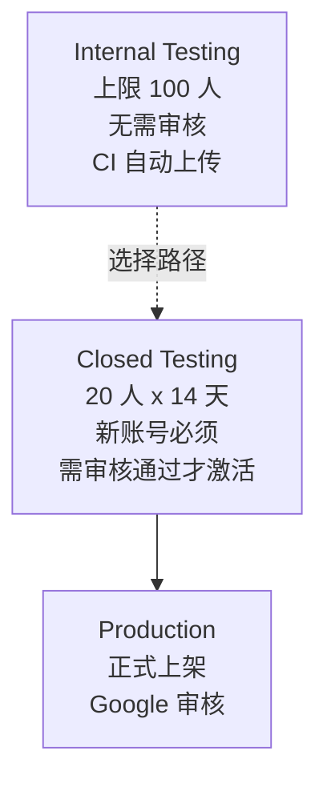

# Android Google Play 上架全流程指南

> 项目: frontend-blog-mobile (Tarsier)
> 包名: `com.tarsier.labs`
> 签名: Google Play App Signing
> 更新日期: 2026-05-21

---

## 总览流程图



---

## 一、开发与构建准备

### 1.1 代码配置

在 `android/app/build.gradle` 中配置以下关键项：

| 配置项       | 位置                                                                       | 说明                                                   |
| ------------ | -------------------------------------------------------------------------- | ------------------------------------------------------ |
| Package name | [`android/app/build.gradle:95-97`](../android/app/build.gradle:95)         | `namespace` 和 `applicationId` 设为 `com.tarsier.labs` |
| Release 签名 | [`android/app/build.gradle:107+`](../android/app/build.gradle:107)         | 配置 `release` signingConfig，引用 keystore            |
| 版本号       | [`android/app/build.gradle:100-103`](../android/app/build.gradle:100)      | 见下方版本号规则                                       |
| ProGuard     | [`android/app/build.gradle:68`](../android/app/build.gradle:68)            | `enableProguardInReleaseBuilds = true`                 |
| 屏幕方向     | [`AndroidManifest.xml:23`](../android/app/src/main/AndroidManifest.xml:23) | `portrait` 锁定竖屏                                    |
| 隐私政策     | [`PrivacyPolicyScreen.tsx`](../src/screens/PrivacyPolicyScreen.tsx)        | 应用中内置隐私政策页面                                 |

**版本号规则**:

```groovy
// android/app/build.gradle:100-103
def runNumber = System.getenv("GITHUB_RUN_NUMBER") ?: "1"
versionCode runNumber.toInteger()
versionName "1.0.1"
```

- **`versionCode`**: CI 中自动使用 `GITHUB_RUN_NUMBER` 递增加一（每次 CI 运行自动增长），本地构建默认为 `1`
- **`versionName`**: 手动按语义化版本更新（`MAJOR.MINOR.PATCH`）

### 1.2 构建 Release AAB

```bash
# Production AAB（用于 Play Store 上传）
cd android && ./gradlew bundleProductionRelease --no-daemon \
  -PreactNativeArchitectures=arm64-v8a \
  -PKEYSTORE_FILE=$KEYSTORE_FILE \
  -PKEYSTORE_PASSWORD=$KEYSTORE_PASSWORD \
  -PKEY_ALIAS=$KEY_ALIAS \
  -PKEY_PASSWORD=$KEY_PASSWORD

# 输出文件
android/app/build/outputs/bundle/productionRelease/app-production-release.aab
```

> 也可以通过 Makefile 快捷命令: `make build-prod-aab`

---

## 二、Google Play Console 配置

按照以下顺序在 Google Play Console 中完成应用配置：

### 2.1 创建应用

1. 登录 [Google Play Console](https://play.google.com/console)
2. 点击 **创建应用**
3. 填写:
   - 名称: **Tarsier**
   - 类型: **应用**
   - 定价: **免费**
   - 开发者声明: 勾选确认
   - 包名: **com.tarsier.labs**

### 2.2 Store Settings

- **类别**: Productivity（低风险，审核通过率高）
  - 不要选 News & Magazines（高风险，需新闻源授权）
- **标签**: 从预定义列表中选择 `Blog` + `News aggregator`
  - Play Console 不支持自定义标签，只能选预定义项
- **联系信息**:
  - Email: mrporterdev@gmail.com
  - 电话: +639451297266
  - 网站: blog.joyminis.com

### 2.3 Store Listing

| 项目            | 内容                                                                                       |
| --------------- | ------------------------------------------------------------------------------------------ |
| 应用名称        | Tarsier                                                                                    |
| 短描述          | 最多 80 字符                                                                               |
| 完整描述        | 最多 4000 字符                                                                             |
| 截图            | 8 张手机截图 + 10 英寸平板截图                                                             |
| Feature Graphic | 上传到 [`assets/play-store-feature-graphic.png`](../assets/play-store-feature-graphic.png) |

### 2.4 App Content 声明

| 声明项          | 回答 | 依据                                                                                             |
| --------------- | ---- | ------------------------------------------------------------------------------------------------ |
| 政府应用        | No   | Tarsier 不是政府应用                                                                             |
| 金融功能        | None | 不提供任何金融功能                                                                               |
| 广告 ID (AD_ID) | No   | [`AndroidManifest.xml`](../android/app/src/main/AndroidManifest.xml) 无 `AD_ID` 权限，无广告 SDK |
| 健康功能        | No   | 不提供健康相关功能                                                                               |

### 2.5 Data Safety

根据代码分析逐项声明以下数据收集情况:

- 账号信息（邮箱、用户名）
- 应用活动（页面浏览、文章阅读）
- 崩溃数据（Sentry 自动收集）
- 设备 ID（用于 OAuth 登录状态）

### 2.6 Content Rating

填写 IARC 内容分级问卷，Tarsier 预期为 **Everyone** 级别。

### 2.7 Pricing & Distribution

- 定价: **免费**
- 分发国家: **所有国家**
- 广告声明: **不含广告**

---

## 三、CI/CD 自动化配置

### 3.1 GitHub Secrets 配置

在 **GitHub → Settings → Secrets and variables → Actions → Repository secrets** 中添加以下 secret:

| Secret Name                | 用途                                                              | 值来源                                                        |
| -------------------------- | ----------------------------------------------------------------- | ------------------------------------------------------------- |
| `PLAY_SERVICE_ACCOUNT_KEY` | Google Play Service Account JSON（**原始 JSON 内容，非 base64**） | 从 Firebase Console 下载的 service account JSON               |
| `KEYSTORE_BASE64`          | 上传密钥库 base64 编码                                            | `base64 -i android/app/release-upload-key.keystore \| pbcopy` |
| `KEYSTORE_FILE`            | 密钥库路径                                                        | `app/release-upload-key.keystore`                             |
| `KEYSTORE_PASSWORD`        | 密钥库密码                                                        | 创建 keystore 时设置的密码                                    |
| `KEY_ALIAS`                | 密钥别名                                                          | `upload-key`                                                  |
| `KEY_PASSWORD`             | 密钥密码                                                          | 创建 key 时设置的密码                                         |
| `CODEPUSH_SERVER_URL`      | 自托管 CodePush 地址                                              | `https://codepush.joyminis.com`                               |
| `CODEPUSH_ACCESS_KEY`      | CodePush API 访问密钥                                             | 通过 REST API 生成                                            |

> ⚠️ `PLAY_SERVICE_ACCOUNT_KEY` 必须是**原始 JSON 内容**，不能 base64 编码。CI 中会对其进行 JSON 格式校验。

### 3.2 工作流概览

CI 配置文件: [`.github/workflows/deploy.yml`](../.github/workflows/deploy.yml)

**触发条件**:

| 触发方式                       | 构建环境             | 上传到 Play         |
| ------------------------------ | -------------------- | ------------------- |
| Push 到 `main`                 | production           | ✅ Internal Testing |
| Push 到 `test`                 | staging              | ❌ 不上传           |
| Push 版本标签 `v*`             | production           | ✅ Internal Testing |
| 手动触发 (`workflow_dispatch`) | 可选 test/production | 取决于选择          |

**Job 职责**:

| Job              | 运行环境      | 职责                                    |
| ---------------- | ------------- | --------------------------------------- |
| `resolve-flavor` | ubuntu-latest | 根据分支/标签决定构建 flavor            |
| `build-android`  | ubuntu-latest | 构建 AAB + 上传到 Internal Testing      |
| `build-ios`      | macos-latest  | 构建 iOS archive（未签名，仅用于存档）  |
| `codepush-test`  | ubuntu-latest | 仅 test 分支: CodePush 热更新到 Staging |

### 3.3 Google Play 上传流程

Production 构建完成后，CI 自动执行以下步骤:

**步骤 1: 解码 keystore**

```yaml
- run: echo "${{ secrets.KEYSTORE_BASE64 }}" | base64 -d > android/app/release-upload-key.keystore
```

**步骤 2: 构建 Production AAB**

```yaml
- run: cd android && ./gradlew bundleProductionRelease --no-daemon \
    -PreactNativeArchitectures=arm64-v8a \
    -PKEYSTORE_FILE=${{ secrets.KEYSTORE_FILE }} \
    -PKEYSTORE_PASSWORD=${{ secrets.KEYSTORE_PASSWORD }} \
    -PKEY_ALIAS=${{ secrets.KEY_ALIAS }} \
    -PKEY_PASSWORD=${{ secrets.KEY_PASSWORD }}
```

**步骤 3: 写入并校验 Service Account Key**

```yaml
- name: 🔑 Write & validate Google Play service account key
  env:
    PLAY_SA_KEY: ${{ secrets.PLAY_SERVICE_ACCOUNT_KEY }}
  run: |
    # 校验 secret 不为空
    if [ -z "${PLAY_SA_KEY}" ]; then
      echo "❌ ERROR: PLAY_SERVICE_ACCOUNT_KEY is empty or not configured."
      exit 1
    fi

    # 写入 JSON 文件（printf 安全处理多行 JSON）
    printf '%s' "${PLAY_SA_KEY}" > /tmp/android-play-sa.json

    # 校验 JSON 格式
    if command -v jq > /dev/null 2>&1; then
      if ! jq . /tmp/android-play-sa.json > /dev/null 2>&1; then
        echo "❌ ERROR: PLAY_SERVICE_ACCOUNT_KEY is not valid JSON"
        exit 1
      fi
      echo "✅ Service account key written & validated"
      echo "   Project: $(jq -r '.project_id' /tmp/android-play-sa.json)"
      echo "   Client email: $(jq -r '.client_email' /tmp/android-play-sa.json)"
    fi
```

**步骤 4: 上传到 Internal Testing**

```yaml
- run: |
    node scripts/upload-android-play-store.mjs \
      --service-account-json /tmp/android-play-sa.json \
      --package-name com.tarsier.labs \
      --aab-path android/app/build/outputs/bundle/productionRelease/app-production-release.aab \
      --track internal \
      --status completed
```

上传脚本 [`scripts/upload-android-play-store.mjs`](../scripts/upload-android-play-store.mjs) 使用 Google Play Developer API v3，通过 JWT 认证直接上传 AAB 到指定 track。

### 3.4 Service Account 权限配置

在 Google Play Console 中为 service account 授予权限:

1. **Google Play Console → Users & Permissions**
2. 添加 service account 邮箱（来自 JSON 中的 `client_email` 字段）
3. 授予以下权限:
   - **View app information**（查看应用信息）
   - **Create and edit draft apps**（创建和编辑草稿）
   - **Publish apps**（发布应用 — Internal Testing 需要）

### 3.5 验证清单

CI/CD 配置完成后，确认以下项目:

- [ ] `PLAY_SERVICE_ACCOUNT_KEY` 在 GitHub Secrets 中已设置（原始 JSON）
- [ ] `KEYSTORE_BASE64` 在 GitHub Secrets 中已设置
- [ ] `KEYSTORE_FILE` / `KEYSTORE_PASSWORD` / `KEY_ALIAS` / `KEY_PASSWORD` 已设置
- [ ] `CODEPUSH_SERVER_URL` 和 `CODEPUSH_ACCESS_KEY` 已设置
- [ ] GitHub Environments `test` 和 `production` 已创建
- [ ] Push 到 `main` 分支后，CI 成功上传 AAB 到 Internal Testing
- [ ] Service account 已在 Play Console Users & Permissions 中添加

---

## 四、测试与发布流程



### 4.1 Internal Testing（CI 自动上传）

**特点**:

- 无需审核，上传即生效
- 最多 100 名测试者
- CI 自动上传（每次 push 到 `main` 自动触发）

**操作步骤**:

1. Push 代码到 `main` 分支，CI 自动构建并上传到 Internal Testing
2. 在 Google Play Console → **Testing → Internal Testing** 中添加测试者邮箱
3. 测试者通过邀请链接安装应用

> Internal Testing 的测试者**无法通过 Play Store 搜索**找到应用，必须通过邀请链接安装。

### 4.2 Closed Testing（手动操作）

当 Internal Testing 验证通过后，或需要正式发布前的测试，走 Closed Testing 流程。

**前置条件**: 获取 AAB 文件

- 从 GitHub Actions Artifacts 下载 `app-production-release.aab`
- 或本地构建: `make build-prod-aab`

**操作步骤**:

```
顺序很重要! 先设置 Countries & Testers，再创建 Release。
```

1. 导航到 **Google Play Console → Testing → Closed Testing → Alpha**
2. **先设置 Countries**（Track 设置 → Select countries/regions → 选择 176 个国家 → 保存）
3. **再设置 Testers**（Track 设置 → Testers → Add email addresses → 输入邮箱 → 保存）
4. **创建 Release**（Create a new release → 上传 AAB → 填写 Release Notes）
5. 填写 Feedback URL/Email（用于测试者提交反馈，如 mrporterdev@gmail.com）
6. 检查预览，确认版本号、Countries、Testers 都正确
7. 回到 **Publishing Overview** 等待 Quick Checks（最多 10 分钟）
8. Quick Checks 通过后，点击 **Send for review** 提交审核

**Publishing Overview 页面状态说明**:

```
┌─────────────────────────────────────────────┐
│  ✓ App content (App content)                │  ← 绿色勾 = 通过
│  ✓ Store settings                           │
│  ✓ Store listing                            │
│  ✓ Data safety                              │
│  ✓ Content rating                           │
│  ✓ Pricing & distribution                   │
│  ⏳ Closed Testing (Alpha) — Quick Checks   │  ← 等待中
└─────────────────────────────────────────────┘
```

如果某部分显示未完成（没有绿色勾），点击该部分进入并**点击页面底部的 Save**，即使没有修改也要保存。

**审核通过后**:

- Google 审核通过后 Closed Testing 激活
- 需要至少 **20 名测试者**参与 **14 天连续测试**（Google 2023 年政策，新账号必须）
- 测试者需要保持活跃（安装 + 使用）

### 4.3 Promote to Production

14 天 Closed Testing 完成后:

1. 回到 **Google Play Console → Testing → Closed Testing**
2. 点击 **Promote to Production**（提升到正式版）
3. 提交 Production 审核（通常 1-3 天）
4. 审核通过后应用正式上架 Google Play Store

> **注意**: 提升到 Production 时使用的是同一个 AAB，**不需要重新构建**。版本号不变，审核通过后即上架。

### 4.4 版本迭代

正式上架后，后续版本迭代流程:

1. 开发新功能，更新 `versionName`
2. Push 到 `main` → CI 自动构建并上传到 Internal Testing
3. Internal Testing 验证通过后，从 CI Artifacts 下载 AAB
4. 手动上传到 Closed Testing 或直接 Promote to Production（如果已过新账号限制期）
5. 后续版本可用 CI 自动上传到 Internal Testing，再手动 Promote

---

## 五、关键概念

### 5.1 Internal Testing vs Closed Testing

| 特性        | Internal Testing   | Closed Testing               |
| ----------- | ------------------ | ---------------------------- |
| 审核        | 无需审核，立即生效 | 需要 Google 审核通过后才激活 |
| 测试者上限  | 100 人             | 无上限（但需审核）           |
| 新账号要求  | 可选               | **必须**，20 人 x 14 天      |
| CI 自动上传 | ✅ 已配置          | ❌ 需手动上传                |
| 使用场景    | 内部开发人员自测   | 发布前的正式测试             |

> **建议**: 首次发布直接走 Closed Testing 流程（跳过 Internal Testing），因为 Internal Testing 的测试者无法通过 Play Store 搜索安装，用户体验不如 Closed Testing。

### 5.2 Google Play App Signing

```
开发者用 Upload Key 签名 AAB
    → Google Play 用 App Signing Key 重新签名
        → 用户下载的 APK 使用 App Signing Key 签名
```

- Upload Key 丢失 = 可以找 Google 重置
- App Signing Key 丢失 = 应用无法更新（Google 保管）
- 密钥库位置: `android/app/release-upload-key.keystore`

### 5.3 版本号规则

| 字段          | 位置                                                                  | 规则                                                 |
| ------------- | --------------------------------------------------------------------- | ---------------------------------------------------- |
| `versionCode` | [`android/app/build.gradle:101-102`](../android/app/build.gradle:101) | CI 中使用 `GITHUB_RUN_NUMBER` 自动递增，每次运行唯一 |
| `versionName` | [`android/app/build.gradle:103`](../android/app/build.gradle:103)     | 语义化版本 `主版本.次版本.修订号`，手动更新          |

---

## 附录: 相关文件索引

| 文件                                                                                            | 用途                                        |
| ----------------------------------------------------------------------------------------------- | ------------------------------------------- |
| [`.github/workflows/deploy.yml`](../.github/workflows/deploy.yml)                               | CI/CD 工作流定义                            |
| [`scripts/upload-android-play-store.mjs`](../scripts/upload-android-play-store.mjs)             | Google Play 上传脚本（取代 r0adkll action） |
| [`android/app/build.gradle`](../android/app/build.gradle)                                       | Android 构建配置                            |
| [`docs/self-hosted-codepush-flow.md`](../docs/self-hosted-codepush-flow.md)                     | CodePush 热更新配置指南                     |
| [`docs/self-hosted-codepush-implementation.md`](../docs/self-hosted-codepush-implementation.md) | CodePush 实现细节                           |

> 本文档是 Android 开发与 Google Play 上架的唯一参考指南。其他相关文档作为补充参考。
