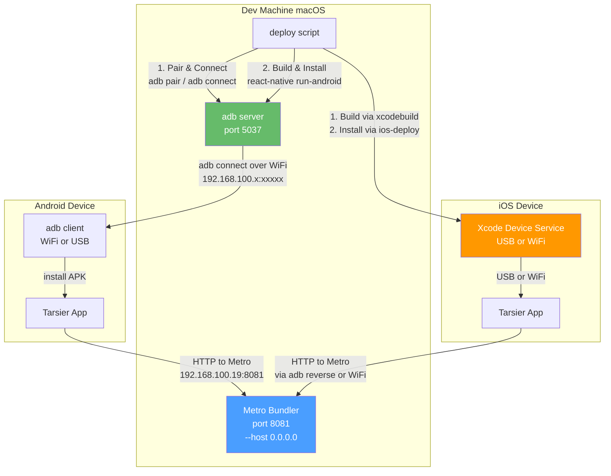

# Device Setup Guide — iOS & Android

> Covers physical device deployment over USB and WiFi for the Tarsier app.

## Prerequisites

| Requirement | iOS                                     | Android                                       |
| ----------- | --------------------------------------- | --------------------------------------------- |
| **IDE**     | Xcode 16+ (via Mac App Store)           | Android Studio (optional, for `adb`)          |
| **SDK**     | Xcode Command Line Tools                | Android SDK (platform-tools)                  |
| **Device**  | iPhone running iOS 16+                  | Android device with Developer Options enabled |
| **Cable**   | USB-Lightning/USB-C (for initial setup) | USB-C/Micro-USB (for initial setup)           |
| **Network** | Same WiFi as dev machine                | Same WiFi as dev machine                      |

---

## 1. iOS Device Setup

### One-Time Setup

1. **USB Trust**: Connect iPhone via USB → Unlock → Tap **Trust This Computer** → Enter passcode
2. **Xcode Developer Disk Image**: Xcode auto-downloads the matching iOS version's developer disk image on first connection
3. **Enable WiFi Debugging** (optional):
   - Open **Xcode → Window → Devices and Simulators**
   - Select your iPhone in the left sidebar
   - ☑️ Check **Connect via network**
   - Your iPhone is now reachable over WiFi for future builds

### Daily Usage

```bash
make dev-ios-device
```

The script:

1. Detects connected iOS devices via Xcode
2. Builds the app using `xcodebuild` (bypasses Xcode 16's `devicectl` bug)
3. Installs via `ios-deploy`
4. Shows live device logs

> **Note**: Even with WiFi enabled, the first build after a device reboot may require USB connection to re-establish trust.

---

## 2. Android Device Setup

### Option A: USB (Simpler)

1. **Enable Developer Options**:
   - Settings → About phone → Tap **Build number** 7 times
2. **Enable USB Debugging**:
   - Settings → Developer Options → **USB debugging** → ON
3. **Connect & Trust**:
   - Plug in USB cable → Accept **Allow USB debugging?** prompt on device → ☑️ **Always allow from this computer** → Allow
4. **Deploy**:
   ```bash
   make dev-android-device
   ```
   The script auto-detects USB, sets up `adb reverse tcp:8081 tcp:8081` for Metro, builds, and installs.

### Option B: WiFi (Wireless — One-Time Pairing)

#### First-Time Setup

1. Enable **Developer Options** and **USB debugging** (same as Option A steps 1–2)
2. Ensure your device is **on the same WiFi network** as your dev machine
3. Run the deployment script:
   ```bash
   make dev-android-device
   ```
4. When prompted **"No Android devices found"**, select:
   ```
   [1] Connect over WiFi (Wireless debugging)
   ```
5. On your device: **Settings → Developer Options → Wireless debugging → ON → Pair device with pairing code**
6. You'll see a screen like this:
   ```
   ╔══════════════════════════════════════╗
   ║  Wi-Fi pairing code:                 ║
   ║  192.168.100.50:39725               ║
   ║  028640                             ║
   ╚══════════════════════════════════════╝
   ```
7. In your terminal:
   - **Step A**: Enter the **IP:Port** (the line with a colon, e.g. `192.168.100.50:39725`)
   - **Step B**: Enter the **6-digit pairing code** (e.g. `028640`)
8. After pairing, enter the **service IP:Port** shown on the device (different port)
9. **Configure Metro dev server** (one-time):
   - Shake device → **Dev Menu** → **Settings**
   - Set **Debug server host & port for device** to: `192.168.100.19:8081`
   - Go back → **Reload**

#### Subsequent Runs

After the first successful WiFi pairing, the script caches the device address at:

```
~/.cache/frontend-blog-mobile/android-wifi-device
```

Just run:

```bash
make dev-android-device
```

The script auto-reconnects to the cached device — no pairing needed.

> **If auto-reconnect fails**: The device may have been rebooted or changed IP. Re-run the script and it will prompt for re-pairing.

---

## 3. Makefile Commands Reference

| Command                   | What it does                                             |
| ------------------------- | -------------------------------------------------------- |
| `make dev`                | Start Metro bundler (`yarn start`) with `--host 0.0.0.0` |
| `make dev-ios`            | Build + run on iOS Simulator                             |
| `make dev-ios-device`     | Build + run on connected iOS physical device             |
| `make dev-android`        | Build + run on Android Emulator                          |
| `make dev-android-device` | Build + run on connected Android device (USB or WiFi)    |
| `make logs-ios`           | Attach to iOS device log stream                          |
| `make logs-android`       | Attach to Android device log stream                      |
| `make doctor`             | Run environment diagnostics                              |
| `make studio-android`     | Open Android project in Android Studio                   |

---

## 4. Troubleshooting

### Android — `adb` not found

```bash
# adb is at ~/Android/sdk/platform-tools/adb
# Add to .zshrc if not already:
echo 'export ANDROID_HOME=$HOME/Android/sdk' >> ~/.zshrc
echo 'export PATH="$PATH:$ANDROID_HOME/platform-tools"' >> ~/.zshrc
source ~/.zshrc
```

The deploy script also searches common paths automatically, so this is optional.

### Android — WiFi pairing fails

- Ensure device and computer are on the **same WiFi network**
- The pairing code **expires after ~1 minute** — tap "Pair device with pairing code" again
- Restart Wireless debugging: toggle OFF → ON in Developer Options

### Android — App builds but doesn't connect to Metro on WiFi

This means you haven't set the **Debug server host & port** on the device:

1. Shake device → Dev Menu → Settings
2. Set **Debug server host & port for device** to `192.168.100.19:8081`
3. Reload

> The port `8081` is where Metro runs. The script's `yarn start` uses `--host 0.0.0.0` so it accepts connections from any LAN IP.

### iOS — "No provider was found" (CoreDeviceError 1002)

This is a known Xcode 16 bug. The `deploy-ios-device.sh` script bypasses it by using `xcodebuild` + `ios-deploy` instead of `devicectl`.

### iOS — Can't find device in Xcode Devices window

1. Check cable connection
2. **Window → Devices and Simulators** → refresh (⌘R)
3. If still not showing: restart Xcode, unlock device, reconnect USB

---

## 5. Architecture Overview


