# iOS App Store Submission & Release Complete Guide

> **Project:** Tarsier Blog (frontend-blog-mobile)
> **Apple ID:** 6775716781
> **Framework:** React Native 0.79+
> **CodePush:** Integrated (server TBD)

---

## Table of Contents

1. [Overview & Flow](#1-overview--flow)
2. [Prerequisites](#2-prerequisites)
3. [Phase 1: Code Preparation](#3-phase-1-code-preparation)
4. [Phase 2: Xcode Archive & Upload](#4-phase-2-xcode-archive--upload)
5. [Phase 3: App Store Connect Configuration](#5-phase-3-app-store-connect-configuration)
6. [Phase 4: App Privacy Questionnaire](#6-phase-4-app-privacy-questionnaire)
7. [Phase 5: Metadata & Screenshots](#7-phase-5-metadata--screenshots)
8. [Phase 6: Submit for Review](#8-phase-6-submit-for-review)
9. [Phase 7: Post-Submission](#9-phase-7-post-submission)
10. [Common Errors & Solutions](#10-common-errors--solutions)
11. [Reference Files](#11-reference-files)

---

## 1. Overview & Flow

```mermaid
flowchart TD
    subgraph "Phase 1: Code Preparation"
        A1["Check environment\nmake env-show"]
        A2["Fix Info.plist issues\nITMS errors"]
        A3["Verify PrivacyInfo.xcprivacy\nmatches questionnaire"]
    end

    subgraph "Phase 2: Archive & Upload"
        B1["Xcode → Product → Archive"]
        B2["Distribute App\nApp Store Connect / Upload"]
        B3["Wait for processing\nTestFlight ~5-30 min"]
    end

    subgraph "Phase 3: App Store Connect Config"
        C1["Select Build"]
        C2["Set Category\nProductivity"]
        C3["Content Rights\nNo"]
        C4["Age Ratings\n4+"]
        C5["Pricing\nFree"]
        C6["Privacy Policy URL"]
    end

    subgraph "Phase 4: App Privacy"
        D1["Admin fills questionnaire"]
        D2["Configure 8 data types"]
        D3["Set Tracking = No"]
        D4["Publish"]
    end

    subgraph "Phase 5: Metadata"
        E1["Upload Screenshots\n6.5 iPhone required"]
        E2["Description / Keywords"]
        E3["Support URL"]
        E4["Review Notes"]
    end

    subgraph "Phase 6: Submit"
        F1["Verify green checkmarks"]
        F2["Click Add for Review"]
        F3["Confirm submission"]
    end

    subgraph "Phase 7: Post-Submission"
        G1["Waiting for Review"]
        G2["In Review"]
        G3{"Approved?"}
        G4["Release to App Store"]
        G5["Fix & Resubmit"]
    end

    A1 --> A2 --> A3 --> B1 --> B2 --> B3
    B3 --> C1 --> C2 --> C3 --> C4 --> C5 --> C6
    C6 --> D1 --> D2 --> D3 --> D4
    D4 --> E1 --> E2 --> E3 --> E4
    E4 --> F1 --> F2 --> F3
    F3 --> G1 --> G2 --> G3
    G3 -->|"Yes"| G4
    G3 -->|"No"| G5
    G5 --> A2
```



---

## 2. Prerequisites

### 2.1 Apple Developer Program Membership

- Active **Apple Developer Program** membership (not expired)
- Verify at [developer.apple.com](https://developer.apple.com) → Membership

### 2.2 App Record Created

- App must already exist in **App Store Connect**
- Verify at [appstoreconnect.apple.com](https://appstoreconnect.apple.com) → Apps → Tarsier Blog

### 2.3 Certificates & Provisioning

- **Distribution Certificate** must be valid (not expired)
- **App Store Provisioning Profile** must include the correct bundle ID
- Check in Xcode: **Settings → Accounts → Team → View Details**

### 2.4 Required Roles

| Task                           | Required Role               |
| ------------------------------ | --------------------------- |
| Upload build (Xcode)           | Developer role or higher    |
| Fill App Privacy questionnaire | **Admin** or Account Holder |
| Submit for Review              | Admin or App Manager        |

> **Note:** If your account shows as Developer/App Manager, you CANNOT fill the App Privacy questionnaire. An Admin must do it.

---

---

## 3. Phase 1: Code Preparation

### 3.1 Switch to Production Environment

```bash
# Switch to production config
make env-prod

# Verify
make env-show
# Expected: Using env: production
# API_URL: https://tarsierlabs.app
```

Configuration files:

- [`src/lib/env.ts`](../src/lib/env.ts) — Runtime environment detection
- [`.env.production`](../.env.production) — Production env variables

### 3.2 App Information Page Fields

**Path:** App Store Connect → Apps → Tarsier Blog → App Information

These are the static fields set once when the app is first created:

| Field                 | Value                    | Notes                                |
| --------------------- | ------------------------ | ------------------------------------ |
| **App Name**          | Tarsier Blog             | Displayed on App Store               |
| **Primary Language**  | English                  | Default language                     |
| **Bundle ID**         | `com.tarsier.blog`       | Must match Xcode project             |
| **SKU**               | `frontend-blog-mobile`   | Internal identifier, not user-facing |
| **Apple ID**          | `6775716781`             | Auto-assigned, read-only             |
| **Content Rights**    | No                       | Already configured                   |
| **License Agreement** | Standard Apple Agreement | Default, read-only                   |

> **Note:** These fields are typically set once. You only need to verify they are correct before your first submission.

### 3.3 Verify Info.plist

**File:** [`ios/FrontendBlogMobile/Info.plist`](../ios/FrontendBlogMobile/Info.plist)

Key values to verify:

| Key                              | Value                           | Purpose                       |
| -------------------------------- | ------------------------------- | ----------------------------- |
| `CFBundleDisplayName`            | `$(DISPLAY_NAME)`               | App name shown on Home Screen |
| `CFBundleShortVersionString`     | `$(MARKETING_VERSION)`          | e.g. 1.0                      |
| `CFBundleVersion`                | `$(CURRENT_PROJECT_VERSION)`    | Build number, e.g. 7          |
| `NSPhotoLibraryUsageDescription` | Set (see below)                 | Required for ITMS-90683       |
| `CodePushServerURL`              | `https://codepush.joyminis.com` | CodePush server               |
| `CodePushDeploymentKey`          | `$(CODEPUSH_DEPLOYMENT_KEY)`    | Xcode build variable          |

### 3.4 Common ITMS Errors: NSPhotoLibraryUsageDescription

**Error:** ITMS-90683: Missing purpose string in Info.plist

**Cause:** Apple's static analyzer finds photo library API references in linked SDKs (even if the app itself doesn't use them).

**Fix** ([`Info.plist:40-41`](../ios/FrontendBlogMobile/Info.plist:40-41)):

```xml
<key>NSPhotoLibraryUsageDescription</key>
<string>Tarsier needs access to your photo library to save images.</string>
```

**Verify:**

```bash
# Check Info.plist for the key
grep -A1 "NSPhotoLibraryUsageDescription" ios/FrontendBlogMobile/Info.plist
```

### 3.5 Verify PrivacyInfo.xcprivacy

**File:** [`ios/FrontendBlogMobile/PrivacyInfo.xcprivacy`](../ios/FrontendBlogMobile/PrivacyInfo.xcprivacy)

This file must be complete and accurate. It is the **source of truth** for the App Privacy questionnaire (Phase 4).

Key sections:

- **NSPrivacyCollectedDataTypes** — Lists all data types the app collects
- **NSPrivacyAccessedAPITypes** — APIs the app accesses (e.g., file timestamps, disk space)
- **NSPrivacyTracking** — Must be `false` (no cross-app/website tracking)

### 3.6 Run TypeScript Check

```bash
make typecheck
```

Fix any type errors before archiving.

---

## 4. Phase 2: Xcode Archive & Upload

### 4.1 Archive the App

1. Open the Xcode workspace
2. Select **Product → Scheme → FrontendBlogMobile**
3. Select destination: **Any iOS Device (arm64)**
4. **Product → Archive** (or `⌘ + B` then Organizer)

### 4.2 Distribute to App Store Connect

1. In **Organizer** (Window → Organizer), select the latest archive
2. Click **Distribute App**
3. Select **App Store Connect**
4. Select **Upload**
5. Choose signing: **Automatically manage signing**
6. Review and **Upload**

### 4.3 Troubleshooting Upload

#### Alternative: Use Transporter (if Xcode upload fails with -19235)

1. In Organizer → select archive → **Distribute App** → **Direct Distribution**
2. Export IPA to a local folder
3. Open **Transporter** app (from Mac App Store)
4. Drag the exported `.ipa` file into Transporter
5. Click **Deliver**

### 4.4 Wait for Processing

1. Go to **App Store Connect → TestFlight → iOS**
2. The new build will appear with status:
   - ⏳ **Processing** — Apple is analyzing the binary (~5-30 min)
   - ✅ **Ready to Submit** — Processing complete, no errors
   - ❌ **Missing Compliance** — See [Section 10.2](#102-missing-compliance-encryption-export)
   - ❌ **ITMS Errors** — See [Section 10.1](#101-itms-90683-missing-nsphotolibraryusagedescription)

3. Wait for the **green checkmark** before proceeding

---

## 5. Phase 3: App Store Connect Configuration

Navigate to **App Store Connect → Apps → Tarsier Blog → App Store**

This is the **Version page** where you configure the current version being submitted (e.g., Version 1.0). You must scroll through the entire page and fill in every section.

### 5.1 Version Information Form

**Path:** Version page — fill in these text fields at the top:

| Field                          | Value                                                                                                                                                         | Required?                                                                            |
| ------------------------------ | ------------------------------------------------------------------------------------------------------------------------------------------------------------- | ------------------------------------------------------------------------------------ |
| **Subtitle**                   | Read and discover                                                                                                                                             | Optional, but recommended                                                            |
| **Description**                | Tarsier Blog is a modern, fast mobile reader for the Tarsier blog platform. Browse articles, read tech insights, and stay up to date with the latest content. | **Required** — at least a few sentences                                              |
| **What's New in This Version** | Initial release of Tarsier Blog.                                                                                                                              | **Required** — for first submission, say Initial release. For updates, list changes. |
| **Keywords**                   | blog,reader,tech,articles,productivity                                                                                                                        | **Required** — comma-separated, max 100 characters                                   |
| **Support URL**                | https://tarsierlabs.app                                                                                                                                       | **Required**                                                                         |
| **Marketing URL**              | https://tarsierlabs.app                                                                                                                                       | Optional                                                                             |

### 5.2 Select Build

1. Scroll to the **Build** section
2. Click **Select Build** → choose the processed build (e.g., Build 7)
3. Wait for green checkmark

### 5.3 Set Category

**Path:** Version page → **Category & Age Rating**

| Field              | Value            |
| ------------------ | ---------------- |
| Primary Category   | **Productivity** |
| Secondary Category | (leave empty)    |

> **Note:** Category is in the App Store version page between Subtitle and Age Ratings, NOT in App Information. If you cannot find it, scroll down past Subtitle.

### 5.4 Set Content Rights

**Path:** Version page → scroll down to **Content Rights**

| Question                                                       | Answer |
| -------------------------------------------------------------- | ------ |
| Does your app contain, display, or access third-party content? | **No** |
| Does your app contain advertisements?                          | **No** |

### 5.5 Set Age Ratings

**Path:** Version page → **Age Ratings**

For each of the 7 rating categories, set to **None**:

| Category                            | Setting |
| ----------------------------------- | ------- |
| Horror/Fear                         | None    |
| Mature/Suggestive Themes            | None    |
| Profanity or Crude Humor            | None    |
| Sexual Content or Nudity            | None    |
| Alcohol, Tobacco, or Drugs          | None    |
| Gambling and Contests               | None    |
| Unrestricted Web Access             | None    |
| Cartoon/Fantasy Violence            | None    |
| Realistic Violence                  | None    |
| Simulated Gambling                  | None    |
| Prolonged Graphic/Sadistic Violence | None    |

This results in **4+** overall age rating for all regions.

### 5.6 Set Pricing

**Path:** Left sidebar → **Pricing and Availability**

| Field        | Value                           |
| ------------ | ------------------------------- |
| Price Tier   | **Free**                        |
| Availability | All countries/regions (default) |

> **Required:** Without a price tier, the **Add for Review** button stays gray. This is the most commonly overlooked field.

### 5.7 Set Privacy Policy URL

**Path:** **App Privacy** page in main setup, or App Information page

```
https://tarsierlabs.app/en/privacy/
```

> **Note:** The production domain is configured in [`src/lib/env.ts:54`](../src/lib/env.ts:54). The backend must serve a valid HTML privacy policy at this URL, matching the in-app policy from [`src/screens/PrivacyPolicyScreen.tsx`](../src/screens/PrivacyPolicyScreen.tsx).

---

## 6. Phase 4: App Privacy Questionnaire

### 6.1 Access

**Path:** App Store Connect → Apps → Tarsier Blog → **App Privacy** (left sidebar)

Click **Get Started** to begin.

> **Critical:** This requires **Admin** or **Account Holder** role. If your account doesn't have Admin, you must contact the team Admin.

### 6.2 Data Collection Question

First question: **"Does your app collect data from this app?"**

Answer: **Yes, we collect data from this app**

### 6.3 Data Type Configuration

Reference file: [`ios/FrontendBlogMobile/PrivacyInfo.xcprivacy`](../ios/FrontendBlogMobile/PrivacyInfo.xcprivacy)

Configure each of the following data types. For each type, you must set three things:

1. **Purpose** — Why do you collect this data?
2. **Linked to User** — Is this data linked to the user's identity?
3. **Tracking** — Does this data contribute to tracking?

| #   | Data Type                            | Purpose           | Linked to User? | Tracking? |
| --- | ------------------------------------ | ----------------- | --------------- | --------- |
| 1   | **Contact Info → Email Address**     | App Functionality | Yes             | No        |
| 2   | **Contact Info → Name**              | App Functionality | Yes             | No        |
| 3   | **Identifiers → User ID**            | App Functionality | Yes             | No        |
| 4   | **Identifiers → Device ID**          | App Functionality | Yes             | No        |
| 5   | **Usage Data → Product Interaction** | Analytics         | Yes             | No        |
| 6   | **Usage Data → Other Usage Data**    | Analytics         | Yes             | No        |
| 7   | **Diagnostics → Crash Data**         | Analytics         | No              | No        |
| 8   | **Diagnostics → Performance Data**   | Analytics         | No              | No        |

#### Detailed Steps for Each Data Type

For each data type (e.g., **Name**):

1. **Step A — Purpose:** Select one or more purposes
   - Email Address, Name, User ID, Device ID → **App Functionality**
   - Product Interaction, Other Usage Data → **Analytics**
   - Crash Data, Performance Data → **Analytics**

2. **Step B — Linked to User:**
   - Yes for: Email Address, Name, User ID, Device ID, Product Interaction, Other Usage Data
   - No for: Crash Data, Performance Data

3. **Step C — Tracking:**
   - **No** for ALL data types

### 6.4 Publish the Questionnaire

After all 8 data types are configured:

1. Review the summary page — all types should show as configured
2. Click **Publish** (top of summary page)
   - Button may be gray until ALL data types are fully configured
   - Each type must have Purpose, Linked to User, AND Tracking set
3. Wait for confirmation: **"Your privacy information has been published"**

### 6.5 After Publishing

Return to the App Store version page. The **App Privacy** section should now show a green checkmark and summary of data types.

---

## 7. Phase 5: Metadata & Screenshots

### 7.1 Screenshots

**Requirement:** At least **one 6.5" iPhone display screenshot** is required for submission. You can upload up to 10 screenshots.

**Supported sizes:**
| Device Class | Screenshot Size | Requirement |
|-------------|----------------|-------------|
| 6.5" iPhone | 1242 x 2688 px or 2688 x 1242 px | **Required** (at least 1) |
| 5.5" iPhone | 1242 x 2208 px | Optional |
| iPad Pro | 2048 x 2732 px | Optional |
| Apple Watch | 368 x 448 px | N/A for this app |

**How to capture:**

```bash
# Start Metro bundler
yarn start

# In another terminal, launch the app on a simulator
npx react-native run-ios --simulator="iPhone 14 Pro Max"

# Take screenshot: ⌘ + S (simulator menu) → Save
# Screenshots are saved to Desktop by default
```

**Recommended screenshots (4-5 minimum for a good listing):**

1. **Home screen** — article feed showing content cards
2. **Article detail** — a full article view with text
3. **Category browsing** — showing the category filter or list
4. **Settings or Account** — personalization options

**Tips:**

- Use English content in screenshots (or match your primary language)
- Avoid showing placeholder/test data
- Status bar should be clean (no excessive notifications)
- Use the simulator's **File → New Screen Shot** for exact device frame output

### 7.2 Description

Write a concise description of your app (up to 4,000 characters).

**Structure:**

1. **First paragraph** — What the app is (2-3 sentences)
2. **Second paragraph** — Key features (bullet points)
3. **Third paragraph** — Value proposition

**Example:**

```
Tarsier Blog is a modern, fast mobile reader for the Tarsier blog platform. Browse articles, read tech insights, and stay up to date with the latest content from your favorite authors.

Key features:
• Clean, distraction-free reading experience
• Dark mode support for comfortable reading at night
• Category-based browsing to find content you love
• Bookmark articles to read later
• Personalized reading experience

Tarsier Blog brings you the best of technical writing and thoughtful analysis, optimized for mobile reading.
```

### 7.3 Keywords

Comma-separated list of keywords (max **100 characters** total):

```
blog,reader,tech,articles,productivity
```

**Tips:**

- Don't repeat your app name (Apple already indexes it)
- Don't use competitor names
- Prioritize high-relevance keywords
- Max 100 characters including commas

### 7.4 Support URL

```
https://tarsierlabs.app
```

### 7.5 Marketing URL (Optional)

```
https://tarsierlabs.app
```

### 7.6 Review Notes

**Path:** Version page → **Review Notes** section (at the bottom, expandable)

When submitting, Apple reviewers need to know how to use the app. Fill in these fields:

| Field                | Value                  | Notes                                                                                   |
| -------------------- | ---------------------- | --------------------------------------------------------------------------------------- |
| **Sign-in required** | Yes / No               | Does the app require a user account?                                                    |
| **Demo Account**     | email / password       | Provide a test account the reviewer can use                                             |
| **Notes**            | Any additional context | E.g., "App requires internet connection. Demo account has sample articles for testing." |
| **Contact Info**     | Your email             | For reviewer questions                                                                  |

**Example for Tarsier Blog:**

```
Sign-in required: Yes
Demo Account:
  Email: review@tarsierlabs.app
  Password: <demo-password>
Notes: The app requires an active internet connection.
       Demo account is pre-populated with sample articles and data
       for review purposes. All content is user-generated from the
       Tarsier blog platform.
Contact: developer@tarsierlabs.app
```

> **Important:** Ensure the demo account is active and working before submission. Verify login, article viewing, and basic navigation.

---

## 8. Phase 6: Submit for Review

### 8.1 Final Checklist

**App Store Version page — verify ALL sections have green checkmarks:**

Before clicking Submit, verify all sections have **green checkmarks**:

| Section                      | Status       |
| ---------------------------- | ------------ |
| Build (selected + processed) | ✅           |
| Category & Age Rating        | ✅           |
| Content Rights               | ✅           |
| Pricing (Free)               | ✅           |
| Privacy Policy URL           | ✅           |
| App Privacy questionnaire    | ✅ Published |
| Screenshots (6.5" iPhone)    | ✅           |
| Description                  | ✅           |
| Support URL                  | ✅           |

### 8.2 Add for Review

1. Click **Add for Review** (top-right of version page)
2. Review all submission items
3. Click **Submit for Review**

### 8.3 Confirm Submission

After submitting, you should see:

```
App Review
iOS Submission
Waiting for Review

Items Submitted (1)
iOS App 1.0 — 1.0 (Build X)
Status: Waiting for Review
```

You'll also receive an email confirmation from Apple:

> **Subject:** App Store Connect
> **Body:** We've received your app for review.
> On average, 50% of apps are reviewed in 24 hours and over 90% are reviewed in 48 hours.

---

## 9. Phase 7: Post-Submission

### 9.1 Status Tracking

| Status                        | Meaning                                                        |
| ----------------------------- | -------------------------------------------------------------- |
| **Waiting for Review**        | In the queue. No action needed.                                |
| **In Review**                 | Apple is actively reviewing.                                   |
| **Ready for Sale**            | ✅ Approved! App will appear on App Store.                     |
| **Pending Developer Release** | ✅ Approved but waiting for manual release.                    |
| **Rejected**                  | ❌ Apple found issues. See resolution email.                   |
| **Metadata Rejected**         | ⚠️ Only metadata needs to change. No resubmit of build needed. |

### 9.2 After Approval

If **Manual Release** is configured:

1. Go to **App Store Connect → Apps → Tarsier Blog → App Store**
2. Click **Release This Version**

If **Automatic Release**, the app will appear on the App Store automatically.

### 9.3 After Rejection

1. Read the **Resolution Center** message from Apple
2. Understand the specific issue(s)
3. Fix the issues in code/metadata
4. Create a new build (bump build number)
5. Resubmit

> **Note:** Resubmitting resets the 48-hour review clock.

---

## 10. Common Errors & Solutions

### 10.1 ITMS-90683: Missing NSPhotoLibraryUsageDescription

**Error message:**

```
ITMS-90683: Missing Purpose String in Info.plist - ...
Your app's code references one or more APIs that access sensitive user data.
```

**Cause:** Apple's static analysis finds photo library API references in linked SDKs.

**Fix:** Add to [`Info.plist:40-41`](../ios/FrontendBlogMobile/Info.plist):

```xml
<key>NSPhotoLibraryUsageDescription</key>
<string>Tarsier needs access to your photo library to save images.</string>
```

### 10.2 Missing Compliance (Encryption Export)

**Error:** Build shows **"Missing Compliance"** in TestFlight.

**Fix:**

1. In **App Store Connect → TestFlight → iOS → Build**
2. Click **Manage** next to the build
3. Select: **"None of the algorithms mentioned above"**
4. Confirm

> **Reason:** The app only uses Apple's built-in HTTPS/SSL, which is exempt from encryption export regulations.

### 10.3 Cannot Add for Review Button is Gray

**Checklist:**

- [ ] Build selected and processed
- [ ] Category set
- [ ] Content Rights answered
- [ ] Privacy Policy URL set
- [ ] App Privacy questionnaire completed and **published**
- [ ] Pricing set to **Free**
- [ ] At least one screenshot uploaded
- [ ] Description filled in
- [ ] Support URL filled in

### 10.4 ITMS-90425: Missing App Icon

**Fix:** Ensure all required icon sizes are present in:
[`ios/FrontendBlogMobile/Images.xcassets/AppIcon.appiconset/`](../ios/FrontendBlogMobile/Images.xcassets/AppIcon.appiconset/)

Required: 1024x1024px (App Store) + all device-specific sizes.

### 10.5 ITMS-90078: Missing Push Notification Entitlement

If your app references push notification APIs but lacks the entitlement:

- Add Push Notifications capability in Xcode
- Or remove push notification references if not used

### 10.6 Upload Error -19235 (Xcode)

**Fix:**

1. Use **Transporter** app instead of Xcode upload
2. Export IPA via **Organizer → Distribute App → Direct Distribution**
3. Open Transporter → drag IPA → Deliver

---

## 11. Reference Files

| File                                                                                                                                                    | Purpose                                              |
| ------------------------------------------------------------------------------------------------------------------------------------------------------- | ---------------------------------------------------- |
| [`ios/FrontendBlogMobile/Info.plist`](../ios/FrontendBlogMobile/Info.plist)                                                                             | App metadata, permissions, CodePush config           |
| [`ios/FrontendBlogMobile/PrivacyInfo.xcprivacy`](../ios/FrontendBlogMobile/PrivacyInfo.xcprivacy)                                                       | Privacy manifest — source of truth for questionnaire |
| [`src/lib/env.ts`](../src/lib/env.ts)                                                                                                                   | Runtime environment config (dev/test/prod URLs)      |
| [`src/screens/PrivacyPolicyScreen.tsx`](../src/screens/PrivacyPolicyScreen.tsx)                                                                         | In-app privacy policy screen                         |
| [`.env.production`](../.env.production)                                                                                                                 | Production environment variables                     |
| [`App.tsx`](../App.tsx)                                                                                                                                 | Root component with CodePush HOC wrapper             |
| [`scripts/deploy-ios-device.sh`](../scripts/deploy-ios-device.sh)                                                                                       | Deploy production build to USB-connected iPhone      |
| [`ios/FrontendBlogMobile/Images.xcassets/AppIcon.appiconset/Contents.json`](../ios/FrontendBlogMobile/Images.xcassets/AppIcon.appiconset/Contents.json) | App icon configuration                               |
| [`plans/ios-app-store-publishing-plan.md`](../plans/ios-app-store-publishing-plan.md)                                                                   | Full publishing guide (build, certs, CI/CD)          |
| [`plans/ios-app-store-submission-fix-plan.md`](../plans/ios-app-store-submission-fix-plan.md)                                                           | Initial fix plan for this submission                 |

---

## Appendix A: Checklist Template

Use this checklist for future submissions:

```markdown
- [ ] Switch to production env (make env-prod)
- [ ] Verify Info.plist keys
- [ ] Run typecheck
- [ ] Archive in Xcode (Any iOS Device)
- [ ] Upload to App Store Connect
- [ ] Wait for processing
- [ ] Select build in version page
- [ ] Set Category: Productivity
- [ ] Set Content Rights: No
- [ ] Set Age Ratings: 4+
- [ ] Set Pricing: Free
- [ ] Set Privacy Policy URL
- [ ] Complete App Privacy questionnaire
- [ ] Publish privacy questionnaire
- [ ] Upload screenshots
- [ ] Fill description / keywords / support URL
- [ ] Submit for Review
```

## Appendix B: CodePush Quick Reference

> **Status:** Code is integrated but server not yet deployed.

If you need to temporarily disable CodePush (e.g., for testing without server):

```ts
// In App.tsx — comment out the HOC wrapper
// const App = codePush(codePushOptions)(AppComponent);
const App = AppComponent; // Remove CodePush temporarily
```

Server deployment guide: [`docs/self-hosted-codepush-implementation.md`](self-hosted-codepush-implementation.md)
