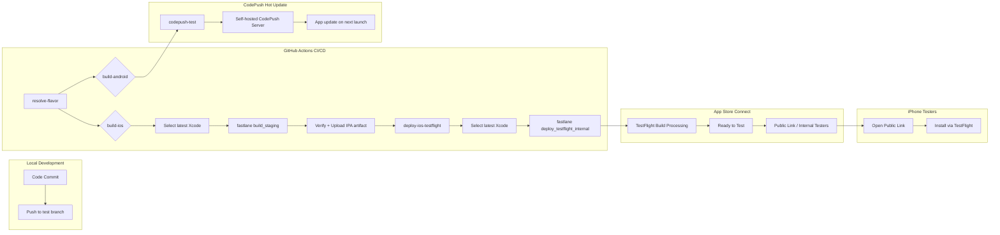

# iOS CI/CD Pipeline — Complete Implementation Guide

> **Last updated**: 2026-06-13
> **Project**: FrontendBlogMobile (Tarsier Blog)
> **Framework**: React Native 0.79+
> **Bundle IDs**: `com.tarsier.labs` (Production) / `com.tarsier.labs.test` (Test)
> **Team ID**: `PK28T343BP`

---

## Table of Contents

1. [Architecture Overview](#1-architecture-overview)
2. [Current State](#2-current-state)
3. [File Inventory](#3-file-inventory)
4. [The Full Story: 32 Problems Solved](#4-the-full-story-32-problems-solved)
5. [How the CI Pipeline Works](#5-how-the-ci-pipeline-works)
6. [How to Release via CI](#6-how-to-release-via-ci)
7. [TestFlight Distribution](#7-testflight-distribution)
8. [Troubleshooting Reference](#8-troubleshooting-reference)
9. [What's Still Left](#9-whats-still-left)

---

## 1. Architecture Overview



### Key Design Decisions

| Decision                         | Rationale                                                             |
| -------------------------------- | --------------------------------------------------------------------- |
| **Separation of build & deploy** | If build fails, deploy never runs. No broken builds in TestFlight.    |
| **resolve-flavor**               | Single source of truth for test vs production branching               |
| **Fastlane lanes**               | All logic encapsulated in Fastfile; CI yml is just thin orchestration |
| **App Store Connect API Key**    | No Apple ID password in CI — uses `.p8` key for auth                  |
| **Artifact passthrough**         | IPA built once, uploaded as artifact, then downloaded by deploy job   |
| **Select latest Xcode**          | CI runners may have outdated default Xcode; explicitly pick newest    |

---

## 2. Current State

### ✅ Phase 1: Infrastructure — COMPLETE

| Item                     | Status        | Details                                           |
| ------------------------ | ------------- | ------------------------------------------------- |
| Fastlane 2.236.1         | ✅ Installed  | Homebrew Ruby 3.4.1                               |
| `ios/Gemfile`            | ✅ Created    | `fastlane`, `cocoapods`, `fastlane-plugin-sentry` |
| `ios/fastlane/Fastfile`  | ✅ Created    | 9 lanes                                           |
| `ios/fastlane/Appfile`   | ✅ Created    | `com.tarsier.labs`                                |
| `ios/fastlane/Matchfile` | ✅ Configured | `readonly(true)`                                  |
| `ios/Gemfile.lock`       | ✅ Present    | Locked gem versions                               |

### ✅ Phase 2: Code Signing — COMPLETE

| Item                      | Status        | Details                                                        |
| ------------------------- | ------------- | -------------------------------------------------------------- |
| Private cert repo         | ✅ Created    | `MrBigPorter/ios-certs` (private GitHub)                       |
| Distribution Certificate  | ✅ Created    | `Apple Distribution: kehang wei (PK28T343BP)` ID: `N97YBNDQ7L` |
| Provisioning Profiles     | ✅ Created    | `match AppStore com.tarsier.labs` + `com.tarsier.labs.test`    |
| App Store Connect API Key | ✅ Created    | `Tarsier Labs CI` — Key ID: `UBW264Z9Z8`                       |
| GitHub Secrets (7)        | ✅ Configured | All secrets in place                                           |

### ✅ Phase 3: CI Pipeline — COMPLETE

| Item                              | Status      | Details                                        |
| --------------------------------- | ----------- | ---------------------------------------------- |
| `build_staging` lane              | ✅ Working  | Builds Test IPA, signs, uploads artifact       |
| `build_production` lane           | ✅ Working  | Builds Production IPA, signs, uploads artifact |
| `deploy_testflight_internal` lane | ✅ Working  | Uploads Test IPA to TestFlight                 |
| `deploy_testflight_external` lane | ✅ Created  | Ready for external beta                        |
| `deploy_app_store` lane           | ✅ Created  | Ready for App Store submission                 |
| Build + Deploy separation         | ✅ Working  | Two-job workflow                               |
| Select latest Xcode               | ✅ Working  | Auto-selects newest Xcode on runner            |
| CodePush test                     | ✅ Working  | Auto-pushes JS update after native build       |
| First TestFlight upload           | ✅ **Done** | Build 1.0 (9) uploaded successfully            |

### ✅ Phase 4: TestFlight Distribution — COMPLETE

| Item                       | Status      | Details                               |
| -------------------------- | ----------- | ------------------------------------- |
| Export Compliance          | ✅ Set      | No encryption used                    |
| Test group "internal test" | ✅ Created  | Internal testers group                |
| Public Link                | ✅ Enabled  | Shareable link for installation       |
| App installed on iPhone    | ✅ **Done** | Tarsier Test installed via TestFlight |

---

## 3. File Inventory

### 3.1 Fastlane Configuration

| File                                                    | Purpose             | Key Contents                                                               |
| ------------------------------------------------------- | ------------------- | -------------------------------------------------------------------------- |
| [`ios/fastlane/Fastfile`](../ios/fastlane/Fastfile)     | Core pipeline logic | 9 lanes, `app_store_connect_api_key()` helper                              |
| [`ios/fastlane/Matchfile`](../ios/fastlane/Matchfile)   | Code signing config | `git_url`, `app_identifier(['com.tarsier.labs', 'com.tarsier.labs.test'])` |
| [`ios/fastlane/Appfile`](../ios/fastlane/Appfile)       | App identity        | `app_identifier('com.tarsier.labs')`, `apple_id(ENV['APPLE_ID'])`          |
| [`ios/fastlane/Pluginfile`](../ios/fastlane/Pluginfile) | Plugins             | `fastlane-plugin-sentry`                                                   |
| [`ios/Gemfile`](../ios/Gemfile)                         | Ruby deps           | `fastlane`, `cocoapods`                                                    |

### 3.2 Xcode Configuration

| File                                                                                                      | Purpose                                                                            |
| --------------------------------------------------------------------------------------------------------- | ---------------------------------------------------------------------------------- |
| [`ios/FrontendBlogMobile.xcodeproj/project.pbxproj`](../ios/FrontendBlogMobile.xcodeproj/project.pbxproj) | **Modified**: Added `CODE_SIGN_STYLE = Manual` to all 6 target-level build configs |
| [`ios/Config/Test.xcconfig`](../ios/Config/Test.xcconfig)                                                 | Test flavor: `com.tarsier.labs.test`, display `Tarsier(Test)`                      |
| [`ios/Config/Prod.xcconfig`](../ios/Config/Prod.xcconfig)                                                 | Production flavor: `com.tarsier.labs`, display `Tarsier`                           |

### 3.3 CI/CD Workflow

| File                                                              | Purpose                                                                                                                   |
| ----------------------------------------------------------------- | ------------------------------------------------------------------------------------------------------------------------- |
| [`.github/workflows/deploy.yml`](../.github/workflows/deploy.yml) | CI pipeline: 5 jobs (resolve-flavor, build-android, build-ios, deploy-ios-testflight, codepush-test, codepush-production) |

---

## 4. The Full Story: 32 Problems Solved

This project went through **two full days of debugging** to get iOS CI/CD fully working. Here's every problem we encountered, organized by phase.

### Phase 0: Local Xcode Build Issues (Before CI)

These are foundational issues that had to be resolved before CI could even be attempted.

| #   | Problem                              | Root Cause                                                              | Fix                                                                        | Doc Link                                                                                                              |
| --- | ------------------------------------ | ----------------------------------------------------------------------- | -------------------------------------------------------------------------- | --------------------------------------------------------------------------------------------------------------------- |
| 1   | **PIF transfer session deadlock**    | Opened `.xcodeproj` instead of `.xcworkspace`; Xcode build service hung | `make clean` + kill zombie processes + `make xcode` (opens `.xcworkspace`) | [`plans/ios-build-fix-plan.md`](../plans/ios-build-fix-plan.md)                                                       |
| 2   | **No such module 'CodePush'**        | Same root cause — wrong workspace; code was correct                     | Auto-resolved after fix #1                                                 |                                                                                                                       |
| 3   | **Hermes dSYM UUID mismatch**        | dsymutil script in Podfile referenced wrong path                        | Rewrote script to use `$BUILT_PRODUCTS_DIR`                                | [`plans/dsym-missing-fix-plan.md`](../plans/dsym-missing-fix-plan.md)                                                 |
| 4   | **App Store rejection (Build 8)**    | Review feedback required app changes                                    | Adjusted based on App Store Connect feedback                               | [`plans/ios-app-store-rejection-fix-plan.md`](../plans/ios-app-store-rejection-fix-plan.md)                           |
| 5   | **BootSplash/LaunchScreen**          | Storyboard or asset configuration                                       | Adjusted BootSplash config                                                 | [`plans/ios-bootsplash-fix-plan.md`](../plans/ios-bootsplash-fix-plan.md)                                             |
| 6   | **New Architecture build failure**   | RN New Arch compatibility                                               | Build config adjustments                                                   | [`plans/ios-new-arch-build-fix-plan.md`](../plans/ios-new-arch-build-fix-plan.md)                                     |
| 7   | **Missing RCTAppDependencyProvider** | Missing module registration                                             | Added dependency provider                                                  | [`plans/ios-missing-rctappdependencyprovider-fix-plan.md`](../plans/ios-missing-rctappdependencyprovider-fix-plan.md) |
| 8   | **Codegen build failure**            | RN Codegen phase error                                                  | Fixed codegen config                                                       | [`plans/ios-codegen-build-fix-plan.md`](../plans/ios-codegen-build-fix-plan.md)                                       |
| 9   | **Simulator launch failure**         | Simulator runtime/cache                                                 | Reset simulator content                                                    | [`plans/ios-simulator-launch-fix-plan.md`](../plans/ios-simulator-launch-fix-plan.md)                                 |
| 10  | **libwebp compilation error**        | Third-party library issue                                               | Build config workaround                                                    | [`plans/ios-build-libwebp-fix-plan.md`](../plans/ios-build-libwebp-fix-plan.md)                                       |
| 11  | **OAuth native channel integration** | Native module linking                                                   | Added OAuth native files                                                   | [`plans/ios-oauth-native-channel-summary.md`](../plans/ios-oauth-native-channel-summary.md)                           |
| 12  | **Build failure after clean purge**  | DerivedData + cache wipe rom                                            | Sequential rebuild steps                                                   | [`plans/ios-build-fix-after-purge-plan.md`](../plans/ios-build-fix-after-purge-plan.md)                               |

### Phase 1: Infrastructure Setup Issues

Setting up fastlane, match, and API keys.

| #   | Problem                          | Root Cause                                     | Fix                                           | Doc Link                                                                        |
| --- | -------------------------------- | ---------------------------------------------- | --------------------------------------------- | ------------------------------------------------------------------------------- |
| 13  | **Ruby version too old**         | macOS system Ruby 2.x, need 3.4+               | Homebrew Ruby 3.4.1, Gemfile lock             |                                                                                 |
| 14  | **Match first-run readonly**     | `readonly: true` blocks cert creation          | First run with `readonly: false`, then switch | [`ios/fastlane/Matchfile`](../ios/fastlane/Matchfile)                           |
| 15  | **API Key permissions**          | Insufficient role on key                       | Regenerate with Admin role                    |                                                                                 |
| 16  | **7 GitHub Secrets to manage**   | Many interrelated secrets                      | Created checklist; store in GitHub env        |                                                                                 |
| 17  | **p8 key invalid curve name** 🔥 | PEM multi-line format broken in GitHub Secrets | Base64 encode p8 → single line → store        | [`plans/ios-p8-key-format-fix-plan.md`](../plans/ios-p8-key-format-fix-plan.md) |

### Phase 2: CI Workflow Design

Designing the pipeline itself.

| #   | Problem                            | Root Cause                      | Fix                                     |
| --- | ---------------------------------- | ------------------------------- | --------------------------------------- |
| 18  | **Original build skipped signing** | `CODE_SIGNING_REQUIRED=NO` hack | Migrated to fastlane + match            |
| 19  | **No flavor detection**            | Single job for all branches     | Added `resolve-flavor` job              |
| 20  | **CocoaPods slow in CI**           | Redownload every run            | Added `actions/cache@v4` for `ios/Pods` |
| 21  | **9 lanes needed**                 | Multiple build/deploy scenarios | Designed full Fastfile                  |

### Phase 3: CI Build Errors (The 2-Day Debugging Session)

The actual CI errors in sequence.

| #   | Error                                                                    | Root Cause                                                                       | Fix                                                              | Commit    |
| --- | ------------------------------------------------------------------------ | -------------------------------------------------------------------------------- | ---------------------------------------------------------------- | --------- |
| 22  | **"conflicting provisioning settings"** 🔥                               | pbxproj missing `CODE_SIGN_STYLE = Manual` in 6 target-level configs             | Added `CODE_SIGN_STYLE = Manual;`                                | `40a8dda` |
| 23  | **"No signing certificate 'iOS Development' found"** 🔥                  | Xcode defaulted to `iPhone Developer` but match uses Distribution                | Added `CODE_SIGN_IDENTITY='iPhone Distribution'` to xcargs       | `bd92f3f` |
| 24  | **"No IPA file found in ios/build/"**                                    | gym output path didn't match CI artifact path                                    | Added `output_directory: './build'`                              | `73f2222` |
| 25  | **"No value found for 'username'"** 🔥                                   | CI called `fastlane run pilot upload` directly, bypassing Fastfile API key logic | Refactored into `deploy_testflight_internal` lane with `api_key` | `f760302` |
| 26  | **"No suitable application records found for com.tarsier.labs.test"** 🔥 | Two bugs: wrong `app_identifier` in Fastfile + missing App Store Connect record  | Fixed `app_identifier` + created "Tarsier Test" app in ASC       | `1c7d048` |
| 27  | **"SDK version issue" — iOS 18.5 vs iOS 26** 🔥                          | CI runner default Xcode 16.4; Apple requires iOS 26+ SDK for new apps            | Added "Select latest Xcode" step                                 | `34566af` |
| 28  | **Trailing colon in Xcode path**                                         | `ls /Applications/Xcode*.app` returns `Xcode_26.3.app:` with colon               | Added `tr -d '[:space:]:'`                                       | `e563242` |

### Phase 4: TestFlight Distribution

Getting the app onto testers' phones.

| #   | Problem                                | Root Cause                                   | Fix                                                |
| --- | -------------------------------------- | -------------------------------------------- | -------------------------------------------------- |
| 29  | **Export Compliance not set**          | Build stuck at "Ready to Test"               | Set "No encryption used" per build                 |
| 30  | **Test group not created**             | No testers could receive app                 | Created "internal test" group + added Apple ID     |
| 31  | **TestFlight shows Redeem Code popup** | Internal tester flow not working as expected | Switched to Public Link method                     |
| 32  | **Public Link needed**                 | Easiest distribution method                  | Enabled in ASC → TestFlight settings → shared link |

### Total: 32 problems solved across 5 phases

---

## 5. How the CI Pipeline Works

### 5.1 Trigger

The pipeline triggers on:

| Trigger                 | Flavor                 | What Happens                                                  |
| ----------------------- | ---------------------- | ------------------------------------------------------------- |
| Push to `test` branch   | `test`                 | Build Test IPA → Upload TestFlight → CodePush Staging         |
| Push to `hotfix` branch | `test`                 | Same as test                                                  |
| Push tag `v*`           | `production`           | Build Production IPA → Upload App Store → CodePush Production |
| Manual dispatch         | `test` or `production` | User picks via workflow_dispatch                              |
| Repository dispatch     | `test`                 | CodePush only (hot update)                                    |

### 5.2 Job Flow

```
resolve-flavor (ubuntu-latest)
  └─ outputs: flavor, flavor_label
      │
      ├── build-ios (macos-latest, 60min)
      │   ├── Checkout + Install JS deps
      │   ├── Pod install (cached)
      │   ├── Setup Ruby + bundler-cache
      │   ├── Select latest Xcode
      │   ├── fastlane build_staging / build_production
      │   ├── Verify IPA (check size)
      │   └── Upload IPA artifact
      │
      ├── build-android (ubuntu-latest, 30min)
      │   └── ... (Android build)
      │
      └── deploy-ios-testflight (macos-latest, 30min)
          └─ ONLY if build-ios succeeded
              ├── Download IPA artifact
              ├── Select latest Xcode
              └── fastlane deploy_testflight_internal

      └── codepush-test / codepush-production (ubuntu-latest)
          └─ JS-only hot update to self-hosted CodePush server
```

### 5.3 Fastlane Lanes Detail

#### `build_staging`

```ruby
lane :build_staging do
  api_key = app_store_connect_api_key
  match(type: 'appstore', readonly: false, api_key: api_key)
  increment_build_number(build_number: app_store_build_number(api_key: api_key) + 1)
  gym(
    scheme: 'FrontendBlogMobile-Test',
    configuration: 'Release-Test',
    export_method: 'app-store',
    output_name: 'TarsierBlog-Test.ipa',
    output_directory: './build',
    include_symbols: false,
    clean: true,
    xcargs: "PROVISIONING_PROFILE_SPECIFIER='match AppStore com.tarsier.labs.test' CODE_SIGN_IDENTITY='iPhone Distribution'"
  )
end
```

#### `deploy_testflight_internal`

```ruby
lane :deploy_testflight_internal do |options|
  ipa = options[:ipa] || './build/TarsierBlog-Test.ipa'
  pilot(
    ipa: ipa,
    app_identifier: 'com.tarsier.labs.test',
    distribute_external: false,
    groups: ['Internal Testers'],
    skip_waiting_for_build_processing: true,
    changelog: latest_changelog,
    api_key: app_store_connect_api_key   # ← KEY: uses API key, not Apple ID password
  )
end
```

### 5.4 The Critical "Select Latest Xcode" Step

This step is in **both** `build-ios` and `deploy-ios-testflight` jobs:

```yaml
- name: Select latest Xcode
  run: |
    LATEST_XCODE=$(ls /Applications/Xcode*.app 2>/dev/null | sort -V | tail -1 | tr -d '[:space:]:')
    if [ -z "$LATEST_XCODE" ]; then
      echo "::error::No Xcode found in /Applications"
      exit 1
    fi
    echo "Selected: $LATEST_XCODE"
    sudo xcode-select -s "$LATEST_XCODE"
    xcodebuild -version
```

**Why both jobs?** The `build-ios` job needs the right Xcode for compilation (SDK version match). The `deploy-ios-testflight` job also needs it because `fastlane pilot` uses `xcrun` under the hood, which depends on the active Xcode.

**The `tr -d '[:space:]:'` fix**: Without this, `ls` output for Xcode_26.3.app includes a trailing colon (`Xcode_26.3.app:`) causing `xcode-select -s` to fail with "invalid path".

---

## 6. How to Release via CI

### 6.1 Test Release (to TestFlight)

```bash
# Push to test branch — fully automated
git checkout -b test
git push origin test
# Wait ~10-15 min for CI
# Share Public Link with testers
```

### 6.2 What CI Does for Test

1. Builds `FrontendBlogMobile-Test` scheme (`.test` bundle ID)
2. Signs with Distribution certificate via match
3. Increments build number
4. Exports IPA
5. Uploads IPA to TestFlight (Build → "Ready to Test")
6. Pushes CodePush Staging update (JS-only, no native)

### 6.3 Production Release (to App Store)

```bash
git tag v1.1.0
git push origin v1.1.0
# CI builds production IPA and uploads via deliver
# Then manually submit in App Store Connect for review
```

### 6.4 Hotfix (CodePush only)

Triggered via repository dispatch or `hotfix` branch — pushes JS bundle only, no native build needed.

---

## 7. TestFlight Distribution

### 7.1 How Testers Install

**Option A: Public Link (Recommended)**

1. Open the Public Link URL on iPhone
2. Tap "Start Testing"
3. TestFlight opens → tap "Install"
4. Done

**Option B: Internal Testers**

1. Add tester's Apple ID to App Store Connect → TestFlight → Internal Testers
2. Tester opens TestFlight app → Apps tab
3. Tap "Tarsier Test" → Install

### 7.2 Setting Up Public Link

1. [App Store Connect](https://appstoreconnect.apple.com) → App → TestFlight
2. Scroll to **Public Link** section
3. Toggle ON
4. Set a password (e.g., `tarsier2026`)
5. Click **Start**
6. Copy the generated link

### 7.3 Export Compliance

Must be set per build version in TestFlight:

- If app uses **only HTTPS** → Select **"No"**
- If app uses **custom encryption** → Select **"Yes"** and submit documentation

Located at: App Store Connect → App → TestFlight → Build → Export Compliance

---

## 8. Troubleshooting Reference

### 8.1 CI Build Errors

| Error Message                                    | Most Likely Fix                                          | See Issue # |
| ------------------------------------------------ | -------------------------------------------------------- | ----------- |
| `conflicting provisioning settings`              | pbxproj missing `CODE_SIGN_STYLE = Manual`               | #22         |
| `No signing certificate "iOS Development" found` | Add `CODE_SIGN_IDENTITY='iPhone Distribution'` to xcargs | #23         |
| `No IPA file found in ios/build/`                | Check `output_directory` in gym matches CI artifact path | #24         |
| `No value found for 'username'`                  | Use Fastlane lane with `api_key`, not direct pilot       | #25         |
| `No suitable application records found`          | Create App in App Store Connect for that bundle ID       | #26         |
| `SDK version issue` / `iOS X SDK`                | Add "Select latest Xcode" step                           | #27-28      |
| `invalid curve name`                             | Base64-encode p8 key, set `is_key_content_base64: true`  | #17         |
| `The IPA is invalid`                             | Check `export_method: 'app-store'` in gym                | -           |
| `Invalid Provisioning Profile`                   | Re-run `fastlane match` (certs may have expired)         | #14         |

### 8.2 TestFlight Distribution Errors

| Symptom                                               | Likely Fix                                           | See Issue # |
| ----------------------------------------------------- | ---------------------------------------------------- | ----------- |
| Build shows "Ready to Test" but cannot install        | Set Export Compliance per build                      | #29         |
| TestFlight asks for Redeem Code                       | Use Public Link instead                              | #31         |
| Testers can't find the app                            | Check they're added to test group OR use Public Link | #30         |
| Build appears in TestFlight but not on tester's phone | Remove and re-add tester, or wait for processing     | #30         |
| "No devices registered"                               | Public Link doesn't need device registration         | -           |

### 8.3 Xcode / Local Build Errors

| Symptom              | Likely Fix                                                | See Issue # |
| -------------------- | --------------------------------------------------------- | ----------- |
| PIF session deadlock | Close Xcode → kill zombie processes → open `.xcworkspace` | #1          |
| Module not found     | Ensure you opened `.xcworkspace` not `.xcodeproj`         | #2          |
| dSYM UUID mismatch   | Check dsymutil script path in Podfile                     | #3          |

---

## 9. What's Still Left

These items are ready but not yet activated:

| Item                    | Status                                | Notes                                                 |
| ----------------------- | ------------------------------------- | ----------------------------------------------------- |
| Sentry dSYM upload      | 🟡 **Ready, needs SENTRY_AUTH_TOKEN** | Lane exists, just needs the GitHub Secret             |
| Slack notifications     | 🟡 **Ready, needs SLACK_WEBHOOK_URL** | Lane exists, just needs the secret                    |
| Smart build skipping    | ⬜ **Not started**                    | Skip native build if only JS changed (CodePush only)  |
| Version auto-tagging    | ⬜ **Not started**                    | Sync `MARKETING_VERSION` from git tags                |
| Production App Store CI | 🟡 **Lane ready, not tested**         | `deploy_app_store` lane exists, needs production test |

---

## Appendix A: GitHub Secrets Reference

| Secret                          | Source                                      | Used By                                |
| ------------------------------- | ------------------------------------------- | -------------------------------------- |
| `APP_STORE_CONNECT_KEY_ID`      | App Store Connect API Key → Key ID          | Fastfile `app_store_connect_api_key()` |
| `APP_STORE_CONNECT_ISSUER_ID`   | App Store Connect API Key → Issuer ID       | Fastfile `app_store_connect_api_key()` |
| `APP_STORE_CONNECT_KEY_CONTENT` | `.p8` file → `base64` encoded               | Fastfile `app_store_connect_api_key()` |
| `MATCH_PASSWORD`                | Set during `fastlane match init`            | Match decrypts certs                   |
| `MATCH_GIT_BASIC_AUTHORIZATION` | GitHub PAT → `echo -n "user:pat" \| base64` | Match clones cert repo                 |
| `APPLE_ID`                      | Apple Developer email                       | Appfile                                |
| `TEAM_ID`                       | Apple Developer Team ID                     | Appfile                                |

## Appendix B: Key Commands

```bash
# Local build
cd ios && bundle exec fastlane build_staging
cd ios && bundle exec fastlane build_production

# Local TestFlight upload (must build first)
cd ios && bundle exec fastlane deploy_testflight_internal

# Full pipeline locally
cd ios && bundle exec fastlane staging_pipeline

# Match: refresh certificates
cd ios && bundle exec fastlane match appstore --readonly false

# List all lanes
cd ios && bundle exec fastlane lanes
```

## Appendix C: Related Documents

| Document                                                                                        | Purpose                                            |
| ----------------------------------------------------------------------------------------------- | -------------------------------------------------- |
| [`docs/ios-app-store-submission-complete-guide.md`](ios-app-store-submission-complete-guide.md) | Manual App Store submission guide (932 lines)      |
| [`plans/enterprise-ios-ci-cd-plan.md`](../plans/enterprise-ios-ci-cd-plan.md)                   | Original enterprise architecture plan (1025 lines) |
| [`plans/universal-ios-ci-cd-template.md`](../plans/universal-ios-ci-cd-template.md)             | Reusable template for any iOS project              |
