# iOS CI/CD Pipeline — Implementation Progress Summary

> **Last updated**: 2026-06-12
> **Project**: FrontendBlogMobile (`com.tarsier.labs`)
> **Team ID**: `PK28T343BP`
> **Apple Developer Account**: See GitHub Secrets (`APPLE_ID`)

---

## ✅ Completed

### Phase 1: Infrastructure

| Item                      | Status       | Details                                                                                                                                                                        |
| ------------------------- | ------------ | ------------------------------------------------------------------------------------------------------------------------------------------------------------------------------ |
| Fastlane 2.236.1          | ✅ Installed | Homebrew Ruby 3.4.1, binary at `/Users/porter/.gem/ruby/3.4.0/bin/fastlane`                                                                                                    |
| `ios/Gemfile`             | ✅ Created   | Sources `fastlane`, `cocoapods`, `fastlane-plugin-sentry`                                                                                                                      |
| `ios/fastlane/Fastfile`   | ✅ Created   | 9 lanes (test, build_staging, build_production, deploy_testflight_internal, deploy_testflight_external, deploy_app_store, upload_dsyms, production_pipeline, staging_pipeline) |
| `ios/fastlane/Appfile`    | ✅ Created   | `app_identifier('com.tarsier.labs')`, reads `APPLE_ID` and `TEAM_ID` from env                                                                                                  |
| `ios/fastlane/Pluginfile` | ✅ Created   | `fastlane-plugin-sentry`                                                                                                                                                       |
| `Makefile`                | ✅ Updated   | Added `fastlane-*` targets using direct Fastlane path                                                                                                                          |
| `fastlane lane list`      | ✅ Verified  | All 9 lanes listed successfully                                                                                                                                                |

### Phase 2.1: Code Signing — Match

| Item                           | Status        | Details                                                                          |
| ------------------------------ | ------------- | -------------------------------------------------------------------------------- |
| Private cert repo              | ✅ Created    | `MrBigPorter/ios-certs` (private GitHub repo)                                    |
| Distribution Certificate       | ✅ Created    | `Apple Distribution: kehang wei (PK28T343BP)` — Certificate ID: `N97YBNDQ7L`     |
| App Store Provisioning Profile | ✅ Created    | `match AppStore com.tarsier.labs` — UUID: `2c1388c8-76d0-4b4d-8505-3a0d1b815c82` |
| Encrypted storage              | ✅ Pushed     | Certificates and profiles encrypted and pushed to `MrBigPorter/ios-certs`        |
| `ios/fastlane/Matchfile`       | ✅ Configured | `readonly(true)` after initial setup                                             |
| Apple ID auth                  | ✅ Verified   | Password authentication successful                                               |
| Keychain passphrase            | ✅ Stored     | Match passphrase stored in local keychain                                        |

### Phase 2.2: App Store Connect API Key

| Item         | Status                                    | Details                                 |
| ------------ | ----------------------------------------- | --------------------------------------- |
| API Key Name | ✅ Created                                | `Tarsier Labs CI`                       |
| Access Level | ✅ Admin                                  | Full API access for Fastlane            |
| Key ID       | ✅ `UBW264Z9Z8`                           | Used for CI authentication              |
| Issuer ID    | ✅ `9f6d8151-f70c-4f1e-8857-800979309bc3` | Used for CI authentication              |
| .p8 file     | ✅ Downloaded                             | `AuthKey_UBW264Z9Z8.p8` — saved locally |

### Phase 2.3: GitHub Secrets

| Secret                          | Status | Value                                  |
| ------------------------------- | ------ | -------------------------------------- |
| `APP_STORE_CONNECT_KEY_ID`      | ✅     | `UBW264Z9Z8`                           |
| `APP_STORE_CONNECT_ISSUER_ID`   | ✅     | `9f6d8151-f70c-4f1e-8857-800979309bc3` |
| `APP_STORE_CONNECT_KEY_CONTENT` | ✅     | .p8 file content                       |
| `MATCH_PASSWORD`                | ✅     | `TarsierLabs2024!`                     |
| `MATCH_GIT_BASIC_AUTHORIZATION` | ✅     | Base64-encoded PAT                     |
| `APPLE_ID`                      | ✅     | `linweixianporter@icloud.com`          |
| `TEAM_ID`                       | ✅     | `PK28T343BP`                           |
| `SENTRY_AUTH_TOKEN`             | ⬜     | Phase 4                                |
| `SLACK_WEBHOOK_URL`             | ⬜     | Phase 4 (optional)                     |

---

## 🔧 Files Created/Modified

| File                                                                          | Purpose                                             |
| ----------------------------------------------------------------------------- | --------------------------------------------------- |
| [`ios/Gemfile`](../ios/Gemfile)                                               | Ruby gem dependencies for Fastlane                  |
| [`ios/fastlane/Fastfile`](../ios/fastlane/Fastfile)                           | All Fastlane lanes (build, deploy, upload)          |
| [`ios/fastlane/Matchfile`](../ios/fastlane/Matchfile)                         | Match code signing configuration                    |
| [`ios/fastlane/Appfile`](../ios/fastlane/Appfile)                             | Apple Developer account configuration               |
| [`ios/fastlane/Pluginfile`](../ios/fastlane/Pluginfile)                       | Fastlane plugins (Sentry)                           |
| [`ios/Gemfile.lock`](../ios/Gemfile.lock)                                     | Locked gem versions (generated by `bundle install`) |
| [`Makefile`](../Makefile)                                                     | Added `fastlane-*` targets                          |
| [`.gitignore`](../.gitignore)                                                 | Added `ios/.env.local`                              |
| [`docs/ios-ci-cd-progress-summary.md`](../docs/ios-ci-cd-progress-summary.md) | This file — centralized progress tracker            |

---

## 📋 Remaining Work

### Phase 2.4: Local Build Test (skipped — will test via CI)

Instead of testing locally, the build will be tested directly via GitHub Actions.

### Phase 3: Update `deploy.yml` — Two-Step iOS Pipeline

Replace the existing `build-ios` job in [`.github/workflows/deploy.yml`](../.github/workflows/deploy.yml) (currently lines 204-318, raw `xcodebuild` with `CODE_SIGNING_REQUIRED=NO`).

Split into two separate jobs:

1. **`build-ios`** — Build only, upload IPA as artifact
2. **`deploy-ios-testflight`** — Only runs if build succeeded, uploads to TestFlight

#### Proposed YAML Change

```yaml
# ─────────────────────────────────────────────────────────────────────────────
# Build iOS — Step 1: Build + Export IPA
# ─────────────────────────────────────────────────────────────────────────────
build-ios:
  name: Build iOS (${{ needs.resolve-flavor.outputs.flavor_label }})
  needs: [resolve-flavor]
  runs-on: macos-latest
  timeout-minutes: 60
  environment: ${{ needs.resolve-flavor.outputs.flavor }}

  steps:
    - name: Checkout
      uses: actions/checkout@v4

    - name: Setup Node.js
      uses: actions/setup-node@v4
      with:
        node-version: ${{ env.NODE_VERSION }}
        cache: 'yarn'

    - name: Install dependencies
      run: yarn install --immutable --ignore-scripts

    - name: Apply patches
      run: npx patch-package

    - name: Cache CocoaPods
      uses: actions/cache@v4
      with:
        path: ios/Pods
        key: pods-${{ runner.os }}-${{ hashFiles('ios/Podfile.lock') }}
        restore-keys: pods-${{ runner.os }}

    - name: Install Pods
      run: cd ios && USE_FRAMEWORKS=static pod install && cd ..

    - name: Setup Ruby
      uses: ruby/setup-ruby@v1
      with:
        ruby-version: '3.4'
        bundler-cache: true
        working-directory: ios

    - name: Configure Code Signing & API Auth
      run: |
        echo "APP_STORE_CONNECT_KEY_ID=${{ secrets.APP_STORE_CONNECT_KEY_ID }}" >> $GITHUB_ENV
        echo "APP_STORE_CONNECT_ISSUER_ID=${{ secrets.APP_STORE_CONNECT_ISSUER_ID }}" >> $GITHUB_ENV
        echo "APP_STORE_CONNECT_KEY_CONTENT=${{ secrets.APP_STORE_CONNECT_KEY_CONTENT }}" >> $GITHUB_ENV
        echo "MATCH_PASSWORD=${{ secrets.MATCH_PASSWORD }}" >> $GITHUB_ENV
        echo "MATCH_GIT_BASIC_AUTHORIZATION=${{ secrets.MATCH_GIT_BASIC_AUTHORIZATION }}" >> $GITHUB_ENV
        echo "APPLE_ID=${{ secrets.APPLE_ID }}" >> $GITHUB_ENV
        echo "TEAM_ID=${{ secrets.TEAM_ID }}" >> $GITHUB_ENV

    - name: Build Archive (Test config)
      if: ${{ needs.resolve-flavor.outputs.flavor == 'test' }}
      run: cd ios && bundle exec fastlane build_staging

    - name: Build Archive (Production config)
      if: ${{ needs.resolve-flavor.outputs.flavor == 'production' }}
      run: cd ios && bundle exec fastlane build_production

    - name: Upload IPA Artifact
      uses: actions/upload-artifact@v4
      with:
        name: ios-${{ needs.resolve-flavor.outputs.flavor }}-ipa
        path: ios/build/*.ipa
        retention-days: 7

# ─────────────────────────────────────────────────────────────────────────────
# Deploy iOS to TestFlight — Step 2: Upload (only after build succeeds)
# ─────────────────────────────────────────────────────────────────────────────
deploy-ios-testflight:
  name: Deploy iOS to TestFlight (${{ needs.resolve-flavor.outputs.flavor_label }})
  needs: [resolve-flavor, build-ios]
  # Only runs if build-ios succeeded — prevents pushing broken builds
  if: ${{ !cancelled() && needs.build-ios.result == 'success' }}
  runs-on: macos-latest
  timeout-minutes: 30
  environment: ${{ needs.resolve-flavor.outputs.flavor }}

  steps:
    - name: Checkout
      uses: actions/checkout@v4

    - name: Setup Ruby
      uses: ruby/setup-ruby@v1
      with:
        ruby-version: '3.4'
        bundler-cache: true
        working-directory: ios

    - name: Configure API Auth
      run: |
        echo "APP_STORE_CONNECT_KEY_ID=${{ secrets.APP_STORE_CONNECT_KEY_ID }}" >> $GITHUB_ENV
        echo "APP_STORE_CONNECT_ISSUER_ID=${{ secrets.APP_STORE_CONNECT_ISSUER_ID }}" >> $GITHUB_ENV
        echo "APP_STORE_CONNECT_KEY_CONTENT=${{ secrets.APP_STORE_CONNECT_KEY_CONTENT }}" >> $GITHUB_ENV

    - name: Download IPA Artifact
      uses: actions/download-artifact@v4
      with:
        name: ios-${{ needs.resolve-flavor.outputs.flavor }}-ipa
        path: ios/build

    - name: Upload to TestFlight Internal
      if: ${{ needs.resolve-flavor.outputs.flavor == 'test' }}
      run: cd ios && bundle exec fastlane run pilot upload

    - name: Upload to TestFlight External
      if: ${{ needs.resolve-flavor.outputs.flavor == 'production' }}
      run: cd ios && bundle exec fastlane run pilot upload
```

#### Key Design Decisions

| Decision                                                         | Reason                                                                 |
| ---------------------------------------------------------------- | ---------------------------------------------------------------------- |
| **Two jobs**: `build-ios` + `deploy-ios-testflight`              | If build fails, deploy never runs. No broken builds in TestFlight.     |
| `needs: [resolve-flavor, build-ios]`                             | `deploy-ios-testflight` depends on `build-ios` completing successfully |
| `if: ${{ !cancelled() && needs.build-ios.result == 'success' }}` | Explicit check: only proceed if build succeeded                        |
| IPA uploaded as artifact                                         | You can inspect/download the IPA before it goes to TestFlight          |
| 7-day retention                                                  | Artifacts auto-expire                                                  |

#### Verification Checklist

- [ ] Push to `test` branch — `build-ios` runs first
- [ ] Match fetches certs, archive builds with proper code signing
- [ ] Build succeeds → IPA uploaded as artifact
- [ ] `deploy-ios-testflight` triggers → uploads to TestFlight
- [ ] Build fails → `deploy-ios-testflight` skipped, no broken build in TestFlight
- [ ] Build appears in App Store Connect → TestFlight

### Phase 4: Polish

| Item                  | Status | Notes                                                         |
| --------------------- | ------ | ------------------------------------------------------------- |
| Sentry dSYM upload    | ⬜     | Fastlane `upload_dsyms` lane ready, needs `SENTRY_AUTH_TOKEN` |
| Slack notifications   | ⬜     | Success/failure per build                                     |
| Smart build detection | ⬜     | Skip native build if only JS changed (CodePush only)          |
| Version automation    | ⬜     | Sync `MARKETING_VERSION` from git tags                        |

---

## 🔐 Sensitive Information (DO NOT COMMIT)

The following values should **never** be committed to any repository:

| What                            | Where to Store                 |
| ------------------------------- | ------------------------------ |
| Apple ID password               | GitHub Secrets only            |
| `MATCH_PASSWORD`                | GitHub Secrets only            |
| `.p8` private key file          | Local machine + GitHub Secrets |
| GitHub personal access token    | Local machine + GitHub Secrets |
| `MATCH_GIT_BASIC_AUTHORIZATION` | GitHub Secrets only            |
| Sentry auth token               | GitHub Secrets only            |

---

## 🚀 Quick Reference

### Trigger Workflow

```bash
# Push to test branch → triggers CI → build + upload to TestFlight Internal
git checkout -b test
git push origin test
```

### Fastfile Available Lanes

| Lane                         | Description                           |
| ---------------------------- | ------------------------------------- |
| `test`                       | Run iOS unit tests                    |
| `build_staging`              | Build staging (Test config)           |
| `build_production`           | Build production archive              |
| `deploy_testflight_internal` | Build + upload to TestFlight Internal |
| `deploy_testflight_external` | Build + upload + external beta        |
| `deploy_app_store`           | Build + upload to App Store           |
| `upload_dsyms`               | Upload dSYM to Sentry                 |
| `production_pipeline`        | Full production pipeline              |
| `staging_pipeline`           | Full staging pipeline                 |

### Matchfile Current State

```ruby
git_url('https://github.com/MrBigPorter/ios-certs.git')
type('appstore')
app_identifier(['com.tarsier.labs'])
username(ENV['APPLE_ID'])
readonly(true)   # Changed to true after initial setup
```

---

## Diagram: Current Pipeline State

```mermaid
flowchart LR
    subgraph Completed["✅ Phase 1-2"]
        F[Fastlane Installed]
        MF[Matchfile Fastfile Appfile Pluginfile]
        M[Match Init Dist Cert + Provisioning Profile]
        MK[Makefile Shortcuts]
        API[App Store Connect API Key]
        SEC[GitHub Secrets 7 configured]
    end

    subgraph Upcoming["⬜ Phase 3-4"]
        CI[Update deploy.yml iOS job Fastlane + Match]
        TF[TestFlight Upload via Pilot]
        DS[Sentry dSYM Upload]
        SL[Slack Notifications]
    end

    Completed --> CI
    CI --> TF
    TF --> DS
    DS --> SL
```



---

## Related Documents

| Document                                                                                                | Purpose                                   |
| ------------------------------------------------------------------------------------------------------- | ----------------------------------------- |
| [`plans/enterprise-ios-ci-cd-plan.md`](../plans/enterprise-ios-ci-cd-plan.md)                           | Full enterprise architecture (1025 lines) |
| [`docs/ios-app-store-submission-complete-guide.md`](../docs/ios-app-store-submission-complete-guide.md) | Manual App Store submission guide         |
