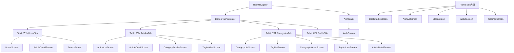
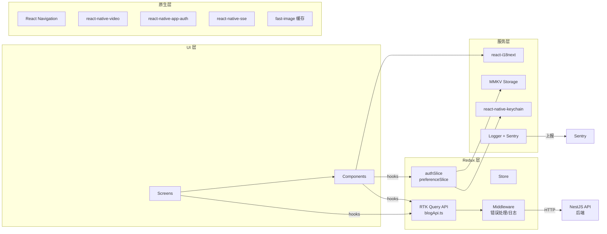
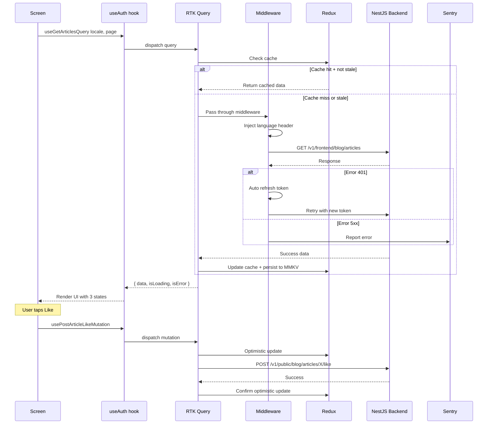
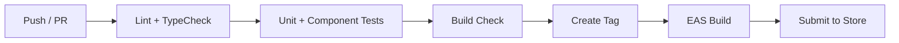

# Frontend Blog React Native App — 架构设计与实施计划

> 基于现有 `JoyMini_Nest_Monorepo/apps/frontend-blog` 的 Web 代码库，重构为 React Native App
> **独立项目** — 放在 `/Volumes/MySSD/work/frontend-blog-mobile/`，与 monorepo 同级
> **企业级标准** — 完整工程化体系

---

## 0. 项目标识

| 项目 | 值 |
|------|-----|
| App 名称 (iOS Display Name) | `Tarsier Labs` |
| App 短名 (Android) | `Tarsier` |
| Bundle Identifier | `com.tarsier.blog` |
| Logo 素材来源 | [`apps/frontend-blog/public/logo.png`](../apps/frontend-blog/public/logo.png) |
| 定位权限文案 (iOS) | `Tarsier Labs uses your location to set the preferred language based on your region` |
| 定位权限 (Android) | `ACCESS_FINE_LOCATION` / `ACCESS_COARSE_LOCATION` |

## 1. 技术栈

| 层级 | 技术选型 | 版本 | 说明 |
|------|---------|------|------|
| 框架 | React Native | 0.76+ | 新架构 New Architecture + Fabric + TurboModules |
| 语言 | TypeScript | 5.4+ | strict 模式，禁止 any |
| 导航 | React Navigation | v7 | Stack + Bottom Tab + Deep Linking |
| 状态管理 | **Redux Toolkit** | ^2.0 | createSlice + middleware |
| 数据获取 | **RTK Query** | ^2.0 | 内置缓存/加载/错误/乐观更新 |
| i18n | react-i18next | v15 | 直接复用 monorepo 的翻译 JSON |
| Markdown | react-native-markdown-display | latest | 渲染博客内容 |
| 视频 | react-native-video | v6 | HLS 视频播放 |
| 持久化 | react-native-mmkv | v3 | KV 存储 + 用户偏好 |
| 安全存储 | react-native-keychain | v9 | Token 安全存储 |
| OAuth | react-native-app-auth | v7 | Google OAuth |
| SSE | react-native-sse | latest | 评论实时推送 |
| 图标 | react-native-vector-icons | v10 | 图标库 |
| 图片缓存 | react-native-fast-image | latest | 图片缓存 + 渐进加载 |
| **测试** | **Jest + React Native Testing Library** | latest | 单元测试 + 组件测试 |
| **E2E** | **Detox / Maestro** | latest | 端到端测试 |
| **错误监控** | **Sentry** | latest | Crash 上报 + 性能监控 |
| **Lint** | **ESLint + Prettier + Husky** | latest | 代码质量 |
| **CI** | **GitHub Actions** | - | 自动 lint + test + build |

---

## 2. 企业级工程标准

### 2.1 架构原则

```
src/
├── screens/         # 页面层 — 只负责组合组件，不写业务逻辑
├── components/      # 组件层 — 纯 UI，不直接接触 Redux/API
│   ├── core/        #   原子组件（Button/Card/Badge...）
│   ├── blog/        #   业务组件（ArticleListItem/CommentList...）
│   ├── layout/      #   布局组件（ScreenContainer/PullToRefresh...）
│   └── features/    #   功能组件（SearchBox/LanguagePicker...）
├── services/        # 服务层 — RTK Query API + 第三方服务封装
├── store/           # Redux 层 — slices + middleware
├── hooks/           # 自定义 hooks — 封装 Redux 操作
├── i18n/            # 国际化
├── theme/           # 主题系统
├── utils/           # 工具函数
└── types/           # 类型定义
```

**单向依赖规则**：
```
Screens → Components → Hooks → Services/Store → Utils
```
❌ 禁止：Screens 直接写 API 调用、Components 直接 dispatch Redux

### 2.2 企业级质量体系

| 类别 | 要求 | 工具/方案 |
|------|------|----------|
| **代码规范** | TypeScript strict + ESLint 规则集 | `@typescript-eslint/strict` + Prettier |
| **提交规范** | Conventional Commits + commit lint | husky + commitlint + lint-staged |
| **单元测试** | 覆盖所有 hooks + utils + slices | Jest + @testing-library/react-native |
| **组件测试** | 覆盖所有 core/blog 组件 | React Native Testing Library |
| **E2E 测试** | 核心用户流程 | Detox / Maestro |
| **错误监控** | 全局 Error Boundary + Crash 上报 | Sentry + react-native-error-boundary |
| **性能监控** | 启动时间/页面切换/FPS | Sentry Performance + react-native-profiler |
| **日志系统** | 分级日志（debug/info/warn/error） | 自定义 Logger + Sentry |
| **安全检查** | Token 加密存储 + SSL Pinning | react-native-keychain + SSL pinning |
| **构建变体** | Debug / Staging / Release | Flavor 配置 |
| **CI/CD** | 自动化 lint/test/build | GitHub Actions |

### 2.3 错误处理体系

```
GlobalErrorBoundary (捕获渲染崩溃)
  └─> 显示友好错误页面 + 上报 Sentry
      
ApiErrorHandler (RTK Query middleware)
  ├─> 401 → 自动刷新 Token / 跳转登录
  ├─> 403 → 无权限提示
  ├─> 404 → 空状态
  ├─> 429 → 限流提示 + 重试
  ├─> 5xx → 服务器错误 + 上报
  └─> Network → 离线提示 + 缓存兜底
      
AsyncActionError (Redux middleware)
  └─> 所有 createAsyncThunk 的 rejected 统一处理
```

### 2.4 离线策略

| 数据 | 策略 | 存储 |
|------|------|------|
| 文章列表 | RTK Query cache + MMKV 持久化 | MMKV |
| 文章详情 | 同上 | MMKV |
| 分类/标签 | 缓存优先，网络更新 | MMKV |
| 用户 Token | 加密存储 | react-native-keychain |
| 偏好设置 | 同步写入 | MMKV |
| 搜索历史 | 最近 10 条 | MMKV |
| 收藏列表 | 网络获取为主 | RTK Query cache |

### 2.5 项目配置文件清单

```
├── .eslintrc.js           # ESLint 配置（strict）
├── .prettierrc            # Prettier 配置
├── .commitlintrc.js       # Conventional Commits
├── .husky/                # Git hooks
│   ├── pre-commit         # lint-staged
│   └── commit-msg         # commitlint
├── jest.config.js         # Jest 配置
├── tsconfig.json          # TypeScript strict
├── babel.config.js        # Babel + module resolver
├── metro.config.js        # Metro bundler
├── .env.development       # 开发环境变量
├── .env.staging           # 预发布环境变量
├── .env.production        # 生产环境变量
├── sentry.properties      # Sentry 配置
├── android/app/build.gradle    # Android 构建
├── ios/Podfile                 # iOS 依赖
└── .github/workflows/         # CI
    ├── lint.yml
    ├── test.yml
    └── build.yml
```

---

## 3. 导航结构 & 页面总览



---

## 4. 所有页面详解（共 13 个 Screen + 1 个 Auth）

### 4.1 首页 - HomeScreen

| 项目 | 内容 |
|------|------|
| **路由** | Tab1 默认页 |
| **用途** | App 首页，展示精选文章 + 推荐列表 |
| **View 结构** | |
| Header | Logo + 搜索按钮 + 语言切换按钮 |
| Featured Hero | 横向滑动轮播 PagerView，展示 3-5 篇精选文章，点击进详情 |
| Section: 分类快捷入口 | 横向滚动 CategoryChip 列表，点击进分类文章页 |
| Section: 推荐文章 | FlatList 纵向 ArticleListItem 列表，分页加载更多 |
| Section: 最新文章 | FlatList 继续加载 |
| **数据来源** | `useGetFeaturedQuery`, `useGetCategoriesQuery`, `useGetArticlesQuery` |
| **API** | `GET /v1/frontend/blog/featured`, `GET /v1/frontend/blog/categories`, `GET /v1/frontend/blog/articles` |
| **特殊处理** | 下拉刷新 PullToRefresh；Hero 图片用 fast-image 缓存 |

### 4.2 文章列表 - ArticleListScreen

| 项目 | 内容 |
|------|------|
| **路由** | Tab2 默认页 |
| **用途** | 全部文章的分页列表 |
| **View 结构** | |
| Header | 标题 + 分类/标签筛选器 |
| Filter bar | 横向滚动 CategoryChip + TagChip，选中后过滤列表 |
| Article List | FlatList ArticleListItem，上拉加载更多 |
| Empty | 无文章时显示 EmptyState |
| **数据来源** | `useGetArticlesQuery` 带筛选参数 |
| **API** | `GET /v1/frontend/blog/articles?categoryId=X&tagId=X&page=X` |

### 4.3 文章详情 - ArticleDetailScreen

| 项目 | 内容 |
|------|------|
| **路由** | Stack 页，从任何列表点击进入 |
| **用途** | 阅读完整文章 |
| **View 结构** | |
| ScrollView 顶部 | 封面图片 + 渐隐效果 |
| Article Header | 标题 + 分类标签 + 发布时间 + 作者信息 |
| Article Content | Markdown 渲染器（支持代码高亮 + 图片 + HLS 视频） |
| Table of Contents | 右侧悬浮 TOC 按钮，点击展开导航 |
| Action Bar | 点赞按钮 + 收藏按钮 + 分享按钮 |
| Related Articles | 横向滚动相关文章卡片 |
| Comment Section | 评论区 |
| **数据来源** | `useGetArticleQuery` |
| **API** | `GET /v1/frontend/blog/articles/:slug` |
| **特殊处理** | HLS 视频用 react-native-video 原生播放；图片用 fast-image 缓存；SSE 实时评论推送 |

### 4.4 分类列表 - CategoryListScreen

| 项目 | 内容 |
|------|------|
| **路由** | Tab3 左侧 |
| **用途** | 浏览所有分类 |
| **View 结构** | 网格 2列 Card 样式，显示分类名 + 文章数 |
| **API** | `GET /v1/frontend/blog/categories` |

### 4.5 标签列表 - TagListScreen

| 项目 | 内容 |
|------|------|
| **路由** | Tab3 右侧 |
| **用途** | 浏览所有标签 |
| **View 结构** | 标签云布局，标签大小按文章数量等比缩放 |
| **API** | `GET /v1/frontend/blog/tags` |

### 4.6 分类文章列表 - CategoryArticlesScreen

| 项目 | 内容 |
|------|------|
| **路由** | Stack 页 |
| **用途** | 查看某个分类下的所有文章 |
| **View 结构** | Header(分类名+文章数) + FlatList ArticleListItem |
| **API** | `GET /v1/frontend/blog/articles?categoryId=X` |

### 4.7 标签文章列表 - TagArticlesScreen

| 项目 | 内容 |
|------|------|
| **路由** | Stack 页 |
| **用途** | 查看某个标签下的所有文章 |
| **View 结构** | 同 CategoryArticlesScreen |
| **API** | `GET /v1/frontend/blog/articles?tagId=X` |

### 4.8 搜索 - SearchScreen

| 项目 | 内容 |
|------|------|
| **路由** | Stack 页，从首页 Header 搜索按钮进入 |
| **用途** | 全文搜索 |
| **View 结构** | 搜索框(TextInput, 自动聚焦, 防抖300ms) + FlatList 结果 + 搜索历史(MMKV 最近10条) |
| **API** | `GET /v1/frontend/blog/search?q=keyword` |

### 4.9 收藏列表 - BookmarksScreen

| 项目 | 内容 |
|------|------|
| **路由** | Tab4 内页 |
| **用途** | 查看已收藏的文章 |
| **View 结构** | Header(标题+收藏数) + FlatList(ArticleListItem+取消收藏) + EmptyState |
| **API** | `GET /v1/frontend/blog/bookmarks` |
| **特殊处理** | 需登录，未登录跳转 AuthScreen |

### 4.10 文章归档 - ArchiveScreen

| 项目 | 内容 |
|------|------|
| **路由** | Tab4 内页 |
| **用途** | 按月查看文章归档 |
| **View 结构** | SectionList 按年分组，展开/收起月份 |
| **API** | `GET /v1/frontend/blog/archive` |

### 4.11 博客统计 - StatsScreen

| 项目 | 内容 |
|------|------|
| **路由** | Tab4 内页 |
| **用途** | 展示博客数据统计 |
| **View 结构** | 2x3 卡片布局：文章总数 / 分类数 / 标签数 / 评论总数 / 总阅读量 / 总点赞数 |
| **API** | `GET /v1/frontend/blog/stats` |

### 4.12 设置 - SettingsScreen

| 项目 | 内容 |
|------|------|
| **路由** | Tab4 默认页 |
| **用途** | 主题切换、语言切换、个人信息 |
| **View 结构** | User Section(未登录→登录按钮；已登录→头像+昵称+邮箱) + 语言选择器(6种) + 主题切换(亮/暗/系统) + 关于入口/版本号/退出登录 |
| **数据来源** | Redux authSlice + preferenceSlice |

### 4.13 关于 - AboutScreen

| 项目 | 内容 |
|------|------|
| **路由** | Tab4 内页 |
| **用途** | App 信息 |
| **View 结构** | App Logo + 名称 + 版本 + 技术栈 + 联系方式 + GitHub/Twitter/个人网站链接 |
| **API** | 无 |

### 4.14 登录 - AuthScreen

| 项目 | 内容 |
|------|------|
| **路由** | Stack 页（全屏 Modal） |
| **用途** | Google OAuth 登录 |
| **View 结构** | Logo + 欢迎文字 + "使用 Google 登录" 按钮 + 隐私政策/服务条款链接 |
| **技术** | react-native-app-auth |
| **特殊处理** | 成功登录后自动跳转回之前的页面 |

---

## 5. 组件与 View 映射关系

| 页面 | 使用的组件 |
|------|-----------|
| **HomeScreen** | ArticleHero, ArticleListItem, CategoryChip, SearchBox, PullToRefresh, ScreenContainer |
| **ArticleListScreen** | ArticleListItem, CategoryChip, TagChip, EmptyState, LoadingSpinner |
| **ArticleDetailScreen** | ArticleContent (Markdown), ArticleMeta, ArticleTOC, LikeButton, BookmarkButton, ShareButton, RelatedArticles, CommentList, CommentForm |
| **CategoryListScreen** | Card, Badge |
| **TagListScreen** | TagChip (不同尺寸) |
| **CategoryArticlesScreen** | ArticleListItem |
| **TagArticlesScreen** | ArticleListItem |
| **SearchScreen** | SearchBox, ArticleListItem, EmptyState |
| **BookmarksScreen** | ArticleListItem + BookmarkButton, EmptyState |
| **ArchiveScreen** | SectionList, ArticleListItem |
| **StatsScreen** | Card, Text |
| **SettingsScreen** | LanguagePicker, ThemeToggle, Button |
| **AboutScreen** | Card, Avatar |
| **AuthScreen** | Button, Avatar |

---

## 6. 项目位置与文件结构

```
/Volumes/MySSD/work/
├── JoyMini_Nest_Monorepo/          # 现有 monorepo（不动）
│   ├── apps/frontend-blog/         # 博客 Web 代码（参考用）
│   │   └── src/lib/
│   │       ├── types/frontend-blog.ts    → 复制类型
│   │       └── messages/*.json           → 复制翻译
│   └── docs/blog/design/                 → 参考设计规范
│
└── frontend-blog-mobile/           # 🆕 新建独立项目
    ├── src/
    │   ├── navigation/
    │   │   ├── RootNavigator.tsx
    │   │   ├── TabNavigator.tsx
    │   │   ├── ArticleStack.tsx
    │   │   └── AuthStack.tsx
    │   │
    │   ├── screens/              # 13 个页面 + Auth
    │   │   ├── HomeScreen.tsx
    │   │   ├── ArticleListScreen.tsx
    │   │   ├── ArticleDetailScreen.tsx
    │   │   ├── CategoryListScreen.tsx
    │   │   ├── TagListScreen.tsx
    │   │   ├── CategoryArticlesScreen.tsx
    │   │   ├── TagArticlesScreen.tsx
    │   │   ├── SearchScreen.tsx
    │   │   ├── BookmarksScreen.tsx
    │   │   ├── ArchiveScreen.tsx
    │   │   ├── StatsScreen.tsx
    │   │   ├── SettingsScreen.tsx
    │   │   ├── AboutScreen.tsx
    │   │   └── AuthScreen.tsx
    │   │
    │   ├── components/
    │   │   ├── core/             # 原子组件
    │   │   │   ├── Button.tsx
    │   │   │   ├── Card.tsx
    │   │   │   ├── Badge.tsx
    │   │   │   ├── Avatar.tsx
    │   │   │   ├── LoadingSpinner.tsx
    │   │   │   ├── EmptyState.tsx
    │   │   │   ├── Divider.tsx
    │   │   │   ├── Icon.tsx
    │   │   │   ├── Skeleton.tsx
    │   │   │   └── NetworkStatusBar.tsx
    │   │   │
    │   │   ├── blog/             # 博客业务组件
    │   │   │   ├── ArticleListItem.tsx
    │   │   │   ├── ArticleHero.tsx
    │   │   │   ├── ArticleMeta.tsx
    │   │   │   ├── ArticleContent.tsx
    │   │   │   ├── ArticleTOC.tsx
    │   │   │   ├── CategoryChip.tsx
    │   │   │   ├── TagChip.tsx
    │   │   │   ├── RelatedArticles.tsx
    │   │   │   ├── CommentList.tsx
    │   │   │   └── CommentForm.tsx
    │   │   │
    │   │   ├── layout/           # 布局组件
    │   │   │   ├── ScreenContainer.tsx
    │   │   │   ├── PullToRefresh.tsx
    │   │   │   ├── ErrorBoundary.tsx
    │   │   │   └── Toast.tsx
    │   │   │
    │   │   └── features/         # 功能组件
    │   │       ├── SearchBox.tsx
    │   │       ├── LanguagePicker.tsx
    │   │       ├── ThemeToggle.tsx
    │   │       ├── LikeButton.tsx
    │   │       ├── BookmarkButton.tsx
    │   │       ├── ShareButton.tsx
    │   │       ├── LoginPrompt.tsx
    │   │       └── OfflineBanner.tsx
    │   │
    │   ├── services/             # RTK Query API 定义
    │   │   ├── blogApi.ts        # 所有 API endpoints
    │   │   ├── apiMiddleware.ts  # 错误处理中间件
    │   │   └── apiUtils.ts       # 请求/响应转换
    │   │
    │   ├── store/                # Redux store
    │   │   ├── index.ts          # configureStore
    │   │   ├── authSlice.ts      # 认证状态
    │   │   └── preferenceSlice.ts # 主题/语言偏好
    │   │
    │   ├── hooks/                # 自定义 hooks
    │   │   ├── useAuth.ts        # 封装 auth 操作
    │   │   ├── useTheme.ts       # 主题 hook
    │   │   ├── useLocale.ts      # 语言切换 hook
    │   │   └── useDebounce.ts    # 防抖 hook
    │   │
    │   ├── i18n/                 # 国际化
    │   │   ├── index.ts
    │   │   └── locales/          # 6 个 JSON（从 monorepo 复制）
    │   │       ├── zh.json
    │   │       ├── en.json
    │   │       ├── ja.json
    │   │       ├── ko.json
    │   │       ├── fr.json
    │   │       └── de.json
    │   │
    │   ├── theme/                # 主题系统
    │   │   ├── colors.ts
    │   │   ├── typography.ts
    │   │   ├── spacing.ts
    │   │   ├── lightTheme.ts
    │   │   └── darkTheme.ts
    │   │
    │   ├── utils/                # 工具函数
    │   │   ├── storage.ts        # MMKV 封装
    │   │   ├── logger.ts         # 分级日志
    │   │   ├── sentry.ts         # Sentry 初始化
    │   │   └── validators.ts     # 输入验证
    │   │
    │   └── types/                # 类型定义
    │       ├── blog.ts           # 从 monorepo 复制
    │       └── navigation.ts     # 导航类型
    │
    ├── __tests__/                # 测试
    │   ├── components/
    │   ├── hooks/
    │   ├── store/
    │   └── screens/
    │
    ├── e2e/                      # E2E 测试
    │   └── homeFlow.test.ts
    │
    ├── .github/workflows/        # CI
    │   ├── lint.yml
    │   ├── test.yml
    │   └── build.yml
    │
    ├── .eslintrc.js
    ├── .prettierrc
    ├── .commitlintrc.js
    ├── .husky/
    ├── jest.config.js
    ├── tsconfig.json
    ├── babel.config.js
    ├── metro.config.js
    ├── .env.development
    ├── .env.staging
    ├── .env.production
    └── package.json
```

---

## 7. 编码架构图



---

## 8. RTK Query 数据流



---

## 9. 实施顺序与时间

| 阶段 | 内容 | 文件数 | AI 编码时间 |
|------|------|:-----:|:-----------:|
| 0 - 项目初始化 | npx react-native init + 安装依赖 + 复制翻译/类型 + ESLint/Husky 配置 | - | ~1h |
| 1 - 基础设施 | theme + i18n + MMKV + Logger + Sentry + Redux store + RTK Query | ~12 个 | ~2h |
| 2 - Core 组件 | 10 个原子组件 + 测试 | ~12 个 | ~2h |
| 3 - Blog 组件 | 10 个业务组件 + 测试 | ~12 个 | ~2h |
| 4 - Layout 组件 | 布局 + 导航配置 + ErrorBoundary | ~8 个 | ~1.5h |
| 5 - 首页 + 文章列表 | HomeScreen + ArticleListScreen + 测试 | ~4 个 | ~2h |
| 6 - 文章详情 | ArticleDetailScreen + Markdown + 视频 + 测试 | ~4 个 | ~2.5h |
| 7 - 分类/标签/搜索 | 5 个页面 + 测试 | ~7 个 | ~2h |
| 8 - 收藏/归档/统计 | 3 个页面 + 测试 | ~5 个 | ~1.5h |
| 9 - 设置/关于/登录 | 3 个页面 + OAuth + 测试 | ~5 个 | ~2h |
| 10 - Feature 组件 | 评论/Like/Bookmark/Share/SSE + 测试 | ~8 个 | ~2.5h |
| 11 - 原生配置 + 调试 | Xcode/Android 配置 + 真机测试 + CI 配置 | - | ~2h |
| **合计** | | **~80 个文件** | **~23 小时** |

> 日历时间约 5-7 天（含编译验证的迭代周期）

---

## 10. 关键编码规则

| # | 规则 | 说明 |
|---|------|------|
| 1 | 所有 API 调用走 RTK Query | 禁止直接 fetch/axios |
| 2 | query key 自动包含 locale | 语言切换时自动重新获取 |
| 3 | 组件不直接操作 Redux | 通过自定义 hooks 封装（useAuth/useTheme/useLocale） |
| 4 | 所有文本走 i18n | 禁止硬编码字符串 |
| 5 | 所有颜色/字体走 theme | 禁止硬编码颜色值 |
| 6 | 三种状态全覆盖 | loading / error / data 每个页面必须有 |
| 7 | FlatList 渲染列表 | 禁止用 ScrollView + map |
| 8 | 原生模块异步加载 | OAuth/视频/SSE 都有 fallback |
| 9 | TypeScript 严格模式 | 禁止 any，用 unknown |
| 10 | Redux 用 createSlice | 不使用手写 reducer |
| 11 | 每个文件 <= 300 行 | 超过则拆分 |
| 12 | Conventional Commits | `feat:`, `fix:`, `chore:`, `docs:` 等 |
| 13 | 敏感信息不进代码 | Token/Key 走环境变量 + keychain |
| 14 | 每个组件有 loading 状态 | Skeleton / Spinner 至少一种 |
| 15 | 列表项用 keyExtractor | 不使用 index 作为 key |

---

## 11. 包大小优化策略

### 11.1 预期包大小

| 平台 | 预估大小 | 说明 |
|------|---------|------|
| iOS Debug | ~80-100 MB | 包含调试符号 |
| iOS Release | ~25-35 MB | Strip 后 |
| Android APK | ~30-45 MB | 含所有架构 |
| Android AAB | ~20-30 MB | Play Store 分发 |
| Android (Android Bundle) | ~15-25 MB | 用户下载实际大小 |

### 11.2 包大小优化方案

| 优化项 | 操作 | 预计节省 |
|--------|------|:--------:|
| Hermes 引擎 | 启用 Hermes（RN 0.76 默认） | -30% JS 包 |
| ProGuard | Android 代码混淆 + 压缩 | -20% |
| 图片压缩 | 所有本地图片用 WebP 格式 | -50-70% |
| 字体裁剪 | 只包含使用的图标 | -5-10 MB |
| react-native-vector-icons | 替换为 react-native-svg 按需加载 | -8 MB |
| 原生库瘦身 | 移除未使用的架构（x86, x86_64） | -15 MB |
| JS Bundle 拆分 | Metro 拆包 + 懒加载 | -40% 首包 |
| 移除重复依赖 | 检查 npm 重复包 | -2-5 MB |
| Flipper 移除 | Release 构建移除 Flipper | -10 MB |
| 6 语言 JSON | 合并 + 压缩翻译文件 | -50% |

### 11.3 目标

**Release 最终目标：iOS 25 MB / Android 20 MB**

---

## 12. 用户体验优化策略

### 12.1 启动体验

| 阶段 | 优化 | 方案 |
|------|------|------|
| 冷启动 | Splash Screen | react-native-bootsplash，显示 Logo + 品牌色 |
| 初始化 | 骨架屏 | 首页立即显示 Skeleton 骨架，不等 API |
| 数据加载 | 缓存优先 | RTK Query cache 命中 + MMKV 持久化 → 秒开 |
| JS Bundle | 预加载 | Metro 预加载 + Hermes 编译 |
| 首页 | 预取数据 | App 启动即并行请求 featured + categories + articles |

### 12.2 运行体验

| 场景 | 优化 | 方案 |
|------|------|------|
| 列表滚动 | 60fps 保证 | FlatList + getItemLayout + windowSize + removeClippedSubviews |
| 图片加载 | 渐进式 | fast-image 先模糊占位图 → 高清图 |
| 文章详情 | Markdown 渲染 | 缓存已渲染的 HTML，不要每次重新解析 |
| 视频播放 | HLS 流式 | 点击播放才加载，不预加载 |
| 页面切换 | 动画流畅 | React Navigation 原生驱动动画 + 保持 tab 状态 |
| 网络切换 | 无缝过渡 | OfflineBanner 提示 + 缓存数据继续展示 |
| 语言切换 | 无感 | 切换后 RTK Query 自动重新 fetch，不清除已有数据 |
| 登录 | 快速 | OAuth Token 刷新自动静默完成 |

### 12.3 网络体验

| 条件 | 表现 |
|------|------|
| WiFi / 5G | 正常请求，RTK Query 缓存 |
| 弱网 | Skeleton + retry 3 次 |
| 离线 | 展示缓存数据 + OfflineBanner 提示 |
| 恢复网络 | 自动重新请求 + 合并数据 |

### 12.4 动画与反馈

| 交互 | 反馈 |
|------|------|
| 点赞 | 红心动画 `Animated.spring` |
| 收藏 | 图标跳变 + Toast "已收藏" |
| 下拉刷新 | 原生 RefreshControl |
| 页面切换 | 原生 Stack 动画（iOS 左滑返回） |
| 按钮点击 | Opacity 降低 + 震动反馈 |
| 错误 | 非侵入式 Toast，不弹 Alert 打断用户 |

### 12.5 无障碍

| 标准 | 实现 |
|------|------|
| 字体缩放 | 支持系统字体缩放 Dynamic Type |
| 屏幕阅读 | 所有交互元素加 accessibilityLabel |
| 高对比度 | 暗色模式完整支持 |
| 手势 | 所有操作都有非手势替代方案 |

---

## 13. 开发 / 测试 / 生产环境配置

### 13.1 三环境策略

| 环境 | 用途 | API 地址 | 构建方式 | 包名后缀 |
|------|------|---------|---------|---------|
| **Development** | 日常开发调试 | `http://localhost:3000/api` | Metro dev server | `.dev` |
| **Staging** | 预发布测试 | `https://staging.api.joymini.com/api` | EAS Build / Local | `.staging` |
| **Production** | App Store / Play Store 发布 | `https://api.joymini.com/api` | EAS Build | 无后缀 |

### 13.2 环境变量文件

```env
# .env.development
API_BASE_URL=http://localhost:3000/api
SENTRY_DSN=https://xxx@sentry.io/xxx
ENABLE_SSE=true
ENABLE_VIDEO=true
LOG_LEVEL=debug

# .env.staging
API_BASE_URL=https://staging.api.joymini.com/api
SENTRY_DSN=https://xxx@sentry.io/xxx
ENABLE_SSE=true
ENABLE_VIDEO=true
LOG_LEVEL=info

# .env.production
API_BASE_URL=https://api.joymini.com/api
SENTRY_DSN=https://xxx@sentry.io/xxx
ENABLE_SSE=true
ENABLE_VIDEO=true
LOG_LEVEL=warn
```

### 13.3 构建变体

| 变体 | iOS Scheme | Android Flavor | 说明 |
|------|-----------|---------------|------|
| Debug | frontend-blog-dev | devDebug | Metro + Flipper + 日志 |
| Staging | frontend-blog-staging | stagingRelease | 预发布 |
| Release | frontend-blog | prodRelease | App Store / Play Store |

### 13.4 版本管理

```
版本号规则: MAJOR.MINOR.PATCH
  - MAJOR: 重大重构或 UI 改版
  - MINOR: 新功能
  - PATCH: Bug 修复

版本同步: package.json version + iOS Info.plist + Android build.gradle
         → 使用 `npx react-native-version` 自动同步
```

---

## 14. CI/CD 流水线

### 14.1 GitHub Actions 工作流



### 14.2 工作流定义

```yaml
# .github/workflows/lint.yml — PR 自动检查
on: [pull_request]
jobs:
  lint-and-typecheck:
    runs-on: ubuntu-latest
    steps:
      - checkout
      - yarn install --frozen-lockfile
      - yarn lint                    # ESLint
      - yarn typecheck               # tsc --noEmit
      - yarn prettier --check        # 格式检查

# .github/workflows/test.yml — PR 自动测试
on: [pull_request]
jobs:
  test:
    runs-on: ubuntu-latest
    steps:
      - checkout
      - yarn install --frozen-lockfile
      - yarn test --coverage         # Jest + coverage
      - upload coverage report

# .github/workflows/build.yml — Release 自动构建
on:
  push:
    tags:
      - 'v*'                        # 推送 tag 触发
jobs:
  build-and-submit:
    runs-on: ubuntu-latest
    steps:
      - checkout
      - yarn install --frozen-lockfile
      - eas build --platform all --profile production
      - eas submit --platform all   # 自动提交 App Store / Play Store
```

### 14.3 CI 检查清单

| 阶段 | 检查项 | 失败处理 |
|------|--------|---------|
| pre-commit | lint-staged（ESLint + Prettier） | 阻止提交 |
| PR | Lint + TypeCheck + Unit Test | PR 不能合并 |
| PR | 组件测试通过 | PR 不能合并 |
| main merge | 全量测试 | 自动回滚 |
| Tag push | EAS Build + Submit | Slack 通知失败 |

---

## 15. 文档体系

### 15.1 文档清单

| 文档 | 内容 | 创建阶段 |
|------|------|---------|
| **README.md** | 项目简介、技术栈、快速启动 | Phase 0 |
| **SETUP.md** | 环境搭建指南（Node/Xcode/Android Studio） | Phase 0 |
| **ARCHITECTURE.md** | 架构设计、分层规则、数据流 | Phase 1 |
| **API.md** | API 端点映射（RN endpoint → NestJS endpoint） | Phase 1 |
| **COMPONENTS.md** | 组件文档（props、用法、示例） | Phase 4 |
| **CONTRIBUTING.md** | 贡献指南、代码规范、PR 流程 | Phase 0 |
| **CHANGELOG.md** | 版本变更记录 | Phase 0 |
| **DEPLOY.md** | 部署流程（EAS Build → App Store/Play Store） | Phase 11 |
| **TESTING.md** | 测试策略、运行命令、覆盖率目标 | Phase 2 |

### 15.2 文档维护规则

| 规则 | 说明 |
|------|------|
| 代码合并前必须更新相关文档 | PR Checklist 包含文档 |
| API 变更同步更新 API.md | 与代码同时 commit |
| 新增组件必须写组件文档 | 至少包含 props 表和用法示例 |
| README 保持最新 | 环境要求、启动命令、项目结构 |
| CHANGELOG 用语义版本 | 每次发布前更新 |

---

## 16. 完整实施顺序（13 阶段）

| 阶段 | 内容 | 文件数 | AI 编码时间 |
|------|------|:-----:|:-----------:|
| 0 - 项目初始化 | npx react-native init + 安装依赖 + ESLint/Husky/CI 配置 + 复制翻译类型 | ~8 个 | ~1h |
| 1 - 基础设施 | theme + i18n + MMKV + Logger + Sentry + Redux store + RTK Query + 文档 | ~14 个 | ~2.5h |
| 2 - Core 组件 | 10 个原子组件 + 测试 + 组件文档 | ~14 个 | ~2.5h |
| 3 - Blog 组件 | 10 个业务组件 + 测试 | ~12 个 | ~2h |
| 4 - Layout 组件 | 布局 + 导航配置 + ErrorBoundary + 文档 | ~10 个 | ~2h |
| 5 - 首页 + 文章列表 | HomeScreen + ArticleListScreen + 测试 | ~4 个 | ~2h |
| 6 - 文章详情 | ArticleDetailScreen + Markdown + 视频 + 测试 | ~4 个 | ~2.5h |
| 7 - 分类/标签/搜索 | 5 个页面 + 测试 | ~7 个 | ~2h |
| 8 - 收藏/归档/统计 | 3 个页面 + 测试 | ~5 个 | ~1.5h |
| 9 - 设置/关于/登录 | 3 个页面 + OAuth + 测试 | ~5 个 | ~2h |
| 10 - Feature 组件 | 评论/Like/Bookmark/Share/SSE + 测试 | ~8 个 | ~2.5h |
| 11 - 原生配置 + 调试 | Xcode/Android 配置 + 真机测试 + CI 配置 | - | ~2h |
| 12 - 文档完善 + 发布 | 全部文档审查 + CHANGELOG + DEPLOY.md | ~5 个 | ~1h |
| **合计** | | **~85 个文件** | **~25 小时** |

> 日历时间约 5-7 天（含你编译验证的迭代周期）

---

## 17. 品牌资产 Logo / Icon / Splash

### 17.1 需要准备的素材

| 素材 | 规格 | 用途 | 数量 |
|------|------|------|:----:|
| **App Icon** | 1024x1024 PNG | iOS + Android 应用图标 | 1 个源文件 |
| **Adaptive Icon** | 108x108 dp 前景 + 背景 | Android 自适应图标 | 2 个 |
| **Splash Screen** | 1242x2688 / 1125x2436 | iOS 启动屏 | 2 套尺寸 |
| **Splash (Android)** | 1080x1920 | Android 启动屏 | 1 个 |
| **Store Screenshots** | 6.7" / 6.5" / 5.5" | App Store / Play Store 截图 | 4-6 张/平台 |
| **Store Promo Text** | 多语言 | App Store 描述 + 关键词 | 6 语言 |

### 17.2 生成工具

| 工具 | 用途 |
|------|------|
| **react-native-bootsplash** | 通过 CLI 自动生成各平台 Splash |
| **react-native-vector-icons** 或自定义字体 | App 内图标 |
| **app-icon** (npm) | 单图自动生成 iOS + Android 全部尺寸 |
| **fastlane screenshot** | 自动截取商店截图 |

### 17.3 实施方式

由于 Logo/Icon 需要你提供品牌设计（或指定风格），方案如下：

```
Phase 0: 你先提供 Logo 源文件（SVG 或 1024x1024 PNG）
Phase 1: 我会用 bootsplash + app-icon 自动生成各平台资源
Phase 11: 用 fastlane 自动生成商店截图
```

如果目前没有设计稿，Phase 0 可以用临时占位图标开始开发，上架前再替换。

---

## 18. 补充：Analytics 埋点 + Deep Linking + 性能基准

### 18.1 Analytics 埋点方案

| 事件 | 触发时机 | 工具 |
|------|---------|------|
| `page_view` | 每个 Screen 进入时 | Sentry Performance + 自定义 Logger |
| `article_read` | 文章详情页停留 >5s | 同上 |
| `article_like` | 点击点赞 | 同上 |
| `article_bookmark` | 点击收藏 | 同上 |
| `article_share` | 点击分享 | 同上 |
| `search` | 执行搜索 | 同上 |
| `language_switch` | 切换语言 | 同上 |
| `login` | OAuth 成功 | 同上 |
| `error` | 任何异常捕获 | Sentry 自动 |

> 初版用 Sentry 统一埋点，后续量大了可以接入 Amplitude / Firebase Analytics

### 18.2 Deep Linking 方案

| URL 类型 | 示例 | 目标 |
|----------|------|------|
| 文章详情 | `joymini://article/:slug` | 直接打开文章页 |
| 分类 | `joymini://category/:slug` | 打开分类文章列表 |
| 搜索结果 | `joymini://search?q=keyword` | 打开搜索结果 |

```
React Navigation 配置:
linking = {
  prefixes: ['joymini://', 'https://blog.joymini.com'],
  config: {
    screens: {
      ArticleDetail: 'article/:slug',
      CategoryArticles: 'category/:slug',
      Search: 'search',
    },
  },
}
```

### 18.3 性能基准目标

| 指标 | 目标 | 测量工具 |
|------|------|---------|
| 冷启动时间 | <2s | Sentry Performance |
| Time To Interactive | <3s | Sentry Performance |
| 列表滚动 FPS | 60fps | react-native-profiler |
| 文章详情加载 | <1s（缓存），<3s（网络） | Sentry |
| 图片加载 | 渐进式 <500ms | fast-image |
| JS Bundle 大小 | <3MB | Metro 分析 |
| APK 大小 | <30MB | 构建报告 |
| IPA 大小 | <35MB | 构建报告 |

---

## 19. App Store / Play Store 合规要求

### 19.1 Apple 审核强制要求

| 要求 | 说明 | 实现方案 |
|------|------|---------|
| **账户删除** | 允许用户在 App 内删除自己的账户 | SettingsScreen 添加「删除账户」按钮 |
| **数据删除** | 删除账户同时删除关联数据 | 后端级联删除：User + Bookmarks + Comments |
| **Sign in with Apple** | 用了 Google 登录则必须提供 Apple 登录 | 添加 react-native-app-auth Apple 登录 |
| **隐私政策 URL** | App Store Connect 必须提交 | 部署 /privacy 页面 |
| **数据收集披露** | 声明收集了哪些数据 | 隐私政策 + App Store 隐私标签 |
| **用户数据管理** | 清除缓存 / 导出数据 / 删除账户 | SettingsScreen 完整功能 |

### 19.2 用户数据管理

| 功能 | 页面 | 说明 |
|------|------|------|
| **清除缓存** | SettingsScreen | 清除 MMKV + RTK Query cache + 图片缓存 |
| **导出我的数据** | SettingsScreen | 导出用户信息 + 收藏 + 评论 JSON |
| **删除账户** | SettingsScreen | 确认弹窗 → DELETE 后端 API |
| **退出登录** | SettingsScreen | 清除 Token + 本地缓存 |
| **隐私政策查看** | SettingsScreen / AuthScreen | WebView 渲染 |

### 19.3 隐私政策要点

```
1. 收集信息: 账户信息、使用数据、设备信息
2. 信息用途: 提供阅读服务、个性化推荐
3. 第三方: Google OAuth、Sentry、react-native-video
4. 数据安全: Token 加密 keychain、MMKV 缓存、不出售数据
5. 用户权利: 查看/导出/删除/关闭账户/清除缓存
```

---

## 20. 网络与设备自适应资源加载策略

### 20.1 API 提供的图片资源层级

[`ArticleMeta.images`](../apps/frontend-blog/src/lib/types/frontend-blog.ts:14) 包含 4 级尺寸 x 2 种格式：

| 字段 | 尺寸 | 格式 | 适用场景 |
|------|------|------|---------|
| `thumbnail.webp/jpg` | ~150px | WebP/JPG | slow-2g / 2g / 列表缩略图 |
| `medium.webp/jpg` | ~600px | WebP/JPG | 3g / 列表大图 |
| `large.webp/jpg` | ~1200px | WebP/JPG | 4g/WiFi / 详情页大图 |
| `original` | 原图 | 原始 | WiFi 详情页 |
| `blurhash` | 32x32 | Canvas | 所有场景的初始占位 |

### 20.2 网络感知策略

Web 端已有 [`useNetworkQuality`](../apps/frontend-blog/src/lib/hooks/useNetworkQuality.ts) hook，RN 端用 `@react-native-community/netinfo` 实现同样逻辑：

```
网络状态         图片尺寸        格式        视频策略         blurhash
─────────────────────────────────────────────────────────────────────
WiFi / 4g       original/large  AVIF/WebP   HLS 最高码率    加载后淡出
3g              medium          WebP        HLS 中码率      加载后淡出
2g              thumbnail       WebP        HLS 低码率      加载后淡出
slow-2g         thumbnail       WebP        仅音频/不加载   持续显示
离线             缓存图片        —           不可用           持续显示
```

### 20.3 实现组件清单

| 组件/文件 | 说明 | 依赖 |
|-----------|------|------|
| `src/lib/hooks/useNetworkQuality.ts` | 移植 Web 版，基于 `@react-native-community/netinfo` | `@react-native-community/netinfo` |
| `src/components/core/BlurhashImage.tsx` | 移植 Web 版 blurhash 解码 + Canvas 渲染 + fade-in | `react-native-svg` canvas替代方案 |
| `src/components/core/NetworkAwareImage.tsx` | 集成 `useNetworkQuality` + `PixelRatio` 自动选图片尺寸 | `react-native-fast-image` |
| `src/components/core/CachedFastImage.tsx` | `fast-image` 封装，LRU缓存 + 渐进式加载 | `react-native-fast-image` |
| `src/components/blog/HlsVideoPlayer.tsx` | HLS 自适应码率播放器，根据网络切 quality | `react-native-video` |

### 20.4 设备适配（PixelRatio）

```typescript
import { PixelRatio } from 'react-native';

function getImageSize(network: NetworkQuality): 'thumbnail' | 'medium' | 'large' | 'original' {
  const ratio = PixelRatio.get();
  
  // 网络优先
  if (network.effectiveType === 'slow-2g' || network.effectiveType === '2g') {
    return 'thumbnail';
  }
  if (network.effectiveType === '3g') {
    return ratio >= 3 ? 'medium' : 'thumbnail';
  }
  // 4g/WiFi
  return ratio >= 3 ? 'original' : 'large';
}
```

### 20.5 视频自适应

后端已将 MP4 转码为 HLS（m3u8 多码率），`react-native-video` 自动根据带宽选码率：

```
视频 URL: https://cdn.tarsier.com/videos/xxx/master.m3u8
                    ↓
HLS playlist 包含:
  - 240p (300kbps)   → 2G / slow-2G
  - 480p (1000kbps)  → 3G
  - 720p (2500kbps)  → 4G
  - 1080p (5000kbps) → WiFi
```

RN 只需 `<Video source={{ uri: hlsUrl }} />`，自适应由 HLS 播放器自动完成。

---

## 21. 最终实施顺序（14 阶段 + 合规）

| 阶段 | 内容 | 文件数 | AI 编码时间 |
|------|------|:-----:|:-----------:|
| 0 | 项目初始化 + 依赖 + ESLint/Husky/CI + 翻译类型 + 品牌素材 | ~10 | ~1.5h |
| 1 | 基础设施: theme + i18n + MMKV + Logger + Sentry + Redux + RTK Query + 文档 | ~14 | ~2.5h |
| 2 | Core 组件 10 个 + 测试 + 组件文档 | ~14 | ~2.5h |
| 3 | Blog 组件 10 个 + 测试 | ~12 | ~2h |
| 4 | Layout 组件 + 导航配置 + Deep Linking + ErrorBoundary + 文档 | ~10 | ~2h |
| 5 | 首页 + 文章列表 + Analytics 埋点 + 测试 | ~5 | ~2.5h |
| 6 | 文章详情 + Markdown + 视频 + 测试 | ~4 | ~2.5h |
| 7 | 分类/标签/搜索 5 个页面 + 测试 | ~7 | ~2h |
| 8 | 收藏/归档/统计 3 个页面 + 测试 | ~5 | ~1.5h |
| 9 | 设置/关于/登录 + Sign in with Apple + 测试 | ~6 | ~2.5h |
| 10 | Feature 组件 + Analytics 埋点 + 测试 | ~9 | ~3h |
| 11 | 用户数据管理: 清除缓存/导出/删除账户/隐私政策 | ~4 | ~1.5h |
| 12 | 原生配置 + 调试 + 性能测试 + CI 配置 | - | ~2.5h |
| 13 | 文档审查 + CHANGELOG + DEPLOY.md + 商店素材 + 隐私政策 | ~8 | ~1.5h |
| **合计** | | **~95 个文件** | **~30 小时** |

> 日历时间约 7-10 天（含编译验证 + 你提供 Logo + App Store 审核迭代）

---

## Appendix A: Phase 0 — 完整 CLI 命令清单

> 所有命令在 `JoyMini_Nest_Monorepo` 同级目录执行，即 `/Volumes/MySSD/work/`

### A.1 初始化 React Native 项目

```bash
# 进入工作目录
cd /Volumes/MySSD/work/

# 使用 RN CLI 创建项目（React Native 0.76+）
npx @react-native-community/cli init frontend-blog-mobile \
  --template react-native-template-typescript \
  --skip-git-init \
  --skip-install

# 进入项目目录
cd frontend-blog-mobile
```

### A.2 安装核心依赖

```bash
# React Navigation (导航)
yarn add @react-navigation/native@^7 \
  @react-navigation/native-stack@^7 \
  @react-navigation/bottom-tabs@^7 \
  react-native-screens \
  react-native-safe-area-context

# Redux Toolkit + RTK Query (状态管理 + API)
yarn add @reduxjs/toolkit@^2 react-redux@^9

# 存储
yarn add react-native-mmkv@^3 \
  react-native-keychain@^9

# i18n
yarn add react-i18next@^15 i18next@^24

# 图标 (svg方案，包大小更优)
yarn add react-native-svg@^15

# 动画
yarn add react-native-reanimated@^3 \
  react-native-gesture-handler@^2

# 文章渲染
yarn add react-native-markdown-display@^7

# 图片(渐进式+缓存)
yarn add react-native-fast-image@^8

# 视频(HLS)
yarn add react-native-video@^6

# OAuth
yarn add react-native-app-auth@^8

# 定位(自动检测语言)
yarn add react-native-geolocation-service@^5

# 网络状态感知
yarn add @react-native-community/netinfo@^11

# 错误边界
yarn add react-native-error-boundary@^4

# Splash Screen
yarn add react-native-bootsplash@^6

# 安全区域
yarn add react-native-safe-area-context@^5
```

### A.3 安装开发依赖

```bash
# TypeScript
yarn add -D typescript@^5 \
  @types/react@^19 \
  @types/react-native@^0.76

# ESLint + Prettier
yarn add -D eslint@^9 \
  @react-native/eslint-config@^0.76 \
  prettier@^3 \
  eslint-plugin-prettier@^5 \
  eslint-config-prettier@^9

# Husky + lint-staged
yarn add -D husky@^9 \
  lint-staged@^15

# Jest + Testing Library
yarn add -D jest@^29 \
  @testing-library/react-native@^12 \
  @testing-library/jest-native@^5 \
  react-test-renderer@^19 \
  @types/jest@^29

# Detox (E2E)
yarn add -D detox@^20 \
  jest-circus@^29

# Sentry
yarn add -D @sentry/react-native@^6

# Bundle分析
yarn add -D react-native-bundle-visualizer@^3

# 类型
yarn add -D @types/react-native-vector-icons@^6
```

### A.4 安装 Pods (iOS)

```bash
# 安装 CocoaPods 依赖
cd ios && pod install && cd ..

# 如果某些 pod 需要更新
pod repo update && pod install
```

### A.5 ESLint + Husky + lint-staged 配置

```bash
# 初始化 Husky
npx husky init

# 添加 pre-commit hook
echo 'npx lint-staged' > .husky/pre-commit
```

### A.6 从 Monorepo 复制翻译文件

```bash
# 源目录: JoyMini_Nest_Monorepo/apps/frontend-blog/src/messages/
# 目标目录: frontend-blog-mobile/src/lib/i18n/locales/

# 创建目录
mkdir -p src/lib/i18n/locales

# 复制翻译文件
cp -r ../JoyMini_Nest_Monorepo/apps/frontend-blog/src/messages/*.json \
  src/lib/i18n/locales/

# 验证
ls src/lib/i18n/locales/
# 应该看到: zh.json en.json ja.json ko.json fr.json de.json
```

### A.7 从 Monorepo 复制类型定义

```bash
# 复制博客类型
mkdir -p src/lib/types
cp ../JoyMini_Nest_Monorepo/apps/frontend-blog/src/lib/types/frontend-blog.ts \
  src/lib/types/
cp ../JoyMini_Nest_Monorepo/apps/frontend-blog/src/lib/types/blog.ts \
  src/lib/types/

# 复制 i18n 配置
cp ../JoyMini_Nest_Monorepo/apps/frontend-blog/src/lib/i18n/config.ts \
  src/lib/i18n/
```

### A.8 生成 App Icon + Splash Screen

```bash
# 复制 logo
mkdir -p assets
cp ../JoyMini_Nest_Monorepo/apps/frontend-blog/public/logo.png assets/

# 使用 app-icon 工具生成 iOS + Android 全部尺寸图标
npx app-icon generate \
  --icon assets/logo.png \
  --platforms ios,android

# 使用 bootsplash 生成启动屏
npx react-native-bootsplash generate \
  assets/logo.png \
  --background-color="#3b82f6" \
  --logo-width=150 \
  --assets-path=assets/bootsplash \
  --flavor=main
```

### A.9 配置 iOS Info.plist (定位权限)

在 `ios/Tarsier/Info.plist` 中添加：

```xml
<key>NSLocationWhenInUseUsageDescription</key>
<string>Tarsier uses your location to set the preferred language based on your region</string>
```

### A.10 配置 Android AndroidManifest.xml (定位权限)

在 `android/app/src/main/AndroidManifest.xml` 中添加：

```xml
<uses-permission android:name="android.permission.ACCESS_FINE_LOCATION" />
<uses-permission android:name="android.permission.ACCESS_COARSE_LOCATION" />
```

### A.11 日常开发命令速查

| 操作 | 命令 | 说明 |
|------|------|------|
| **启动 Metro** | `npx react-native start` | 开发服务器（热更新/HMR） |
| **运行 iOS** | `npx react-native run-ios` | 编译 + 启动 iOS 模拟器 |
| **运行 Android** | `npx react-native run-android` | 编译 + 启动 Android 模拟器 |
| **指定模拟器** | `npx react-native run-ios --simulator "iPhone 16"` | 选择特定 iOS 模拟器 |
| **Release 编译** | `npx react-native run-ios --configuration Release` | 生产模式验证 |
| **更新 Pods** | `cd ios && pod install && cd ..` | 添加新原生依赖后必执行 |
| **清除缓存** | `npx react-native start --reset-cache` | Metro 缓存异常时使用 |
| **查看 iOS 日志** | `npx react-native log-ios` | 调试时看 console.log |
| **查看 Android 日志** | `npx react-native log-android` | 同上 for Android |
| **热更新** | Metro 中按 `R` 刷新 / `Cmd+R` | 代码改后自动刷新（默认开启） |
| **Dev Menu** | Metro 中按 `D` / 摇一摇 | 切换 Debug/Release、Profiler |
| **Lint** | `yarn lint` | ESLint 检查 |
| **类型检查** | `npx tsc --noEmit` | TypeScript 编译检查 |
| **测试** | `yarn test` | Jest 单元测试 |
| **E2E 测试** | `detox test` | Detox E2E 测试 |
| **构建 IPA** | `cd ios && xcodebuild ...` | 正式打包给 App Store |
| **构建 APK** | `cd android && ./gradlew assembleRelease` | 正式打包给 Play Store |

### A.12 首次启动验证

```bash
# iOS (需要 Xcode)
npx react-native run-ios

# Android (需要 Android Studio 模拟器)
npx react-native run-android

# 如果 Metro 没有自动启动
npx react-native start
```

---

> Phase 0 完成后，项目结构验证:
> ```
> frontend-blog-mobile/
> ├── src/
> │   ├── lib/
> │   │   ├── i18n/locales/  (6 个翻译 JSON)
> │   │   ├── types/          (frontend-blog.ts, blog.ts)
> │   │   └── ...
> │   ├── ...
> ├── assets/
> │   ├── logo.png
> │   ├── bootsplash/        (Splash 素材)
> │   └── app-icon/          (iOS + Android 图标)
> ├── ios/                   (Info.plist 已配置定位)
> ├── android/               (AndroidManifest.xml 已配置定位)
> ├── .husky/                (pre-commit hook)
> ├── .eslintrc.js
> ├── .prettierrc.js
> ├── package.json
> └── tsconfig.json
> ```
