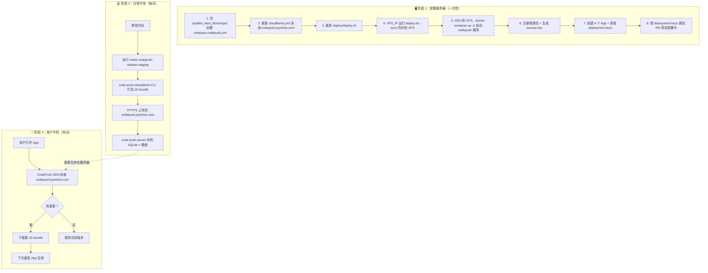

# CodePush 自建热更新 — 完整闭环流程

## 一句话概括

```
你在本地 Mac 或 CI 上传更新包到 VPS → 用户手机每次打开 App 自动检查 VPS → 有更新就下载
```

## 完整流程图



## 三个阶段详解

### 阶段 1：配置服务器（只做一次）

这一步是在你的 VPS 上安装 code-push-server 服务。

```
你的 Mac                          VPS
  │                                │
  │── compose.codepush.yml ──────>│  定义 codepush 容器（Docker）
  │── cloudflared.yml 加一行 ────>│  添加域名映射
  │── deploy.sh 加两行 ─────────>│  让部署脚本同步新文件
  │                                │
  │── deploy --sync ─────────────>│  把配置文件传到 VPS
  │                                │
  │               SSH             │  docker compose up -d
  │──────────────────────────────>│  启动 code-push-server
  │                                │  端口 3000，SQLite 数据库
```

### 阶段 2：日常推送热更新（每天做）

你修改完代码后，运行一个命令就把更新包推送到服务器。

```
你的 Mac
  │
  │  make codepush-release-staging
  │
  │  code-push-standalone 做了什么：
  │  1. 打包 JS bundle（yarn bundle）
  │  2. HTTPS POST 到 https://codepush.joyminis.com
  │  3. 上传 bundle 文件
  │
  ▼
VPS 上的 code-push-server
  │
  │  1. 收到更新包
  │  2. 存到数据库（SQLite）
  │  3. 存到硬盘（/data/storage/）
  │
  ▼
✅ 更新已就绪，等待手机来下载
```

### 阶段 3：用户手机自动更新

用户不需要做任何操作。

```
用户手机上的 Tarsier App
  │
  │  用户打开 App（或从后台切回来）
  │
  │  CodePush SDK（内置在 App 里的插件）
  │  发请求到 https://codepush.joyminis.com
  │  "我当前版本是 v1.0.0，有更新吗？"
  │
  ▼
VPS 上的 code-push-server
  │
  │  检查数据库
  │  "有，最新版本是 v1.0.1"
  │
  ▼
用户手机
  │
  │  后台下载新 JS bundle（几百 KB）
  │  下次重启 App → 新版本生效
  │
  ▼
✅ 用户看到新内容，不需要去应用商店更新
```

## 网络通讯总结

|    方向    | 发起方        | 目标                    |    协议    |     频率     |
| :--------: | :------------ | :---------------------- | :--------: | :----------: |
| ① 上传更新 | 你的 Mac / CI | `codepush.joyminis.com` | HTTPS POST |  每次发布时  |
| ② 检查更新 | 用户手机      | `codepush.joyminis.com` | HTTPS GET  | 每次打开 App |
| ③ 下载更新 | 用户手机      | `codepush.joyminis.com` | HTTPS GET  |   有更新时   |

所有通讯都通过 `codepush.joyminis.com` 这个域名，经过 Cloudflare 加密转发到你的 VPS。

## 你需要改的文件

### JoyMini_Nest_Monorepo（3 个文件）

| 文件                   | 操作                                               |
| ---------------------- | -------------------------------------------------- |
| `compose.codepush.yml` | **新建** — 定义 code-push-server Docker 容器       |
| `cloudflared.yml`      | **加一行** — 添加 `codepush.joyminis.com` 域名映射 |
| `deploy/deploy.sh`     | **加两行** — 同步新文件到 VPS                      |

### frontend-blog-mobile（5 个文件，我做）

| 文件                                | 操作                                         |
| ----------------------------------- | -------------------------------------------- |
| `ios/FrontendBlogMobile/Info.plist` | 加 `CodePushServerURL` key                   |
| `android/app/build.gradle`          | 加 `ServerUrl` resValue                      |
| `Makefile`                          | 改 `code-push` → `code-push-standalone` 命令 |
| `.github/workflows/deploy.yml`      | 改 CI 命令                                   |
| `docs/ci-cd-setup-guide.md`         | 更新文档                                     |

## 配置完成后，一句话验证

```bash
# 你本地推送更新
make codepush-release-staging
# → 上传到 VPS

# 用户打开 App
# → 自动检查 https://codepush.joyminis.com
# → 有更新就下载
# → 下次重启生效
```
