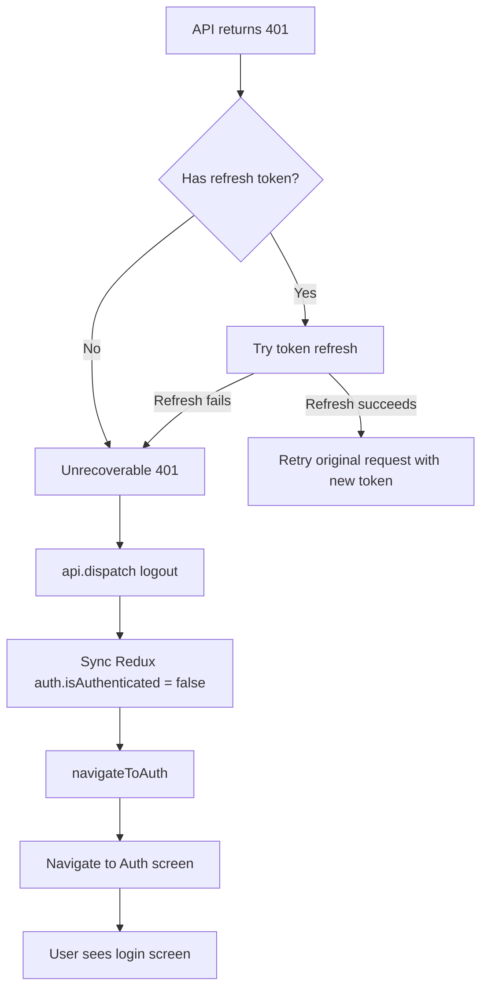

# Fix: 401 Unauthorized Should Redirect to Login Screen

## Problem

When the bookmark API (or any authenticated API) returns a 401 status, the app clears the tokens from MMKV storage but does NOT:

1. Update Redux auth state (leaves `auth.isAuthenticated` as `true`)
2. Navigate to the Auth/login screen

This leaves the user in a broken state where they see the app as logged in, but all authenticated API calls silently fail.

### Root Cause in [`src/api/baseApi.ts`](src/api/baseApi.ts:181)

The `baseQuery` function handles 401 in two scenarios:

**Scenario A — No refresh token (line 248-252):**

```ts
// No refresh token available — user needs to re-authenticate
console.warn('[API] 401 but no refresh token — clearing access token');
storage.delete(AUTH_TOKEN_KEY);
```

→ Clears MMKV, but no Redux `logout()` dispatch, no navigation to Auth.

**Scenario B — Refresh token failed (line 233-237):**

```ts
// Refresh returned non-2xx — clear stored tokens
console.warn('[API] Token refresh failed — clearing stored tokens');
storage.delete(AUTH_TOKEN_KEY);
storage.delete(REFRESH_TOKEN_KEY);
```

→ Same issue: clears MMKV, but no Redux sync, no navigation.

### Why Navigation Doesn't Happen

The `baseQuery` function has no access to React Navigation. It's a pure data-layer function in the Redux middleware stack. The `api` parameter (RTK `BaseQueryApi`) provides `api.dispatch()` and `api.getState()`, but not navigation.

---

## Solution Architecture



### Files to Modify

#### 1. Create: [`src/lib/navigationRef.ts`](src/lib/navigationRef.ts) (NEW)

A shared navigation ref that can be imported from non-component code (like `baseApi.ts`).

```typescript
import { createNavigationContainerRef } from '@react-navigation/native';
import type { RootStackParamList } from '@/navigation/types';

export const navigationRef = createNavigationContainerRef<RootStackParamList>();

/** Navigate to the Auth screen if the navigation container is ready */
export function navigateToAuth(): void {
  if (navigationRef.isReady()) {
    navigationRef.navigate('Auth');
  }
}
```

#### 2. Modify: [`App.tsx`](App.tsx:106)

Import the shared `navigationRef` and pass it to `NavigationContainer` instead of using a local ref.

**Current:**

```tsx
const navigationRef = useRef<NavigationContainerRef<...>>(null);
// ...
<NavigationContainer ref={navigationRef}>
```

**After:**

```tsx
import { navigationRef } from '@/lib/navigationRef';
// ...
<NavigationContainer ref={navigationRef}>
```

Note: the `handleStateChange` callback uses `navigationRef.current` which is still correct since `createNavigationContainerRef` exposes the `.current` property.

#### 3. Modify: [`src/api/baseApi.ts`](src/api/baseApi.ts:180)

After clearing tokens on unrecoverable 401, dispatch the Redux `logout` action and navigate to Auth.

**Add imports:**

```typescript
import { logout } from '@/store/slices/authSlice';
import { navigateToAuth } from '@/lib/navigationRef';
```

**Update both unrecoverable 401 cases (lines ~229-252):**

After each `storage.delete(...)` call in the 401 handling block, add:

```typescript
api.dispatch(logout());
navigateToAuth();
```

This ensures:

- Redux `auth.isAuthenticated` is set to `false`
- Redux `auth.user` is cleared
- Navigation to the Auth screen happens

---

## Why This Approach

| Concern                       | Solution                                                                                                                                                                                    |
| ----------------------------- | ------------------------------------------------------------------------------------------------------------------------------------------------------------------------------------------- |
| **Separation of concerns**    | Navigation ref keeps navigation logic out of the data layer; dispatching `logout` is already how other parts of the app handle logout                                                       |
| **No circular deps**          | `baseApi.ts` imports from `authSlice.ts` and `navigationRef.ts` — both leaf modules with no reverse deps back to `baseApi.ts`                                                               |
| **Covers all endpoints**      | Since the fix is in the base query, ALL authenticated API calls (bookmarks, likes, comments, etc.) automatically get the redirect behavior                                                  |
| **Matches existing patterns** | `logout` action is already exported from `authSlice.ts` and used in [`SettingsScreen.tsx`](src/screens/SettingsScreen.tsx:444) and [`clearAppCache.ts`](src/lib/cache/clearAppCache.ts:104) |

## Affected Scenarios

All authenticated API endpoints that may receive 401:

- [`POST /api/v1/frontend/blog/articles/:id/bookmark`](src/api/endpoints/bookmarks.ts:38) — Add bookmark
- [`DELETE /api/v1/frontend/blog/articles/:id/bookmark`](src/api/endpoints/bookmarks.ts:52) — Remove bookmark
- [`GET /api/v1/frontend/blog/articles/:id/bookmark-status`](src/api/endpoints/bookmarks.ts:66) — Check bookmark status
- [`POST /api/v1/frontend/blog/articles/:slug/like`](src/api/endpoints/likes.ts:29) — Like article
- [`POST /api/v1/frontend/blog/articles/:slug/unlike`](src/api/endpoints/likes.ts:47) — Unlike article
- [`POST /api/v1/frontend/auth/logout`](src/api/endpoints/auth.ts:213) — Logout
- [`GET /api/v1/auth/profile`](src/api/endpoints/auth.ts:235) — Get profile

All of these will now trigger a redirect to Auth on 401, since the fix is in the shared `baseQuery`.

## Edge Cases

1. **Navigation container not ready**: `navigateToAuth()` checks `navigationRef.isReady()` first — safe to call during app initialization
2. **Already on Auth screen**: Navigating to Auth when already there is a no-op in React Navigation
3. **Concurrent 401s**: Multiple simultaneous 401s will each dispatch `logout()` — Redux reducers are idempotent, so repeated dispatches are safe
4. **API calls during token refresh**: The refresh call itself uses `rawBaseQuery` (bypasses the 401 handler), preventing infinite loops
