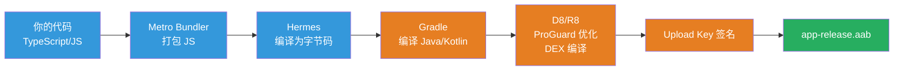

# AAB 是什么？

## 一句话

**AAB** = **Android App Bundle**（Android 应用束），是 Google Play 推荐的上传格式，后缀名为 `.aab`。

---

## APK vs AAB 的区别

```
传统方式（APK）                              Google Play 推荐方式（AAB）

你打包一个巨大的 APK                       你上传一个 AAB
┌──────────────────────────┐              ┌──────────────────────────┐
│ 代码 + 资源              │              │ 代码 + 资源（完整）       │
│ ├─ armeabi-v7a 的 so     │              │                          │
│ ├─ arm64-v8a 的 so       │  ← 所有架构   │  上传到 Google Play       │
│ ├─ x86 的 so             │    都塞进去   │          │               │
│ ├─ hdpi 的图片           │              │          ▼               │
│ ├─ mdpi 的图片           │  ← 所有分辨   │  Google Play 动态处理     │
│ ├─ xhdpi 的图片          │    率都塞进去  │          │               │
│ └─ xxhdpi 的图片         │              │          ▼               │
│                          │              │ 为用户生成最优 APK        │
│ 用户下载 50MB 的 APK     │              │ ┌──────────────────────┐ │
│ 但实际只用了一部分       │              │ │ 仅 arm64-v8a 的 so   │ │
│                          │              │ │ 仅 xxhdpi 的图片     │ │
│                          │              │ │ 大小: ~30MB          │ │
│                          │              │ └──────────────────────┘ │
└──────────────────────────┘              └──────────────────────────┘
```

### 为什么 Google 推荐 AAB？

|              | APK（旧方式）      | AAB（新方式）                              |
| ------------ | ------------------ | ------------------------------------------ |
| 用户下载大小 | 大（包含所有架构） | 小（仅用户需要的）                         |
| 维护成本     | 你需要管理多架构   | Google 自动处理                            |
| 文件大小     | 比如 50MB          | 用户只需下载 ~30MB                         |
| 目前要求     | 仍支持             | **Google Play 强制推荐**，新应用只能用 AAB |

> 从 **2021年8月** 起，Google Play 要求新应用必须使用 AAB 格式上传。

---

## 构建 AAB 的命令

```bash
cd android && ./gradlew bundleRelease
```

构建成功后，文件在：

```
android/app/build/outputs/bundle/release/app-release.aab
```

### 对比：构建 APK 的命令（如果你需要）

```bash
cd android && ./gradlew assembleRelease
# 输出在: android/app/build/outputs/apk/release/app-release.apk
```

---

## AAB 的构建过程



---

## 操作流程总结

```
你本地操作：                        Google Play Console：

cd android &&                     1. 创建应用
  ./gradlew bundleRelease          2. 配置 App Signing
         │                        3. 上传 app-release.aab
         ▼                        4. 填写 Store Listing
  生成 AAB 文件                    5. Data Safety
  app-release.aab                 6. Content Rating
                                   7. 发布
```

---

## 快速对比表格

| 项目                | 说明                                                       |
| ------------------- | ---------------------------------------------------------- |
| 全称                | Android App Bundle                                         |
| 扩展名              | `.aab`                                                     |
| 能否直接安装到手机  | ❌ 不能，需要 Google Play 转换成 APK                       |
| 上传到哪            | Google Play Console                                        |
| 构建命令            | `cd android && ./gradlew bundleRelease`                    |
| 输出路径            | `android/app/build/outputs/bundle/release/app-release.aab` |
| 是否需要 Upload Key | ✅ 需要签名                                                |
| 你的 AAB 状态       | ⏳ 还没构建，需要用上面命令构建                            |
