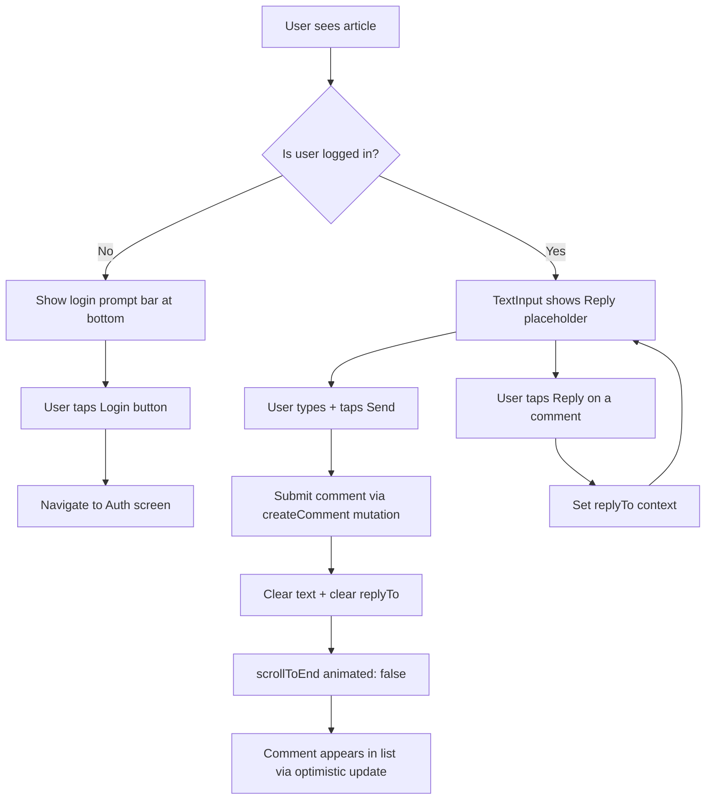

# Plan: Always-Visible Comment Input + Instant Scroll on Submit

## Goal

1. Make the floating comment input bar **always visible** at the bottom of `ArticleDetailScreen` (no toggle)
2. If not logged in → show "Login to comment" prompt; if logged in → show `TextInput` ready to type
3. After submitting a comment, **scroll to the bottom instantly** (no animation) so the user sees their new comment

## Changes (single file: `src/screens/ArticleDetailScreen.tsx`)

### 1. Remove `showCommentInput` state

**Line 107** — remove:
```tsx
const [showCommentInput, setShowCommentInput] = useState(false);
```
The state is no longer needed since the input is always visible.

### 2. Update `handleReply` — don't need to toggle input visibility

**Line 169** — remove `setShowCommentInput(true);` from `handleReply`:
```tsx
// Before:
setReplyTo({ commentId: comment.id, author: comment.author });
setShowCommentInput(true);

// After:
setReplyTo({ commentId: comment.id, author: comment.author });
```
The input is always visible; we just need to set the reply context.

### 3. Update `handleSubmitComment` — scroll to bottom after submit

**Line 213** — replace `setShowCommentInput(false);` with:
```tsx
scrollRef.current?.scrollToEnd({ animated: false });
```
This scrolls the `KeyboardAwareScrollView` to the very bottom instantly (no animation) so the new comment or its optimistic placeholder is visible.

### 4. Remove action button from empty state

**Lines 558-559** — remove `actionLabel` and `onAction` props from `EmptyLogoContent`:
```tsx
// Before:
<EmptyLogoContent
  title={t('comment.noComments')}
  description={t('comment.beFirst')}
  actionLabel={t('comment.writeComment')}
  onAction={() => setShowCommentInput(true)}
/>

// After:
<EmptyLogoContent
  title={t('comment.noComments')}
  description={t('comment.beFirst')}
/>
```
The "Write a comment" button is no longer needed since the input bar is always visible at the bottom.

### 5. Remove conditional wrapper around `KeyboardStickyView`

**Lines 567-677** — remove the `{showCommentInput && (...)}` wrapper:
```tsx
// Before:
{showCommentInput && (
  <KeyboardStickyView ...>
    ...
  </KeyboardStickyView>
)}

// After:
<KeyboardStickyView ...>
  ...
</KeyboardStickyView>
```

## Summary of all changes

| # | Location | Change | Reason |
|---|----------|--------|--------|
| 1 | Line 107 | Remove `showCommentInput` state | No longer needed |
| 2 | Line 169 | Remove `setShowCommentInput(true)` | Input always visible, just set reply context |
| 3 | Line 213 | Replace `setShowCommentInput(false)` → `scrollRef.current?.scrollToEnd({ animated: false })` | Scroll to bottom instantly after submit |
| 4 | Lines 558-559 | Remove `actionLabel` + `onAction` from `EmptyLogoContent` | No toggle needed, input always visible |
| 5 | Line 567 | Remove `{showCommentInput && (...)}` wrapper | Always render `KeyboardStickyView` |

## Visual Flow (after changes)

```
┌─────────────────────────────────────┐
│          Article Content            │
│                                     │
│         ─── Comments ───            │
│         Comment 1                   │
│         Comment 2                   │
│         ...                         │
│                                     │
├─────────────────────────────────────┤
│ [Reply indicator if replying]       │
│ [Login prompt OR TextInput + Send]  │  ← Always visible
└─────────────────────────────────────┘
```

## Mermaid: State Flow



## Risk Assessment

- **Low risk**: All changes are in a single file, no new dependencies
- **Edge case**: If `scrollRef` is not yet attached when submit happens, `scrollToEnd` is a no-op (optional chaining handles this)
- **EmptyLogoContent**: Removing `actionLabel`/`onAction` is safe since both are optional props in `EmptyLogoContentProps`
