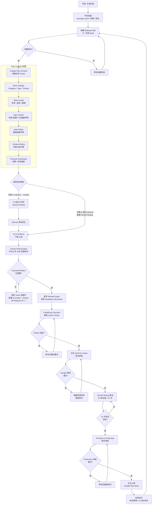
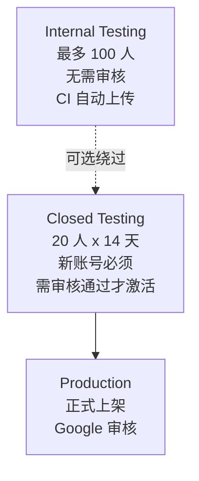

# Android Google Play 上架全流程闭环

> 项目: frontend-blog-mobile (Tarsier)
> 包名: `com.tarsier.labs`
> 签名: Google Play App Signing
> 更新日期: 2026-05-21

---

## 总览流程图



---

## 阶段一：开发与构建准备

### 1.1 代码层面配置

| #   | 任务                                         | 文件                                                                            | 状态      |
| --- | -------------------------------------------- | ------------------------------------------------------------------------------- | --------- |
| 1   | Package name `com.tarsier.labs`              | [`android/app/build.gradle`](../android/app/build.gradle:90)                    | ✅ 已完成 |
| 2   | 移除不必要的权限                             | [`AndroidManifest.xml`](../android/app/src/main/AndroidManifest.xml:3)          | ✅ 已完成 |
| 3   | Release 签名配置                             | [`android/app/build.gradle`](../android/app/build.gradle:96)                    | ✅ 已完成 |
| 4   | 版本号 `versionCode 1` / `versionName 1.0.0` | [`android/app/build.gradle:93-94`](../android/app/build.gradle:93)              | ✅ 已完成 |
| 5   | ProGuard                                     | [`android/app/build.gradle:68`](../android/app/build.gradle:68)                 | ✅ 已完成 |
| 6   | Adaptive Icon                                | `res/mipmap-anydpi-v26/`                                                        | ✅ 已完成 |
| 7   | 屏幕方向 portrait                            | [`AndroidManifest.xml`](../android/app/src/main/AndroidManifest.xml:23)         | ✅ 已完成 |
| 8   | 隐私政策页面                                 | [`src/screens/PrivacyPolicyScreen.tsx`](../src/screens/PrivacyPolicyScreen.tsx) | ✅ 已完成 |
| 9   | Firebase Android 应用注册 `com.tarsier.labs` | [`google-services.json:96-101`](../android/app/google-services.json:96)         | ✅ 已完成 |

### 1.2 构建 Release AAB

```bash
# Production 环境构建
make build-prod-aab
# 等价于: cd android && ./gradlew bundleProductionRelease

# 输出文件
android/app/build/outputs/bundle/productionRelease/app-production-release.aab
```

> **注意**: 本地构建需要 JDK 17。推荐从 GitHub Actions Artifacts 下载 AAB（`deploy.yml` 每次构建都会上传 Artifact）。

---

## 阶段二：Google Play Console 操作

### 2.1 流程全景

```mermaid
flowchart LR
    A["创建应用\nTarsier"] --> B["Store Settings\nCategory / Tags"]
    B --> C["Store Listing\n名称 / 描述 / 截图"]
    C --> D["App Content\n声明政府/金融/广告/健康"]
    D --> E["Data Safety\n数据收集声明"]
    E --> F["Content Rating\n内容分级问卷"]
    F --> G["Pricing & Distribution\n免费 / 所有国家"]
    G --> H["Closed Testing\nCountries + Testers + AAB"]
    H --> I["Publishing Overview\nSend for review"]
    I --> J["审核 → 14天测试 → Production"]
```



### 2.2 已完成操作

| #   | 步骤                   | 详情                                                                                                                    | 状态      |
| --- | ---------------------- | ----------------------------------------------------------------------------------------------------------------------- | --------- |
| 1   | 创建应用               | Tarsier / App / Free / `com.tarsier.labs`                                                                               | ✅ 已完成 |
| 2   | Store Settings         | 类别: Productivity / 标签: Blog + News aggregator / 联系信息: mrporterdev@gmail.com / +639451297266 / blog.joyminis.com | ✅ 已完成 |
| 3   | Store Listing          | 名称: Tarsier / 短描述 + 完整描述已填写 / 8 张手机截图 + 10-inch 平板截图已上传 / Feature Graphic 已上传                | ✅ 已完成 |
| 4   | App Content 声明       | 政府应用: No / 金融功能: None / 广告 ID: No / 健康功能: No / 全部通过 ✅                                                | ✅ 已完成 |
| 5   | Data Safety            | 根据代码分析逐项声明（账号信息/应用活动/崩溃数据等）                                                                    | ✅ 已完成 |
| 6   | Content Rating         | IARC 问卷已完成 / 预期 Everyone                                                                                         | ✅ 已完成 |
| 7   | Pricing & Distribution | 免费 / 所有国家 / 不含广告                                                                                              | ✅ 已完成 |
| 8   | CI/CD 自动构建         | [`deploy.yml`](../.github/workflows/deploy.yml) main 分支自动构建 AAB + 上传 Artifact                                   | ✅ 已完成 |
| 9   | Service Account 权限   | Firebase service account 已加入 Play Console Users & permissions / 13 个权限已授予                                      | ✅ 已完成 |

### 2.3 当前待完成操作

| #   | 步骤                       | 说明                                                                                                | 优先级 |
| --- | -------------------------- | --------------------------------------------------------------------------------------------------- | ------ |
| 1   | **等待 Quick Checks 完成** | Publishing Overview 显示 "Running quick checks... Up to 10 minutes"，等待完成后点击 Send for review | 🔴 高  |
| 2   | **Closed Testing 审核**    | Google 审核 Closed Testing 发布（通常 1-3 天，快则几小时）                                          | 🔴 高  |
| 3   | **招募 20+ 测试者**        | 审核通过后需要至少 20 名测试者参与 14 天连续测试                                                    | 🟡 中  |
| 4   | **14 天 Closed Testing**   | 测试期间需要测试者保持活跃（安装 + 使用）                                                           | 🟡 中  |
| 5   | **Promote to Production**  | 14 天后从 Closed Testing 提升到 Production 轨道                                                     | 🟡 中  |
| 6   | **Production 审核 + 上架** | Google 审核 Production 发布（通常 1-3 天）                                                          | 🟡 中  |

---

## 阶段三：CI/CD 自动化分发

### 3.1 CI/CD 配置

| 配置项        | 详情                                                              |
| ------------- | ----------------------------------------------------------------- |
| CI 文件       | [`.github/workflows/deploy.yml`](../.github/workflows/deploy.yml) |
| 触发分支      | `main` → production AAB                                           |
| 构建命令      | `cd android && ./gradlew bundleProductionRelease`                 |
| Artifact 上传 | `actions/upload-artifact@v4` 上传 AAB                             |
| Play 自动上传 | 使用 `r0adkll/upload-google-play` 上传到 Internal Testing         |

### 3.2 GitHub Secrets

| Secret Name                | 用途                             | 状态      |
| -------------------------- | -------------------------------- | --------- |
| `FIREBASE_SERVICE_ACCOUNT` | Firebase Admin SDK 私钥 (base64) | ✅ 已配置 |
| `PLAY_SERVICE_ACCOUNT_KEY` | Google Play Service Account JSON | ✅ 已配置 |
| `KEYSTORE_BASE64`          | 上传密钥库 (base64)              | ✅ 已配置 |
| `KEYSTORE_FILE`            | 密钥库路径                       | ✅ 已配置 |
| `KEYSTORE_PASSWORD`        | 密钥库密码                       | ✅ 已配置 |
| `KEY_ALIAS`                | 密钥别名                         | ✅ 已配置 |
| `KEY_PASSWORD`             | 密钥密码                         | ✅ 已配置 |

---

## 阶段四：测试与发布

### 4.1 测试层级



### 4.2 当前状态

| 层级               | 状态        | 说明                                              |
| ------------------ | ----------- | ------------------------------------------------- |
| **App Content**    | ✅ 全部完成 | 政府/金融/广告/健康 四项声明全部提交              |
| **Store Settings** | ✅ 全部完成 | Productivity / Blog + News aggregator / 联系方式  |
| **Store Listing**  | ✅ 全部完成 | 名称/描述/截图/Feature Graphic 全部填写           |
| **Data Safety**    | ✅ 全部完成 | 数据声明已提交                                    |
| **Content Rating** | ✅ 全部完成 | IARC 问卷已完成                                   |
| **Pricing**        | ✅ 全部完成 | 免费/所有国家                                     |
| **Closed Testing** | ⏳ 审核中   | v1.0.1 (versionCode 27) 已提交，等待 Quick Checks |
| **Production**     | ❌ 未开始   | 需完成 Closed Testing 14 天后才能提交             |

### 4.3 时间线

```
Day 1:     ✅ 代码准备 + 签名配置
Day 1:     ✅ Google Play 创建应用
Day 1:     ✅ Store Settings / Store Listing / App Content
Day 1:     ✅ Data Safety / Content Rating / Pricing
Day 1:     ✅ AAB v1.0.1 上传到 Closed Testing Alpha
Day 1:     ⏳ Quick Checks + Send for review
Day 1-3:   🔲 Google Closed Testing 审核
Day 1-14:  🔲 Closed Testing (20 测试者)
Day 15:    🔲 Promote to Production
Day 15-17: 🔲 Google Production 审核
Day 17:    🎯 正式上架 Google Play Store
```

---

## 阶段五：实操要点与避坑指南（本次发布经验总结）

### 5.1 Store Settings — 类别选择

| 类别             | 风险                 | 选择 |
| ---------------- | -------------------- | ---- |
| News & Magazines | 高风险，需新闻源授权 | ❌   |
| **Productivity** | 低风险，审核通过率高 | ✅   |

> **Gemini AI 建议**: News & Magazines 类别对新闻聚合类应用审核较严，可能要求提供新闻来源授权证明。Productivity 或 Tools 类别审核更宽松，上架更快。

### 5.2 Store Tags — Play Console 预定义标签

Google Play Console **不支持自定义标签**，只能从预定义列表中选择。

| 标签                 | 所属分类         | 选择 |
| -------------------- | ---------------- | ---- |
| `Blog`               | Social           | ✅   |
| `News aggregator`    | News & magazines | ✅   |
| `reading`, `tech` 等 | 自定义           | ❌   |

> 之前计划的 `reading`, `tech` 标签在 Play Console 中不存在，最终选择 `Blog` + `News aggregator`。

### 5.3 Closed Testing — Countries & Testers 关键坑

**⚠️ 最重要的一条经验: Countries 和 Testers 必须在 Track 设置页面配置，而不是在 Release 创建页面！**

```
正确流程:
Track 设置页 (Settings for this track)
  ├── Select countries/regions → 选择所有 176 个国家 → 保存
  ├── Testers → Add email addresses → 输入测试者邮箱 → 保存
  └── 然后再回去创建 Release
```

**错误示范**（第一次踩坑）:

1. 在 Closed Testing 页面创建 Release
2. 填写 Release 详情后预览 → 报错 "No countries selected"
3. 回到 Track 设置页重新配置 Countries 和 Testers
4. 返回 Release 页重新填写 Release Notes

> 建议顺序: **先设置 Countries → 再设置 Testers → 最后创建 Release**

### 5.4 Closed Testing — 发布步骤（详细）

| #   | 步骤                       | 说明                                                                          |
| --- | -------------------------- | ----------------------------------------------------------------------------- |
| 1   | 获取 AAB                   | 从 GitHub Actions Artifacts 下载 `app-production-release.aab`                 |
| 2   | 导航到 Closed Testing 页面 | Play Console → Testing → Closed Testing → Alpha                               |
| 3   | 设置 Countries             | Track 设置 → Select countries/regions → 选择所有国家（共 176 个）→ 保存       |
| 4   | 设置 Testers               | Track 设置 → Testers → Add email addresses → 输入测试者邮箱（每行一个）→ 保存 |
| 5   | 创建 Release               | Create a new release → 上传 AAB → 填写 Release Notes                          |
| 6   | 填写 Feedback URL/Email    | 必须填写，用于测试者提交反馈。填写 mrporterdev@gmail.com                      |
| 7   | 检查预览                   | 确认版本号、Countries、Testers 都正确                                         |
| 8   | 回到 Publishing Overview   | 等待 Quick Checks 完成（最多 10 分钟）                                        |
| 9   | 点击 Send for review       | 提交审核                                                                      |

### 5.5 Publishing Overview — 提交流程

```
Publishing Overview 页面:
  ┌─────────────────────────────────────────────┐
  │  ✓ App content (App content)                │  ← 绿色勾 = 通过
  │  ✓ Store settings                           │
  │  ✓ Store listing                            │
  │  ✓ Data safety                              │
  │  ✓ Content rating                           │
  │  ✓ Pricing & distribution                   │
  │  ⏳ Closed Testing (Alpha) — Quick Checks   │  ← 等待中
  └─────────────────────────────────────────────┘

状态: "Changes not yet sent for review"
      "Running quick checks... Up to 10 minutes remaining"
```

**操作要点**:

- 如果某部分显示为未完成状态（没有绿色勾），点击该部分进入并**点击页面底部的 Save**，即使没有修改也要保存
- 每次 Save 会触发该部分的状态刷新
- Quick Checks 完成后会显示 "Ready to send for review"
- 此时点击 **Send for review** 提交

### 5.6 App Content 声明汇总

| 声明项          | 回答 | 依据                                                                                             |
| --------------- | ---- | ------------------------------------------------------------------------------------------------ |
| 政府应用        | No   | Tarsier 不是政府应用                                                                             |
| 金融功能        | None | 不提供任何金融功能                                                                               |
| 广告 ID (AD_ID) | No   | [`AndroidManifest.xml`](../android/app/src/main/AndroidManifest.xml) 无 `AD_ID` 权限，无广告 SDK |
| 健康功能        | No   | 不提供健康相关功能                                                                               |

---

## 当前待办清单

### 🔴 立即执行

1. **等待 Quick Checks 完成** → 点击 **Send for review**
2. **审核通过后 → 招募 20+ 测试者**（当前已有 8 人，至少还需要 12 人）

### 🟡 下一步

3. 测试者加入 Closed Testing 并安装使用 14 天
4. 14 天后 Promote to Production

### 🔵 长期维护

5. 正式上架后的版本迭代
6. 版本号管理（`versionCode` 递增 + `versionName` 语义化版本）
7. 后续版本可通过 CI 自动上传到 Internal Testing

---

## 关键概念说明

### Internal Testing vs Closed Testing

| 特性        | Internal Testing         | Closed Testing               |
| ----------- | ------------------------ | ---------------------------- |
| 审核        | 无需审核，立即生效       | 需要 Google 审核通过后才激活 |
| 测试者上限  | 100 人                   | 无上限（但需审核）           |
| 新账号要求  | 可选                     | **必须**，20 人 x 14 天      |
| CI 自动上传 | ✅ 已配置 (`deploy.yml`) | ❌ 需手动上传（本流程）      |
| 使用场景    | 内部开发人员自测         | 发布前的正式测试             |

> **注意**: 本次发布选择了跳过 Internal Testing，直接通过 Closed Testing 提交。原因是 Internal Testing 虽然无需审核但测试者无法通过 Play Store 安装，体验不如直接走 Closed Testing 流程。

### Google Play App Signing

```
开发者用 Upload Key 签名 AAB
    → Google Play 用 App Signing Key 重新签名
        → 用户下载的 APK 使用 App Signing Key 签名
```

- Upload Key 丢失 = 可以找 Google 重置
- App Signing Key 丢失 = 应用无法更新（Google 保管）
- 密钥库位置: `android/app/release-upload-key.keystore`

### 版本号规则

| 字段          | 位置                                                            | 规则                              |
| ------------- | --------------------------------------------------------------- | --------------------------------- |
| `versionCode` | [`android/app/build.gradle:93`](../android/app/build.gradle:93) | 每次上传递增 1                    |
| `versionName` | [`android/app/build.gradle:94`](../android/app/build.gradle:94) | 语义化版本 `主版本.次版本.修订号` |
