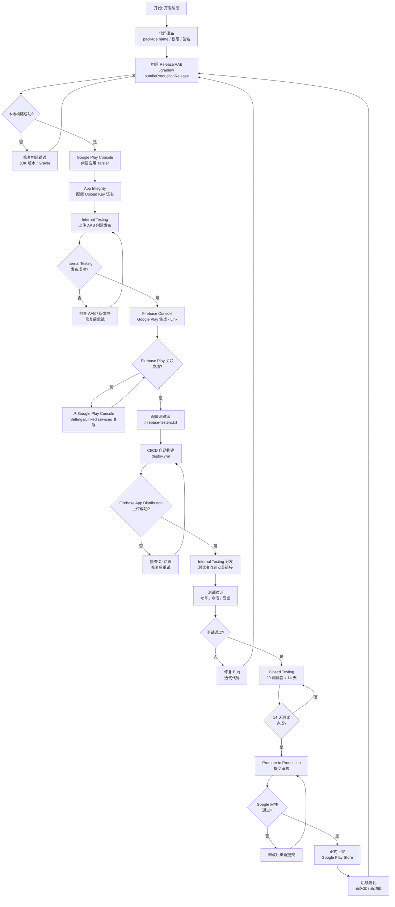
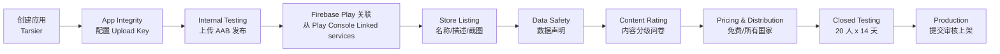
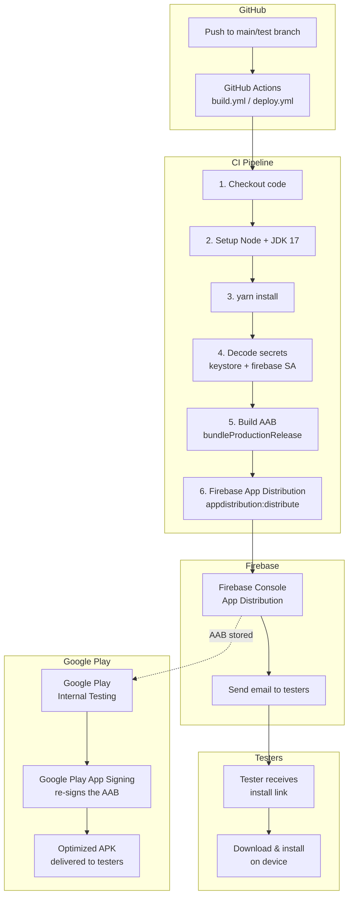
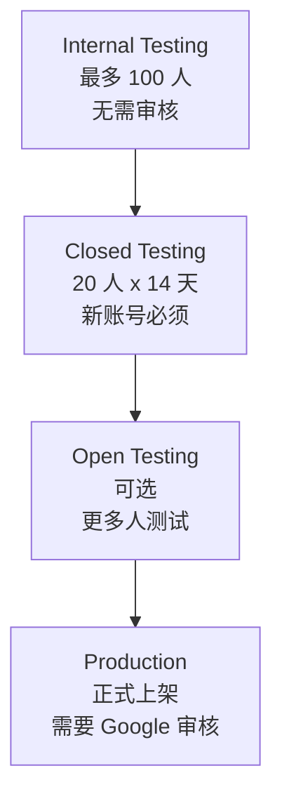

# Android Google Play 上架全流程闭环

> 项目: frontend-blog-mobile (Tarsier)
> 包名: `com.tarsier.labs`
> 签名: Google Play App Signing
> 更新日期: 2026-05-21

---

## 总览流程图



---

## 阶段一：开发与构建准备

### 1.1 代码层面配置

| #   | 任务                                         | 文件                                                                            | 状态      |
| --- | -------------------------------------------- | ------------------------------------------------------------------------------- | --------- |
| 1   | Package name `com.tarsier.labs`              | [`android/app/build.gradle`](../android/app/build.gradle:90)                    | ✅ 已完成 |
| 2   | 移除不必要的权限                             | [`AndroidManifest.xml`](../android/app/src/main/AndroidManifest.xml:3)          | ✅ 已完成 |
| 3   | Release 签名配置                             | [`android/app/build.gradle`](../android/app/build.gradle:96)                    | ✅ 已完成 |
| 4   | 版本号 `versionCode 1` / `versionName 1.0.0` | [`android/app/build.gradle:93-94`](../android/app/build.gradle:93)              | ✅ 已完成 |
| 5   | ProGuard                                     | [`android/app/build.gradle:68`](../android/app/build.gradle:68)                 | ✅ 已完成 |
| 6   | Adaptive Icon                                | `res/mipmap-anydpi-v26/`                                                        | ✅ 已完成 |
| 7   | 屏幕方向 portrait                            | [`AndroidManifest.xml`](../android/app/src/main/AndroidManifest.xml:23)         | ✅ 已完成 |
| 8   | 隐私政策页面                                 | [`src/screens/PrivacyPolicyScreen.tsx`](../src/screens/PrivacyPolicyScreen.tsx) | ✅ 已完成 |
| 9   | Firebase Android 应用注册 `com.tarsier.labs` | [`google-services.json:96-101`](../android/app/google-services.json:96)         | ✅ 已完成 |

### 1.2 构建 Release AAB

```bash
# Production 环境构建
make build-prod-aab
# 等价于: cd android && ./gradlew bundleProductionRelease

# 输出文件
android/app/build/outputs/bundle/productionRelease/app-production-release.aab
```

> **注意**: 本地构建需要 JDK 17。如果系统 JDK 版本不匹配，使用 GitHub Actions Artifacts 下载 AAB。

---

## 阶段二：Google Play Console 操作

### 2.1 流程全景



### 2.2 已完成操作

| #   | 步骤                        | 详情                                                         | 状态      |
| --- | --------------------------- | ------------------------------------------------------------ | --------- |
| 1   | 创建应用                    | Tarsier / App / Free / `com.tarsier.labs`                    | ✅ 已完成 |
| 2   | Internal Testing 发布       | 上传 `app-production-release.aab` v1.0.0                     | ✅ 已完成 |
| 3   | Firebase ↔ Google Play 关联 | 从 Google Play Console → Settings → Linked services 关联成功 | ✅ 已完成 |
| 4   | 上传密钥配置                | TODO: 在 App Integrity 中设置 Upload Key 证书指纹            | ⏳ 待完成 |

### 2.3 待完成操作

| #   | 步骤                                | 说明                                                                                                               | 优先级 |
| --- | ----------------------------------- | ------------------------------------------------------------------------------------------------------------------ | ------ |
| 1   | **App Integrity - 配置 Upload Key** | 在 Play Console → Setup → App Integrity → 添加 Upload Key 证书指纹                                                 | 🔴 高  |
| 2   | **Store Listing**                   | 填写应用名称、简介、完整描述                                                                                       | 🟡 中  |
| 3   | **Feature Graphic**                 | 上传 1024x500px 宣传图（已有 [`assets/play-store-feature-graphic.png`](../assets/play-store-feature-graphic.png)） | 🟡 中  |
| 4   | **Screenshots**                     | 至少 2 张手机截图 (1080x1920)                                                                                      | 🟡 中  |
| 5   | **Data Safety**                     | 声明数据收集和使用情况                                                                                             | 🟡 中  |
| 6   | **Content Rating**                  | 完成内容分级问卷（预计 Everyone / Teen）                                                                           | 🟡 中  |
| 7   | **Pricing & Distribution**          | 设置为免费 / 所有国家                                                                                              | 🟡 中  |
| 8   | **Closed Testing**                  | 20 测试者 x 14 天（新账号必须）                                                                                    | 🟡 中  |

---

## 阶段三：CI/CD 自动化分发

### 3.1 架构图



### 3.2 CI/CD 配置

| 配置项        | 详情                                                              |
| ------------- | ----------------------------------------------------------------- |
| CI 文件       | [`.github/workflows/deploy.yml`](../.github/workflows/deploy.yml) |
| 触发分支      | `test` → staging APK / `main` → production AAB                    |
| 构建命令      | `cd android && ./gradlew bundleProductionRelease`                 |
| Firebase 上传 | `npx firebase-tools appdistribution:distribute`                   |
| 测试者文件    | [`.firebase-testers.txt`](../.firebase-testers.txt)               |
| 服务账号      | Firebase Admin SDK (GitHub Secret: `FIREBASE_SERVICE_ACCOUNT`)    |

### 3.3 GitHub Secrets

| Secret Name                | 用途                             | 状态      |
| -------------------------- | -------------------------------- | --------- |
| `FIREBASE_SERVICE_ACCOUNT` | Firebase Admin SDK 私钥 (base64) | ✅ 已配置 |
| `KEYSTORE_BASE64`          | 上传密钥库 (base64)              | ✅ 已配置 |
| `KEYSTORE_FILE`            | 密钥库路径                       | ✅ 已配置 |
| `KEYSTORE_PASSWORD`        | 密钥库密码                       | ✅ 已配置 |
| `KEY_ALIAS`                | 密钥别名                         | ✅ 已配置 |
| `KEY_PASSWORD`             | 密钥密码                         | ✅ 已配置 |

---

## 阶段四：测试与发布

### 4.1 测试层级



### 4.2 当前状态

| 层级                 | 状态      | 说明                             |
| -------------------- | --------- | -------------------------------- |
| **Internal Testing** | ✅ 已完成 | v1.0.0 已发布，Firebase 已关联   |
| **Closed Testing**   | ⏳ 待开始 | 需收集 20 个测试者邮箱           |
| **Production**       | ❌ 未开始 | 需完成 Closed Testing 后才能提交 |

### 4.3 时间线

```
Day 1:     ✅ 代码准备 + 签名配置
Day 1:     ✅ Google Play 创建应用
Day 1:     ✅ Internal Testing 发布 AAB
Day 1:     ✅ Firebase ↔ Google Play 关联
Day 1:     ⏳ 配置 CI 测试者 .firebase-testers.txt
Day 1:     ⏳ 运行 CI 验证 Firebase 上传
Day 1-7:   🔲 Store Listing / Data Safety / Content Rating
Day 1-14:  🔲 Closed Testing (20 测试者)
Day 15:    🔲 Promote to Production
Day 15-17: 🔲 Google 审核 (1-3 天)
Day 17:    🎯 正式上架 Google Play Store
```

---

## 当前待办清单

### 🔴 立即执行（必须先做）

1. **配置 Upload Key 证书到 App Integrity**

   ```bash
   keytool -list -v -keystore android/app/release-upload-key.keystore -alias upload-key
   ```

   复制 SHA-1 指纹 → Play Console → Setup → App Integrity → Add upload key

2. **更新 `.firebase-testers.txt`** 填入你的邮箱

   ```
   porter@example.com
   ```

3. **推送触发 CI** 验证 Firebase App Distribution 上传成功

### 🟡 下一步

4. 填写 Store Listing（名称 / 描述 / 截图）
5. 配置 Data Safety 声明
6. 完成 Content Rating 问卷
7. 准备 Closed Testing（收集 20 个测试者）

### 🔵 长期维护

8. 正式上架后的版本迭代
9. 版本号管理（`versionCode` 递增 + `versionName` 语义化版本）
10. 持续通过 CI 自动化分发

---

## 关键概念说明

### Firebase App Distribution 流程

```
开发者推送代码 → GitHub Actions 构建 AAB → Firebase 上传
    → Firebase 发送邮件给测试者 → 测试者下载安装
```

- 不需要经过 Google Play 审核
- 适合内部测试和 CI 自动化
- Firebase 和 Google Play 关联后，AAB 自动使用 Google Play App Signing

### Google Play App Signing

```
开发者用 Upload Key 签名 AAB
    → Google Play 用 App Signing Key 重新签名
        → 用户下载的 APK 使用 App Signing Key 签名
```

- Upload Key 丢失 = 可以找 Google 重置
- App Signing Key 丢失 = 应用无法更新（Google 保管）
- 密钥库位置: `android/app/release-upload-key.keystore`

### 版本号规则

| 字段          | 位置                                                            | 规则                              |
| ------------- | --------------------------------------------------------------- | --------------------------------- |
| `versionCode` | [`android/app/build.gradle:93`](../android/app/build.gradle:93) | 每次上传递增 1                    |
| `versionName` | [`android/app/build.gradle:94`](../android/app/build.gradle:94) | 语义化版本 `主版本.次版本.修订号` |
