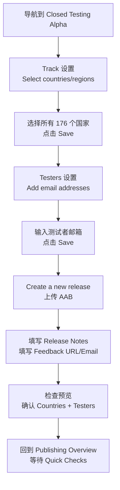

# Android Google Play 上架计划

> 项目: frontend-blog-mobile (Tarsier)
> 状态: 准备首次上架 Google Play
> 包名: `com.tarsier.labs`
> 签名方式: Google Play App Signing

---

## 总览

当前应用基本功能完整，但存在若干 **阻塞性问题** 需要解决才能通过 Google Play 审核。以下按优先级列出了所有需要完成的工作。

---

## 🔴 第一阶段：代码层面修改（已完成 ✅）

### 1. 更改 Package Name 为 `com.tarsier.labs`

**涉及文件：**

- [`android/app/build.gradle:90`](../android/app/build.gradle:90) — `applicationId "com.frontendblogmobile"` → 改为 `com.tarsier.labs`
- [`android/app/src/main/AndroidManifest.xml:1`](../android/app/src/main/AndroidManifest.xml:1) — `package` 改为 `com.tarsier.labs`
- [`android/app/src/main/java/com/frontendblogmobile/`](../android/app/src/main/java/com/frontendblogmobile/) — 整个目录结构需要重命名
- `MainActivity.kt` 和 `MainApplication.kt` 中的 `package com.frontendblogmobile` → 改为 `com.tarsier.labs`

**操作步骤：**

1. 在 `android/app/build.gradle` 中将 `applicationId` 改为 `com.tarsier.labs`
2. 将 `android/app/src/main/java/com/frontendblogmobile/` 目录重命名为 `android/app/src/main/java/com/tarsier/labs/`
3. 更新 `MainActivity.kt` 和 `MainApplication.kt` 中的 `package` 声明为 `com.tarsier.labs`
4. 更新 `AndroidManifest.xml` 中的 `package` 属性为 `com.tarsier.labs`

> ⚠️ **首次上传后不可更改！** 必须在第一次提交 AAB 前完成。iOS 端已有的 `CFBundleURLName` 是 `com.tarsier.blog`，后续也可以统一对齐。

### 2. 移除不必要的权限声明

**涉及文件：**

- [`android/app/src/main/AndroidManifest.xml:3-9`](../android/app/src/main/AndroidManifest.xml:3)

**需要移除的权限：**

```xml
<!-- 删除以下行 -->
<uses-permission android:name="android.permission.CAMERA" />
<uses-permission android:name="android.permission.READ_EXTERNAL_STORAGE" />
<uses-permission android:name="android.permission.WRITE_EXTERNAL_STORAGE" />
<uses-permission android:name="android.permission.ACCESS_FINE_LOCATION" />
<uses-permission android:name="android.permission.ACCESS_COARSE_LOCATION" />
```

**保留的权限：**

- `INTERNET` — 必需，API 通信
- `POST_NOTIFICATIONS` — 推送通知（Android 13+）
- `VIBRATE` — 触觉反馈

> ⚠️ Google Play 会审核权限是否被代码实际使用，未使用的权限可能导致拒审。

### 3. 配置 Release 签名（Google Play App Signing）

**涉及文件：**

- [`android/app/build.gradle:96-103`](../android/app/build.gradle:96) — signingConfigs 区块
- [`android/app/build.gradle:112-121`](../android/app/build.gradle:112) — buildTypes.release 区块

**操作步骤：**

1. 创建上传密钥 (Upload Key)：
   ```bash
   keytool -genkey -v -storetype PKCS12 \
     -keystore release-upload-key.keystore \
     -alias upload-key \
     -keyalg RSA -keysize 2048 \
     -validity 10000
   ```
2. 将 `release-upload-key.keystore` 放在 `android/app/` 目录下（**不要提交到 Git**）
3. 创建 `android/app/keystore.properties` 文件（**不要提交到 Git**）：
   ```properties
   storeFile=release-upload-key.keystore
   storePassword=your-password
   keyAlias=upload-key
   keyPassword=your-password
   ```
4. 在 `android/app/build.gradle` 中添加 release signing 配置：
   ```gradle
   signingConfigs {
       debug { /* 保持现状 */ }
       release {
           if (project.hasProperty('KEYSTORE_FILE')) {
               storeFile file(KEYSTORE_FILE)
               storePassword KEYSTORE_PASSWORD
               keyAlias KEY_ALIAS
               keyPassword KEY_PASSWORD
           }
       }
   }
   ```
5. 将 `buildTypes.release.signingConfig` 改为 `signingConfigs.release`

### 4. 更新版本号

**涉及文件：**

- [`android/app/build.gradle:93-94`](../android/app/build.gradle:93)

```gradle
defaultConfig {
    versionCode 1        // 每次上传递增
    versionName "1.0.0"  // 语义化版本号
}
```

### 5. 启用 ProGuard（可选但推荐）

**涉及文件：**

- [`android/app/build.gradle:68`](../android/app/build.gradle:68)

```gradle
def enableProguardInReleaseBuilds = true
```

并确保 `proguard-rules.pro` 包含了所有必要的 keep 规则（已配置 ExoPlayer/react-native-video）。

### 6. 添加 Adaptive Icon（自适应图标）

**需要创建的文件：**

- `android/app/src/main/res/mipmap-anydpi-v26/ic_launcher.xml`
- `android/app/src/main/res/mipmap-anydpi-v26/ic_launcher_round.xml`
- `android/app/src/main/res/drawable/ic_launcher_background.xml`（纯色背景）
- `android/app/src/main/res/drawable/ic_launcher_foreground.xml`（应用图标前景，SVG/Vector）

Adaptive Icon 在 Android 8+ (API 26+) 上显示为自适应形状，建议添加以获得更好的用户体验。

### 7. 屏幕方向限制（建议）

**涉及文件：**

- [`android/app/src/main/AndroidManifest.xml:23`](../android/app/src/main/AndroidManifest.xml:23)

在 `<activity>` 标签中添加：

```xml
android:screenOrientation="portrait"
```

与 iOS 保持一致（iOS 限制 iPhone 为竖屏）。

---

## 🟡 第二阶段：配置与密钥

### 8. 配置 Sentry DSN

**涉及文件：**

- [`src/lib/env.ts:44`](../src/lib/env.ts:44)

```typescript
const PROD_CONFIG: EnvConfig = {
  // ...
  SENTRY_DSN: 'https://your-dsn@sentry.io/your-project',
  // ...
};
```

**操作步骤：**

1. 在 [sentry.io](https://sentry.io) 创建项目
2. 获取 React Native 项目的 DSN
3. 更新 `src/lib/env.ts` 中的 `PROD_CONFIG.SENTRY_DSN`

### 9. 配置 OAuth Client ID

**涉及文件：**

- [`src/lib/env.ts:48-49`](../src/lib/env.ts:48)

```typescript
const PROD_CONFIG: EnvConfig = {
  // ...
  OAUTH_GOOGLE_CLIENT_ID: 'your-google-client-id',
  OAUTH_APPLE_CLIENT_ID: 'your-apple-client-id',
  // ...
};
```

### 10. 托管隐私政策到公开 URL

- 将隐私政策内容部署到 `https://blog.joyminis.com/privacy`
- 可以在 Web 前端添加一个 `/privacy` 路由，复用应用内隐私内容
- 或者在 API 端创建一个静态页面
- Google Play Console 中需要填入此 URL

---

## 🟢 第三阶段：Google Play Console 操作

### 11. 在 Google Play Console 创建应用

1. 前往 [play.google.com/console](https://play.google.com/console)
2. 创建新应用，选择 **应用 (App)** 类型
3. 名称：`Tarsier`（或最终确定的应用名称）
4. 语言：默认选择（可添加多语言）
5. 应用或游戏：应用
6. 免费或付费：免费

### 12. 设置 Google Play App Signing

1. 在 Play Console → **Setup** → **App Integrity**
2. 选择 **Google Play App Signing** 选项
3. 上传上面生成的 **Upload Key** 公钥证书
4. Google 会生成并管理最终签名密钥

### 13. Fill in Store Listing

**Required content:**

- **App description** (Short description: max 80 characters; Full description: max 4000 characters)
- **Screenshots** (at least 2 phone screenshots, 6-8 recommended)
  - Size: 16:9 or 9:16
  - Generate using Android emulator
- **Feature Graphic** (1024x500px)
- **Category**: ~~News & Magazines~~ → **Productivity** ⚠️ 重要变更
- **Tags**: ~~blog, reading, tech~~ → **Blog, News aggregator** ⚠️ 重要变更

#### 关于 Category 选择的说明

> **2026-05-21 更新**: 最初选择 `News & Magazines`，后根据 Gemini AI 建议改为 `Productivity`。
>
> **原因**: News & Magazines 类别对新闻聚合类应用审核较严格，可能需要提供新闻来源授权证明。Productivity 类别审核更宽松，上架更快。

| 类别             | 风险                 | 选择 |
| ---------------- | -------------------- | ---- |
| News & Magazines | 高风险，需新闻源授权 | ❌   |
| **Productivity** | 低风险，审核通过率高 | ✅   |

#### 关于 Tags 的说明

> **2026-05-21 更新**: Google Play Console 仅支持**预定义标签**，不支持自定义标签。
>
> 原计划 `reading`, `tech` 标签在 Play Console 中不存在。
>
> **实际选择**:
>
> - `Blog` (Social 分类)
> - `News aggregator` (News & magazines 分类)

### 14. Set up Data Safety

Google Play requires you to declare what data your app collects and shares.

**Based on code analysis:**

- ✅ **Account info** (email, username) — OAuth login
- ✅ **App activity** (browsing history, bookmarks, likes)
- ✅ **App info & performance** (Sentry crash reports)
- ❌ Location — not collected
- ❌ Photos / Media — not collected
- ❌ Device ID — Sentry may collect (confirm)

### 15. Set up Content Rating

Complete the Google Play content rating questionnaire:

- Expected rating: **Everyone** or **Teen**
- Blog content, no adult material

> 完整的 Content Rating 问答记录请参考 [`plans/android-content-rating-answers.md`](./android-content-rating-answers.md)

### 16. Set up Pricing & Distribution

- Free app
- Select distribution countries (default: all)
- Confirm no ads (no ad SDK found in codebase, select "No")

### 17. Set up Testers — Closed Testing（关键步骤）

> **新账号必须**完成 Closed Testing 才能发布 Production。

#### 17.1 测试路径选择

2026-05-21 实际操作为: **跳过 Internal Testing，直接走 Closed Testing 路径**

| 路径                      | 说明                                               | 选择        |
| ------------------------- | -------------------------------------------------- | ----------- |
| Internal → Closed Testing | CI 自动上传到 Internal → 再手动设置 Closed Testing | ❌ 跳过     |
| **直接 Closed Testing**   | 从 CI Artifacts 下载 AAB → 手动上传到 Closed       | ✅ 实际采用 |

#### 17.2 获取 AAB

方式一：从 CI Artifacts 下载

1. 推送代码到 `main` 分支触发 [deploy.yml](../.github/workflows/deploy.yml)
2. GitHub Actions 构建完成后，在 Workflow 页面找到 **Artifacts** 部分
3. 下载 `app-production-release.aab`

方式二：本地构建

```bash
make build-prod-aab
# 输出: android/app/build/outputs/bundle/productionRelease/app-production-release.aab
```

#### 17.3 Closed Testing 详细步骤

> ⚠️ **重要: Countries 和 Testers 必须在 Track 设置页面配置，而不是在 Release 创建页面！**



**分步操作:**

| #   | 步骤                       | 说明                                                                          |
| --- | -------------------------- | ----------------------------------------------------------------------------- |
| 1   | 导航到 Closed Testing 页面 | Play Console → Testing → Closed Testing → Alpha                               |
| 2   | 设置 Countries             | Track 设置 → Select countries/regions → 选择所有国家（共 176 个）→ 保存       |
| 3   | 设置 Testers               | Track 设置 → Testers → Add email addresses → 输入测试者邮箱（每行一个）→ 保存 |
| 4   | 创建 Release               | Create a new release → 上传 AAB → 填写 Release Notes                          |
| 5   | 填写 Feedback URL/Email    | 必须填写，用于测试者提交反馈。填写 mrporterdev@gmail.com                      |
| 6   | 检查预览                   | 确认版本号、Countries、Testers 都正确                                         |
| 7   | 回到 Publishing Overview   | 等待 Quick Checks 完成（最多 10 分钟）                                        |
| 8   | 点击 Send for review       | 提交审核                                                                      |

#### 17.4 常见错误及解决方法

| 错误信息                                                                                    | 原因                            | 解决方法                                      |
| ------------------------------------------------------------------------------------------- | ------------------------------- | --------------------------------------------- |
| "No countries or regions have been selected for this track"                                 | Countries 未在 Track 设置页保存 | 回到 Track 设置 → Select countries → 保存     |
| "This release will not be available to any users because you haven't specified any testers" | Testers 未在 Track 设置页保存   | 回到 Track 设置 → Testers → Add email → 保存  |
| "Changes not yet sent for review"                                                           | 发布尚未提交审核                | 等待 Quick Checks 完成 → 点击 Send for review |

> 💡 **经验总结**: 先设置 Countries 和 Testers 并保存，**然后再**创建 Release。如果在创建 Release 后才发现 Countries/Testers 未配置，需要回到 Track 设置页面修改并保存，然后回到 Release 页面重新检查。

### 18. Publishing Overview — 最终提交流程

当所有配置完成后，Publishing Overview 页面会显示各部分的完成状态。

**页面布局:**

```
Publishing Overview 页面:
  ┌─────────────────────────────────────────────┐
  │  ✓ App content (App content)                │  ← 绿色勾 = 通过
  │  ✓ Store settings                           │
  │  ✓ Store listing                            │
  │  ✓ Data safety                              │
  │  ✓ Content rating                           │
  │  ✓ Pricing & distribution                   │
  │  ⏳ Closed Testing (Alpha) — Quick Checks   │  ← 等待中
  └─────────────────────────────────────────────┘

状态文字: "Changes not yet sent for review"
         "Running quick checks... Up to 10 minutes remaining"
```

**操作要点:**

1. **先保存每个部分** — 如果某部分显示为未完成状态（没有绿色勾），点击进入并点击页面底部的 **Save**，即使没有修改也要保存
2. **等待 Quick Checks** — Google 会自动检查配置是否正确，通常需要 1-10 分钟
3. **点击 Send for review** — Quick Checks 完成后会显示 "Ready to send for review"

### 19. Build AAB & Upload

```bash
# Switch to production environment
make env-prod

# Build AAB
make build-android

# Output
# android/app/build/outputs/bundle/release/app-release.aab
```

---

## 📋 Execution Order Summary

| #   | Task                                                | Type     | Status        |
| --- | --------------------------------------------------- | -------- | ------------- |
| 1   | Change package name to `com.tarsier.labs`           | Code     | ✅ 已完成     |
| 2   | Remove unused permissions (CAMERA, LOCATION)        | Code     | ✅ 已完成     |
| 3   | Create Upload Key + configure Release signing       | Config   | ✅ 已完成     |
| 4   | Update version (versionCode 1, versionName 1.0.0)   | Code     | ✅ 已完成     |
| 5   | Enable ProGuard                                     | Code     | ✅ 已完成     |
| 6   | Add Adaptive Icon                                   | Assets   | ✅ 已完成     |
| 7   | Restrict screen orientation (portrait)              | Code     | ✅ 已完成     |
| 8   | Configure Sentry DSN                                | Config   | 🔲 待完成     |
| 9   | Configure OAuth Client ID                           | Config   | 🔲 待完成     |
| 10  | Deploy privacy policy to blog.joyminis.com/privacy  | External | 🔲 待完成     |
| 11  | Google Play Console — Create app                    | External | ✅ 已完成     |
| 12  | Google Play App Signing                             | External | ✅ 已完成     |
| 13  | Store Listing (name/desc/screenshots/category/tags) | External | ✅ 已完成     |
| 14  | Data Safety                                         | External | ✅ 已完成     |
| 15  | Content Rating                                      | External | ✅ 已完成     |
| 16  | Pricing & Distribution                              | External | ✅ 已完成     |
| 17  | Closed Testing setup + AAB upload                   | External | ✅ 已提交审核 |
| 18  | Publishing Overview → Send for review               | External | ⏳ 等待中     |
| 19  | Closed Testing 14-day (20 testers)                  | External | 🔲 待完成     |
| 20  | Promote to Production                               | External | 🔲 待完成     |

---

## ⚠️ Important Notes

1. **Package name is irreversible** — once uploaded to Play Console, it can never be changed
2. **Key security** — Upload Key must be backed up; without it you cannot update the app
3. **Closed Testing** — new developer accounts require 14 days of testing with at least 20 testers before production
4. **Countries/Testers must be set at Track level** — not at Release level. This is a common gotcha!
5. **API review** — if your API returns user-generated content, additional review may be required
6. **Android 16 (SDK 36)** — ensure all dependency libraries are compatible with targetSdk 36
7. **Category choice matters** — Productivity > News & Magazines for faster review
8. **Tags are predefined** — Google Play does not support custom tags; only choose from the predefined list

---

## 附录：CI/CD Google Play Internal Testing 自动发布

> 已配置 GitHub Actions 自动构建并直接上传到 Google Play Console Internal Testing 轨道
>
> **⚠️ 注意**: 首次上架时我们选择了跳过 Internal Testing 直接走 Closed Testing。Internal Testing 的自动发布适用于后续版本迭代。

### ✅ 已完成（代码层面）

| 文件                                                                                                            | 改动                                                                                   |
| --------------------------------------------------------------------------------------------------------------- | -------------------------------------------------------------------------------------- |
| [`.github/workflows/deploy.yml`](../.github/workflows/deploy.yml)                                               | 使用 `r0adkll/upload-google-play` 替换 Firebase App Distribution，直接上传到 Play 内测 |
| [`android/app/build.gradle`](../android/app/build.gradle)                                                       | `versionCode` 自动递增（使用 `GITHUB_RUN_NUMBER`），`versionName` 更新为 `1.0.1`       |
| [`docs/ci-cd-setup-guide.md`](../docs/ci-cd-setup-guide.md#7-google-play-internal-testing-setup-ci-auto-upload) | 更新为 Google Play Internal Testing 配置文档                                           |

---

### 📋 手动操作步骤（一次性设置）

以下是 CI 上线前需要完成的 **手动设置**（已完成 ✅）：

---

### 第 1 步：启用 Google Play Android Developer API ✅

> 在 Google Cloud Console 中启用 Play 的 API，让 service account 能调用 Play 上传接口。

1. 打开 **Google Cloud Console**：https://console.cloud.google.com/apis/library/androidpublisher.googleapis.com
2. 确保选择了项目 `adroit-outlet-444914-m0`
3. 点击 **Enable**（已启用 ✅）

---

### 第 2 步：添加 Service Account 到 Google Play Console ✅

> 把 Firebase 的 service account 邮箱加到 Play Console 中，授予上传权限。

1. 打开 **Google Play Console** → **Settings** → **Users & permissions**
2. 点击 **Invite new user**
3. 输入 service account 邮箱（在 Firebase Console → Project Settings → Service Accounts 中可以找到）
4. 权限选择 **Admin**（所有权限）
5. 点击 **Invite**（已添加 ✅，确认 13 个权限）

---

### 第 3 步：创建 `PLAY_SERVICE_ACCOUNT_KEY` GitHub Secret ✅

> 把 service account 的 JSON 密钥存为 GitHub Secret，供 CI 使用。

1. 打开 **Firebase Console** → **Project Settings** → **Service Accounts**
2. 点击 **Generate new private key** → 下载 JSON 文件
3. 复制 JSON 文件的**全部原始内容**（不要 base64 编码）
4. 打开 **GitHub → Settings → Secrets and variables → Actions**
5. 点击 **New repository secret**
   - **Name:** `PLAY_SERVICE_ACCOUNT_KEY`
   - **Value:** 粘贴 JSON 原始内容
6. 点击 **Add secret**（已创建 ✅）

---

### 第 4 步：在 Google Play Console 添加测试者（Closed Testing 路径）

> 对于 Closed Testing，测试者直接在 Play Console 的 Track 设置中添加。

1. 打开 **Google Play Console → Tarsier → Testing → Closed Testing → Alpha**
2. 在 **Track 设置**中 → **Testers** → **Add email addresses**
3. 输入测试者的 Gmail 邮箱（每行一个）
4. 点击 **Save**
5. 审核通过后，测试者会收到邀请链接，点击加入即可

> ⚠️ 不要将真实邮箱提交到 git 仓库。

---

### CI 构建规则

| 推送到分支 | CI 自动构建    | 上传到 Google Play Internal Testing |
| ---------- | -------------- | ----------------------------------- |
| `test`     | staging APK    | ❌ 不上传（仅开发调试）             |
| `main`     | production AAB | ✅ 上传到 Internal Testing 并发布   |
| `v*` tag   | production AAB | ✅ 上传到 Internal Testing 并发布   |

### 版本号规则

- **versionCode** — 自动递增，每个 CI 运行使用 `GITHUB_RUN_NUMBER`（如 #8 → versionCode 8）
- **versionName** — 手动在 [`android/app/build.gradle`](../android/app/build.gradle:100-103) 中设置，遵循语义化版本 `MAJOR.MINOR.PATCH`
  - 大版本改动 → 改 MAJOR（如 `2.0.0`）
  - 新功能 → 改 MINOR（如 `1.1.0`）
  - 小修复 → 改 PATCH（如 `1.0.2`）
