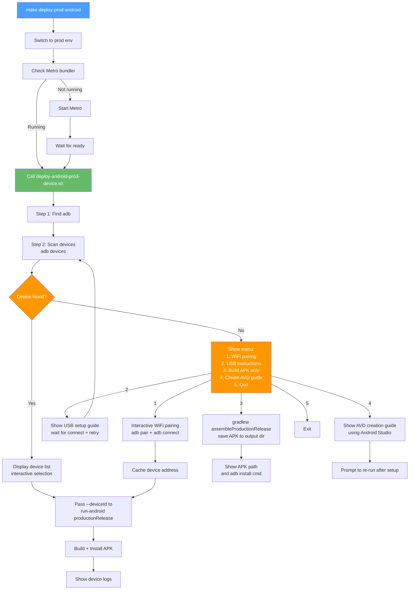

# Android Production Deploy — Device Discovery Fix Plan

## Current State & Problem

The [`deploy-prod-android`](../Makefile:125) Makefile target runs:

```makefile
npx react-native run-android --mode productionRelease
```

This command has a critical flaw: `react-native run-android` **always tries to launch an emulator first**. When no AVD (Android Virtual Device) exists, it fails with:

```
error Failed to launch emulator. Reason: No emulators found as an output of `emulator -list-avds`.
```

Even if a physical device **is** connected, `run-android` may still emit this error and fail to install if the emulator resolution step errors out before falling through to device installation.

The existing [`deploy-android-device.sh`](../scripts/deploy-android-device.sh) script handles device discovery robustly (USB detection, WiFi pairing with interactive setup) but is only used for **debug** builds (`dev-android-device`). The production deploy path has no equivalent.

## Proposed Solution

Create a new script [`scripts/deploy-android-prod-device.sh`](../scripts/deploy-android-prod-device.sh) that:

1. Reuses the device discovery logic from [`deploy-android-device.sh`](../scripts/deploy-android-device.sh)
2. Adds a **pre-flight device check** that gracefully handles the "no device found" scenario
3. Builds and deploys the **productionRelease** variant instead of debug
4. Uses `--deviceId` flag to skip the emulator launch attempt entirely
5. Falls back to build-only if the user chooses

Then update the [`Makefile`](../Makefile) `deploy-prod-android` target to call this script.

## Architecture



## Detailed Steps

### Step 1: Create [`scripts/deploy-android-prod-device.sh`](../scripts/deploy-android-prod-device.sh)

This script is modeled after [`deploy-android-device.sh`](../scripts/deploy-android-device.sh) with these key differences:

| Aspect           | `deploy-android-device.sh` (debug) | `deploy-android-prod-device.sh` (production) |
| ---------------- | ---------------------------------- | -------------------------------------------- |
| Build variant    | Debug (default)                    | `productionRelease`                          |
| Metro needed?    | Yes (debug JS serves from Metro)   | **No** (JS bundled inside APK for release)   |
| Device discovery | Same logic                         | Same logic + **no-device fallback menu**     |
| `adb reverse`    | Yes (for Metro)                    | **No** (not needed)                          |
| `--deviceId`     | Used                               | Used (to avoid emulator launch)              |
| Auto-logs        | Yes                                | Yes (same pattern)                           |
| No-device menu   | No (exits with error)              | **Yes** (interactive options)                |
| WiFi cache       | Yes                                | Yes (reuses same cache)                      |

**Script structure:**

```
1.  Java environment setup (JDK 17 pinning) — same as existing
2.  Configuration, colors, helper functions — same as existing
3.  Step 1: Find `adb` binary — same as existing
4.  Step 2: Scan for connected devices — same as existing
    - Auto-reconnect to cached WiFi device
    - Parse `adb devices` output
5.  Step 2b: NO-DEVICE FALLBACK MENU (NEW)
    - Options:
      a) WiFi pairing (interactive, reusing logic from existing)
      b) USB connection guide + retry
      c) Build APK only (fallback)
      d) Create AVD guide
      e) Quit
6.  Step 3: Device selection — same as existing
7.  Step 4: `adb reverse` — SKIPPED (not needed for release builds)
8.  Step 5: Metro check — simplified (still check, but warn it's not required)
9.  Step 6: Build & deploy with `--deviceId` and `--mode productionRelease`
10. Step 7: Device logs (same as existing)
```

**Key details for the no-device fallback menu:**

```text
━━━ No Device Found ━━━

No Android devices detected. What would you like to do?

  [1] Connect over WiFi (Wireless debugging) — recommended
      (Only need to pair once — subsequent runs reconnect automatically)
  [2] Connect over USB — plug in your device now
  [3] Build APK only (save to disk for manual install)
  [4] Create an Android emulator (AVD) — for future use
  [5] Quit

Select [1/2/3/4/5]:
```

For option 3 (Build APK only):

```bash
cd android && ./gradlew assembleProductionRelease
echo "✅ APK built: android/app/build/outputs/apk/production/release/app-production-release.apk"
echo "   Install with: adb install android/app/build/outputs/apk/production/release/app-production-release.apk"
```

For option 4 (Create AVD guide):

```bash
echo "📱 To create an Android emulator:"
echo "   1. Open Android Studio → More Actions → AVD Manager"
echo "   2. Click 'Create Virtual Device' → select a device (e.g., Pixel 7)"
echo "   3. Select a system image (e.g., API 35) → Download → Next"
echo "   4. Finish → Click Play to start the emulator"
echo ""
echo "   Or via CLI (requires Android SDK command-line tools):"
echo "     avdmanager create avd -n Pixel_7_API_35 -k 'system-images;android-35;google_apis;arm64-v8a'"
echo "     emulator -avd Pixel_7_API_35"
echo ""
echo "   Then re-run: make deploy-prod-android"
```

### Step 2: Update [`Makefile`](../Makefile) `deploy-prod-android` target

Change from:

```makefile
deploy-prod-android: env-prod ## Build & deploy production APK to connected Android device
	@echo "..."
	@npx react-native run-android --mode productionRelease 2>&1; \
	...
```

To:

```makefile
deploy-prod-android: env-prod ## Build & deploy production APK to connected Android device
	@echo "🏗️  Deploying \033[31mproduction\033[0m build to connected Android device..."
	@echo ""
	@echo "━━━ Step 1 — Metro Bundler ━━━"
	@if curl -s http://localhost:8081/status > /dev/null 2>&1; then \
		echo "  ✅ Metro bundler is already running"; \
	else \
		echo "  ⚠️  Metro bundler not running. Starting..."; \
		yarn start > /tmp/metro-bundler.log 2>&1 & \
		METRO_PID=$$!; \
		echo "  🔄 Metro PID: $$METRO_PID — waiting for ready..."; \
		for i in $$(seq 1 30); do \
			if curl -s http://localhost:8081/status > /dev/null 2>&1; then \
				echo "  ✅ Metro is ready!"; \
				break; \
			fi; \
			if [ "$$i" = "30" ]; then \
				echo "  ❌ Metro did not start. Check /tmp/metro-bundler.log"; \
				exit 1; \
			fi; \
			sleep 1; \
		done; \
	fi
	@echo ""
	@echo "━━━ Step 2 — Device Discovery & Deploy ━━━"
	@./scripts/deploy-android-prod-device.sh
```

The Metro check is kept in the Makefile for visibility, but the script also handles it. The key change is delegating to the script which handles device discovery interactively.

### Step 3: Update `.PHONY` list

Ensure `deploy-prod-android` is already in the `.PHONY` list (it should be from the previous plan).

### Step 4: Verify no regressions

- Test `make dev-android-device` still works (existing script unchanged)
- Test `make build-prod-apk` still works (existing gradle command unchanged)
- Test `make deploy-prod-android` with a connected device → should build + install
- Test `make deploy-prod-android` without a device → should show the interactive menu

## Files to Modify

| File                                                                                | Change                                                                  | Type       |
| ----------------------------------------------------------------------------------- | ----------------------------------------------------------------------- | ---------- |
| [`scripts/deploy-android-prod-device.sh`](../scripts/deploy-android-prod-device.sh) | **Create** new script (700+ lines, modeled on deploy-android-device.sh) | **Create** |
| [`Makefile`](../Makefile:125)                                                       | Replace inline `npx react-native run-android` with call to script       | **Modify** |

## Key Design Decisions

| Decision                                             | Rationale                                                                                                                                                                                     |
| ---------------------------------------------------- | --------------------------------------------------------------------------------------------------------------------------------------------------------------------------------------------- |
| Create **new** script rather than modifying existing | Existing `deploy-android-device.sh` is debug-focused (Metro-dependent, `adb reverse`, etc.). Mixing production logic would create complexity with flags. A separate script is cleaner.        |
| Use `--deviceId` flag                                | Prevents `react-native run-android` from attempting to launch an emulator. Targets the exact connected device.                                                                                |
| Keep Metro check in Makefile + script                | Makefile provides clear user-facing output. Script handles Metro as fallback. For production builds Metro is technically optional (JS bundled), but having it provides better error messages. |
| Reuse same WiFi cache file                           | User only needs to pair once — both debug and production scripts share the same `~/.cache/frontend-blog-mobile/android-wifi-device`                                                           |
| Build-only fallback                                  | Useful for CI or when you just want the APK artifact without deployment                                                                                                                       |
| AVD creation guide                                   | Helps users set up a development emulator for ongoing use                                                                                                                                     |
