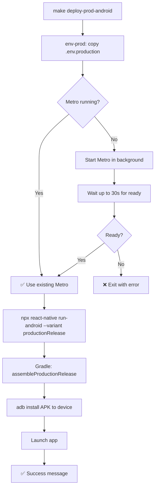

# Android Production Device Deploy Plan

## Current State

| Feature                                         | Status                                   |
| ----------------------------------------------- | ---------------------------------------- |
| `dev-android-device` (Debug → device)           | ✅ Exists via interactive script         |
| `build-prod-apk` (Build only)                   | ✅ `./gradlew assembleProductionRelease` |
| `build-prod-aab` (Google Play)                  | ✅ `./gradlew bundleProductionRelease`   |
| `deploy-prod-ios` (Production → device)         | ✅ Already added                         |
| **`deploy-prod-android`** (Production → device) | **❌ MISSING**                           |

## Prerequisites Already Met

1. **Release keystore exists** — [`android/app/release-upload-key.keystore`](../android/app/release-upload-key.keystore) with [`keystore.properties`](../android/app/keystore.properties) providing passwords → configured in [`android/app/build.gradle:111-126`](android/app/build.gradle:111)
2. **JDK 17 pinned** in [`android/gradle.properties:17`](android/gradle.properties:17) — avoids JDK 25+ issues
3. **Product flavors configured** — `production` / `staging` in [`android/app/build.gradle:128-155`](android/app/build.gradle:128)
4. **Build variant** — `productionRelease` will produce a signed, minified, ProGuard'd APK

## Proposed Changes

### 1. Add `deploy-prod-android` to `.PHONY` in Makefile

Add to line ~13:

```
deploy-prod-android \
```

### 2. Create the target (place after `deploy-prod-ios` block, around line ~122)

Pattern mirrors [`deploy-prod-ios`](../Makefile:73) exactly:

```makefile
deploy-prod-android: env-prod ## Build & deploy production APK to connected Android device
	@echo "🏗️  Deploying \033[31mproduction\033[0m build to connected Android device..."
	@echo ""
	@echo "━━━ Step 1 — Metro Bundler ━━━"
	@if curl -s http://localhost:8081/status > /dev/null 2>&1; then \
		echo "  ✅ Metro bundler is already running"; \
	else \
		echo "  ⚠️  Metro bundler not running. Starting..."; \
		yarn start > /tmp/metro-bundler.log 2>&1 & \
		METRO_PID=$$!; \
		echo "  🔄 Metro PID: $$METRO_PID — waiting for ready..."; \
		for i in $$(seq 1 30); do \
			if curl -s http://localhost:8081/status > /dev/null 2>&1; then \
				echo "  ✅ Metro is ready!"; \
				break; \
			fi; \
			if [ "$$i" = "30" ]; then \
				echo "  ❌ Metro did not start. Check /tmp/metro-bundler.log"; \
				exit 1; \
			fi; \
			sleep 1; \
		done; \
	fi
	@echo ""
	@echo "━━━ Step 2 — Build productionRelease & Deploy ━━━"
	@echo "  📱 Building and installing productionRelease APK..."
	@echo "     (signed with release-upload-key.keystore)"
	@echo ""
	@npx react-native run-android --variant productionRelease 2>&1; \
	RC=$$?; \
	if [ $$RC -ne 0 ]; then \
		echo ""; \
		echo "  ❌ Deployment failed."; \
		echo "     Possible causes:"; \
		echo "     • No Android device connected (check: adb devices)"; \
		echo "     • Device not authorized (accept USB debugging prompt)"; \
		echo "     • Gradle build error (check output above)"; \
		echo "     • Keystore issue (check android/app/keystore.properties)"; \
		exit $$RC; \
	fi
	@echo ""
	@echo "━━━━━━━━━━━━━━━━━━━━━━━━━━━━━━━━━━━━━━━━"
	@echo "  ✅  Production APK deployed to Android!"
	@echo "━━━━━━━━━━━━━━━━━━━━━━━━━━━━━━━━━━━━━━━━"
	@echo ""
	@echo "  🔍 To view console logs:"
	@echo "     $$ make logs-android"
	@echo ""
```

### 3. Key Design Decisions

| Decision                                    | Rationale                                                                                                               |
| ------------------------------------------- | ----------------------------------------------------------------------------------------------------------------------- |
| Use `--variant productionRelease`           | This is the correct Gradle variant for production flavor + release build type                                           |
| Use `npx react-native run-android` directly | Unlike the debug script, no interactive device selection needed — picks first connected device (same as iOS `--device`) |
| Auto-start Metro                            | Same pattern as `deploy-prod-ios` — necessary for JS bundle during build                                                |
| `adb reverse` not needed                    | Production APK bundles JS inside; no runtime Metro connection required                                                  |
| No `--deviceId` flag                        | Simpler UX; `adb` already selects the single connected device automatically                                             |

### 4. Mermaid Flow



### 5. Files to Modify

| File                          | Change                                                           |
| ----------------------------- | ---------------------------------------------------------------- |
| [`Makefile`](../Makefile:13)  | Add `deploy-prod-android` to `.PHONY` list                       |
| [`Makefile`](../Makefile:122) | Add `deploy-prod-android` target block (after `deploy-prod-ios`) |
