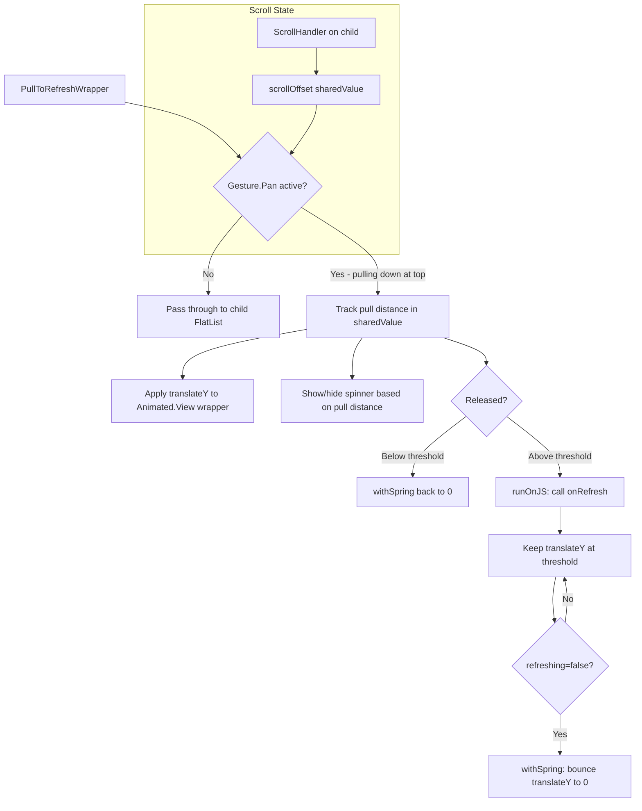

# Android Pull-to-Refresh iOS-style Bounce Plan

## Problem

On Android, React Native's `RefreshControl` (backed by native `SwipeRefreshLayout`) snaps the content back immediately when the user releases the pull gesture. On iOS, the content stays in the pulled-down position while the spinner shows, then bounces back when the refresh completes.

The user wants Android to have the same "stay pulled then bounce back" behavior as iOS.

## Current Behavior vs Desired Behavior

```
iOS (current - already correct):
┌─────────────────────┐    ┌─────────────────────┐    ┌─────────────────────┐
│ Pull down...        │    │ Release: stays down  │    │ Refresh complete:   │
│ ┌─────────────────┐ │    │ ◎ spinner spinning   │    │ bounce back         │
│ │ Article 1       │ │    │ ┌─────────────────┐ │    │ ┌─────────────────┐ │
│ │ Article 2       │ │    │ │ Article 1       │ │    │ │ Article 1       │ │
│ └─────────────────┘ │    │ │ Article 2       │ │    │ │ Article 2       │ │
└─────────────────────┘    └─────────────────────┘    └─────────────────────┘

Android (current - needs fix):
┌─────────────────────┐    ┌─────────────────────┐    ┌─────────────────────┐
│ Pull down...        │    │ Release: snaps back  │    │ Refresh complete:   │
│ ┌─────────────────┐ │    │ ◎ spinner at top     │    │ spinner disappears  │
│ │ Article 1       │ │    │ ┌─────────────────┐ │    │ ┌─────────────────┐ │
│ │ Article 2       │ │    │ │ Article 1       │ │    │ │ Article 1       │ │
│ └─────────────────┘ │    │ │ Article 2       │ │    │ │ Article 2       │ │
└─────────────────────┘    └─────────────────────┘    └─────────────────────┘

Android (desired):
┌─────────────────────┐    ┌─────────────────────┐    ┌─────────────────────┐
│ Pull down...        │    │ Release: stays down  │    │ Refresh complete:   │
│ ┌─────────────────┐ │    │ ◎ spinner spinning   │    │ spring back 🏀     │
│ │ Article 1       │ │    │ ┌─────────────────┐ │    │ ┌─────────────────┐ │
│ │ Article 2       │ │    │ │ Article 1       │ │    │ │ Article 1       │ │
│ └─────────────────┘ │    │ │ Article 2       │ │    │ │ Article 2       │ │
└─────────────────────┘    └─────────────────────┘    └─────────────────────┘
```

## Approach

Create a reusable `PullToRefreshWrapper` component using `react-native-reanimated` and `react-native-gesture-handler` that replaces the native `RefreshControl` **on Android only**. On iOS, the native `RefreshControl` already has the correct behavior and will be left as-is.

### How it Works

1. **Gesture Handling**: Use `Gesture.Pan()` from react-native-gesture-handler to detect pull-down gestures when the FlatList/ScrollView is at scroll position 0 (top). Use `scrollOffset` shared value (read from the list's onScroll handler) to conditionally activate.

2. **Pull Tracking**: Track the pull distance using a Reanimated `useSharedValue`. Apply logarithmic resistance/damping to simulate rubber-band feel (pulling gets harder as you go).

3. **Visual Feedback**: Show a custom animated spinner (rotating circle using Reanimated) positioned at the top of the content area. The spinner fades in as the user pulls past a threshold.

4. **Release Behavior**:
   - Pulled past threshold (~80px) → trigger `onRefresh` via `runOnJS`, keep `translateY` at threshold value (content stays pulled)
   - Not past threshold → `withSpring(0)` bounce back

5. **Refresh Completion**: When `refreshing` prop becomes `false`, animate `translateY` back to 0 using `withSpring()` with damping/stiffness tuned for iOS-like bounce.

6. **Scroll Integration**: The FlatList/ScrollView's `onScroll` handler updates a shared value `scrollOffset`. The pan gesture only activates when `scrollOffset <= 0` AND the gesture is pulling down.

### Component API

```tsx
interface PullToRefreshWrapperProps {
  refreshing: boolean;
  onRefresh: () => void;
  /** Threshold pull distance to trigger refresh (default: 80) */
  pullThreshold?: number;
  /** Offset from top to position the spinner (e.g., for header padding) */
  spinnerOffset?: number;
  /** Spinner color */
  spinnerColor?: string;
  /** Background color to fill the revealed gap */
  backgroundColor?: string;
  /** Render-prop for the scrollable content */
  children: React.ReactNode;
}
```

### Architecture



### Files to Create

| File                                           | Purpose                                |
| ---------------------------------------------- | -------------------------------------- |
| `src/components/core/PullToRefreshWrapper.tsx` | New reusable pull-to-refresh component |

### Files to Modify

| File                                     | Change                                                          |
| ---------------------------------------- | --------------------------------------------------------------- |
| `src/screens/HomeScreen.tsx`             | Replace `RefreshControl` with `PullToRefreshWrapper` on Android |
| `src/screens/TagListScreen.tsx`          | Same - uses ScrollView                                          |
| `src/screens/CategoryListScreen.tsx`     | Same - uses FlatList                                            |
| `src/screens/ArticleListScreen.tsx`      | Same - uses FlatList                                            |
| `src/screens/BookmarksScreen.tsx`        | Same - uses FlatList                                            |
| `src/screens/TagArticlesScreen.tsx`      | Same - uses FlatList                                            |
| `src/screens/CategoryArticlesScreen.tsx` | Same - uses FlatList                                            |
| `src/screens/ArchiveScreen.tsx`          | Same - uses ScrollView                                          |

## Implementation Details

### PullToRefreshWrapper Component

```tsx
// Core structure:
<GestureDetector gesture={panGesture}>
  <Animated.View style={[wrapperStyle, animatedStyle]}>
    {/* Spinner indicator - absolutely positioned */}
    <AnimatedSpinner
      progress={pullProgress}
      color={spinnerColor}
      offset={spinnerOffset}
    />
    {/* The actual FlatList/ScrollView content */}
    {children}
  </Animated.View>
</GestureDetector>
```

Key implementation notes:

1. **`useAnimatedScrollHandler`** must be set up on the child FlatList/ScrollView and communicate `scrollOffset` back to the wrapper. Since the FlatList's `onScroll` is already used in HomeScreen for scroll-driven animations, we need to compose both handlers. The wrapper will accept an `onScroll` callback that gets called from the child's scroll handler.

2. **Gesture detection**: Use `Gesture.Pan()` with:
   - `activateAfterLongPress(0)` or appropriate activation delay
   - `onUpdate`: track translationY with rubber-band damping
   - `onEnd`: check if past threshold, trigger refresh if so
   - The gesture should only activate when `scrollOffset <= 0` (at top)

3. **Spring animation for bounce-back**: Use `withSpring` with carefully tuned parameters:

   ```ts
   withSpring(0, {
     damping: 15,
     stiffness: 150,
     mass: 0.5,
   });
   ```

4. **Custom spinner**: Use Reanimated to create a rotating circle indicator:
   - `withRepeat(withTiming(360, { duration: 1000 }), -1)` for rotation
   - Opacity based on pull progress (0 → 1 as pull approaches threshold)

5. **Platform condition**: Only wrap on Android; on iOS, render children directly without modification.

### Screen Modifications Pattern

Each screen will follow this pattern:

```tsx
// BEFORE:
<FlatList
  refreshControl={
    <RefreshControl refreshing={refreshing} onRefresh={onRefresh} />
  }
/>

// AFTER:
<PullToRefreshWrapper
  refreshing={refreshing}
  onRefresh={onRefresh}
  backgroundColor={colors.bgSecondary}
  spinnerColor={colors.primary}
>
  <FlatList />
</PullToRefreshWrapper>
```

For HomeScreen specifically, the `onScroll` handler from the wrapper and the existing animated scroll handler need to be composed. This can be done by:

- The wrapper accepts an optional `onScroll` prop (the existing animated scroll handler)
- The wrapper's internal scroll handler calls both the pull-to-refresh tracking logic AND the provided `onScroll`

## Potential Risks & Mitigations

| Risk                                                                                | Mitigation                                                                                                                        |
| ----------------------------------------------------------------------------------- | --------------------------------------------------------------------------------------------------------------------------------- |
| Pan gesture conflicts with FlatList scrolling                                       | Use `simultaneousHandlers` or ensure gesture only activates when `scrollOffset <= 0`                                              |
| Performance overhead on HomeScreen (already has animated scroll handler)            | Compose scroll handlers: wrapper calls the existing animated handler internally                                                   |
| Spinner positioning overlaps with Header overlay on HomeScreen                      | Use `spinnerOffset` prop to position spinner below the header padding                                                             |
| Content gap shows wrong background color                                            | Pass `backgroundColor` prop matching the screen's bgSecondary color                                                               |
| iOS already works correctly                                                         | Use `Platform.OS === 'android'` to conditionally wrap; iOS keeps native RefreshControl                                            |
| requestAnimationFrame pattern in TagListScreen/CategoryListScreen for spinner state | The PullToRefreshWrapper handles spinner display internally via shared values; the screen only needs to manage `refreshing` state |

## Testing

1. **Android device/simulator**:
   - Pull-to-refresh on HomeScreen: verify content stays down, spinner shows, bounces back on complete
   - Pull-to-refresh below threshold: verify content bounces back without triggering refresh
   - Pull-to-refresh on other screens: verify same behavior
   - Scroll down first, then pull at top: verify normal scroll works, pull-to-refresh only at top
   - Scroll to bottom, scroll fast, pull to refresh: verify no jitter (existing overscroll fix still works)

2. **iOS device/simulator**:
   - Verify no regression: iOS should still use native RefreshControl with correct bounce behavior
   - All 8 screens should work as before

3. **Edge cases**:
   - Empty list: pull-to-refresh should work
   - Error state: pull-to-refresh should work
   - Rapid pull-to-refresh (trigger, complete, trigger again): should work
   - Language switch: pull-to-refresh should still work after data reset
