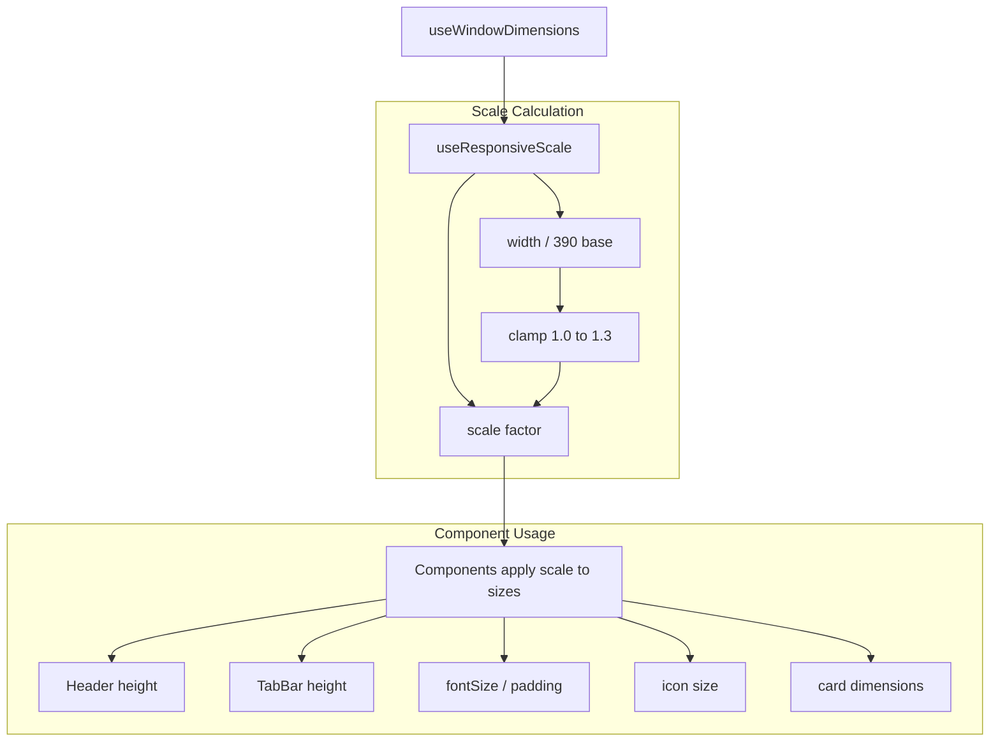

# Android Tablet Responsive Scaling Plan

## Problem

On Android tablets (800-1280dp wide), the app runs at native full-screen resolution (no compatibility mode). While Flexbox layouts fill the screen, all font sizes and spacing values remain at phone-scale physical sizes because React Native uses density-independent pixels (dp/pt). This makes UI elements appear proportionally too small on larger screens.

```
Phone (390dp)                    Tablet (800dp)
┌─────────────────┐              ┌───────────────────────────────────────┐
│ [Title 18px]     │              │ [Title 18px]  ← same physical size   │
│ [Card]           │              │ [Card  ←        but proportionally   │
│  padding: 16     │              │  padding: 16]   smaller on tablet   │
│                   │              │                                       │
│  ✓ 比例合适       │              │  ✗ 元素偏小，空白太多                │
└─────────────────┘              └───────────────────────────────────────┘
```

## Solution

Add a screen-width-based **responsive scale factor** that proportionally enlarges font sizes, spacing, and component dimensions on tablets.

## Architecture



## Files to Create / Modify

### 1. NEW: `src/lib/theme/responsive.ts`

The core infrastructure file. Contains:

```typescript
// useResponsiveScale() — Returns scale factor based on screen width
//
// - Base width: 390dp (iPhone standard)
// - Tablet threshold: >= 768dp
// - Scale range: 1.0 (phone) ~ 1.3 (max tablet)
// - Uses useWindowDimensions, re-calculates on orientation change
//
// Returns: { scale: number, isTablet: boolean, screenWidth: number }

// useResponsiveSpacing(baseValue: number) — Convenience: baseValue * scale
// useResponsiveFontSize(baseSize: number) — Convenience: baseSize * scale
```

**API design:**

```typescript
export function useResponsiveScale(): {
  scale: number; // 1.0 on phone, 1.25 on tablet
  isTablet: boolean; // screenWidth >= 768
  screenWidth: number;
};

export function scaledFontSize(baseSize: number, scale: number): number;
export function scaledSpacing(baseValue: number, scale: number): number;
```

### 2. MODIFY: `src/lib/theme/index.ts`

Add export of the new hooks:

```typescript
export {
  useResponsiveScale,
  scaledFontSize,
  scaledSpacing,
} from './responsive';
```

### 3. MODIFY: Layout components (Phase 1 — high impact, low risk)

Apply scaling to fixed-height containers and layout elements:

| Component                                                | Values to Scale                | Current   | Scaled (1.25x)    |
| -------------------------------------------------------- | ------------------------------ | --------- | ----------------- |
| [`Header.tsx`](src/components/layout/Header.tsx:69)      | `headerHeight`                 | 44/56     | 55/70             |
| [`Header.tsx:245`](src/components/layout/Header.tsx:245) | `logo` size                    | 28×28     | 35×35             |
| [`TabBar.tsx:98`](src/components/layout/TabBar.tsx:98)   | `ACTIVE_CIRCLE_SIZE`           | 40        | 50                |
| [`TabBar.tsx:154`](src/components/layout/TabBar.tsx:154) | icon size                      | 22        | 28                |
| [`HomeScreen.tsx:68-79`](src/screens/HomeScreen.tsx:68)  | `HEADER_HEIGHT`, `CONTENT_TOP` | 44/56/116 | use scaled values |

**Scale behavior:**

```typescript
// In Header.tsx
const { scale } = useResponsiveScale();
const headerHeight = Platform.OS === 'ios' ? 44 * scale : 56 * scale;
// On tablet: 55 / 70
```

### 4. MODIFY: Content components (Phase 2)

| Component                                                        | Values to Scale    | Current | Scaled (1.25x) |
| ---------------------------------------------------------------- | ------------------ | ------- | -------------- |
| [`ArticleCard.tsx:418`](src/components/blog/ArticleCard.tsx:418) | `title fontSize`   | 18      | 22.5           |
| [`ArticleCard.tsx:394`](src/components/blog/ArticleCard.tsx:394) | `content padding`  | 16      | 20             |
| [`ArticleCard.tsx:438`](src/components/blog/ArticleCard.tsx:438) | `excerpt fontSize` | 14      | 17.5           |
| [`CategoryFilter.tsx`](src/components/blog/CategoryFilter.tsx)   | chip sizes         | —       | scale x1.2     |
| [`TagChip.tsx`](src/components/blog/TagChip.tsx)                 | chip padding       | —       | scale x1.2     |

### 5. MODIFY: Screen-level components (Phase 3)

| Component                                                                    | Values to Scale        | Current             | Scaled (1.25x)            |
| ---------------------------------------------------------------------------- | ---------------------- | ------------------- | ------------------------- |
| [`ArticleDetailScreen.tsx:397-401`](src/screens/ArticleDetailScreen.tsx:397) | title `fontSize`       | 24                  | 30                        |
| [`ArticleDetailScreen.tsx:540`](src/screens/ArticleDetailScreen.tsx:540)     | related card width     | `screenWidth * 0.7` | keep (already responsive) |
| [`ArticleDetailScreen.tsx:907`](src/screens/ArticleDetailScreen.tsx:907)     | `commentInput` padding | 12                  | 15                        |
| [`AboutScreen.tsx`](src/screens/AboutScreen.tsx)                             | avatar, text           | —                   | scale x1.2                |
| [`SearchScreen.tsx`](src/screens/SearchScreen.tsx)                           | search bar             | —                   | scale x1.15               |

## Implementation Details

### Scale Factor Calculation

```typescript
// src/lib/theme/responsive.ts
import { useWindowDimensions } from 'react-native';

const BASE_WIDTH = 390; // iPhone standard width
const MAX_SCALE = 1.3; // Cap at 30% enlargement
const TABLET_BREAKPOINT = 768; // Standard tablet threshold

export function useResponsiveScale() {
  const { width: screenWidth } = useWindowDimensions();

  const scale = Math.min(Math.max(screenWidth / BASE_WIDTH, 1.0), MAX_SCALE);

  const isTablet = screenWidth >= TABLET_BREAKPOINT;

  return { scale, isTablet, screenWidth };
}

export function scaledFontSize(baseSize: number, scale: number): number {
  return Math.round(baseSize * scale);
}

export function scaledSpacing(baseValue: number, scale: number): number {
  return Math.round(baseValue * scale);
}
```

### Component Integration Pattern

For each component, the pattern is:

```typescript
// Before (static)
const styles = StyleSheet.create({
  title: { fontSize: 18, padding: 16 },
});

// After (dynamic — move inline or use memo)
const Component = () => {
  const { scale } = useResponsiveScale();

  return (
    <Text style={{
      fontSize: scaledFontSize(18, scale),
      padding: scaledSpacing(16, scale),
    }}>
      Title
    </Text>
  );
};
```

### Performance Considerations

- `useWindowDimensions()` is efficient — React Native optimizes it with native event handling
- Re-renders only on orientation change (not on every frame)
- Use `useMemo` / `React.memo` as needed to prevent cascade re-renders
- `scale` value changes rarely (only on device rotation) — minimal perf impact

### What NOT to Scale

| Value                                      | Reason                                      |
| ------------------------------------------ | ------------------------------------------- |
| `borderWidth` / `StyleSheet.hairlineWidth` | Should remain crisp at any size             |
| `aspectRatio` (16/9, 1/1)                  | Ratios are dimension-independent            |
| `borderRadius` small values (< 8)          | Visual rounding shouldn't change much       |
| SafeArea `insets`                          | These are OS-dictated physical measurements |
| `zIndex`                                   | Not a visual size                           |
| Percentage widths (`width: '100%'`)        | Already responsive                          |
| Shadow/elevation values                    | Physical depth perception                   |

## Execution Order

```
Phase 1: Core infrastructure
  └── src/lib/theme/responsive.ts  (create)
  └── src/lib/theme/index.ts  (update exports)

Phase 2: Layout components (high impact, visible)
  └── Header.tsx  (scale headerHeight, logo, icon sizes)
  └── TabBar.tsx  (scale circle, icon, label sizes)
  └── HomeScreen.tsx  (scale HEADER_HEIGHT, CONTENT_TOP constants)

Phase 3: Card/content components
  └── ArticleCard.tsx  (scale title, excerpt, padding)
  └── CategoryFilter.tsx  (scale chip sizes)
  └── TagChip.tsx  (scale chip padding)

Phase 4: Screen-level components
  └── ArticleDetailScreen.tsx  (scale title, content padding)
  └── AboutScreen.tsx  (scale avatar, text)
  └── SearchScreen.tsx  (scale search bar)
  └── Other screens as needed
```

## Testing

1. Run on Android tablet emulator (800×1280, Pixel C or similar)
2. Verify scaling activates at `width >= 768dp`
3. Verify max scale is `1.3x` on very large screens (1280dp+)
4. Verify phone (390dp) shows NO scaling change (scale = 1.0)
5. Rotate tablet to landscape — verify scale increases correctly
6. Check that borders, safe areas, aspect ratios remain unchanged
