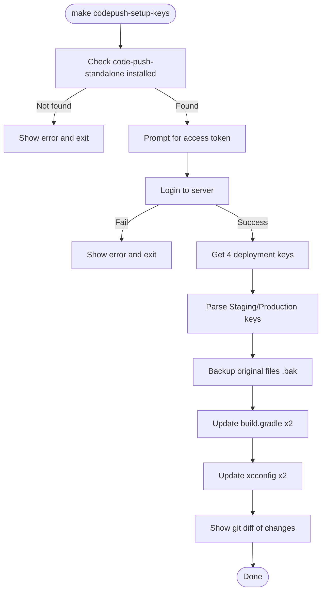

# Auto CodePush Setup Script

## Objective

Create an interactive script + Makefile target that prompts the user for their CodePush access token, automatically logs in to the self-hosted CodePush server, retrieves deployment keys, and fills them into the Android and iOS configuration files.

## Background

- Self-hosted CodePush server at `https://codepush.joyminis.com`
- 4 CodePush apps already created on the server:
  - `TarsierTest-ios` (Staging iOS)
  - `TarsierTest-android` (Staging Android)
  - `Tarsier-ios` (Production iOS)
  - `Tarsier-android` (Production Android)
- Each app has `Staging` and `Production` deployment keys by default
- We need only the `Staging` key for test apps and `Production` key for production apps

## Current Placeholder Values

| File                           | Line                         | Current Value                           | Target                          |
| ------------------------------ | ---------------------------- | --------------------------------------- | ------------------------------- |
| `android/app/build.gradle:139` | staging                      | `"CODEPUSH_KEY_TEST_PLACEHOLDER"`       | TarsierTest-android Staging key |
| `android/app/build.gradle:151` | production                   | `"CODEPUSH_KEY_PRODUCTION_PLACEHOLDER"` | Tarsier-android Production key  |
| `ios/Config/Test.xcconfig:6`   | `$(CODEPUSH_KEY_TEST)`       | TarsierTest-ios Staging key             |
| `ios/Config/Prod.xcconfig:6`   | `$(CODEPUSH_KEY_PRODUCTION)` | Tarsier-ios Production key              |

## Files to Create/Modify

### 1. NEW: `scripts/setup-codepush-keys.sh`

Interactive shell script that:

1. **Check prerequisites** — Verify `code-push-standalone` is installed
2. **Prompt for Access Token** — Read token from stdin (no echo)
3. **Login** — `code-push-standalone login https://codepush.joyminis.com --accessKey "$TOKEN"`
4. **Get deployment keys** for all 4 apps:
   - `TarsierTest-ios` → extract `Staging` key
   - `TarsierTest-android` → extract `Staging` key
   - `Tarsier-ios` → extract `Production` key
   - `Tarsier-android` → extract `Production` key
5. **Backup** original files with `.bak` suffix
6. **Update** the 4 files with sed in-place:
   - `android/app/build.gradle`: Replace placeholder string
   - `ios/Config/Test.xcconfig`: Replace `$(CODEPUSH_KEY_TEST)` with actual key
   - `ios/Config/Prod.xcconfig`: Replace `$(CODEPUSH_KEY_PRODUCTION)` with actual key
7. **Show diff** of changes made

### 2. MODIFY: `Makefile`

Add two things:

1. Add `codepush-setup-keys` to `.PHONY` list
2. Add new target:

```makefile
codepush-setup-keys: ## Interactive: login, get deployment keys, and auto-fill config files
	./scripts/setup-codepush-keys.sh
```

This should go right after `codepush-keys` target (around line 441).

## Flow



## OAuth Client IDs

Still pending user input. These need to be filled in `src/lib/env.ts`:

```
OAUTH_GOOGLE_CLIENT_ID: '...',
OAUTH_APPLE_CLIENT_ID: '...',
```

## Sentry DSN

Already done. `src/lib/env.ts` now has:

```
TEST_CONFIG.SENTRY_DSN = 'https://59af1081c07587571c2ac0d27d2ac5bc@o4511086990524416.ingest.us.sentry.io/4511389161357312'
PROD_CONFIG.SENTRY_DSN = 'https://59af1081c07587571c2ac0d27d2ac5bc@o4511086990524416.ingest.us.sentry.io/4511389161357312'
```
