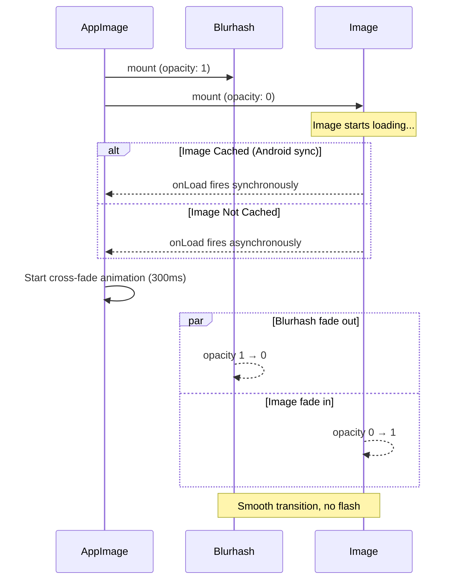

# Blurhash Not Displaying on Home Screen — Root Cause Analysis & Fix Plan

## Status of Previous Fix

The previous plan ([`plans/blurhash-fix-plan.md`](plans/blurhash-fix-plan.md)) addressed the _blurhash path resolution_ bug:

- API returns blurhash at `meta.images.blurhash`
- **The fix IS already applied**: [`ArticleCard.tsx:132`](src/components/blog/ArticleCard.tsx:132) and [`VideoPlayer.tsx:85`](src/components/features/VideoPlayer.tsx:85) both correctly use `article.meta?.images?.blurhash ?? article.meta?.blurhash`

Despite this, blurhash still doesn't show. The issue is in **`AppImage.tsx` rendering logic**.

---

## Root Cause Analysis

### Data Flow

```
API (meta.images.blurhash = "L75$Z3...")
  → useGetArticlesQuery → usePaginatedQuery
    → FlatList → ArticleCard
      → AppImage(blurhash="L75$Z3...")
        → <Blurhash blurhash="L75$Z3..." />
```

### Bug 1: `blurhashDismissed` state never resets on prop changes

[`AppImage.tsx:141`](src/components/core/AppImage.tsx:141):

```typescript
const [blurhashDismissed, setBlurhashDismissed] = useState(!blurhash);
```

`useState` only evaluates the initial value. If `blurhash` prop starts as `undefined` (during pagination or component recycling) and later receives a valid string, `blurhashDismissed` remains `true` → blurhash **never shows**.

**Affected scenarios:**

- Pagination (page 2+) when FlatList reuses component instances
- Screen transitions where ArticleCard reactivates with new data
- Any case where the component renders before data arrives

### Bug 2 (CRITICAL): Synchronous `onLoad` race condition on Android

When images are **cached** (OS-level HTTP cache), `Image.onLoad` fires synchronously **during the render commit** on Android. The current logic has a fatal race:

**Timeline:**

```
Step 1: Component renders
  - isLoaded = false
  - blurhashDismissed = false
  - showBlurhash = true
  → <Blurhash /> renders ✅
  → <Image style={hidden} /> (opacity 0)

Step 2: React commits to native UI
  - <Image> mounts, image is CACHED
  - onLoad fires SYNCHRONOUSLY during commit

Step 3: handleLoad() runs
  - setIsLoaded(true)        ← queued
  - RAF(setBlurhashDismissed(true))  ← queued for next frame

Step 4: React re-renders (same microtask, BEFORE paint)
  - isLoaded = true
  - !isLoaded = false  → Blurhash REMOVED from tree ❌
  - showBlurhash = true (RAF hasn't fired)
  - (showBlurhash || !isLoaded) = (true || false) = true → Image still HIDDEN ❌

Step 5: PAINT — nothing visible (just gray #f0f0f0 background) 🔴

Step 6: RAF fires → blurhashDismissed = true
  - showBlurhash = false
  - Image unhidden → visible
```

**Result:** Blurhash **never paints to screen**. It's dismissed in the same microtask before the first frame renders.

### Bug 3: `isLoaded` gates blurhash visibility too aggressively

[`AppImage.tsx:188`](src/components/core/AppImage.tsx:188):

```tsx
{
  !isLoaded && !hasError && (showBlurhash ? <Blurhash /> : <Skeleton />);
}
```

This ties blurhash visibility to `!isLoaded`, which flips to `false` in the same synchronous tick as `onLoad`. The blurhash should remain visible until **after the next frame paints**, regardless of `isLoaded`.

---

## Fix Strategy: Flutter-style Cross-Fade (渐进式显示)

Instead of abrupt blurhash → image switching, implement a **cross-fade transition** (like Flutter's `FadeInImage`):

- **Blurhash** starts at `opacity: 1`, **Image** starts at `opacity: 0`
- When image loads, blurhash **fades out** while image **fades in** simultaneously (300ms)
- After animation completes, blurhash overlay remains in tree at `opacity: 0` (ready for next blurhash change)

This is better UX AND inherently solves the race condition — blurhash is always visible until the cross-fade completes.

### Changes to [`src/components/core/AppImage.tsx`](src/components/core/AppImage.tsx)

#### 1. Replace state management with `Animated.Value`

**Before:**

```typescript
const [isLoaded, setIsLoaded] = useState(false);
const [hasError, setHasError] = useState(false);
const [blurhashDismissed, setBlurhashDismissed] = useState(!blurhash);
const showBlurhash = Boolean(blurhash) && !blurhashDismissed;
```

**After:**

```typescript
import { Animated } from 'react-native';

// Inside component:
const imageOpacity = useRef(new Animated.Value(0)).current;
const blurhashOpacity = useRef(new Animated.Value(1)).current;
const [hasError, setHasError] = useState(false);
```

#### 2. Add `useEffect` to reset animated values on blurhash change

```typescript
useEffect(() => {
  // Reset animation values when blurhash prop changes (e.g., new article in FlatList)
  if (blurhash) {
    imageOpacity.setValue(0);
    blurhashOpacity.setValue(1);
  } else {
    // No blurhash — image visible immediately
    imageOpacity.setValue(1);
    blurhashOpacity.setValue(0);
  }
  setHasError(false);
}, [blurhash, imageOpacity, blurhashOpacity]);
```

#### 3. Cross-fade `handleLoad`

```typescript
const handleLoad = useCallback(() => {
  // Cross-fade: blurhash fades out, image fades in
  Animated.parallel([
    Animated.timing(imageOpacity, {
      toValue: 1,
      duration: 300,
      useNativeDriver: true,
    }),
    Animated.timing(blurhashOpacity, {
      toValue: 0,
      duration: 300,
      useNativeDriver: true,
    }),
  ]).start();
  onLoad?.();
}, [imageOpacity, blurhashOpacity, onLoad]);
```

#### 4. Updated render logic

```tsx
// No image available — show placeholder
if (!optimizedUrl) {
  return (
    <View style={[styles.container, styles.placeholder, containerStyle, style]}>
      <SvgIcon name="file-text" size={FALLBACK_ICON_SIZE} color="#9CA3AF" />
    </View>
  );
}

return (
  <View style={[styles.container, containerStyle]}>
    {/* ── Image ── */}
    {!hasError && (
      <Animated.Image
        source={{ uri: optimizedUrl }}
        style={[style, { opacity: imageOpacity }]}
        onLoad={handleLoad}
        onError={handleError}
        {...imageProps}
      />
    )}

    {/* ── Error state ── */}
    {hasError && (
      <View style={[styles.errorContainer, style]}>
        <SvgIcon
          name="alert-circle"
          size={FALLBACK_ICON_SIZE}
          color="#9CA3AF"
        />
      </View>
    )}

    {/* ── Blurhash overlay — fades out during cross-fade ── */}
    {Boolean(blurhash) && (
      <Blurhash
        blurhash={blurhash!}
        style={[StyleSheet.absoluteFill, style, { opacity: blurhashOpacity }]}
        pointerEvents="none"
      />
    )}

    {/* ── Skeleton placeholder — only when no blurhash ── */}
    {!blurhash && !hasError && (
      <View
        style={[styles.skeleton, StyleSheet.absoluteFill, style]}
        pointerEvents="none"
      />
    )}
  </View>
);
```

---

## Affected File

| File                                                                   | Changes                                                                       |
| ---------------------------------------------------------------------- | ----------------------------------------------------------------------------- |
| [`src/components/core/AppImage.tsx`](src/components/core/AppImage.tsx) | Full refactor: cross-fade animation, remove blurhashDismissed/isLoaded states |

No changes needed in `ArticleCard.tsx` or `VideoPlayer.tsx` — the blurhash path fix is already applied.

---

## Visual Timeline (Fixed)



## Verification

1. **Cold load** (image not cached): Blurhash visible → 300ms cross-fade → image appears ✅
2. **Cached load** (Android sync onLoad): Blurhash visible → 300ms cross-fade → image appears ✅
3. **Pagination**: New articles show blurhash while images load → cross-fade ✅
4. **No blurhash**: Gray skeleton → image fades in ✅
5. **Image error**: Shows error icon (no change) ✅
6. **`pointerEvents="none"`**: Blurhash/skeleton don't block touch events on image ✅
