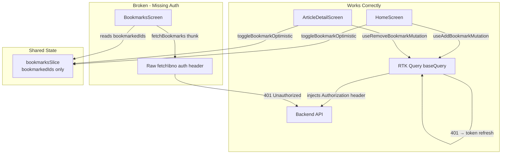

# Bookmarks 401 Unauthorized Fix Plan

## Problem Statement

`GET /api/v1/frontend/blog/bookmarks?page=1&pageSize=20` returns `401 Unauthorized` even though the user is authenticated (other bookmark operations like POST succeed).

## Root Cause Analysis

The app has **two parallel systems** for bookmark operations, and they handle auth differently:

### System 1: RTK Query Endpoints (works correctly)

- File: [`src/api/endpoints/bookmarks.ts`](../src/api/endpoints/bookmarks.ts)
- Uses `blogApi.injectEndpoints()` → goes through [`baseApi.ts`](../src/api/baseApi.ts)'s `baseQuery`
- `baseQuery` automatically injects `Authorization: Bearer <token>` header from MMKV storage ([`baseApi.ts:74-76`](../src/api/baseApi.ts#L74-L76))
- `baseQuery` also handles 401 with automatic token refresh ([`baseApi.ts:148-213`](../src/api/baseApi.ts#L148-L213))
- **Used by:** `HomeScreen` and `ArticleDetailScreen` for bookmark mutations (POST/DELETE)

### System 2: Redux Thunks (broken)

- File: [`src/store/slices/bookmarksSlice.ts`](../src/store/slices/bookmarksSlice.ts)
- Uses `createAsyncThunk` with **raw `fetch()` calls**
- **No Authorization header is set** on any of the thunk requests ([`bookmarksSlice.ts:67-70`](../src/api/endpoints/bookmarks.ts#L67-L70)):
  ```typescript
  const response = await fetch(
    `${env.API_URL}/api/v1/frontend/blog/bookmarks?${searchParams.toString()}`,
    { headers: { 'Content-Type': 'application/json' } }, // ← No auth header!
  );
  ```
- **No token refresh logic** (no 401 handling at all)
- **Used by:** `BookmarksScreen` for fetching the bookmarks list (GET)

### Why POST/bookmark Succeeds but GET/bookmarks Fails

The server log confirms:

- `POST /api/v1/frontend/blog/articles/:id/bookmark` → `201` (uses RTK Query → auth header present)
- `GET /api/v1/frontend/blog/bookmarks?page=1&pageSize=20` → `401` (uses thunk → no auth header)

The server's `JwtStrategy.authenticate` (passport-jwt) correctly rejects the GET because no Bearer token is sent.

## Architecture Diagram



## Proposed Solution

### Strategy: Migrate `BookmarksScreen` to RTK Query Hooks

Keep `bookmarksSlice` only for the `bookmarkedIds` optimistic UI state (used by `HomeScreen` and `ArticleDetailScreen`), but migrate `BookmarksScreen` to use the already-existing RTK Query hooks (`useGetBookmarksQuery`, `useRemoveBookmarkMutation`).

This is the minimal, safest change because:

1. The RTK Query endpoints already exist and work correctly
2. `baseQuery` handles auth + token refresh automatically
3. No backend changes needed
4. The `bookmarkedIds` slice remains intact for other screens

### Step-by-Step Implementation Plan

#### Step 1: Remove `fetchBookmarks` and `removeBookmark` thunks from bookmarksSlice

**File:** [`src/store/slices/bookmarksSlice.ts`](../src/store/slices/bookmarksSlice.ts)

- Remove the `fetchBookmarks` thunk (lines 55-80)
- Remove the `removeBookmark` thunk (lines 101-118)
- Remove the `addBookmark` thunk (lines 82-99) — only used in thunk form if anywhere
- Remove the `checkBookmarkStatus` thunk (lines 120-137)
- Remove the corresponding `extraReducers` cases:
  - `fetchBookmarks.pending`, `.fulfilled`, `.rejected` (lines 186-213)
  - `addBookmark.fulfilled`, `.rejected` (lines 216-224)
  - `removeBookmark.fulfilled` (lines 227-244)
  - `checkBookmarkStatus.fulfilled` (lines 247-251)
- Keep the slice reducers: `toggleBookmarkOptimistic`, `setBookmarkStatus`, `clearCache`, `syncBookmarkIdsFromArticles`
- Keep the `bookmarkedIds` state management for optimistic UI

**Note:** The `addBookmark` thunk was not used by any screen (HomeScreen and ArticleDetailScreen use the RTK Query mutation). Check if anything else imports it.

#### Step 2: Migrate `BookmarksScreen` to RTK Query

**File:** [`src/screens/BookmarksScreen.tsx`](../src/screens/BookmarksScreen.tsx)

Replace thunk-based data fetching with RTK Query hooks:

1. **Replace imports:**
   - Remove: `import { fetchBookmarks, removeBookmark } from '@/store/slices/bookmarksSlice'`
   - Add: `import { useGetBookmarksQuery, useRemoveBookmarkMutation } from '@/api/endpoints/bookmarks'`

2. **Replace Redux state reads:**
   - Remove: `const { articles, isLoading, error, total, page, totalPages } = useAppSelector(state => state.bookmarks)`
   - Add: `const { data, isLoading, error } = useGetBookmarksQuery({ page: currentPage, pageSize: PAGE_SIZE, locale: i18n.language })`
   - Derive local state from `data`

3. **Remove manual pagination state management:**
   - Remove `allArticles` local state and the accumulation `useEffect`
   - RTK Query handles caching/pagination via `providesTags: ['Bookmark']`

4. **Replace removeBookmark thunk dispatch:**
   - Use the `useRemoveBookmarkMutation` hook instead

5. **Remove the `useEffect` that dispatches `fetchBookmarks`:**
   - RTK Query's `useGetBookmarksQuery` auto-fetches on mount and when params change

6. **Handle `handleRefresh`:**
   - Use RTK Query's `refetch` function instead of manually dispatching

#### Step 3: Verify offline MMKV caching

The old `fetchBookmarks.fulfilled` handler cached articles to MMKV. With RTK Query:

- RTK Query has built-in cache management via its reducer
- For explicit offline persistence, consider RTK Query's `subscription` behavior or add a listener via `onQueryStarted`
- **Options:**
  a. Add an `onQueryStarted` handler in the RTK Query endpoint to persist to MMKV
  b. Use a separate middleware/cache layer
  c. Accept that bookmarks won't be available offline (simplest, may be acceptable)

#### Step 4: Clean up unused imports/exports in related files

- Update [`src/store/index.ts`](../src/store/index.ts) if bookmarksReducer is reduced
- Update [`src/lib/cache/clearAppCache.ts`](../src/lib/cache/clearAppCache.ts) if needed

### Files to Modify

| File                                                                          | Change                                                          |
| ----------------------------------------------------------------------------- | --------------------------------------------------------------- |
| [`src/store/slices/bookmarksSlice.ts`](../src/store/slices/bookmarksSlice.ts) | Remove thunks + their extraReducers; keep reducers only         |
| [`src/screens/BookmarksScreen.tsx`](../src/screens/BookmarksScreen.tsx)       | Migrate to `useGetBookmarksQuery` + `useRemoveBookmarkMutation` |
| [`src/api/endpoints/bookmarks.ts`](../src/api/endpoints/bookmarks.ts)         | Optionally add `onQueryStarted` for MMKV caching                |

### Files NOT Modified (no impact)

| File                                                                            | Reason                           |
| ------------------------------------------------------------------------------- | -------------------------------- |
| [`src/api/baseApi.ts`](../src/api/baseApi.ts)                                   | Already handles auth correctly   |
| [`src/screens/HomeScreen.tsx`](../src/screens/HomeScreen.tsx)                   | Already uses RTK Query mutations |
| [`src/screens/ArticleDetailScreen.tsx`](../src/screens/ArticleDetailScreen.tsx) | Already uses RTK Query mutations |
| [`src/store/slices/authSlice.ts`](../src/store/slices/authSlice.ts)             | Auth flow is correct             |

## Risk Assessment

| Risk                                                           | Mitigation                                                                                                                                             |
| -------------------------------------------------------------- | ------------------------------------------------------------------------------------------------------------------------------------------------------ |
| Losing MMKV offline caching for bookmarks                      | Acceptable — bookmarks list is auth-only, so offline access is inherently limited. Can add `onQueryStarted` persistence as follow-up.                  |
| Regression in HomeScreen/ArticleDetailScreen bookmark behavior | No changes to those files. `bookmarkedIds` state remains intact.                                                                                       |
| Pagination behavior changes                                    | RTK Query's `useGetBookmarksQuery` handles pagination via tag invalidation. The `currentPage` state in BookmarksScreen controls which page is fetched. |
