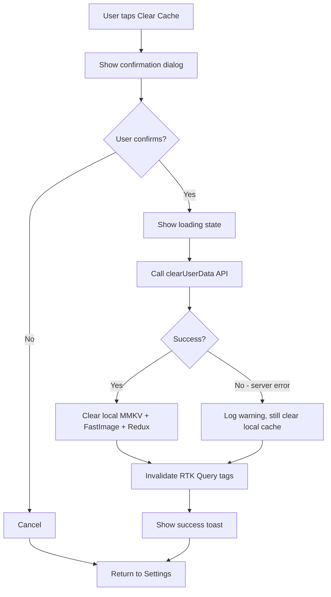

# Clear Data API — Full Implementation Plan (v1)

> **Decisions:**
>
> - Comments are **anonymized** (not hard-deleted): author → "deleted user", body → "[deleted]", preserving thread context
> - Full account deletion (`DELETE /api/v1/auth/account`) is **out of scope** — handled in a separate PR later

## Current State Summary

| Feature                                 | Implementation                                                                                                                     | Has Server API? |
| --------------------------------------- | ---------------------------------------------------------------------------------------------------------------------------------- | --------------- |
| **Clear Cache** (Settings > Data)       | Client-side only: `clearAppCache()` clears MMKV + FastImage + Redux bookmarks cache                                                | ❌ No           |
| **Delete Account** (Settings > Account) | Only `dispatch(logout())` + `// TODO: API call to delete account` at [`SettingsScreen.tsx`](../src/screens/SettingsScreen.tsx:453) | ❌ No (TODO)    |
| **Export Data** (Settings > Data)       | Not implemented yet                                                                                                                | ❌ No           |

## Scope

Add a **server-side API endpoint** to clear all user activity data, and integrate it into the existing client-side flow.

---

## Part 1: Backend (NestJS) — New API Endpoint

### Endpoint: `DELETE /api/v1/auth/account/data`

**Purpose:** Clears all user-created activity data on the server **without** deleting the account itself.

**Auth:** Requires valid Bearer token.

**Request:**

```
DELETE /api/v1/auth/account/data
Authorization: Bearer <token>
```

**Response (200):**

```json
{
  "data": {
    "deletedComments": 12,
    "deletedBookmarks": 5,
    "deletedLikes": 34,
    "totalDeleted": 51
  }
}
```

**Server-side operations (transactional):**

| #   | Operation                                                          | Data Impact                                            |
| --- | ------------------------------------------------------------------ | ------------------------------------------------------ |
| 1   | Delete all comments by this user from `comments` table             | Comments permanently removed                           |
| 2   | Delete all bookmarks by this user from `bookmarks` table           | Bookmarks permanently removed                          |
| 3   | Delete all likes by this user from `likes` table                   | Likes permanently removed                              |
| 4   | (Optional) Anonymize any comment replies/mentions referencing user | Set `authorId` to null, text to "[deleted]" in replies |

**Note:** Full account deletion (`DELETE /api/v1/auth/account`) is a **separate** endpoint with a broader scope (deletes profile data, email, etc.). Not included in this plan.

---

## Part 2: Frontend (React Native) — API Integration

### 2a. Add RTK Query endpoint

**File:** [`src/api/endpoints/auth.ts`](../src/api/endpoints/auth.ts)

Add a new mutation to `authApi`:

```typescript
/**
 * Clear all user activity data on the server
 * DELETE /api/v1/auth/account/data
 */
clearUserData: builder.mutation<ClearUserDataResponse, void>({
  query: () => ({
    url: '/api/v1/auth/account/data',
    method: 'DELETE',
  }),
  transformResponse: (response: ApiResponseWrapper<ClearUserDataResponse>) =>
    unwrapData(response),
  invalidatesTags: ['Bookmark', 'Comment', 'Like'],
}),
```

### 2b. Update `clearAppCache()` to also call server API

**File:** [`src/lib/cache/clearAppCache.ts`](../src/lib/cache/clearAppCache.ts)

Change from synchronous function to async, and add optional server-side clearing:

```typescript
export async function clearAppCache(options?: {
  clearServerData?: boolean;
}): Promise<void> {
  // 1. FastImage cache (unchanged)
  // 2. Redux bookmarks cache (unchanged)
  // 3. MMKV storage (unchanged)

  // 4. Server-side data clearing (NEW)
  if (options?.clearServerData) {
    try {
      await store.dispatch(authApi.endpoints.clearUserData.initiate()).unwrap();
    } catch (error) {
      console.warn('[clearAppCache] Server data clear failed:', error);
      // Don't block — client cache was still cleared
    }
  }
}
```

### 2c. Add Redux tag invalidation

**Files:**

- [`src/api/endpoints/comments.ts`](../src/api/endpoints/comments.ts) — Add `'Comment'` tag
- [`src/api/endpoints/likes.ts`](../src/api/endpoints/likes.ts) — Add `'Like'` tag
- [`src/api/endpoints/bookmarks.ts`](../src/api/endpoints/bookmarks.ts) — Already has `'Bookmark'` tag

After clearing data on server, invalidate these tags so RTK Query refetches fresh data.

---

## Part 3: Frontend — UI Changes

### 3a. SettingsScreen — Update "Clear Cache" flow

**File:** [`src/screens/SettingsScreen.tsx`](../src/screens/SettingsScreen.tsx)

Modify the `handleClearCache` callback to:

1. Show confirmation dialog: "This will clear all local cache AND delete your comments, likes, and bookmarks from the server. This cannot be undone."
2. Call `clearAppCache({ clearServerData: true })`
3. Show loading indicator during server call
4. Show success/error toast

### 3b. New confirmation flow (Mermaid)



### 3c. i18n message updates

**Files:** [`src/messages/en.json`](../src/messages/en.json), [`src/messages/zh.json`](../src/messages/zh.json), etc.

Add new translation keys:

```json
{
  "settings": {
    "clearCache": {
      "confirm": "Clear All Data",
      "message": "This will clear local cache AND delete your comments, likes, and bookmarks from the server. This cannot be undone.",
      "action": "Clear All Data",
      "loading": "Clearing data...",
      "success": "All data cleared successfully",
      "error": "Failed to clear server data. Local cache has been cleared."
    }
  }
}
```

---

## Part 4: Privacy Policy Update

**File:** [`src/lib/privacy/privacyContent.ts`](../src/lib/privacy/privacyContent.ts)

Update the privacy policy section on data retention to mention:

- Users can clear their activity data without deleting their account
- Comments, likes, and bookmarks will be permanently deleted
- Anonymized content (e.g., replies to comments) may be retained

---

## Implementation Order

| Step | Task                                                              | File(s)                                                                                        | Type             |
| ---- | ----------------------------------------------------------------- | ---------------------------------------------------------------------------------------------- | ---------------- |
| 1    | Create backend NestJS endpoint `DELETE /api/v1/auth/account/data` | Backend (NestJS)                                                                               | Backend          |
| 2    | Add `clearUserData` mutation to `authApi`                         | [`src/api/endpoints/auth.ts`](../src/api/endpoints/auth.ts)                                    | Frontend API     |
| 3    | Add tag keys to comment/like/bookmark endpoints for invalidation  | [`comments.ts`](../src/api/endpoints/comments.ts), [`likes.ts`](../src/api/endpoints/likes.ts) | Frontend API     |
| 4    | Update `clearAppCache()` to async + optional server call          | [`src/lib/cache/clearAppCache.ts`](../src/lib/cache/clearAppCache.ts)                          | Frontend lib     |
| 5    | Update `handleClearCache` in SettingsScreen                       | [`src/screens/SettingsScreen.tsx`](../src/screens/SettingsScreen.tsx)                          | Frontend UI      |
| 6    | Add i18n translation keys for new dialog/messages                 | [`src/messages/*.json`](../src/messages/)                                                      | Frontend i18n    |
| 7    | Update privacy policy                                             | [`src/lib/privacy/privacyContent.ts`](../src/lib/privacy/privacyContent.ts)                    | Frontend content |
| 8    | Test: clear data on server → verify comments/likes/bookmarks gone | E2E                                                                                            | Testing          |

---

## Resolved Decisions

1. **Comment anonymization strategy** → **(b) Anonymized**
   - Author → `"deleted user"`, comment body → `"[deleted]"`
   - Preserves thread continuity for other readers
   - Hard delete would break comment threads under articles

2. **"Delete Account" vs "Clear Data"** → **Separate PR**
   - This plan covers only `DELETE /api/v1/auth/account/data` (clear activity data)
   - Full account deletion (`DELETE /api/v1/auth/account`) remains a `TODO` at [`SettingsScreen.tsx`](../src/screens/SettingsScreen.tsx:453) for a future PR
