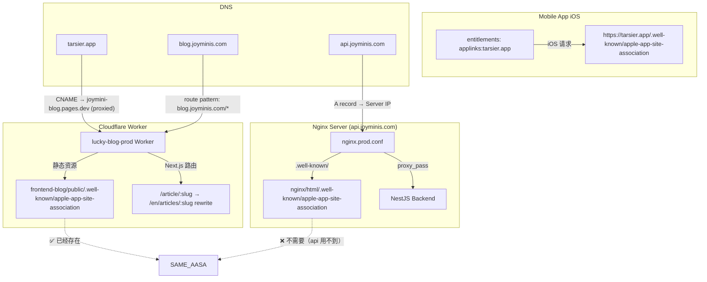

# Plan: Cloudflare DNS 确认 + AASA 文件部署 + Universal Link 修复

## 背景

需要确认 `tarsier.app` 的 Cloudflare 配置，确定 AASA (apple-app-site-association) 文件的正确部署位置。

## 架构总览



## 确认结果

| 项目 | 结果 |
|------|------|
| `tarsier.app` DNS | → Cloudflare Worker (`lucky-blog-prod`) |
| `blog.joyminis.com` | → 同一个 Worker 的别名 |
| `api.joyminis.com` | → Nginx → NestJS 后端 |
| AASA 位置 (Nginx) | `/Volumes/MySSD/work/JoyMini_Nest_Monorepo/nginx/html/.well-known/apple-app-site-association` |
| AASA 位置 (Worker) | `/Volumes/MySSD/work/JoyMini_Nest_Monorepo/apps/frontend-blog/public/.well-known/apple-app-site-association` |
| iOS Bundle ID | `com.tarsier.labs`（来自 [`project.pbxproj`](../ios/FrontendBlogMobile.xcodeproj/project.pbxproj:289)） |
| iOS Associated Domain | `applinks:tarsier.app`（来自 [`entitlements`](../ios/FrontendBlogMobile/FrontendBlogMobile.entitlements:7)） |

## 当前 AASA 文件内容

两个位置的内容相同（需要同步更新）：

```json
{
  "applinks": {
    "apps": [],
    "details": [
      { "appID": "A1B2C3D4E5.com.porter.joyminis", "paths": ["/group/*", "/oauth/callback"] },
      { "appID": "A1B2C3D4E5.com.porter.joyminis.test", "paths": ["/group/*", "/oauth/callback"] },
      { "appID": "PK28T343BP.com.tarsier.labs", "paths": ["/article/*", "/oauth/callback", "/group/*"] }
    ]
  }
}
```

### 发现的问题

1. **`A1B2C3D4E5.com.porter.joyminis`** — Team ID `A1B2C3D4E5` 看起来是占位符/测试值，不是真正的 Apple Team ID
2. **`PK28T343BP.com.tarsier.labs`** — Bundle ID `com.tarsier.labs` ✅ 匹配 iOS 项目配置，但需要确认 Team ID `PK28T343BP` 是否正确
3. **路径 `/article/*`** ✅ 匹配 RN 的 deep link 配置 `article/:slug`
4. **AASA 在 Worker 侧已部署** ✅ — 但可能未发布到线上（需要重新部署 Cloudflare Worker）

## 执行步骤

### Step 1: 确认 Apple Team ID

**位置**: [`project.pbxproj`](../ios/FrontendBlogMobile.xcodeproj/project.pbxproj) 和 Apple Developer Portal

- 登录 [https://developer.apple.com](https://developer.apple.com) → Membership → Team ID
- 确认 `PK28T343BP` 是否是正确的 Team ID
- 如果不是，更新 AASA 文件中的 `appID` 值

### Step 2: 修正 AASA 文件内容

**文件**: [`apps/frontend-blog/public/.well-known/apple-app-site-association`](../apps/frontend-blog/public/.well-known/apple-app-site-association)

更新内容：
- 删除占位符 `A1B2C3D4E5.com.porter.joyminis` 条目（除非 Flutter 版还在用）
- 使用正确的 Team ID + Bundle ID
- 添加 `paths` 包括所有 Universal Link 需要匹配的路径

建议的最终内容：
```json
{
  "applinks": {
    "apps": [],
    "details": [
      {
        "appID": "PK28T343BP.com.tarsier.labs",
        "paths": [
          "/article/*",
          "/articles/*",
          "/oauth/callback",
          "/group/*",
          "/search",
          "/auth",
          "/bookmarks"
        ]
      }
    ]
  }
}
```

### Step 3: 同步更新 Nginx 侧的 AASA 文件

**文件**: [`nginx/html/.well-known/apple-app-site-association`](../nginx/html/.well-known/apple-app-site-association)

保持与 Worker 侧内容一致（虽然 iOS 不会从 `api.joyminis.com` 获取，但保持同步避免混淆）。

### Step 4: 添加 Next.js rewrite 规则（可选但推荐）

**文件**: [`apps/frontend-blog/next.config.ts`](../apps/frontend-blog/next.config.ts)

在 `redirects` 之前添加 `rewrites`：
- `/article/:slug` → `/en/articles/:slug`
- 解决分享 URL (`https://tarsier.app/article/:slug`) 与 Next.js 路由 (`/:locale/articles/:slug`) 不匹配的问题

### Step 5: 重新部署 Cloudflare Worker

运行部署脚本使 AASA 文件生效：

```bash
cd /Volumes/MySSD/work/JoyMini_Nest_Monorepo
./deploy/blog-cloudflare.sh --env production
```

### Step 6: 验证部署

```bash
# 验证 AASA 可访问
curl -sI https://tarsier.app/.well-known/apple-app-site-association
# 应返回 HTTP 200 且 Content-Type: application/json

# 验证内容正确
curl -s https://tarsier.app/.well-known/apple-app-site-association | jq .

# 验证 rewrite 生效
curl -sI https://tarsier.app/article/test-slug
# 应返回 200 而非 404
```

### Step 7: 真机测试 Universal Link

1. 在 iOS 真机上安装最新 build（含更新后的 entitlements）
2. 在 Notes/Messages 中输入 `https://tarsier.app/article/some-slug`
3. 长按链接 → 应显示 "Open in Tarsier" 或直接打开 App
4. 点击链接 → 应跳转到 App 并导航到对应文章

## 涉及的文件清单

| 文件 | 操作 |
|------|------|
| [`frontend-blog/public/.well-known/apple-app-site-association`](../apps/frontend-blog/public/.well-known/apple-app-site-association) | 更新 AASA 内容 |
| [`nginx/html/.well-known/apple-app-site-association`](../nginx/html/.well-known/apple-app-site-association) | 同步更新（可选） |
| [`frontend-blog/next.config.ts`](../apps/frontend-blog/next.config.ts) | 添加 rewrite 规则 |
| [`src/navigation/RootNavigator.tsx`](../src/navigation/RootNavigator.tsx) | 已配置 `article/:slug` ✅ |
| [`ios/FrontendBlogMobile/FrontendBlogMobile.entitlements`](../ios/FrontendBlogMobile/FrontendBlogMobile.entitlements) | 已配置 `applinks:tarsier.app` ✅ |
| [`ios/FrontendBlogMobile/AppDelegate.swift`](../ios/FrontendBlogMobile/AppDelegate.swift) | 已实现 Universal Link 处理 ✅ |
