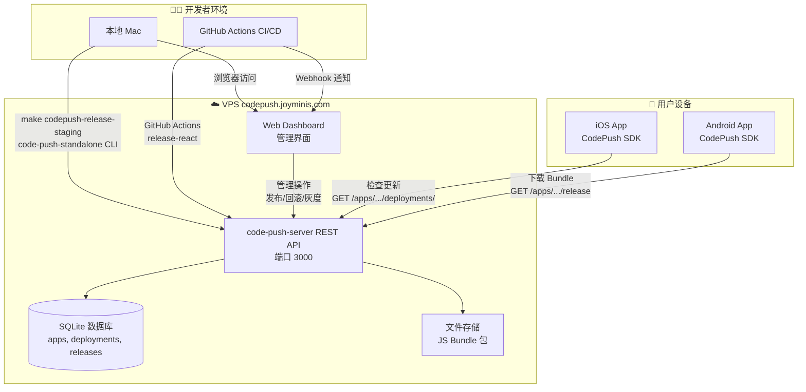
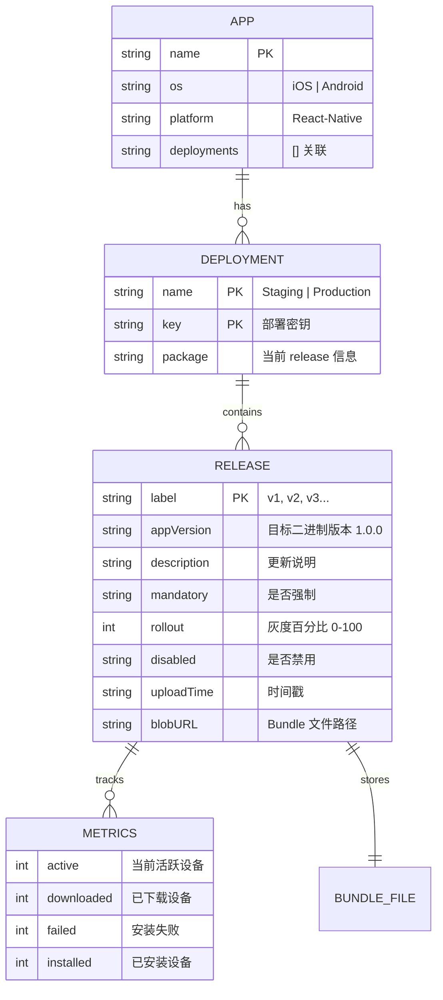
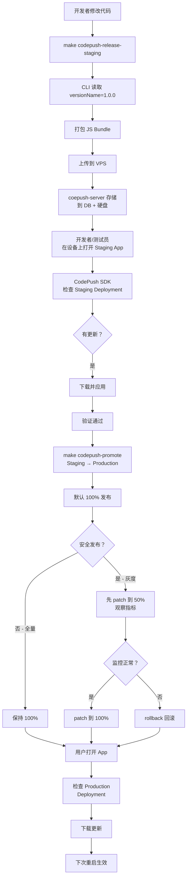
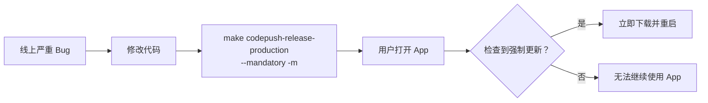
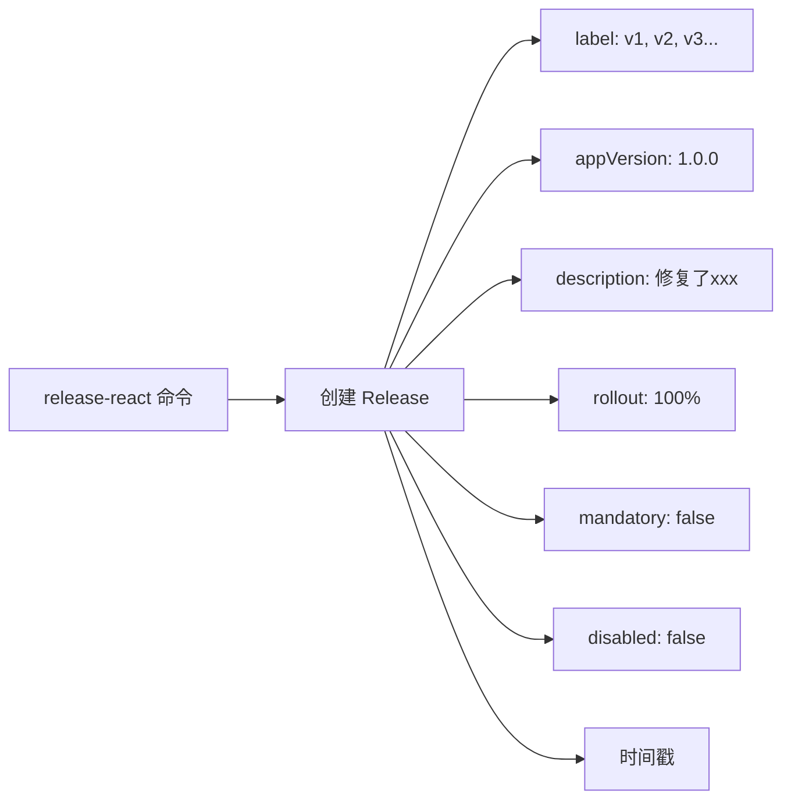
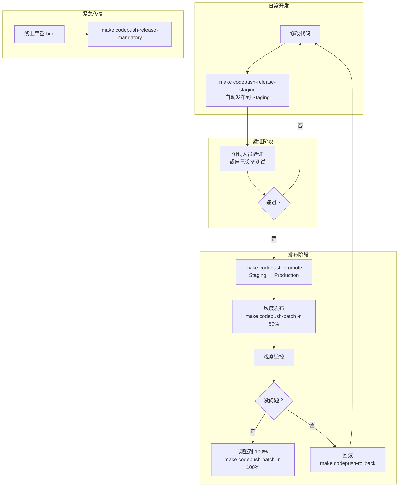
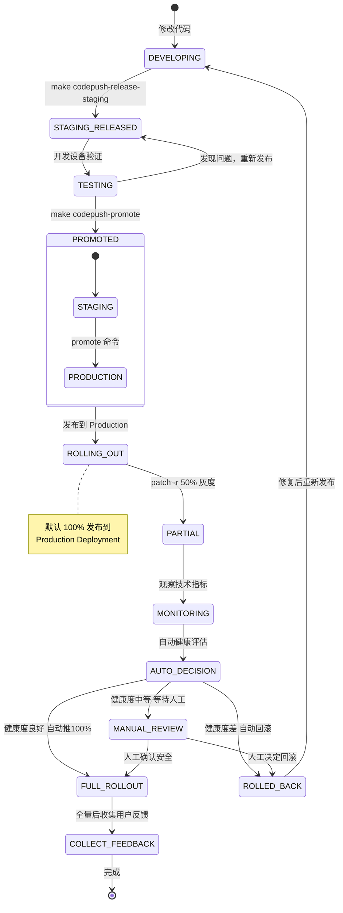
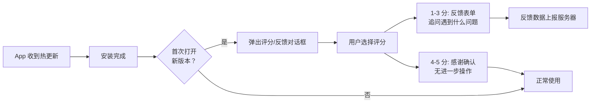
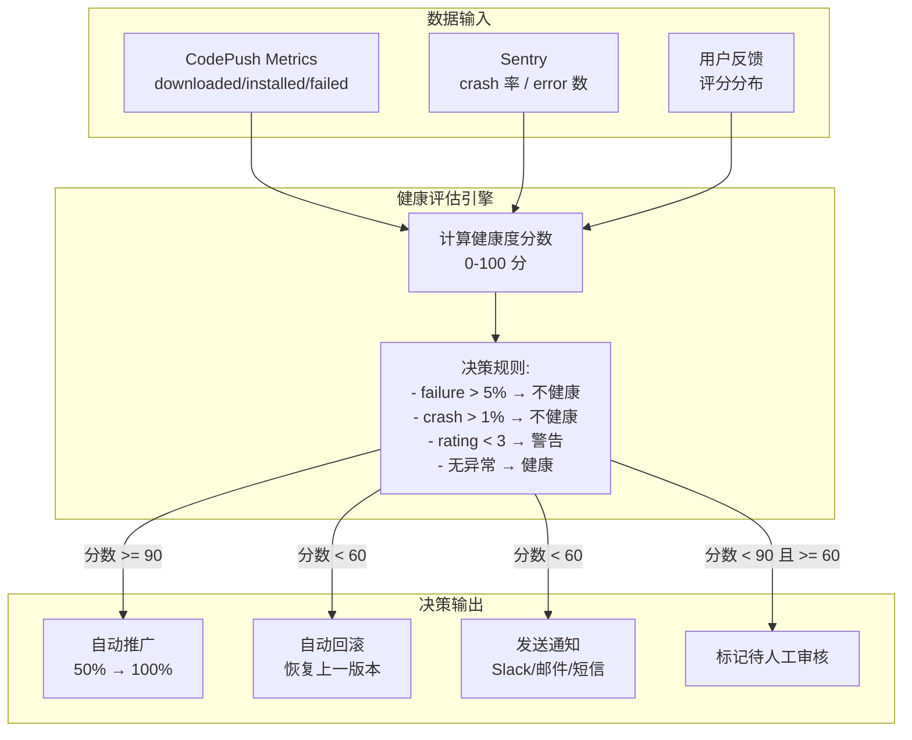

# CodePush 完整闭环架构设计

## 当前状态

- App 二进制版本: **1.0.0**（Android: [`android/app/build.gradle`](android/app/build.gradle) / iOS: `$(MARKETING_VERSION)`）
- 已有 4 个 CodePush App + 8 个 Deployment Key（已写入配置文件）
- `ensure_app()` 和 `get_key()` 已修复，`make codepush-setup-keys` 可用
- 已有 Makefile targets：`codepush-release-staging`, `codepush-release-production`, `codepush-promote`, `codepush-history`

## 一切皆可管理

当前所有手动操作过的步骤，都可以通过 REST API 管理，后续都可以做到 Web Dashboard 里：

| 操作                | 当前方式                 | REST API                                   | Dashboard 管理     |
| ------------------- | ------------------------ | ------------------------------------------ | ------------------ |
| 创建 App            | `curl POST /apps/`       | ✅ `POST /apps/`                           | ✅ 新建 App        |
| 删除 App            | 手动                     | ✅ `DELETE /apps/{name}`                   | ✅ 删除 App        |
| 重命名 App          | 手动                     | ✅ `PATCH /apps/{name}`                    | ✅ 重命名          |
| 查看 App 列表       | `make codepush-keys`     | ✅ `GET /apps/`                            | ✅ App 概览页      |
| 创建 Deployment     | 自动（创建 App 时自带）  | ✅ `POST /apps/{name}/deployments/`        | ✅ 新建 Deployment |
| 获取 Deployment Key | `get_key()` 已修复       | ✅ `GET /apps/{name}/deployments/`         | ✅ 一键复制 Key    |
| 重命名 Deployment   | 手动                     | ✅ `PATCH /apps/{name}/deployments/{dep}`  | ✅ 重命名          |
| 删除 Deployment     | 手动                     | ✅ `DELETE /apps/{name}/deployments/{dep}` | ✅ 删除            |
| 配置到项目          | `setup-codepush-keys.sh` | ❌ 需要脚本                                | ✅ 显示 Key + 复制 |

## 一、整体架构总览



## 二、数据模型

### 2.1 核心实体关系



### 2.2 当前已有数据

| App                 | 平台    | Deployment | Key (已配置) |
| ------------------- | ------- | ---------- | ------------ |
| TarsierTest-ios     | iOS     | Staging    | `M2BSYL...`  |
| TarsierTest-android | Android | Staging    | `pjANOo...`  |
| Tarsier-ios         | iOS     | Production | `xUO3wC...`  |
| Tarsier-android     | Android | Production | `NXYx4q...`  |

## 三、完整闭环流程

### 3.1 日常发布流程



### 3.2 紧急修复流程



## 四、App 版本管理策略

### 4.1 二进制版本 vs OTA 版本

每次发布热更新时，CodePush 会记录以下信息：



版本关系图：

```
App Store / Google Play 发布     CodePush 热更新
──────────────────────          ──────────────────
二进制版本 1.0.0                 OTA v1 → 针对 1.0.0
                                 OTA v2 → 针对 1.0.0
                                 OTA v3 → 针对 1.0.0
二进制版本 1.1.0                 OTA v4 → 针对 >=1.0.0 (兼容)
                                 OTA v5 → 针对 1.1.x
二进制版本 1.2.0                 OTA v6 → 针对 >=1.1.0
```

### 4.2 Semver 策略建议

| scenario         | --targetBinaryVersion | 说明                |
| ---------------- | --------------------- | ------------------- |
| 修复当前版本 Bug | `1.0.0`               | 只针对精确版本      |
| 小版本兼容修复   | `1.0.x`               | 针对 1.0.x 系列     |
| 跨版本兼容       | `>=1.0.0`             | 所有 1.0.0 以上版本 |
| 范围兼容         | `1.0.0 - 1.2.0`       | 指定范围            |

支持的 Semver 语法：`1.0.0`, `~1.2.3`, `^1.0.0`, `1.0.x`, `>=1.0.0`, `1.0.0 - 1.2.0`

### 4.3 版本定位示例

```bash
# 只对 1.0.x 版本用户推送
code-push-standalone release-react Tarsier-ios ios \
  --targetBinaryVersion "1.0.x" \
  --description "修复 1.0.x 系列的 bug"

# 对 1.0.0 和 1.1.0 都推送
code-push-standalone release-react Tarsier-ios ios \
  --targetBinaryVersion "1.0.0 - 1.1.0" \
  --description "兼容两个版本"

# 从特定版本开始所有版本都推送
code-push-standalone release-react Tarsier-ios ios \
  --targetBinaryVersion ">=1.0.0" \
  --description "所有 1.0.0 以上版本"
```

## 五、CLI 发布管理（Phase 2）

### 5.1 现有 CLI 功能

| 功能         | CLI 命令                       | 当前 Makefile 是否支持                                        |
| ------------ | ------------------------------ | ------------------------------------------------------------- |
| 发布更新     | `release-react`                | ✅ `codepush-release-staging` / `codepush-release-production` |
| 查看历史     | `deployment history`           | ✅ `codepush-history`                                         |
| 提升到生产   | `promote`                      | ✅ `codepush-promote`                                         |
| 指定目标版本 | `--targetBinaryVersion` / `-t` | ❌ 未使用                                                     |
| 灰度百分比   | `--rollout` / `-r`             | ❌ 未使用                                                     |
| 强制更新     | `--mandatory` / `-m`           | ❌ 未使用                                                     |
| 禁用发布     | `--disabled` / `-x`            | ❌ 未使用                                                     |
| 修改发布     | `patch`                        | ❌ 无 target                                                  |
| 回滚         | `rollback`                     | ❌ 无 target                                                  |

### 5.2 建议增强的 Makefile targets

```makefile
# ── 灰度发布（Staging） ──────────────────────────────────────────
codepush-release-staging-rollout: ## 灰度发布到 Staging（可指定百分比）
	@read -p "📝 Enter description: " msg; \
	read -p "📊 Rollout percentage [100]: " pct; \
	pct=$${pct:-100}; \
	echo "📦 Releasing to TarsierTest-ios Staging ($$pct%)..." && \
	$(CODEPUSH_STANDALONE_CMD) release-react TarsierTest-ios ios \
	  --deploymentName Staging \
	  --description "$$msg" \
	  --rollout "$$pct%" && \
	echo "📦 Releasing to TarsierTest-android Staging ($$pct%)..." && \
	$(CODEPUSH_STANDALONE_CMD) release-react TarsierTest-android android \
	  --deploymentName Staging \
	  --description "$$msg" \
	  --rollout "$$pct%" && \
	echo "✅ Staging rollout sent ($$pct%)"

# ── 强制更新（Production） ──────────────────────────────────────
codepush-release-mandatory: ## 发布强制更新（用户必须更新才能使用）
	@read -p "📝 Enter description: " msg; \
	echo "📦 Releasing mandatory update to Tarsier-ios Production..." && \
	$(CODEPUSH_STANDALONE_CMD) release-react Tarsier-ios ios \
	  --deploymentName Production \
	  --description "$$msg" \
	  --mandatory && \
	echo "📦 Releasing mandatory update to Tarsier-android Production..." && \
	$(CODEPUSH_STANDALONE_CMD) release-react Tarsier-android android \
	  --deploymentName Production \
	  --description "$$msg" \
	  --mandatory && \
	echo "✅ Mandatory update sent"

# ── 修改现有发布 ────────────────────────────────────────────────
codepush-patch: ## 修改已有发布（如调整灰度比例）
	@read -p "📱 App name [Tarsier-ios]: " app; \
	app=$${app:-Tarsier-ios}; \
	read -p "🚚 Deployment [Production]: " dep; \
	dep=$${dep:-Production}; \
	read -p "📊 New rollout % [100]: " pct; \
	pct=$${pct:-100}; \
	$(CODEPUSH_STANDALONE_CMD) patch $${app} $${dep} \
	  --rollout "$$pct%"

# ── 回滚 ────────────────────────────────────────────────────────
codepush-rollback: ## 回滚到上一个版本
	@read -p "📱 App name [Tarsier-ios]: " app; \
	app=$${app:-Tarsier-ios}; \
	read -p "🚚 Deployment [Production]: " dep; \
	dep=$${dep:-Production}; \
	$(CODEPUSH_STANDALONE_CMD) rollback $${app} $${dep}

# ── 查看完整历史 ────────────────────────────────────────────────
codepush-history-all: ## 查看所有 App 的部署历史
	@echo "━━━ TarsierTest-ios Staging ━━━"
	$(CODEPUSH_STANDALONE_CMD) deployment history TarsierTest-ios Staging
	@echo ""
	@echo "━━━ TarsierTest-android Staging ━━━"
	$(CODEPUSH_STANDALONE_CMD) deployment history TarsierTest-android Staging
	@echo ""
	@echo "━━━ Tarsier-ios Production ━━━"
	$(CODEPUSH_STANDALONE_CMD) deployment history Tarsier-ios Production
	@echo ""
	@echo "━━━ Tarsier-android Production ━━━"
	$(CODEPUSH_STANDALONE_CMD) deployment history Tarsier-android Production
```

### 5.3 推荐工作流程



### 5.4 关键管理命令速查

```bash
# 查看历史
make codepush-history            # Staging
make codepush-history-all        # 全部

# 发布
make codepush-release-staging    # 快速发布到 Staging
make codepush-release-production # 快速发布到 Production
make codepush-release-mandatory  # 强制更新

# 灰度控制
make codepush-release-staging-rollout  # 灰度发布
make codepush-patch                    # 调整灰度/修改发布

# 提升 & 回滚
make codepush-promote    # Staging → Production
make codepush-rollback   # 回滚

# 查看 key
make codepush-keys       # 列出所有 deployment key
make codepush-setup-keys # 重新配置（新机器上用）

# CLI 直接操作（更灵活）
code-push-standalone deployment history Tarsier-ios Production
code-push-standalone patch Tarsier-ios Production --rollout "50%"
code-push-standalone rollback Tarsier-ios Production
```

## 六、未来 Web Dashboard 设计

### 6.1 页面结构

```
/admin/
├── login                  # 管理员登录（复用已有 auth）
├── dashboard              # 总览仪表盘
│   ├── 4 Apps 状态卡片     # 每个 App 的当前 release 信息
│   ├── 活跃设备统计        # 当前在线设备数
│   └── 最近发布记录        # 最近 5 次发布
├── apps/
│   └── [appName]/
│       ├── deployments/    # Staging + Production tab
│       │   ├── history     # 发布历史列表
│       │   ├── metrics     # 安装统计
│       │   └── release     # 新建发布
│       └── settings        # App 设置
├── releases/               # 全局发布管理
│   ├── promote             # 跨环境提升
│   ├── patch               # 修改发布
│   └── rollback            # 回滚操作
└── logs                    # 操作审计日志
```

### 6.2 Dashboard 调用的 REST API

Web Dashboard 直接调用 code-push-server 的 REST API：

| 方法     | 端点                                      | 用途                                |
| -------- | ----------------------------------------- | ----------------------------------- |
| `GET`    | `/apps/`                                  | 获取所有 App 列表                   |
| `GET`    | `/apps/{name}/deployments/`               | 获取 Deployment 列表（含 key）      |
| `GET`    | `/apps/{name}/deployments/{dep}/history`  | 发布历史                            |
| `GET`    | `/apps/{name}/deployments/{dep}/metrics`  | 安装统计                            |
| `GET`    | `/apps/{name}/deployments/{dep}/release`  | 当前 release 详情                   |
| `POST`   | `/apps/{name}/deployments/{dep}/release`  | 上传新版本（发 bundle）             |
| `PATCH`  | `/apps/{name}/deployments/{dep}`          | 修改发布（patch rollout/mandatory） |
| `POST`   | `/apps/{name}/deployments/{dep}/rollback` | 回滚                                |
| `POST`   | `/apps/{name}/deployments/{dep}/promote`  | 提升到其他 deployment               |
| `DELETE` | `/apps/{name}/deployments/{dep}/history`  | 清空历史                            |

> 这些端点已经在 [`management-sdk.js`](management-sdk.js) 中有完整定义，Dashboard 可以复用相同的 API 调用模式。

### 6.3 技术选型建议

```
前端:   React / Next.js（你已熟悉 React）
后端:   无（直接调用 code-push-server REST API）
部署:   Docker 容器，和 code-push-server 同 VPS
域名:   codepush.joyminis.com/admin 或 独立子域名
认证:   复用 code-push-server 的 access key 认证
```

## 七、完整闭环状态流转图（含用户反馈环）



## 八、监控与反馈

### 8.1 当前已有的监控手段

| 手段        | 命令                    | 信息                          |
| ----------- | ----------------------- | ----------------------------- |
| 发布历史    | `make codepush-history` | label, appVersion, 时间, 描述 |
| 部署详情    | `make codepush-keys`    | deployment key                |
| CLI metrics | `deployment history`    | 活跃设备、下载量、安装量      |

### 8.2 建议新增的技术监控

| 监控项             | 方式                                              | 解决的问题                      |
| ------------------ | ------------------------------------------------- | ------------------------------- |
| **App内版本上报**  | 在 App 启动时异步调用 API 上报当前 CodePush label | 知道用户分布在哪些版本          |
| **Sentry 集成**    | 在 Sentry 错误报告中附带 `codepush_label` 标签    | 知道 crash 发生在哪个热更新版本 |
| **版本分布可视化** | Dashboard 显示各 label 的用户占比                 | 知道 v1/v2/v3 各有多少用户      |
| **安装成功率**     | CodePush SDK 回调 `install` 成功/失败             | 知道用户是否成功安装            |

### 8.3 用户反馈收集（缺失的关键一环）

仅靠技术 metrics 无法知道"用户觉得这次更新怎么样"。需要主动收集用户的定性反馈。



**设计方案：**

```typescript
// App 端 - 更新后反馈组件
interface UpdateFeedback {
  codepushLabel: string;     // v1, v2, v3
  appVersion: string;        // 1.0.0
  rating: 1 | 2 | 3 | 4 | 5;
  comment?: string;          // 可选反馈文本
  timestamp: number;
  deviceInfo: {
    platform: 'ios' | 'android';
    osVersion: string;
  };
}

// 上报端点（可复用到现有 API 服务器）
POST /api/v1/codepush/feedback
Body: UpdateFeedback

// Dashboard 查看
GET /api/v1/codepush/feedback?label=v3
→ 返回该版本的用户评分分布 + 反馈列表
```

**触发时机：**

| 时机                     | 方式     | 说明                                       |
| ------------------------ | -------- | ------------------------------------------ |
| App 启动时检测到新 label | 自动弹窗 | 首次打开新版本时弹出，不打扰               |
| 灰度发布期间             | 抽样弹出 | 只对灰度用户弹出，减少干扰                 |
| 重大更新                 | 强制弹窗 | 如果 `mandatory: true`，建议弹出满意度调查 |

### 8.4 更新日志展示（增强用户透明度）

用户收到更新但不知道改了什么。可以在 App 内增加"最近更新"页面：

```
设置页 → 关于 → 最近更新
┌─────────────────────────────┐
│ 📦 更新日志                   │
│                             │
│ v3  2026-05-20              │
│  修复首页加载慢的问题         │
│                             │
│ v2  2026-05-18              │
│  新增搜索功能                │
│                             │
│ v1  2026-05-15              │
│  性能优化和 bug 修复         │
└─────────────────────────────┘
```

数据来源：`GET /apps/{name}/deployments/{dep}/history` 返回的 `description` 字段。

## 九、自动决策引擎（缺失的关键一环）

### 9.1 为什么需要自动决策

当前流程中，灰度发布后完全依赖人工判断：

```
灰度50% → 人工看Sentry → 人工决定是否推100% → 人工操作patch
```

这个流程的问题是：

- 半夜出问题没人看
- 人工反应慢（从发现问题到回滚可能间隔几十分钟甚至几小时）
- 不同人判断标准不一致

### 9.2 自动决策架构



### 9.3 决策规则定义

| 指标            | 健康   | 警告      | 不健康 |
| --------------- | ------ | --------- | ------ |
| 安装失败率      | < 1%   | 1% - 5%   | > 5%   |
| Sentry crash 率 | < 0.1% | 0.1% - 1% | > 1%   |
| 用户评分平均分  | >= 4.0 | 3.0 - 3.9 | < 3.0  |
| 反馈负面率      | < 5%   | 5% - 15%  | > 15%  |

**决策策略：**

```
所有指标健康        → 自动推 100% + 发送通知
任一指标不健康      → 自动回滚 + 发送告警
有指标处于警告状态  → 保持灰度 + 标记待人工审核 + 发送通知
```

### 9.4 实现路径

| 阶段   | 方案                                     | 说明                                        |
| ------ | ---------------------------------------- | ------------------------------------------- |
| 初期   | 人工决策 + Dashboard 辅助展示指标        | 所有操作仍然人工，但 Dashboard 提供数据支撑 |
| 中期   | 半自动：决策引擎给出建议，人工确认       | Dashboard 显示"建议推广/建议回滚"，一键执行 |
| 成熟期 | 全自动：健康度达标自动执行，异常自动回滚 | 仅在异常时通知人工介入                      |

## 十、认证流程 — 如何零代码获取 Token

### 10.1 关键发现

code-push-server 是一个 Express 应用，**所有 API 端点都在同一个端口 3000 上**。cloudflare 将 `codepush.joyminis.com` 整个域名映射到这个端口，没有做路径过滤。

这意味着以下端点已经在公网可访问：

```
https://codepush.joyminis.com/auth/login     ✅ 可直接访问
https://codepush.joyminis.com/accessKeys      ✅ 可直接访问
https://codepush.joyminis.com/authenticated   ✅ 可直接访问
```

### 10.2 桌面软件认证流程

```
┌─────────────────────────────────────────────────┐
│  CodePush Desktop Manager - 首次设置               │
├─────────────────────────────────────────────────┤
│                                                  │
│  用户输入:                                        │
│  ┌─────────────────────────────────────────────┐ │
│  │ 服务器地址: https://codepush.joyminis.com    │ │
│  │ 管理员邮箱: admin@joyminis.com               │ │
│  │ 管理员密码: •••••••••••••••••               │ │
│  │                                              │ │
│  │  [连接服务器]                                 │ │
│  └─────────────────────────────────────────────┘ │
│                                                  │
│  ─── 后台自动完成（用户无感知）───                  │
│                                                  │
│  ①  POST {serverUrl}/auth/login                  │
│      → 返回 session token                        │
│                                                  │
│  ②  POST {serverUrl}/accessKeys                  │
│      Body: { name: "desktop-app", ttl: 3650 }    │
│      Header: Authorization: Bearer {session}     │
│      → 返回永久 access key                        │
│                                                  │
│  ③ 保存 access key 到本地电子保险箱                │
│     后续所有 API 调用都用这个 key                   │
│                                                  │
│  ④ 自动调用 GET /apps/                           │
│     显示服务器上所有 App 列表                       │
│                                                  │
│  ─── 完成 ───                                     │
│  ✅ 无需 SSH，无需 CLI，无需任何代码                 │
└─────────────────────────────────────────────────┘
```

### 10.3 多服务器支持

桌面软件可以保存多个服务器配置，随时切换：

```json
{
  "servers": [
    {
      "name": "Tarsier 生产环境",
      "url": "https://codepush.joyminis.com",
      "accessKey": "nyDjgcSb82ELaWhCU4X6keYi7x8pf8EU92luy",
      "lastConnected": "2026-05-20T10:00:00Z"
    },
    {
      "name": "本地开发环境",
      "url": "http://localhost:3000",
      "accessKey": "xxx...",
      "lastConnected": "2026-05-19T15:00:00Z"
    }
  ]
}
```

### 10.4 安全性

| 顾虑             | 解决方案                                              |
| ---------------- | ----------------------------------------------------- |
| Access Key 泄露  | 存储在本地 Electron 保险箱（系统密钥链）              |
| 管理员密码传输   | HTTPS 加密，一次性使用                                |
| 多用户共享服务器 | 每个桌面实例生成独立的 access key，可在服务端单独吊销 |

## 十一、GitHub Actions 集成（已有）

当前已有 CI/CD 流程（[`.github/workflows/deploy.yml`](.github/workflows/deploy.yml)）：

```
test 分支推送 → 自动登录 → release-react Staging
prod 分支推送 → 自动登录 → release-react Production
```

建议增强：

```yaml
# 在 deploy.yml 中增加
- name: Notify Dashboard
  run: |
    curl -X POST https://codepush.joyminis.com/api/webhooks/github \
      -H "Authorization: Bearer ${{ secrets.CODEPUSH_ACCESS_KEY }}" \
      -d '{"event":"release","app":"TarsierTest-ios","deployment":"Staging","label":"v3"}'
```

## 十二、桌面管理软件设计

### 12.1 概念

一个通用的 **CodePush Desktop Manager** 桌面应用：

```
┌─────────────────────────────────────────┐
│  CodePush Desktop Manager                │
│  ─────────────────────────────────────   │
│                                          │
│  🔗 连接到服务器                          │
│  ┌─────────────────────────────────────┐ │
│  │ 服务器地址: https://codepush.xxx.com │ │
│  │ Access Token: ••••••••••••••••••••  │ │
│  │ [连接]                               │ │
│  └─────────────────────────────────────┘ │
│                                          │
│  连接后 → 管理界面                        │
│  ┌─────────────────────────────────────┐ │
│  │ 📱 Apps        发布管理  部署密钥    │ │
│  │ ┌───────┬──────┬──────────────┐    │ │
│  │ │ App   │ 平台 │ 操作         │    │ │
│  │ ├───────┼──────┼──────────────┤    │ │
│  │ │ MyApp │ iOS  │ 发布 | 历史  │    │ │
│  │ │ MyApp │ And. │ 发布 | 历史  │    │ │
│  │ └───────┴──────┴──────────────┘    │ │
│  └─────────────────────────────────────┘ │
└─────────────────────────────────────────┘
```

### 12.2 架构设计

```mermaid
graph TB
    subgraph "💻 桌面应用 Electron + React"
        UI["React UI 界面"]
        API_CLIENT["API Client 层<br/>封装所有 REST 调用"]
        STORE["本地状态管理<br/>连接配置缓存"]
        CONFIG["本地存储<br/>JSON: 服务器列表"]
    end

    subgraph "☁️ 任意 code-push-server"
        SERVER_A["服务器 A<br/>codepush.a.com"]
        SERVER_B["服务器 B<br/>codepush.b.com:3000"]
    end

    UI --> API_CLIENT
    API_CLIENT -->|"配置 URL + Token"| SERVER_A
    API_CLIENT -->|"配置 URL + Token"| SERVER_B
    STORE --> CONFIG
    CONFIG -->|"持久化"| ["~/.codepush-manager/config.json<br/>保存多个服务器配置"]
```

### 12.3 核心功能

| 模块           | 功能                                       |
| -------------- | ------------------------------------------ |
| **服务器管理** | 添加/编辑/删除多个服务器配置，快速切换     |
| **App 管理**   | 创建/删除/重命名 App，查看 Deployment Key  |
| **发布管理**   | 选择 JS Bundle 文件 → 填写版本/描述 → 发布 |
| **历史查看**   | 所有 App × Deployment 的发布历史列表       |
| **灰度控制**   | 调整 rollout 百分比、设为强制更新、禁用    |
| **提升/回滚**  | 一键 Promote 或 Rollback                   |
| **密钥管理**   | 查看/复制 Deployment Key，重新生成         |
| **统计**       | 安装量、活跃设备（来自 metrics API）       |

### 12.4 技术方案对比

| 方案                 | 优点                           | 缺点               |
| -------------------- | ------------------------------ | ------------------ |
| **Electron + React** | 你熟悉 React，生态成熟，跨平台 | 包体积大 ~150MB    |
| **Tauri + React**    | 包体积小 ~5MB，性能好          | 需要 Rust 知识     |
| **Web App + Docker** | 部署到服务器，浏览器访问       | 不是真正的桌面软件 |

### 12.5 推荐技术栈

```
框架:   Electron + React + TypeScript
UI:     Tailwind CSS / shadcn/ui
状态:   Zustand
本地存储: electron-store (JSON)
API:    code-push-server REST API (直接调用)
打包:   electron-builder (dmg + exe + AppImage)
```

### 12.6 使用流程

```
1. 下载安装 CodePush Desktop Manager
2. 打开 → 输入服务器地址 + 管理员邮箱 + 密码 → [连接]
3. 后台自动获取 Token，看到服务器上所有 App 列表
4. 点 App → 查看 Deployment + 发布历史
5. 创建新 App / 发布更新 / 调整灰度 / 回滚
6. 可以添加多个服务器配置，随时切换
```

### 12.7 与现有方案的关系

```
            已有 CLI 方案                         未来桌面方案
    ┌─────────────────────┐          ┌─────────────────────────┐
    │ make codepush-xxx   │          │ CodePush Desktop        │
    │ 适合 CI/CD 自动化    │   互补   │ 适合手动操作和可视化    │
    │ 适合开发者           │ ◄────►  │ 适合非技术人员          │
    └─────────────────────┘          └─────────────────────────┘
                                           │
                                           ▼
                                     与任意 code-push-server 兼容
                                     只需服务器地址 + 管理员账号密码
```

### 12.8 最终目标

> **一个桌面软件，配置服务器地址即可管理任意 CodePush 实例。**
> 开源、跨平台、零依赖、即开即用。

## 十三、实施路线图

### 进度总览

| Phase   | 名称                      | 状态          | 完成度          | 优先级 |
| ------- | ------------------------- | ------------- | --------------- | ------ |
| Phase 1 | 基础设施                  | ✅ **已完成** | 100% — 4/4 任务 | —      |
| Phase 2 | CLI 管理增强              | 📋 **计划中** | 0% — 0/5 任务   | P0     |
| Phase 3 | 桌面管理软件 Electron App | 🚧 **未来**   | 0% — 0/8 任务   | P1     |
| Phase 4 | 自动化与监控              | 🚧 **未来**   | 0% — 0/4 任务   | P2     |
| Phase 5 | 用户反馈闭环              | 🚧 **未来**   | 0% — 0/5 任务   | P2     |
| Phase 6 | 自动决策引擎              | 🚧 **未来**   | 0% — 0/6 任务   | P3     |

### 执行排期

按 **"先出能用功能，再做复杂功能"** 原则，拆分为 4 个批次：

| 批次        | 包含内容                          | 为什么先做                                   | 产出                                 |
| ----------- | --------------------------------- | -------------------------------------------- | ------------------------------------ |
| **Batch 1** | Phase 2 CLI 增强 + Phase 4 第一项 | 零依赖，直接用已有 CLI，立竿见影             | 5 个新 Makefile target + CI 自动通知 |
| **Batch 2** | Phase 3 桌面 Electron（分步）     | 可视化操作替代命令行，降低日常操作门槛       | Desktop GUI 管理工具                 |
| **Batch 3** | Phase 4 剩余项 + Phase 5 用户反馈 | 需要 Batch 1 的 CLI 基础 + 部分 Desktop 能力 | 监控 + 数据采集能力                  |
| **Batch 4** | Phase 6 自动决策引擎              | 依赖 Batch 3 的数据源，数据到位后才可决策    | 全自动健康评估 + 回滚                |

---

### Batch 1: CLI 增强 + 基础自动化（快速出活）

**为什么排最先：** 不依赖任何新基础设施，直接在已有 CLI 上包装 Makefile target，改一个 Makefile 就能用。加上 CI 自动通知也是 GitHub Actions 加几行配置。

**Phase 2: CLI 管理增强**

- [ ] 添加灰度发布 Makefile target（`codepush-release-staging-rollout`）
- [ ] 添加强制更新 Makefile target（`codepush-release-mandatory`）
- [ ] 添加 patch/rollback Makefile target（`codepush-patch` / `codepush-rollback`）
- [ ] 添加全量历史查看 Makefile target（`codepush-history-all`）
- [ ] 完善发布说明模板

**Phase 4 前置项: CI/CD 发布后自动通知**

- [ ] deploy.yml 成功后调用 Webhook / Slack API 发送通知

---

### Batch 2: 桌面管理软件（可视化操作）

**为什么排第二：** CLI 虽然可用，但每次查历史、改灰度比例都要敲命令，不够直观。Desktop 把最常用的操作变成 GUI，但比 CLI 复杂的多，所以放在第二。

**Phase 3: 桌面管理软件 Electron App**

分两步走，先出 MVP，再完善：

**Step 1 — MVP（只查看，不可操作）**

- [ ] Electron + React 项目脚手架搭建
- [ ] 服务器连接 + Token 自动获取页面
- [ ] App 列表 + Deployment 概览页面
- [ ] 发布历史查看页面（只读）

**Step 2 — 完整功能**

- [ ] 一键发布 / 灰度 / 回滚功能
- [ ] 安装统计图表
- [ ] 多服务器配置管理
- [ ] 打包分发（dmg + exe + AppImage）

---

### Batch 3: 监控数据 + 用户反馈（数据采集层）

**为什么排第三：** 需要 Batch 1 的 CLI 能力做发布基础，部分统计能力依赖 Batch 2 的 Desktop 展示。同时这部分是数据采集，为 Batch 4 的自动决策提供输入。

**Phase 4 剩余项: 自动化与监控**

- [ ] Sentry 错误关联 CodePush 版本（在 Sentry tag 中记录 codepush label）
- [ ] 版本兼容性检查（发布时自动校验 targetBinaryVersion 是否匹配）
- [ ] 自动回滚触发器（检测到异常 crash 率超过阈值 → 自动回滚）

**Phase 5: 用户反馈闭环**

- [ ] 在 App 内嵌入更新反馈评分组件（TypeScript 组件，1-5 星评分 + 可选评论）
- [ ] 搭建反馈数据收集 API（后端 POST /api/v1/codepush/feedback）
- [ ] Dashboard 查看用户评分分布（Desktop App 或简单 Web 页面）
- [ ] 灰度发布时对灰度用户抽样弹出反馈
- [ ] 根据反馈评分辅助灰度决策（Dashboard 展示"评分正常/偏低/危险"）

---

### Batch 4: 自动决策引擎（智能层）

**为什么排最后：** 依赖 Batch 3 提供 Sentry crash 率 + 用户反馈评分数据，没有数据支撑就无法做决策。同时前期需要人工验证决策规则的准确性。

**Phase 6: 自动决策引擎**

- [ ] 搭建健康度评估规则引擎（0-100 分，4 维度加权）
- [ ] 接入 Sentry crash 率数据
- [ ] 接入用户反馈评分数据
- [ ] 半自动阶段：Dashboard 显示"建议推广/建议回滚"并一键执行
- [ ] 全自动阶段：健康度达标自动推100%，异常自动回滚
- [ ] Slack/邮件/短信多渠道告警通知
