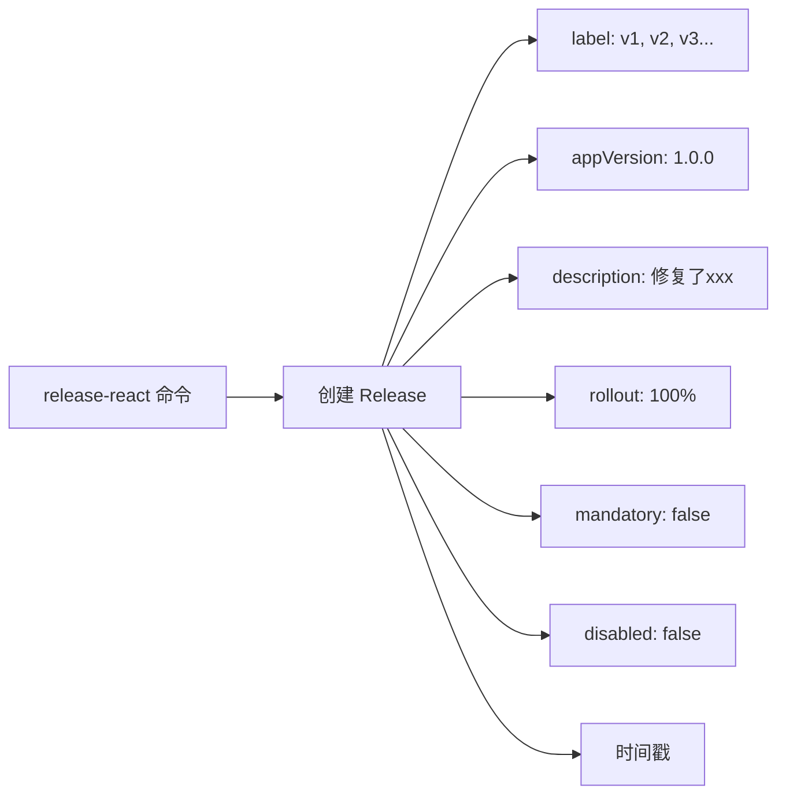
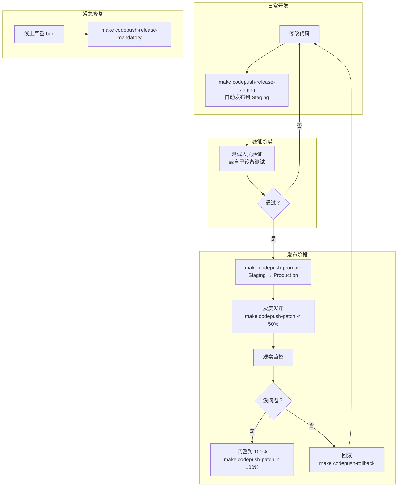

# CodePush 热更新管理方案

## 当前状态

- App 二进制版本: **1.0.0**（Android: `android/app/build.gradle` / iOS: `$(MARKETING_VERSION)`）
- 已有 4 个 CodePush App + 8 个 Deployment Key（已写入配置文件）
- `ensure_app()` 和 `get_key()` 已修复，`make codepush-setup-keys` 可用
- 已有 Makefile targets：`codepush-release-staging`, `codepush-release-production`, `codepush-promote`, `codepush-history`

## CodePush 发布管理核心概念

每次发布热更新时，CodePush 会记录以下信息：



## 现有 CLI 功能（全可用）

| 功能         | CLI 命令                       | 当前 Makefile 是否支持                                        |
| ------------ | ------------------------------ | ------------------------------------------------------------- |
| 发布更新     | `release-react`                | ✅ `codepush-release-staging` / `codepush-release-production` |
| 查看历史     | `deployment history`           | ✅ `codepush-history`                                         |
| 提升到生产   | `promote`                      | ✅ `codepush-promote`                                         |
| 指定目标版本 | `--targetBinaryVersion` / `-t` | ❌ 未使用                                                     |
| 灰度百分比   | `--rollout` / `-r`             | ❌ 未使用                                                     |
| 强制更新     | `--mandatory` / `-m`           | ❌ 未使用                                                     |
| 禁用发布     | `--disabled` / `-x`            | ❌ 未使用                                                     |
| 修改发布     | `patch`                        | ❌ 无 target                                                  |
| 回滚         | `rollback`                     | ❌ 无 target                                                  |

## 问题解答

### Q1: 怎么知道每个热更新对应哪些 App 版本？

**自动检测版本号：** 运行 `release-react` 时如果不传 `--targetBinaryVersion`，CLI 会自动读取：

- **Android:** `android/app/build.gradle` 的 `versionName "1.0.0"`
- **iOS:** `Info.plist` 的 `CFBundleShortVersionString`（即 `$(MARKETING_VERSION)`）

每次发布的 Release 都会记录它所针对的 App 二进制版本。通过 `make codepush-history` 可以看到：

```
┌────────┬──────────────┬──────────────┬──────────────────┐
│ Label  │ Description  │ App Version  │ Mandatory        │
├────────┼──────────────┼──────────────┼──────────────────┤
│ v3     │ 修复登录bug  │ 1.0.0        │ No               │
│ v2     │ 新增搜索功能 │ 1.0.0        │ No               │
│ v1     │ 首页优化     │ 1.0.0        │ Yes              │
└────────┴──────────────┴──────────────┴──────────────────┘
```

每个 Release 都有一个 `label`（v1, v2, v3...），你可以看到它针对哪个 App 版本。

### Q2: 如果出了新版本 App（比如 1.1.0），热更新怎么管理？

用 `--targetBinaryVersion` 控制更新范围：

```bash
# 只对 1.0.x 版本用户推送
code-push-standalone release-react Tarsier-ios ios \
  --targetBinaryVersion "1.0.x" \
  --description "修复 1.0.x 系列的 bug"

# 对 1.0.0 和 1.1.0 都推送
code-push-standalone release-react Tarsier-ios ios \
  --targetBinaryVersion "1.0.0 - 1.1.0" \
  --description "兼容两个版本"

# 从特定版本开始所有版本都推送
code-push-standalone release-react Tarsier-ios ios \
  --targetBinaryVersion ">=1.0.0" \
  --description "所有 1.0.0 以上版本"
```

支持的 Semver 语法：`1.0.0`, `~1.2.3`, `^1.0.0`, `1.0.x`, `>=1.0.0`, `1.0.0 - 1.2.0`

## 建议增强的 Makefile targets

```makefile
# ── 灰度发布（Staging） ──────────────────────────────────────────
codepush-release-staging-rollout: ## 灰度发布到 Staging（可指定百分比）
	@read -p "📝 Enter description: " msg; \
	read -p "📊 Rollout percentage [100]: " pct; \
	pct=$${pct:-100}; \
	echo "📦 Releasing to TarsierTest-ios Staging ($$pct%)..." && \
	$(CODEPUSH_STANDALONE_CMD) release-react TarsierTest-ios ios \
	  --deploymentName Staging \
	  --description "$$msg" \
	  --rollout "$$pct%" && \
	echo "📦 Releasing to TarsierTest-android Staging ($$pct%)..." && \
	$(CODEPUSH_STANDALONE_CMD) release-react TarsierTest-android android \
	  --deploymentName Staging \
	  --description "$$msg" \
	  --rollout "$$pct%" && \
	echo "✅ Staging rollout sent ($$pct%)"

# ── 强制更新（Production） ──────────────────────────────────────
codepush-release-mandatory: ## 发布强制更新（用户必须更新才能使用）
	@read -p "📝 Enter description: " msg; \
	echo "📦 Releasing mandatory update to Tarsier-ios Production..." && \
	$(CODEPUSH_STANDALONE_CMD) release-react Tarsier-ios ios \
	  --deploymentName Production \
	  --description "$$msg" \
	  --mandatory && \
	echo "📦 Releasing mandatory update to Tarsier-android Production..." && \
	$(CODEPUSH_STANDALONE_CMD) release-react Tarsier-android android \
	  --deploymentName Production \
	  --description "$$msg" \
	  --mandatory && \
	echo "✅ Mandatory update sent"

# ── 修改现有发布 ────────────────────────────────────────────────
codepush-patch: ## 修改已有发布（如调整灰度比例）
	@read -p "📱 App name [Tarsier-ios]: " app; \
	app=$${app:-Tarsier-ios}; \
	read -p "🚚 Deployment [Production]: " dep; \
	dep=$${dep:-Production}; \
	read -p "📊 New rollout % [100]: " pct; \
	pct=$${pct:-100}; \
	$(CODEPUSH_STANDALONE_CMD) patch $${app} $${dep} \
	  --rollout "$$pct%"

# ── 回滚 ────────────────────────────────────────────────────────
codepush-rollback: ## 回滚到上一个版本
	@read -p "📱 App name [Tarsier-ios]: " app; \
	app=$${app:-Tarsier-ios}; \
	read -p "🚚 Deployment [Production]: " dep; \
	dep=$${dep:-Production}; \
	$(CODEPUSH_STANDALONE_CMD) rollback $${app} $${dep}

# ── 查看完整历史 ────────────────────────────────────────────────
codepush-history-all: ## 查看所有 App 的部署历史
	@echo "━━━ TarsierTest-ios Staging ━━━"
	$(CODEPUSH_STANDALONE_CMD) deployment history TarsierTest-ios Staging
	@echo ""
	@echo "━━━ TarsierTest-android Staging ━━━"
	$(CODEPUSH_STANDALONE_CMD) deployment history TarsierTest-android Staging
	@echo ""
	@echo "━━━ Tarsier-ios Production ━━━"
	$(CODEPUSH_STANDALONE_CMD) deployment history Tarsier-ios Production
	@echo ""
	@echo "━━━ Tarsier-android Production ━━━"
	$(CODEPUSH_STANDALONE_CMD) deployment history Tarsier-android Production
```

## 推荐工作流程



## 关键管理命令速查

```bash
# 查看历史
make codepush-history            # Staging
make codepush-history-all        # 全部

# 发布
make codepush-release-staging    # 快速发布到 Staging
make codepush-release-production # 快速发布到 Production
make codepush-release-mandatory  # 强制更新

# 灰度控制
make codepush-release-staging-rollout  # 灰度发布
make codepush-patch                    # 调整灰度/修改发布

# 提升 & 回滚
make codepush-promote    # Staging → Production
make codepush-rollback   # 回滚

# 查看 key
make codepush-keys       # 列出所有 deployment key
make codepush-setup-keys # 重新配置（新机器上用）

# CLI 直接操作（更灵活）
code-push-standalone deployment history Tarsier-ios Production
code-push-standalone patch Tarsier-ios Production --rollout "50%"
code-push-standalone rollback Tarsier-ios Production
```
