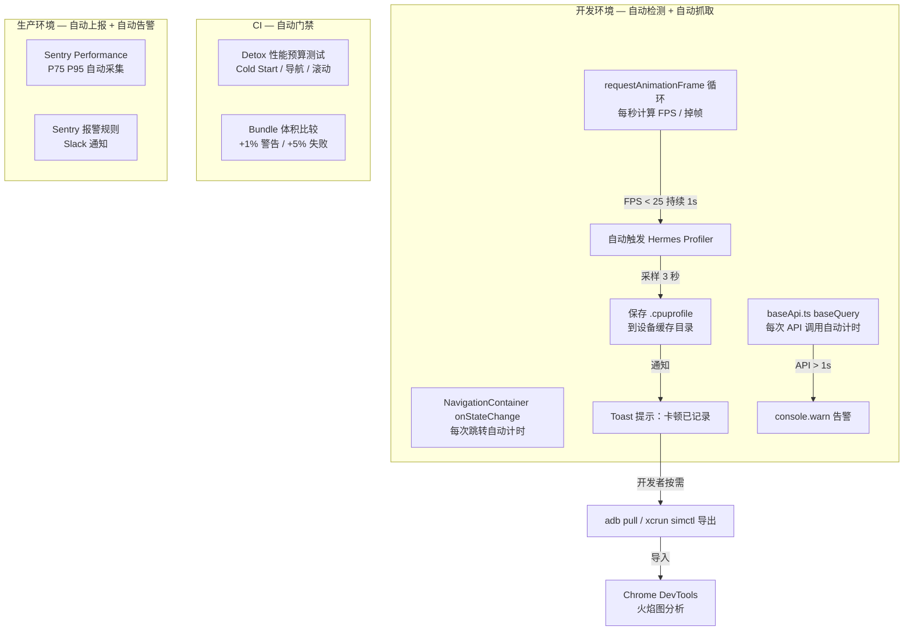
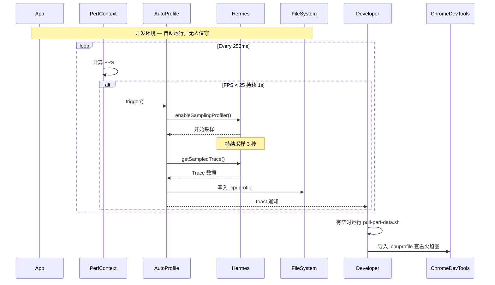

# 综合性能监控方案 — 全自动化版

> **核心理念**：全自动化，无人值守。系统自动检测性能问题、自动抓取 Profile、自动告警，开发者不需要"用眼睛看"任何面板。

---

## 架构总览



---

## Phase 1: 开发环境自动化检测 + 自动抓取

### 1.1 FPS 监控 + 自动触发 Hermes Profiler

**核心逻辑**（在 [`PerfContext.tsx`](src/lib/perf/PerfContext.tsx) 的 FPS tick 函数中添加）：

```typescript
// 卡顿检测状态
let consecutiveLowFpsFrames = 0;
let isProfiling = false;

// 在每 15 帧的更新逻辑中
if (currentFps < 25) {
  consecutiveLowFpsFrames++;
  if (consecutiveLowFpsFrames > 3 && !isProfiling) {
    // 连续 3 次检测（约 750ms）FPS < 25 → 自动启动 Hermes Profiler
    isProfiling = true;
    startHermesProfile();
  }
} else {
  consecutiveLowFpsFrames = 0;
}
```

**新建文件**: [`src/lib/perf/autoProfile.ts`](src/lib/perf/autoProfile.ts)

```typescript
/**
 * 自动 Hermes Profiler 控制
 *
 * 当 PerfMonitor 检测到卡顿时，自动启动 Hermes Sampling Profiler，
 * 采样 3 秒后停止并保存 .cpuprofile 文件。
 * 全程无需开发者操作。
 */

let isProfiling = false;
let profileTimer: ReturnType<typeof setTimeout> | null = null;

export function startAutoProfile(): void {
  if (!__DEV__ || isProfiling) return;
  if (!canUseHermesProfiler()) return;

  isProfiling = true;
  console.log('[PerfMonitor] 🚨 检测到帧率过低，自动启动 Hermes Profiler...');

  // 启动 Hermes Sampling Profiler
  global.HermesInternal?.enableSamplingProfiler?.();

  // 采样 3 秒后停止
  profileTimer = setTimeout(async () => {
    await stopAndSaveProfile();
  }, 3000);
}

export function cancelAutoProfile(): void {
  if (profileTimer) clearTimeout(profileTimer);
  profileTimer = null;
  isProfiling = false;
}

async function stopAndSaveProfile(): Promise<void> {
  try {
    const profile = await new Promise<any>((resolve, reject) => {
      global.HermesInternal?.getSampledTrace?.((err: any, data: any) => {
        if (err) reject(err);
        else resolve(data);
      });
    });

    // 保存到缓存目录
    const filename = `perf-jank-${Date.now()}.cpuprofile`;
    // 写入文件系统...
    console.log(`[PerfMonitor] ✅ Profile 已保存: ${filename}`);
  } catch (e) {
    console.warn('[PerfMonitor] ⚠️ Profile 保存失败:', e);
  } finally {
    isProfiling = false;
  }
}
```

### 1.2 API 慢请求自动告警

**已有**（[`baseApi.ts`](src/api/baseApi.ts) 中已集成 `recordApiCall`），新增告警逻辑：

```typescript
// 在 baseApi.ts 的 recordApiCall 调用处
if (duration > 1000) {
  console.warn(`[PerfMonitor] ⚠️ 慢 API: ${method} ${endpoint} — ${duration}ms`);
  // 可选：发送到 Sentry 作为 breadcrumb
  addBreadcrumb?.(`Slow API: ${method} ${endpoint} ${duration}ms`, 'http');
}
```

### 1.3 文件导出工具

**新建文件**: [`scripts/pull-profiles.sh`](scripts/pull-profiles.sh)

```bash
#!/bin/bash
# 从 iOS Simulator 或 Android Emulator 拉取 CPU Profile 文件
# 用法: ./scripts/pull-profiles.sh

if [ "$1" = "ios" ]; then
  echo "📱 从 iOS Simulator 拉取 Profile..."
  xcrun simctl get_app_container booted com.frontendblogmobile data
  # 具体路径取决于 app 的缓存目录
elif [ "$1" = "android" ]; then
  echo "🤖 从 Android Emulator 拉取 Profile..."
  adb shell "run-as com.frontendblogmobile cat /data/data/com.frontendblogmobile/caches/*.cpuprofile" > /tmp/profiles/
else
  echo "Usage: ./scripts/pull-profiles.sh [ios|android]"
fi
```

### 1.4 开发者通知（Toast）

在 [`autoProfile.ts`](src/lib/perf/autoProfile.ts) 中，Profile 保存成功后显示 Toast：

```typescript
// 使用 React Native ToastAndroid (Android) 或 Alert (iOS)
if (Platform.OS === 'android') {
  ToastAndroid.show(`Profile saved: ${filename}`, ToastAndroid.LONG);
} else {
  // iOS 没有原生 Toast，可发一个本地通知或简单的 Alert
}
```

无需浮动 UI 面板，无需开发者主动操作。

---

## Phase 2: CI 自动门禁

### 2.1 Detox 性能预算 CI

**已有文件**: [`e2e/performance-budget.test.ts`](e2e/performance-budget.test.ts)

在 CI 中配置自动执行：

```yaml
# .github/workflows/ci.yml
perf-budget:
  runs-on: macos-latest
  steps:
    - uses: actions/checkout@v4
    - uses: ./.github/actions/setup
    - run: make release-ios
    - run: detox test --configuration ios.sim.release e2e/performance-budget.test.ts
    - if: success()
      run: echo "✅ 性能预算通过"
    - if: failure()
      run: echo "❌ 性能预算未通过，请检查是否引入了性能退化"
```

**Makefile** 新增命令：
```makefile
perf-ci: ## Run Detox performance budget tests (CI gate)
	detox test --configuration ios.sim.release e2e/performance-budget.test.ts
```

### 2.2 Bundle 体积自动监控

**新建文件**: [`scripts/check-bundle-size.sh`](scripts/check-bundle-size.sh)

```bash
#!/bin/bash
# 检查生产 Bundle 体积是否超出预算

BUDGET_KB=2500  # 2.5MB

yarn react-native bundle --platform ios --dev false --entry-file index.js \
  --bundle-output /tmp/main.jsbundle 2>/dev/null

SIZE=$(stat -f%z /tmp/main.jsbundle 2>/dev/null || stat -c%s /tmp/main.jsbundle)
SIZE_KB=$((SIZE / 1024))

echo "Bundle size: ${SIZE_KB}KB (budget: ${BUDGET_KB}KB)"

if [ $SIZE_KB -gt $BUDGET_KB ]; then
  echo "❌ FAIL: Bundle size ${SIZE_KB}KB exceeds budget ${BUDGET_KB}KB"
  exit 1
elif [ $SIZE_KB -gt $((BUDGET_KB * 85 / 100)) ]; then
  echo "⚠️  WARN: Bundle size ${SIZE_KB}KB is within 15% of budget"
  exit 0
else
  echo "✅ PASS: Bundle size ${SIZE_KB}KB within budget"
  exit 0
fi
```

**Makefile** 新增：
```makefile
check-bundle-size: ## Check production bundle size against budget
	@./scripts/check-bundle-size.sh
```

---

## Phase 3: 生产环境自动监控

### 3.1 Sentry Performance 自动采集

**已有**（[`src/lib/sentry.ts`](src/lib/sentry.ts) 已配置），需确认：

| 配置项 | 当前值 | 说明 |
|--------|--------|------|
| `tracesSampleRate` | 0.2 | 20% 采样，足够计算 P75/P95 |
| `profilesSampleRate` | 0.2 | 20% 的 Trace 附带 CPU Profile |
| `replaysSessionSampleRate` | 0.1 | 10% 用户有 Session Replay |
| `replaysOnErrorSampleRate` | 1.0 | 报错时 100% 录制回放 |

### 3.2 Sentry 报警规则

需要在 Sentry 后台配置（开发环境无法自动配置）：

| 规则 | 条件 | 动作 |
|------|------|------|
| 页面加载 P75 > 3s | 过去 1h 超过 50 次 | Slack 通知 |
| HTTP 错误率上升 | 环比增长 200% | Slack + Email |
| JS Crash 率 > 0.5% | 过去 5 分钟 | PagerDuty / Slack |

### 3.3 Makefile 更新 Sentry 链接

```makefile
sentry-dashboard: ## Open Sentry Performance dashboard
	open https://sentry.io/organizations/frontend-blog/performance/
```

---

## Phase 4: 导出工具链

### 4.1 一键导出脚本

**新建文件**: [`scripts/pull-perf-data.sh`](scripts/pull-perf-data.sh)

```bash
#!/bin/bash
# 一键导出所有性能数据
# 从设备拉取 .cpuprofile + FPS log + API log

DEVICE_TYPE=$1  # ios or android
OUTPUT_DIR=/tmp/perf-data-$(date +%Y%m%d-%H%M%S)
mkdir -p $OUTPUT_DIR

echo "📁 导出到: $OUTPUT_DIR"

if [ "$DEVICE_TYPE" = "ios" ]; then
  xcrun simctl get_app_container booted com.frontendblogmobile data
  cp ~/Library/Developer/CoreSimulator/Devices/*/data/Containers/Data/Application/*/Library/Caches/*.cpuprofile $OUTPUT_DIR/ 2>/dev/null
elif [ "$DEVICE_TYPE" = "android" ]; then
  adb exec-out run-as com.frontendblogmobile cat /data/data/com.frontendblogmobile/caches/perf-*.cpuprofile > $OUTPUT_DIR/
fi

echo "✅ 导出完成，文件列表:"
ls -la $OUTPUT_DIR/
```

---

## 文件变更清单（最终版）

| 文件 | 操作 | 说明 |
|------|------|------|
| [`src/lib/perf/PerfContext.tsx`](src/lib/perf/PerfContext.tsx) | 修改 | 添加自动 Profiler 触发逻辑 |
| [`src/lib/perf/autoProfile.ts`](src/lib/perf/autoProfile.ts) | **新建** | Hermes Profiler 自动控制 |
| [`src/lib/perf/PerfMonitor.tsx`](src/lib/perf/PerfMonitor.tsx) | 修改 | 仅保留 Record 按钮，移除以视觉为主的面板展示，改为后台运行 |
| [`src/lib/perf/index.ts`](src/lib/perf/index.ts) | 修改 | 导出 autoProfile |
| [`src/api/baseApi.ts`](src/api/baseApi.ts) | 修改 | 添加慢 API 告警 |
| [`Makefile`](Makefile) | 修改 | 添加 perf-ci / check-bundle-size / sentry-dashboard |
| [`scripts/check-bundle-size.sh`](scripts/check-bundle-size.sh) | **新建** | Bundle 体积检查 |
| [`scripts/pull-perf-data.sh`](scripts/pull-perf-data.sh) | **新建** | 性能数据导出 |
| [`e2e/performance-budget.test.ts`](e2e/performance-budget.test.ts) | 已有 | CI 性能预算（无需修改） |

---

## 核心流程



---

## 和原方案的区别

| 维度 | 原方案（面板） | 全自动化方案（新） |
|------|--------------|------------------|
| 展示方式 | 浮动 HUD 面板，需要肉眼观看 | 无 UI，后台静默运行 |
| FPS 监控 | 显示在面板上 | 后台计算，仅触发时通知 |
| Profile 触发 | 手动按 Record | 自动触发 |
| 开发者动作 | 边开发边看面板 | FPS 掉时收到 Toast，有空再看 |
| CI 门禁 | 有 Detox 示例但未接入 | CI 集成 + Bundle 检查 |
| 适合谁 | 关注实时数据的开发者 | 不想分心、相信自动化的开发者 |
