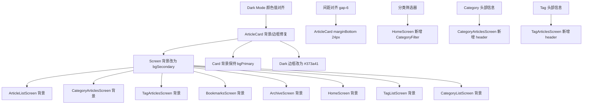

# 全面视觉差异审计：Mobile App vs Web App

> 审计时间：2026-05-15
> 范围：所有屏幕和组件的视觉一致性

---

## 已修复项（之前 Phase 1-2 已完成）

| # | 项目 | 状态 |
|---|------|------|
| ✅ | 品牌色同步（`#fc7701` → `#d68a29`） | Done |
| ✅ | ArticleCard 布局改为垂直（匹配 Web） | Done |
| ✅ | ArticleCard 增加 views/comments 计数 | Done |
| ✅ | HomeScreen 新增 Featured 轮播 + 圆点指示器 | Done |
| ✅ | Header 增加语言切换、主题切换、用户菜单 | Done |
| ✅ | Bottom Nav 改为 5 Tab（Home/Tags/Categories/Bookmarks/About） | Done |
| ✅ | SvgIcon 增加 tag 图标 | Done |

---

## 仍存在的视觉差异

### 🔴 P0: ArticleCard 背景/边框不可见

**Web 端：**
```tsx
className="bg-white dark:bg-slate-900 rounded-lg border border-slate-200 dark:border-slate-700"
```
- Card 背景：`bg-white`（`#ffffff`）/ `dark:bg-slate-900`（`#0f172a`）
- 边框：`border-slate-200`（`#e2e8f0`）/ `dark:border-slate-700`（`#334155`）
- **页面背景 = body**（不是纯白），card 能浮出来

**App 端（当前）：**
- Screen 背景：`colors.background` → `colors.bgPrimary` = `#ffffff` / `#22262f`
- Card 背景：`colors.bgPrimary` = `#ffffff` / `#22262f`
- Card 边框：`colors.borderSecondary` = `#e9eaeb` / `#22262f`
- **问题：Light mode 下 card 和 screen 都是白色，Dark mode 下 card 和 screen 都是 `#22262f`，边框也是 `#22262f` — 完全不可见**

**修复方案：**
- Screen 背景改为 `colors.bgSecondary`（`#f5f5f5` / `#0a0d12`）
- Card 背景保持 `colors.bgPrimary`（白色 card 在灰色背景上）
- Dark mode 边框改为 `#373a41`（当前 `#22262f` 不可见）

---

### 🔴 P0: Dark Mode 颜色值与 Web 不匹配

| Token | Web (globals.css) | App 当前 | 问题 |
|-------|-------------------|---------|------|
| `--background` (light) | `hsl(0 0% 100%)` = `#ffffff` | `bgPrimary` = `#ffffff` | ✅ 一致 |
| `--background` (dark) | `hsl(20 14.3% 4.1%)` = `#0a0a0a` | `bgPrimary` = `#22262f` | ❌ 不一致 |
| `--border` (dark) | `hsl(217.2 32.6% 17.5%)` = `#1e293b` | `borderSecondary` = `#22262f` | ❌ 不一致 |
| Card bg (dark) | `bg-slate-900` = `#0f172a` | `bgPrimary` = `#22262f` | ❌ 不一致 |
| Card border (dark) | `border-slate-700` = `#334155` | `borderSecondary` = `#22262f` | ❌ 不一致 |
| `--foreground` (dark) | `hsl(60 9.1% 97.8%)` ≈ `#f8f9f5` | `textPrimary` | 需验证 |
| `--muted-foreground` (dark) | `hsl(24 5.4% 63.9%)` ≈ `#a69f96` | `textSecondary` | 需验证 |

**修复方案：**
- 对齐 Dark Mode 的 `bgPrimary` 值到接近 Web 的 `--background`（`#0a0a0a`）
- 对齐 Dark Mode 的 `borderSecondary` 到接近 Web 的 `--border` / `slate-700`（`#334155`）
- 但这涉及修改 `variables.tokens.json` 的 dark tokens，需要确认是否允许

---

### 🟡 P1: HomePage 缺少标题区和分类筛选器

**Web 端：**
```tsx
<div className="sticky top-0 z-40 md:static ... bg-background/95 backdrop-blur-md">
  <CategoryFilter ... />
</div>
<div className="mb-8">
  <h1 className="text-3xl md:text-4xl font-bold text-slate-900 dark:text-white mb-3">
    Tarsier Labs
  </h1>
  <p className="text-base text-slate-600 dark:text-slate-400">
    Tech innovation lab from Bohol, Philippines
  </p>
</div>
```

**App 端：**
- 没有 CategoryFilter（分类筛选水平滚动条）
- 没有页面标题 "Tarsier Labs"
- 没有副标题

**影响：** Web 首页可以直接筛选分类，App 需要切换到 Categories tab

**修复方案：**
- 在 HomeScreen 的 Recent Section 上方增加分类筛选条
- 增加页面标题/副标题（可选，移动端空间有限）

---

### 🟡 P1: Article 列表布局差异

**Web 端（HomePage）：**
```tsx
<div className="grid gap-6 md:grid-cols-2">
```
- 2 列网格布局（桌面端）
- `gap-6` = `24px` 间距
- 每个 card 宽度自适应

**App 端（ArticleListScreen + HomeScreen Recent）：**
- 单列 FlatList
- `marginBottom: spacing.md`（约 16px）
- 每个 card 宽度 = 100%

**影响：** 这是合理的移动端适配，移动端单列更好。但间距应该对齐 Web 的 `gap-6`（24px）。

**修复方案：**
- 保持单列布局（移动端优化）
- 调整 article item 的 `marginBottom` 为 24px（匹配 Web `gap-6`）
- 检查 padding 是否对齐 Web 的 `px-4 md:px-6`（16px→24px）

---

### 🟡 P1: Category 详情页差异

**Web 端（CategoryClientView）：**
```tsx
<header className="mb-10">
  <div className="flex items-center gap-4 mb-4">
    <div className="text-5xl">{emoji_icon}</div>
    <div>
      <h1 className="text-3xl md:text-4xl font-bold">{category.name}</h1>
      <p className="text-lg text-muted-foreground mt-2">{description}</p>
      <p className="text-sm text-muted-foreground mt-1">{articleCount}</p>
    </div>
  </div>
</header>
<div className="space-y-6">
  {articles.map(article => <ArticleCard key={article.id} article={article} />)}
</div>
```
- 返回按钮 → `/categories`
- 分类 emoji 图标
- 分类名称（`text-3xl` 粗体）
- 分类描述（`text-lg`）
- 文章数量
- ArticleCard 列表（`space-y-6`）

**App 端（CategoryArticlesScreen）：**
- 没有返回按钮（导航栈自带）
- 没有 emoji 图标
- 没有分类描述
- 没有文章数量
- FlatList 上的纯 article 列表

**修复方案：**
- 在 CategoryArticlesScreen 增加分类头部：名称、描述、文章数
- `space-y-6` 间距对齐

---

### 🟡 P1: Tag 详情页差异

**Web 端（TagClientView）：**
- 类似 Category 的布局：标题 + 描述 + 文章列表
- `space-y-6` 间距

**App 端（TagArticlesScreen）：**
- 纯 article 列表，没有 tag 头部信息

**修复方案：**
- 在 TagArticlesScreen 增加 tag 头部：名称、文章数

---

### 🟡 P1: Header 行为差异

**Web 端：**
- 使用 Headroom 库：向下滚动时隐藏，向上滚动时显示
- 搜索框点击打开 SearchModal（全屏搜索）
- 搜索快捷键 `Cmd+K`

**App 端：**
- 始终固定在顶部
- 搜索图标导航到 SearchScreen（独立 screen）
- 没有快捷键

**修复方案：**
- 保持固定（移动端 UX 规范）
- 无需改动

---

### 🟢 P2: About Page 差异

**Web 端（about/page.tsx）：**
- 完整的关于页面
- 需要读取

**App 端（AboutScreen）：**
- 已有 AboutScreen 组件
- 需要对比差异

---

### 🟢 P2: Spacing 对齐

| 用途 | Web | App 当前 | 应改为 |
|------|-----|---------|--------|
| Card 间距 | `gap-6` / `space-y-6` = `24px` | `marginBottom: 16` | `marginBottom: 24` |
| 页面水平 padding | `px-4 md:px-6 lg:px-8` = 16/24/32px | `paddingHorizontal: spacing.md` (16px) | 视情况 |
| 页面垂直 padding | `py-6 md:py-10` = 24/40px | 无统一设置 | 可加 |

---

### 🟢 P2: CategoryListScreen 差异

**Web 端：**
- 分类网格展示
- 每个分类有卡片（图标 + 名称 + 文章数）
- 点击进入 `/categories/[slug]`

**App 端（CategoryListScreen）：**
- 已有分类网格
- CategoryCard 组件
- 需要对比视觉细节

---

### 🟢 P2: TagListScreen 差异

**Web 端：**
- 标签流式布局（tag cloud）
- 每个标签可点击进入 `/tags/[slug]`

**App 端（TagListScreen）：**
- 已有标签流式布局
- 需要对比视觉细节

---

## 总结优先级

### 立即修复（P0）
| # | 差异 | 涉及文件 | 工作量 |
|---|------|---------|--------|
| 1 | ArticleCard 背景/边框不可见 | ArticleCard.tsx + 8 个 screen 文件 | ~10 个文件 |
| 2 | Dark Mode 颜色值与 Web 不匹配 | variables.tokens.json + design_tokens.g.ts | ~2 个文件 |

### 建议修复（P1）
| # | 差异 | 涉及文件 | 工作量 |
|---|------|---------|--------|
| 3 | HomePage 缺少分类筛选器 | HomeScreen.tsx | ~1 个文件 |
| 4 | Category 详情页缺头部信息 | CategoryArticlesScreen.tsx | ~1 个文件 |
| 5 | Tag 详情页缺头部信息 | TagArticlesScreen.tsx | ~1 个文件 |
| 6 | 间距对齐（16px → 24px） | ArticleCard.tsx + screen 文件 | ~5 个文件 |

### 可选优化（P2）
| # | 差异 | 涉及文件 | 工作量 |
|---|------|---------|--------|
| 7 | About Page 细节差异 | AboutScreen.tsx | ~1 个文件 |

---

## Mermaid：修复依赖关系



---

## 建议执行顺序

1. **Step 1**: 对齐 Dark Mode 颜色值（variables.tokens.json）
2. **Step 2**: 重新生成 design_tokens.g.ts
3. **Step 3**: 修改所有 list screen 容器背景（bgPrimary → bgSecondary）
4. **Step 4**: 修复 ArticleCard 的 dark mode 边框
5. **Step 5**: 间距对齐（16px → 24px）
6. **Step 6**: 各详情页增加头部信息
7. **Step 7**: 类型检查验证
