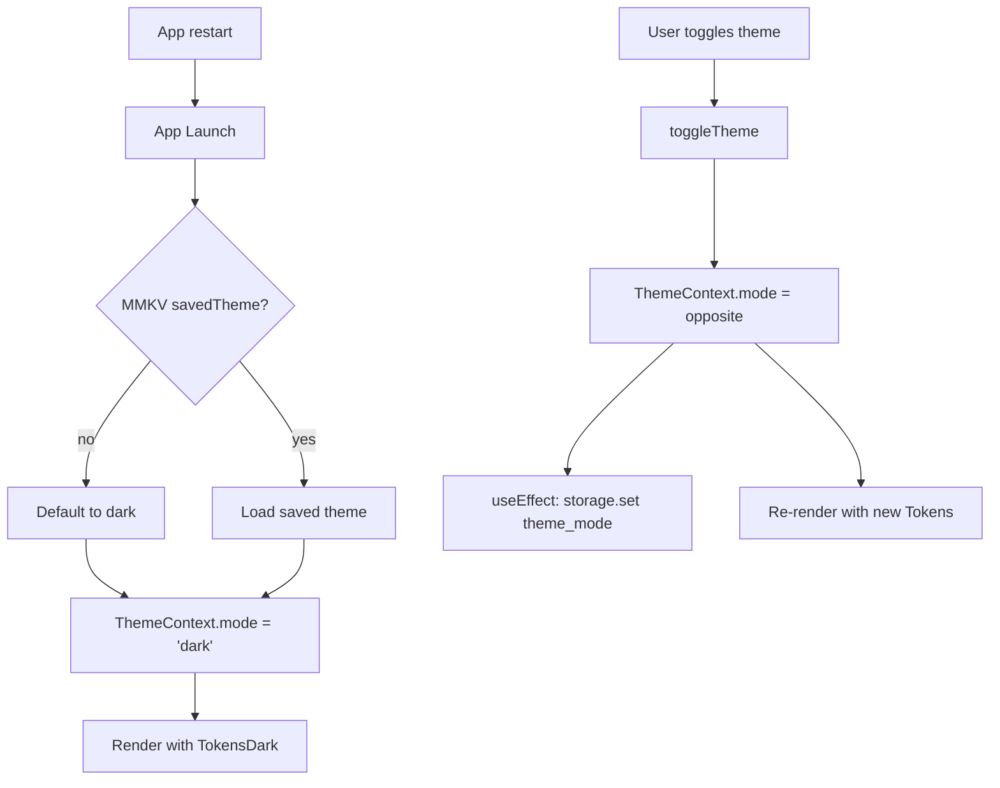

# Default Dark Theme Fix Plan

## Problem

The app's default theme is not dark (black) mode. Two root causes:

1. [`ThemeContext.tsx:39`](src/lib/theme/ThemeContext.tsx:39) initializes theme based on system color scheme with fallback to `'light'`
2. User's theme preference is **never persisted** — toggling to dark mode is lost on app restart

## Requirements

- **First launch (no user preference set)**: Default to dark mode
- **After user manually switches**: Persist the preference (via MMKV), restored on next launch

## Changes Required

### 1. [`ThemeContext.tsx`](src/lib/theme/ThemeContext.tsx) — Initialize with persisted preference or dark mode default

**Current behavior** (line 39):
```ts
const [mode, setMode] = useState<ThemeMode>((systemScheme as ThemeMode) ?? 'light');
```

**New behavior**:
- On mount, read from `MMKV` key `'theme_mode'`
- If a saved preference exists → use it
- If no saved preference → default to `'dark'`
- Remove dependency on `useColorScheme()` for initialization

**Implementation approach**:
- Use `useEffect` + `useRef` to read from `storage.getString('theme_mode')` on first render
- Use a `'loading'` state or `null` initial value to avoid flash of wrong theme
- Alternatively, synchronously read from MMKV at module level or in the component init (MMKV `getString` is synchronous)

Since MMKV is synchronous, we can do:
```ts
const savedTheme = storage.getString('theme_mode') as ThemeMode | undefined;
const [mode, setMode] = useState<ThemeMode>(savedTheme ?? 'dark');
```

### 2. [`ThemeContext.tsx`](src/lib/theme/ThemeContext.tsx) — Persist preference on toggle

In `toggleTheme` callback (or in `setMode` via a `useEffect` watcher):
```ts
useEffect(() => {
  storage.set('theme_mode', mode);
}, [mode]);
```

This saves whenever mode changes.

### 3. [`ThemeToggle.tsx`](src/components/features/ThemeToggle.tsx) — Keep Redux sync (no change needed)

The component already dispatches both `toggleTheme()` (ThemeContext) and `reduxToggleTheme()` (Redux). No changes needed here.

### 4. [`uiSlice.ts`](src/store/slices/uiSlice.ts) — Optional cleanup

The Redux `uiSlice.theme` field is effectively **dead code** for initialization — it's never read by `ThemeContext`. However, other parts of the app might use `useAppSelector(state => state.ui.theme)`. To keep things consistent:

- Option A: Keep the Redux slice as-is (it stays in sync via `ThemeToggle` dispatches)
- Option B: Remove the Redux theme state entirely and rely solely on `ThemeContext`

Recommendation: **Option A** (minimal change, lower risk).

## Files to Modify

| File | Change |
|------|--------|
| [`src/lib/theme/ThemeContext.tsx`](src/lib/theme/ThemeContext.tsx) | Initialize mode from MMKV (default `'dark'`), persist on change |
| [`src/store/slices/uiSlice.ts`](src/store/slices/uiSlice.ts) | Optional: update initial state `theme` to `'dark'` for consistency |

## Files NOT to Modify

| File | Reason |
|------|--------|
| [`src/lib/theme/design_tokens.g.ts`](src/lib/theme/design_tokens.g.ts) | Auto-generated; dark tokens already exist correctly |
| [`src/lib/theme/colors.ts`](src/lib/theme/colors.ts) | No changes needed |
| [`src/lib/theme/index.ts`](src/lib/theme/index.ts) | Just re-exports, no changes needed |
| [`src/components/features/ThemeToggle.tsx`](src/components/features/ThemeToggle.tsx) | Already toggles both contexts correctly |
| [`src/screens/SettingsScreen.tsx`](src/screens/SettingsScreen.tsx) | Already uses the Switch tied to `isDark` and `toggleTheme` |
| [`App.tsx`](App.tsx) | Provider structure is fine |

## Data Flow Diagram



### 3. [`ThemeContext.tsx:27-32`](src/lib/theme/ThemeContext.tsx:27) — Add backward-compatible color aliases

The design tokens use keys like `bgPrimary`, `textPrimary`, `borderSecondary`, but all screens access `colors.background`, `colors.text`, `colors.border`, `colors.primary`, `colors.surface`. These aliases were missing, causing ALL screens to show white/transparent background regardless of theme.

```ts
// Added aliases in resolveThemeColors()
map.background = map.bgPrimary;
map.text = map.textPrimary;
map.primary = map.utilityBrand500 ?? map.fgBrandPrimary;
map.border = map.borderSecondary;
map.surface = map.bgSecondary;
```

## Verification

1. Delete app data / fresh install → app should start in dark mode
2. Go to Settings → toggle Dark Mode switch → should switch to light mode
3. Kill app and reopen → should remain in light mode
4. Toggle back to dark → kill and reopen → should remain in dark mode
