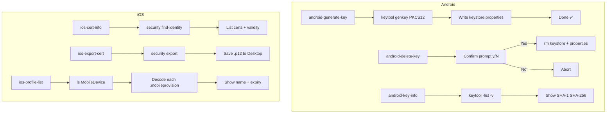

# Global Key & Certificate Management Plan

## Overview

Add comprehensive Makefile commands for managing signing keys and certificates across **Android** and **iOS**, plus a categorized help system.

---

## Current Key Assets

| Asset                   | Platform | Path                                            | Status                         |
| ----------------------- | -------- | ----------------------------------------------- | ------------------------------ |
| Release upload keystore | Android  | `android/app/release-upload-key.keystore`       | ✅ Exists                      |
| Keystore config         | Android  | `android/app/keystore.properties`               | ✅ Exists                      |
| Debug keystore          | Android  | `android/app/debug.keystore`                    | ✅ Exists                      |
| Apple Distribution Cert | iOS      | Keychain (`security`)                           | ✅ Exists (Team: `PK28T343BP`) |
| Provisioning Profiles   | iOS      | `~/Library/MobileDevice/Provisioning Profiles/` | ✅ Unknown count               |
| CodePush Auth Keys      | Both     | CodePush server                                 | ✅ Has commands                |

---

## Proposed Commands

### Android Key Commands

| Command                  | Description                                                        | Implementation                                                                |
| ------------------------ | ------------------------------------------------------------------ | ----------------------------------------------------------------------------- |
| `android-generate-key`   | Generate new `release-upload-key.keystore` + `keystore.properties` | Interactive prompts for password, then `keytool -genkey -v -storetype PKCS12` |
| `android-delete-key`     | Delete existing keystore + properties (with confirmation)          | `rm` with `read -p "Are you sure?"` confirmation                              |
| `android-key-info`       | Show SHA-1 and SHA-256 fingerprints                                | `keytool -list -v -keystore` and parse output                                 |
| `android-key-backup`     | Create encrypted backup of keystore + properties to Desktop        | `zip -er ~/Desktop/...`                                                       |
| `android-debug-key-info` | Show debug.keystore SHA-1 (needed for Firebase/Google Sign-In)     | `keytool -list -v -keystore ~/.android/debug.keystore`                        |

### iOS Certificate Commands

| Command            | Description                                              | Implementation                                                                      |
| ------------------ | -------------------------------------------------------- | ----------------------------------------------------------------------------------- |
| `ios-cert-info`    | List all valid code signing certificates in Keychain     | `security find-identity -v -p basic`                                                |
| `ios-export-cert`  | Export distribution certificate as .p12 (for CI sharing) | `security export -k login.keychain -t identities -f pkcs12`                         |
| `ios-profile-list` | List installed provisioning profiles                     | `ls ~/Library/MobileDevice/Provisioning\ Profiles/` + decode with `security cms -D` |
| `ios-profile-info` | Show details of a specific `.mobileprovision` file       | `security cms -D -i <file>`                                                         |

### Help System

| Command | Description                                                         |
| ------- | ------------------------------------------------------------------- |
| `help`  | Existing — shows all targets (auto-discovers via `##` descriptions) |
|         | New targets added below will automatically appear in `make help`    |

---

## Mermaid Flow — Key Management Workflow



---

## Files to Modify

| File                          | Changes                                                            |
| ----------------------------- | ------------------------------------------------------------------ |
| [`Makefile`](../Makefile)     | Add ~8 new targets in a new `# ── Key Management ──` section       |
| [`.gitignore`](../.gitignore) | Verify `.p12` and `.mobileprovision` are excluded — add if missing |

---

## Git Protection Check

Current [`../.gitignore`](../.gitignore):

```
*.keystore
!debug.keystore
keystore.properties
```

Need to add: `.p12` and `*.mobileprovision` to prevent accidental commits of exported certs.
