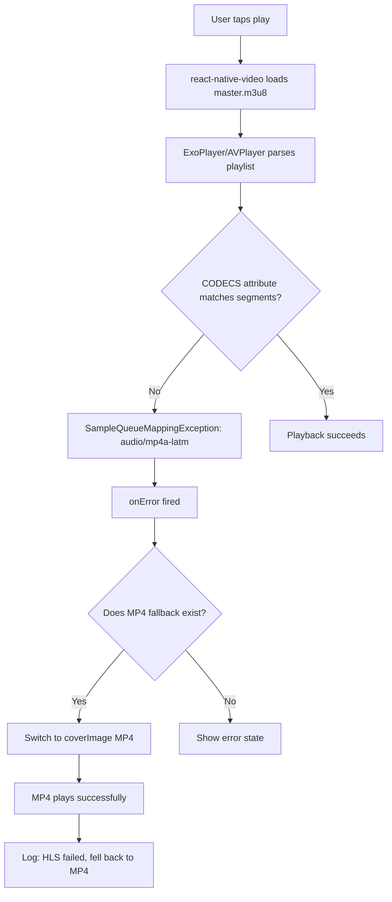

# HLS Video Playback Fix Plan (Updated with Audio Codec Root Cause)

## Root Cause (DEFINITIVE — from ExoPlayer stack trace)

```
Caused by: androidx.media3.exoplayer.hls.SampleQueueMappingException:
Unable to bind a sample queue to TrackGroup with MIME type audio/mp4a-latm.
```

**The HLS MPEG-TS segments contain AAC audio (`audio/mp4a-latm`) that ExoPlayer's `HlsSampleStream` cannot bind to a sample queue.** This is an audio codec mismatch between what the HLS manifest advertises and what's actually encoded in the `.ts` segments.

### Why This Affects Both Platforms

| Platform | Player      | Behavior                                                       |
| -------- | ----------- | -------------------------------------------------------------- |
| Android  | ExoPlayer   | Throws `SampleQueueMappingException` — immediate failure       |
| iOS      | AVPlayer    | Fails silently on audio track initialization — same root cause |
| Web/H5   | Browser MSE | More forgiving of codec mismatches — works fine                |

### Why MP4 Fallback Works

MP4 is a different container format with a different decoder path. ExoPlayer and AVPlayer handle MP4/AAC correctly because the audio codec is properly signaled in the MP4 `moov` atom.

## What's Been Done (Client-Side Improvements — All Applied ✅)

| Change                                       | File                                                                  | Status |
| -------------------------------------------- | --------------------------------------------------------------------- | ------ |
| Fix poster prop (`''` → `undefined`)         | [`ArticleCard.tsx`](../src/components/blog/ArticleCard.tsx)           | ✅     |
| Add `extractVideoError()` structured logging | [`useVideoPlayback.ts`](../src/lib/hooks/useVideoPlayback.ts)         | ✅     |
| Add `handleVideoLoadStart` callback          | [`useVideoPlayback.ts`](../src/lib/hooks/useVideoPlayback.ts)         | ✅     |
| Wire `onLoadStart` on `<Video>`              | [`ArticleCard.tsx`](../src/components/blog/ArticleCard.tsx)           | ✅     |
| Add `onError` to inline videos               | [`MarkdownRenderer.tsx`](../src/components/blog/MarkdownRenderer.tsx) | ✅     |
| Fix poster prop on inline videos             | [`MarkdownRenderer.tsx`](../src/components/blog/MarkdownRenderer.tsx) | ✅     |

## What Still Needs to Be Done

### Track A: Server-Side HLS Transcoding Fix (🚨 REQUIRED for HLS to work)

The HLS transcoding pipeline produces `.ts` segments with AAC audio that ExoPlayer can't bind. This needs to be diagnosed and fixed on the backend.

**Checklist:**

1. **Inspect the actual audio codec** in the TS segments:
   ```bash
   ffprobe -v quiet -print_format json -show_streams \
     "https://img.joyminis.com/uploads/blog/videos/.../hls/480p/segment_000.ts"
   ```
2. **Compare with the CODECS attribute** in the master playlist:
   ```bash
   curl -s "https://img.joyminis.com/uploads/blog/videos/.../hls/master.m3u8"
   # Look for: CODECS="avc1.4D4028,mp4a.40.2"
   ```
3. **Check FFmpeg encoding flags** used in the transcoding pipeline:
   - Ensure `-c:a aac` or `-c:a libfdk_aac` is used with explicit profile
   - Consider adding `-bsf:a aac_adtstoasc` bitstream filter for AAC in MPEG-TS
   - Match audio profile to what's advertised in the playlist CODECS tag

4. **Verify segment encoding** is consistent across all quality levels (480p, 720p, etc.)

5. **Test with reference encoder** — Apple's `mediastreamsegmenter` or FFmpeg with verified AAC parameters

### Track B: Client-Side Hero Video in ArticleDetailScreen

The [`ArticleDetailScreen.tsx`](../src/screens/ArticleDetailScreen.tsx) has NO hero video player, even though `article.meta?.video?.hlsUrl` data is available from the API (see Bug 3 in [`article-image-video-fix-plan.md`](./article-image-video-fix-plan.md)).

**Implementation:**

- Reuse the `useVideoPlayback` hook (or create a standalone variant)
- Render a `<Video>` component between the `KeyboardAwareScrollView` start and the article header, when `article.meta?.video` exists
- Use the same HLS→MP4 fallback pattern
- Show a playable poster (with play button overlay) before activation
- Show error state when both HLS and MP4 fail

**Design reference:** Same pattern as [`ArticleCard.tsx`](../src/components/blog/ArticleCard.tsx) — poster frame with play button, then full video on tap.

### Track C: Diagnostic Test with Apple HLS

Temporarily swap in Apple's reference HLS stream to confirm whether the react-native-video pipeline itself works:

```
https://devstreaming-cdn.apple.com/videos/streaming/examples/img_bipbop_adv_example_fmp4/master.m3u8
```

- If Apple HLS works → issue is 100% your HLS encoding
- If Apple HLS also fails → there may be a react-native-video v6 + Fabric configuration issue

## Mermaid: HLS Failure Flow



## Execution Order

1. **Server-side**: Diagnose and fix HLS audio codec mismatch in transcoding pipeline
2. **Client-side**: Add hero video player to ArticleDetailScreen (reuses existing patterns)
3. **Test**: Verify HLS works end-to-end after server fix
4. **Verify**: Use Apple test HLS stream to isolate any remaining client-side issues
