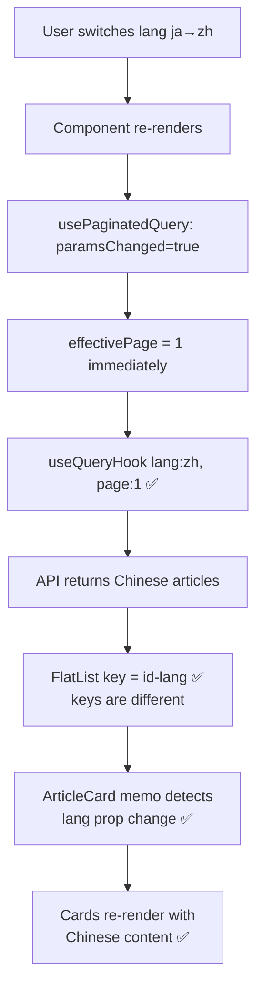

# HomeScreen Language Stale Display Fix Plan

## Problem

When switching the app language (e.g., Japanese → Chinese), the API correctly returns Chinese content (`接口返回中文`), but the HomeScreen page still shows Japanese article content (`页面还是日语`).

## Root Cause Analysis

Three interconnected bugs cause this issue:

### Bug 1 (Primary): `ArticleCard` memo comparison only checks `article.id`, ignoring language context

[`src/components/blog/ArticleCard.tsx:310-354`](src/components/blog/ArticleCard.tsx:310)

```tsx
function articleCardPropsEqual(prevProps, nextProps): boolean {
  if (prevProps.article.id !== nextProps.article.id) return false;
  // ... checks other props but NOT language/translation changes
  return true; // Memo blocks re-render if same article ID!
}
```

If the same article ID exists in both Japanese and Chinese (translated content, same article), `articleCardPropsEqual` returns `true` → the card is NOT re-rendered → stale Japanese content displayed.

**User's hint confirmed**: The `article.id` key doesn't include language info, so the memo comparison can't differentiate between language variants of the same article.

### Bug 2: `usePaginatedQuery` render-phase state update creates stale `page` for RTK Query call

[`src/lib/hooks/usePaginatedQuery.ts:100-119`](src/lib/hooks/usePaginatedQuery.ts:100)

```tsx
if (paramsChanged) {
  setPage(1); // ❌ Queued — NOT applied in current render
  setAllItems([]);
}
// ...
const { data } = useQueryHook({ ...params, page, pageSize });
// page STILL has old value (e.g., 3) even though lang changed to 'zh'
```

When `lang` changes from `'ja'` to `'zh'`:

1. Render-phase: `setPage(1)` queued, but `page` is still `3`
2. `useQueryHook({ lang: 'zh', page: 3 })` — **Wrong page!** Cache key has stale `page`
3. RTK Query fetches Chinese page 3 (unnecessary) or hits wrong cache entry
4. Next render (state applied): `useQueryHook({ lang: 'zh', page: 1 })` — Correct

### Bug 3: FlatList `keyExtractor` uses bare `item.id` without language

[`src/screens/HomeScreen.tsx:464`](src/screens/HomeScreen.tsx:464)

```tsx
keyExtractor={(item) => item.id}
```

If Chinese articles have the same IDs as Japanese articles (same translated article), React treats them as identical elements and doesn't update the DOM nodes. Combined with Bug 1's `React.memo`, the stale content persists.

### Data Flow After Language Switch (Before Fix)

```mermaid
flowchart TD
    A[User switches lang ja→zh] --> B[Component re-renders]
    B --> C["usePaginatedQuery: paramsChanged=true"]
    C --> D["setPage1 queued<br/>but page is still 3"]
    D --> E["useQueryHook lang:zh, page:3 ❌"]
    D --> F["useQueryHook lang:zh, page:1 ✅<br/>next render after state]
    F --> G[API returns Chinese articles]
    G --> H{"Same article IDs<br/>as Japanese?"}
    H -->|Yes| I["ArticleCard memo blocks<br/>re-render ❌"]
    H -->|No| J["Cards re-render ✅"]
    I --> K["Page still shows<br/>Japanese content ❌"]
```

## Fix Strategy

### Fix 1: Make `ArticleCard` memo language-aware

**File**: [`src/components/blog/ArticleCard.tsx`](src/components/blog/ArticleCard.tsx:310)

Add language-aware comparison to `articleCardPropsEqual`:

```tsx
function articleCardPropsEqual(prevProps, nextProps): boolean {
  // Article identity check
  if (prevProps.article.id !== nextProps.article.id) return false;

  // NEW: Also compare article content hash/timestamp
  // If the same article ID has different content (language switch), force re-render
  if (prevProps.article.updatedAt !== nextProps.article.updatedAt) return false;

  // OR: Add `lang` prop and compare it
  if (prevProps.lang !== nextProps.lang) return false;

  // ...rest of existing checks...
}
```

**Approach A** (Recommended): Add `lang` prop to `ArticleCard`. When language changes, the `lang` prop changes, forcing memo re-evaluation. This is explicit and doesn't depend on `updatedAt` timestamps.

**Approach B**: Compare `article.updatedAt` or do a shallow content comparison. Less reliable but doesn't require prop changes.

### Fix 2: Fix render-phase stale `page` in `usePaginatedQuery`

**File**: [`src/lib/hooks/usePaginatedQuery.ts`](src/lib/hooks/usePaginatedQuery.ts:100)

Use a local effective page that is immediately available:

```tsx
// Replace useState-based page with immediate computed value
const effectivePage = paramsChanged ? 1 : page;

const {
  data,
  // ...
} = useQueryHook({ ...params, page: effectivePage, pageSize });
```

This ensures that when params change, `useQueryHook` is immediately called with `page=1`, not the stale `page` value.

### Fix 3: Make FlatList keyExtractor language-aware

**File**: [`src/screens/HomeScreen.tsx:464`](src/screens/HomeScreen.tsx:464)

```tsx
keyExtractor={(item) => `${item.id}-${lang}`}
```

This ensures React can distinguish between the same article ID in different languages, forcing proper element unmount/remount when language changes.

## Files to Modify

| File                                                                             | Change                                               | Risk                             |
| -------------------------------------------------------------------------------- | ---------------------------------------------------- | -------------------------------- |
| [`src/components/blog/ArticleCard.tsx`](src/components/blog/ArticleCard.tsx:310) | Add `lang` prop to memo comparison (Fix 1)           | Low - additive change            |
| [`src/lib/hooks/usePaginatedQuery.ts`](src/lib/hooks/usePaginatedQuery.ts:100)   | Use `effectivePage` instead of stale `page` (Fix 2)  | Medium - changes core hook logic |
| [`src/screens/HomeScreen.tsx`](src/screens/HomeScreen.tsx:464)                   | Update `keyExtractor` to include lang (Fix 3)        | Low - key change only            |
| [`src/screens/HomeScreen.tsx`](src/screens/HomeScreen.tsx:155)                   | Pass `lang` to `renderArticleItem` (for ArticleCard) | Low                              |

## Execution Order

1. **Fix `usePaginatedQuery` (Bug 2)** — Core fix, ensures RTK Query is called with correct page immediately
2. **Fix `ArticleCard` memo (Bug 1)** — Prevents stale content display when same article ID exists in multiple languages
3. **Fix `keyExtractor` (Bug 3)** — Ensures React properly differentiates language variants
4. **TypeScript verification** — `npx tsc --noEmit`
5. **Test on device** — Switch between Japanese and Chinese, verify articles update immediately

## Expected Behavior After Fix


