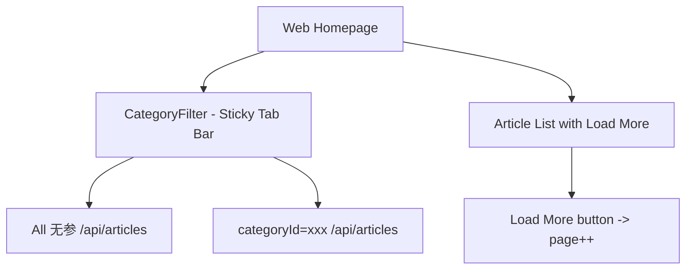

# HomeScreen 简化 + CategoryFilter 修复计划

## 分析结论

查看 Web 版首页源码后确认：**首页只有 `CategoryFilter`（分类 Tab）+ 文章列表**，没有 Featured、没有 Popular、没有 Categories Grid。



**关键行为（Web）：**
- 点击 Tab → 调用 API `GET /api/v1/frontend/blog/articles?lang=...&page=1&pageSize=10&categoryId=xxx`
  - "All" 时不传 `categoryId`
- 切换 Tab → `resetState()`（page=1, allArticles=[]）+ 重新 API 请求
- 300ms 防抖防快速连点
- Load More 按钮加载下一页

---

## Web UI vs RN App 差异 & 适配

| Web 端 | RN App 适配方案 |
|--------|----------------|
| `CategoryFilter` embla carousel + scroll buttons | **RN**: `ScrollView horizontal` 天然支持滑动，无需额外 scroll buttons |
| `rounded-lg`（8px 圆角）、`px-5 py-2.5` | **RN**: 使用 `borderRadius: 8`（常量复用 `borderRadius.md`），`paddingHorizontal: 20, paddingVertical: 10` |
| 选中 = `bg-blue-600 text-white`，未选中 = 透明背景灰色文字 | **RN**: 选中 = `colors.primary` bg + `#ffffff` text，未选中 = `colors.bgSecondary` bg + `colors.textSecondary` text + `colors.borderSecondary` border |
| `articleCount` 以 `text-xs` 淡色显示在 name 右侧 | **RN**: `fontSize: 12` + 淡色显示 `(N)` |
| 2 列 grid 文章列表 | **RN**: 单列 FlatList（移动端自然布局），每个 ArticleCard 占满宽度 |
| Load More 按钮 | **RN**: 使用 FlatList `onEndReached` 无限滚动（更自然的移动端体验），或用按钮 |
| 300ms 防抖 | **RN**: 同样 300ms debounce 防止快速连点触发多次请求 |

---

## 改造后 UI 预览

```
┌──────────────────────────────┐
│        [Header: Tarsier]      │
├──────────────────────────────┤
│                              │
│  ┌─────┐ ┌──────┐ ┌──────┐  │
│  │ All  │ │ Tech  │ │ Life │  │ ← CategoryFilter 横向滚动
│  └─────┘ └──────┘ └──────┘  │  (选中=primary蓝底白字)
│                              │
│  ┌────────────────────────┐  │
│  │  ArticleCard 1         │  │
│  │  [img] Title...        │  │
│  └────────────────────────┘  │
│  ┌────────────────────────┐  │
│  │  ArticleCard 2         │  │
│  └────────────────────────┘  │
│  ┌────────────────────────┐  │
│  │  ArticleCard 3         │  │
│  └────────────────────────┘  │
│         ...                   │
│  ┌────────────────────────┐  │
│  │   Load More...         │  │ ← onEndReached 触发
│  └────────────────────────┘  │
└──────────────────────────────┘
```

---

## 待办列表

### 1. [`HomeScreen.tsx`](src/screens/HomeScreen.tsx) — 大幅简化 + 服务器端过滤

**删除（~250 行）：**
- `useGetFeaturedArticlesQuery` — 全部 state/ref/autoPlay/FeaturedSection
- `useGetPopularArticlesQuery` — 全部 PopularSection
- `useGetCategoriesQuery` — 改为 CategoryFilter 内部自行获取
- `renderFeaturedSection()`、`renderPopularSection()`、`renderCategoriesSection()`
- `filteredArticles` useMemo 客户端过滤
- `CategoryCard` 导入
- `featuredFlatListRef`、`autoPlayRef`、`activeFeaturedIndex` 等 carousel state
- `handleFeaturedScroll`、`handleFeaturedTouchStart/End`、`startAutoPlay`、`stopAutoPlay`
- `renderDots` 方法
- `cardWidth`、`horizontalCardWidth`、`numColumns` 计算

**新增/修改：**
- `useGetArticlesQuery` 接受动态 `categoryId` 参数（服务器端过滤）
- `page` state + `handleLoadMore`
- `handleCategoryChange` — 切换分类时重置 `setPage(1)`
- 300ms 防抖
- 简化 FlatList：CategoryFilter as ListHeaderComponent + articles as data + onEndReached

**核心 API 调用逻辑：**
```tsx
const [page, setPage] = useState(1);
const [selectedCategoryId, setSelectedCategoryId] = useState<string | null>(null);

const debounceRef = useRef<ReturnType<typeof setTimeout> | null>(null);

const queryParams = selectedCategoryId 
  ? { page, pageSize: 10, categoryId: selectedCategoryId }
  : { page, pageSize: 10 };

const { data: articlesData, isLoading, isFetching, isError, refetch } = 
  useGetArticlesQuery(queryParams);

const articles = articlesData?.items || [];
const totalPages = articlesData?.totalPages || 1;
const hasMore = page < totalPages;

// 切换分类：300ms 防抖 + 重置 page
const handleCategoryChange = useCallback((categoryId: string | null) => {
  if (debounceRef.current) clearTimeout(debounceRef.current);
  debounceRef.current = setTimeout(() => {
    setSelectedCategoryId(categoryId);
    setPage(1);
  }, 300);
}, []);

const handleLoadMore = useCallback(() => {
  if (!isFetching && hasMore) {
    setPage(p => p + 1);
  }
}, [isFetching, hasMore]);
```

**FlatList 结构：**
```tsx
<FlatList
  data={articles}
  keyExtractor={(item) => item.id}
  renderItem={({ item }) => (
    <View style={styles.articleItem}>
      <ArticleCard article={item} onPress={handleArticlePress} showExcerpt />
    </View>
  )}
  ListHeaderComponent={
    <CategoryFilter
      selectedCategoryId={selectedCategoryId}
      onSelect={handleCategoryChange}
    />
  }
  ListFooterComponent={
    isFetching && page > 1 ? (
      <View style={styles.footerLoader}>
        <ActivityIndicator size="small" color={colors.primary} />
      </View>
    ) : null
  }
  ListEmptyComponent={/* loading skeleton or empty state */}
  refreshControl={
    <RefreshControl refreshing={refreshing} onRefresh={onRefresh} />
  }
  onEndReached={handleLoadMore}
  onEndReachedThreshold={0.5}
  showsVerticalScrollIndicator={false}
/>
```

**onRefresh 简化：**
```tsx
const onRefresh = useCallback(async () => {
  setRefreshing(true);
  setPage(1);
  await refetch();
  setRefreshing(false);
}, [refetch]);
```

### 2. [`CategoryFilter.tsx`](src/components/blog/CategoryFilter.tsx) — 内部获取 + Web 匹配样式

**Props 变更：**
```tsx
interface CategoryFilterProps {
  selectedCategoryId: string | null;
  onSelect: (categoryId: string | null) => void;
}
// 不再接受 categories 数组，内部自行获取
```

**新增：**
- `useGetCategoriesQuery()` 内部调用获取 categories
- Loading skeleton：6 个灰色 pulse 占位 chip
- Empty state：categories 为空时返回 null

**样式调整（匹配 Web）：**
```tsx
// Web: rounded-lg (8px), px-5 py-2.5, flex gap-2
// RN:
chip: {
  paddingHorizontal: 20,       // web's px-5 ≈ 20px
  paddingVertical: 10,         // web's py-2.5 ≈ 10px
  borderRadius: 8,             // web's rounded-lg
  borderWidth: 1,
  marginRight: 8,              // web's gap-2
},
// 选中：colors.primary bg + white text（现有逻辑保持不变）
// 未选中：colors.bgSecondary + borderSecondary border + textSecondary text
```

**articleCount 显示：**
```tsx
<Text style={[styles.chipText, { color: isSelected ? '#ffffff' : colors.textTertiary }]}>
  {category.name}
</Text>
{category.articleCount !== undefined && (
  <Text style={[styles.countText, { color: isSelected ? 'rgba(255,255,255,0.6)' : colors.textTertiary }]}>
    {' '}{category.articleCount}
  </Text>
)}
```

### 3. 数据不一致修复

之前 "All" 数据与 Web 不同的原因分析：

| 旧方案（客户端过滤 ❌） | 新方案（服务器端过滤 ✅） |
|------------------------|------------------------|
| 只请求一次 `{ page: 1, pageSize: 10 }` | 每次切换 Tab 重新请求 API |
| 客户端 `filterArticles` 过滤已加载的数据 | `categoryId` 参数变化 → RTK Query 自动 refetch |
| 切换分类后数据不刷新 | 数据始终与服务器同步 |
| 不传入 `categoryId` 时默认为 null → 可能被当作字符串"null"传入 | "All" 时不传 `categoryId` 参数 |

**修复后：**
- "All" → `{ page: 1, pageSize: 10 }`（无 categoryId）
- 选分类 → `{ page: 1, pageSize: 10, categoryId: xxx }`
- 切换 Tab → `setPage(1)` → params 变化 → RTK Query 自动发新请求

### 4. 删除不必要的导入

从 [`HomeScreen.tsx`](src/screens/HomeScreen.tsx) 移除：
- `CategoryCard` 导入
- `ScrollView` 导入（如果不再使用）
- `Animated` 导入（如果不再使用）
- `NativeScrollEvent`、`NativeSyntheticEvent` 导入（Featured carousel 类型）

### 5. CategoryArticlesScreen + TagArticlesScreen — 无需改动

这两个 screen 的 header 已经在前一轮修复中完成，样式正确。

---

## 执行顺序

1. **重写 [`HomeScreen.tsx`](src/screens/HomeScreen.tsx)** — 删除 Featured/Popular/Categories 三个 section（~250行），简化 FlatList，改用服务器端过滤 + onEndReached 分页
2. **更新 [`CategoryFilter.tsx`](src/components/blog/CategoryFilter.tsx)** — 内部获取 categories，匹配 Web 端 UI 样式（rounded-lg、padding、articleCount 显示）
3. **验证 TypeScript 检查通过** — `npx tsc --noEmit`
4. **运行 App 验证** — 确保 Tab 切换触发 API 请求，数据与 Web 一致
