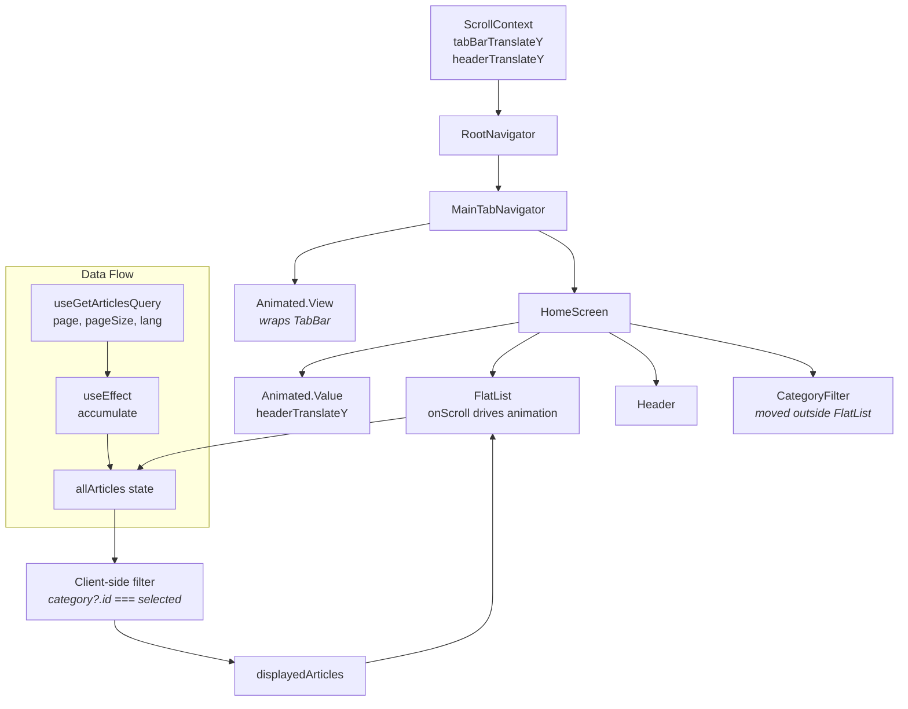

# HomeScreen + App 综合修复计划（7 项）

## 问题总览

| # | 问题 | 影响范围 | 严重性 |
|---|------|---------|--------|
| 1 | 分页不累加，数据被替换 → 滚动"卡死" | HomeScreen, CategoryArticlesScreen, TagArticlesScreen | 🔴 P0 |
| 2 | API 不支持 `categoryId` 过滤（返回全部文章） | HomeScreen | 🔴 P0 |
| 3 | CategoryFilter 在 FlatList 内 → 滚动时跑掉 | HomeScreen | 🟡 P1 |
| 4 | Header 不会在滚动时隐藏（像 Facebook/Instagram） | HomeScreen | 🟡 P1 |
| 5 | 底部 TabBar 不会在滚动时隐藏（像 Facebook/Instagram） | HomeScreen (+ TabBar) | 🟡 P1 |
| 6 | Empty 状态垂直居中（应顶部对齐） | HomeScreen | 🟢 P2 |
| 7 | 切换语言后不重新请求接口（缺少 `lang` 参数） | HomeScreen | 🟡 P1 |

---

## 架构变化

### 当前 HomeScreen 布局

```
┌─────────────────────────┐
│      Header             │  ← 始终显示
├─────────────────────────┤
│   NetworkStatusBar      │
├─────────────────────────┤
│   FlatList              │
│  ┌───────────────────┐  │
│  │ CategoryFilter    │  │  ← ListHeaderComponent → 滚动时消失
│  ├───────────────────┤  │
│  │ ArticleCard       │  │
│  │ ArticleCard       │  │
│  │ ...               │  │
│  └───────────────────┘  │
├─────────────────────────┤
│      TabBar             │  ← 始终显示
└─────────────────────────┘
```

### 目标布局

```
┌─────────────────────────┐
│  Animated.View          │  ← translateY 驱动隐藏/显示
│  ┌───────────────────┐  │
│  │     Header        │  │
│  ├───────────────────┤  │
│  │  CategoryFilter   │  │  ← 始终在 Header 下方，一起隐藏
│  └───────────────────┘  │
├─────────────────────────┤
│   NetworkStatusBar      │
├─────────────────────────┤
│   FlatList (full height)│  ← onScroll 驱动 Header+TabBar 动画
│  ┌───────────────────┐  │
│  │ ArticleCard       │  │
│  │ ArticleCard       │  │
│  │ ...               │  │
│  └───────────────────┘  │
├─────────────────────────┤
│  Animated.View          │  ← translateY 驱动隐藏/显示
│  ┌───────────────────┐  │
│  │     TabBar        │  │
│  └───────────────────┘  │
└─────────────────────────┘
```

---

## 详细修改方案

### 1. 新建文件：`src/lib/ScrollContext.tsx` — 共享滚动动画上下文

**目的**: 让 HomeScreen 和 TabBar 共享同一个 `Animated.Value`，实现 Header + TabBar 联动隐藏

```typescript
import React, { createContext, useContext, useRef } from 'react';
import { Animated } from 'react-native';

interface ScrollContextValue {
  /** Animated value for TabBar translateY */
  tabBarTranslateY: React.MutableRefObject<Animated.Value>;
  /** Animated value for Header translateY */
  headerTranslateY: React.MutableRefObject<Animated.Value>;
  /** Last scroll Y position for direction detection */
  lastScrollY: React.MutableRefObject<number>;
}

const ScrollContext = createContext<ScrollContextValue | null>(null);

export function ScrollProvider({ children }: { children: React.ReactNode }) {
  const tabBarTranslateY = useRef(new Animated.Value(0));
  const headerTranslateY = useRef(new Animated.Value(0));
  const lastScrollY = useRef(0);

  return (
    <ScrollContext.Provider value={{ tabBarTranslateY, headerTranslateY, lastScrollY }}>
      {children}
    </ScrollContext.Provider>
  );
}

export function useScrollContext(): ScrollContextValue {
  const ctx = useContext(ScrollContext);
  if (!ctx) throw new Error('useScrollContext must be used within ScrollProvider');
  return ctx;
}
```

### 2. 修改：`src/navigation/RootNavigator.tsx` — 添加 ScrollProvider + TabBar 动画包装

**变化**:
- 导入 `ScrollProvider`
- 包裹 `MainTabNavigator` 内部使用 ScrollContext
- `MainTabNavigator` 内用 `Animated.View` 包装 TabBar，应用 `tabBarTranslateY`

关键代码片段：
```typescript
// MainTabNavigator 内
const { tabBarTranslateY } = useScrollContext();

<MainTab.Navigator
  tabBar={({ state, descriptors, navigation }) => {
    const tabs: TabItem[] = state.routes.map(route => ({...}));
    return (
      <Animated.View style={{ transform: [{ translateY: tabBarTranslateY.current }] }}>
        <TabBar tabs={tabs} activeTab={...} onTabPress={...} />
      </Animated.View>
    );
  }}
>
```

### 3. 主要修改：`src/screens/HomeScreen.tsx` — 全部 7 项修复

#### 3a. 导入变更

```typescript
// 新增导入
import { Animated } from 'react-native';
import { useScrollContext } from '@/lib/ScrollContext';
import { getCurrentLanguage } from '@/lib/i18n';
import { useMemo, useEffect } from 'react';  // 确保这些已导入
import type { FrontendCategory } from '@/types/frontend-blog'; // 如果不存在
```

#### 3b. 查询参数 — 移除 categoryId + 添加 lang

```typescript
// 之前
const queryParams = selectedCategoryId
  ? { page, pageSize: PAGE_SIZE, categoryId: selectedCategoryId }
  : { page, pageSize: PAGE_SIZE };

// 之后 — API 不支持 categoryId 过滤，使用客户端过滤
const lang = getCurrentLanguage();
const queryParams = { page, pageSize: PAGE_SIZE, lang };
```

#### 3c. 累加状态 + 客户端分类过滤

```typescript
// 新增: 累加状态
const [allArticles, setAllArticles] = useState<FrontendArticle[]>([]);

// 新增: 累加 effect
useEffect(() => {
  if (articlesData?.items) {
    if (page === 1) {
      setAllArticles(articlesData.items);
    } else {
      setAllArticles(prev => [...prev, ...articlesData.items]);
    }
  }
}, [articlesData, page]);

// 新增: 客户端分类过滤
const displayedArticles = useMemo(() => {
  if (!selectedCategoryId) return allArticles;
  return allArticles.filter(a => a.category?.id === selectedCategoryId);
}, [allArticles, selectedCategoryId]);
```

#### 3d. 滚动动画 — Header + CategoryFilter 隐藏

```typescript
const SCROLL_THRESHOLD = 50; // 滚动超过此阈值触发隐藏

const { headerTranslateY, lastScrollY } = useScrollContext();

// 使用 Animated.event 驱动动画
const onScroll = Animated.event(
  [{ nativeEvent: { contentOffset: { y: headerTranslateY.current } } }],
  {
    useNativeDriver: true,
    listener: (event: any) => {
      const currentY = event.nativeEvent.contentOffset.y;
      const diff = currentY - lastScrollY.current;
      
      if (diff > 5 && currentY > SCROLL_THRESHOLD) {
        // 向下滚动 → 隐藏 (translateY = -headerHeight)
        Animated.timing(headerTranslateY.current, {
          toValue: -HEADER_HEIGHT, // 约 Header + CategoryFilter 总高度
          duration: 200,
          useNativeDriver: true,
        }).start();
      } else if (diff < -5) {
        // 向上滚动 → 显示
        Animated.timing(headerTranslateY.current, {
          toValue: 0,
          duration: 200,
          useNativeDriver: true,
        }).start();
      }
      
      lastScrollY.current = currentY;
    },
  }
);
```

**重要**: 因为 Header 和 CategoryFilter 需要一起隐藏，不能简单用 `Animated.event` 的 `contentOffset.y` 直接映射。需要使用两个独立的 `Animated.Value`:
- 一个真正的 scrollY（用于跟踪位置）
- `headerTranslateY`（驱动显示的 translateY 值，在 listener 中计算方向后更新）

#### 3e. 渲染结构变化

```tsx
return (
  <View style={[styles.container, { backgroundColor: colors.bgSecondary }]}>
    {/* 可隐藏的头部区域 */}
    <Animated.View style={{ transform: [{ translateY: headerTranslateY.current }] }}>
      <Header title="Tarsier" />
      <CategoryFilter
        selectedCategoryId={selectedCategoryId}
        onSelect={handleCategoryChange}
      />
    </Animated.View>

    <NetworkStatusBar />

    <FlatList
      data={displayedArticles}     // ← 使用累加+过滤后的数据
      keyExtractor={(item) => item.id}
      renderItem={renderArticleItem}
      onScroll={onScroll}           // ← 滚动驱动动画
      scrollEventThrottle={16}
      ListEmptyComponent={renderEmpty}
      ListFooterComponent={renderFooter}
      refreshControl={
        <RefreshControl
          refreshing={refreshing}
          onRefresh={onRefresh}
          tintColor={colors.primary}
          colors={[colors.primary]}
        />
      }
      onEndReached={handleLoadMore}
      onEndReachedThreshold={0.5}
      showsVerticalScrollIndicator={false}
      contentContainerStyle={[
        styles.scrollContent,
        { paddingBottom: insets.bottom + spacing.xl },
        displayedArticles.length === 0 && styles.emptyList,  // ← 使用 displayedArticles
      ]}
    />
  </View>
);
```

#### 3f. Empty 状态去居中

```typescript
// 之前
emptyList: {
  justifyContent: 'center',
}

// 之后 — 去掉 justifyContent，只保留 flexGrow
emptyList: {
  // justifyContent: 'center',  ← 移除
}
```

#### 3g. Refresh 回调更新

```typescript
const onRefresh = useCallback(async () => {
  setRefreshing(true);
  setPage(1);
  setAllArticles([]);          // ← 清空累加
  await refetch();
  setRefreshing(false);
}, [refetch]);
```

#### 3h. renderEmpty 使用 displayedArticles

```typescript
// 所有 articles.length 改为 displayedArticles.length
if (isError && !displayedArticles.length) { ... }
if (!displayedArticles.length) { ... }
```

### 4. 修改：`src/screens/CategoryArticlesScreen.tsx` — 分页累加

参照 [`ArticleListScreen.tsx:74-82`](src/screens/ArticleListScreen.tsx:74-82) 模式：

```typescript
// 1. 添加 state
const [allArticles, setAllArticles] = useState<FrontendArticle[]>([]);

// 2. 累加 effect
React.useEffect(() => {
  if (categoryData?.articles?.items) {
    if (page === 1) {
      setAllArticles(categoryData.articles.items);
    } else {
      setAllArticles(prev => [...prev, ...categoryData.articles.items]);
    }
  }
}, [categoryData, page]);

// 3. FlatList data={allArticles}
// 4. handleRefresh 中 setAllArticles([])
// 5. 移除 articles 变量（行 53）
```

### 5. 修改：`src/screens/TagArticlesScreen.tsx` — 分页累加

同上模式，数据来自 `tagData?.articles?.items`。

### 6. 修改：`src/components/layout/TabBar.tsx` — 保持不动（已被 RootNavigator 用 Animated.View 包装）

TabBar 本身不需要改动，因为滚动驱动的 translateY 由 RootNavigator 中包装的 `Animated.View` 提供。

---

## 执行顺序

```
1. 创建 src/lib/ScrollContext.tsx
2. 修改 RootNavigator.tsx — 添加 ScrollProvider + TabBar Animated wrapper
3. 修改 HomeScreen.tsx — 全部 7 项修复
4. 修改 CategoryArticlesScreen.tsx — 分页累加
5. 修改 TagArticlesScreen.tsx — 分页累加
6. npx tsc --noEmit 验证
```

---

## 组件关系图



---

## 风险与注意事项

1. **`useNativeDriver: true` 限制**: Animated 事件使用原生驱动时，不能同时更新 `contentOffset.y` 和 `translateY` 为同一个值。解决方案：使用 `useNativeDriver: false` 或使用独立 listener 管理 `headerTranslateY`。

2. **RefreshControl 冲突**: 当 Header 被隐藏时，下拉刷新需要能正常触发。`RefreshControl` 在 FlatList 内部，不受外部 `Animated.View` 影响。

3. **ScrollEventThrottle**: 需要设置为 `16`（约 60fps）以保证动画流畅。

4. **TabBar 动画反向**: TabBar 向上移动（`-translateY`）使其隐藏在屏幕下方。HomeScreen 的 Header 同样向上移动。确保 TabBar 的 `Animated.View` 在 `zIndex` 上处于正确层级。

5. **CategoryFilter 不再在 FlatList 内**: 删除 `renderListHeader` 和 `ListHeaderComponent` 引用。

6. **CategoryArticlesScreen + TagArticlesScreen 不需要客户端过滤**: 这两个页面的数据已经按分类/标签过滤（通过 `useGetCategoryBySlugQuery` 和 `useGetTagBySlugQuery`），只需要修 **分页累加**。
