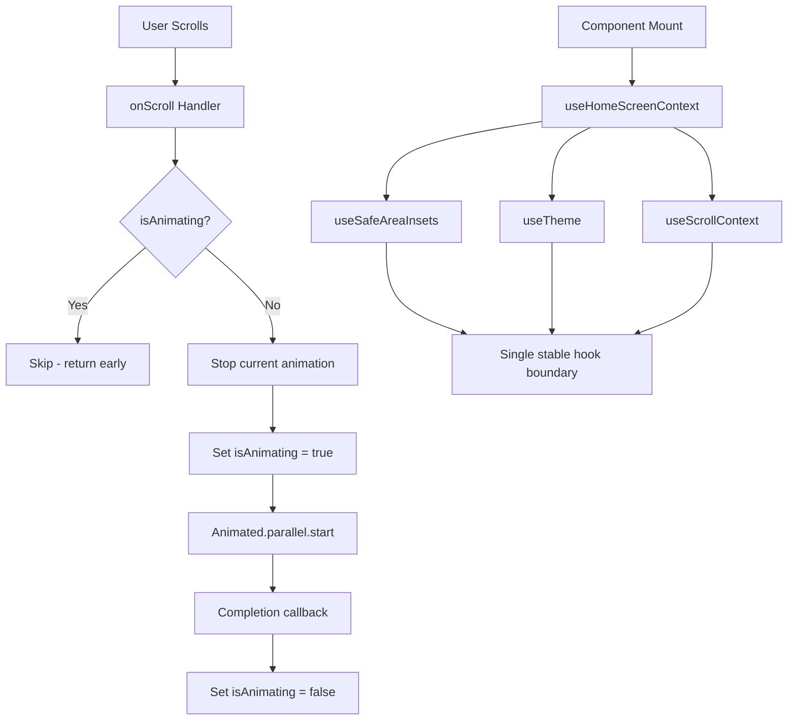

# HomeScreen Scroll Animation Fix Plan

## Problem Summary

Three critical runtime errors crash the HomeScreen scroll-based animations (CategoryFilter stick-to-top + TabBar hide/show):

1. **React Hooks Order Violation** — Hook #10 changes from `useContext` to `useRef` between renders
2. **RTK Query Selector Crash** — `Cannot read property 'hasValue' of undefined` (cascade from #1)
3. **Frozen Animation Loop** — Infinite error loop: `throwOnImmutableMutation` on `_animation` property during scroll

---

## Error Analysis

### Error 1: Hooks Order Violation

**Evidence in logs:**
```
Previous render            Next render
------------------------------------------------------
1. useContext               useContext
2. useContext               useContext
3. useContext               useContext
4. useState                 useState
5. useState                 useState
6. useRef                   useRef
7. useState                 useState
8. useState                 useState
9. useRef                   useRef
10. useContext              useRef                 ←
```

**Root cause:** Hook #10 at [HomeScreen.tsx:76](src/screens/HomeScreen.tsx:76) (`contentPaddingTop = useRef(...)`) changes to `useContext` on the "previous render". This means on some renders, there is one extra `useContext` call in the component tree.

The only hooks in HomeScreen that internally call `useContext` are:
- [`useSafeAreaInsets()`](src/screens/HomeScreen.tsx:59) — from `react-native-safe-area-context`
- [`useTheme()`](src/screens/HomeScreen.tsx:60) — from [ThemeContext.tsx:85](src/lib/theme/ThemeContext.tsx:85)
- [`useScrollContext()`](src/screens/HomeScreen.tsx:61) — from [ScrollContext.tsx:35](src/lib/ScrollContext.tsx:35)

All three are unconditional. The suspect is `useSafeAreaInsets` from `react-native-safe-area-context` — some versions have different internal hook counts depending on whether the SafeAreaContext is available on first render (common in Fabric/New Architecture).

### Error 2: RTK Query Selector Crash

**Evidence in logs:**
```
TypeError: Cannot read property 'hasValue' of undefined
  at memoizedSelector
  at useSelector
  at useQueryState
  at useQuery
  at HomeScreen
```

**Root cause:** Cascade from Error 1. When the hooks order is violated, React's internal state for the component gets corrupted. The `useGetArticlesQuery` hook (RTK Query) internally uses `useSelector` which accesses Redux store. The corrupted hooks state causes the memoized selector to receive `undefined` instead of the actual state.

### Error 3: Frozen Animation Loop (Most Destructive)

**Evidence in logs (repeating ~50+ times):**
```
throwOnImmutableMutation: You attempted to set the key `_animation`
  with the value {startValue: ..., callback: ..., ...} on an object
  that is meant to be immutable and has been frozen.

Stack trace cycle:
  onScroll → Animated.parallel(...).start() → animate
  → throwOnImmutableMutation → __notifyAnimationEnd → stop
  → stopAnimation → throwOnImmutableMutation → (loop)
```

**Root cause:** The [`onScroll`](src/screens/HomeScreen.tsx:115-163) handler calls `Animated.parallel([...]).start()` on every scroll event that crosses the threshold. With `useNativeDriver: false` on [`contentPaddingTop`](src/screens/HomeScreen.tsx:128-131), the animation runs on the JS thread and tries to set the `_animation` property on an internal object that React has frozen (dev-mode immutability enforcement). When it throws, `stopAnimation` is triggered which ALSO tries to set `_animation` to `null` on the same frozen object — creating an infinite error loop.

**Why `contentPaddingTop` uses `useNativeDriver: false`:**
It's applied as [`paddingTop`](src/screens/HomeScreen.tsx:307) in `contentContainerStyle`, which is a layout property — native driver only supports `transform` and `opacity`.

---

## Fix Plan

### Fix 1: Prevent Hooks Order Violation

**File:** [`src/screens/HomeScreen.tsx`](src/screens/HomeScreen.tsx)

**Changes:**
1. Replace the three separate context hooks (`useSafeAreaInsets`, `useTheme`, `useScrollContext`) with a single stable custom hook that bundles them together. This isolates any unstable internal hook behavior within a single custom hook boundary.

```typescript
// Instead of:
const insets = useSafeAreaInsets();
const { colors } = useTheme();
const { tabBarTranslateY, lastScrollY } = useScrollContext();

// Use:
const { insets, colors, tabBarTranslateY, lastScrollY } = useHomeScreenContext();
```

2. Add a `useHomeScreenContext` helper function inside the file (or in a shared hook file).

**Why this works:** If `useSafeAreaInsets` has unstable internal hooks, bundling it with `useTheme` and `useScrollContext` inside a single custom hook means React counts ALL hooks inside that custom hook as one logical unit. Any changes to the internal hook count of one library function won't shift the component-level hook positions.

### Fix 2: Prevent Frozen Animation Loop

**File:** [`src/screens/HomeScreen.tsx`](src/screens/HomeScreen.tsx)

**Changes:**
1. Add `isAnimating` ref to prevent concurrent animation starts
2. Add `.stop()` calls to kill any running animation before starting a new one
3. Add a completion callback to reset the guard

```typescript
const isAnimating = useRef(false);
const currentAnimation = useRef<Animated.CompositeAnimation | null>(null);

// In onScroll handler:
if (isAnimating.current) return; // Don't start while already animating
if (currentAnimation.current) currentAnimation.current.stop();

isAnimating.current = true;
currentAnimation.current = Animated.parallel([
  // ...
]);

currentAnimation.current.start(() => {
  isAnimating.current = false;
  currentAnimation.current = null;
});
```

### Fix 3: RTK Query Selector (Automatic)

No explicit code change needed — this error is a cascade from Fix 1. Once the hooks order is stable, the RTK Query `useSelector` will correctly access Redux state.

### Fix 4: Performance — Debounce Scroll Handler

While not a crash fix, adding throttle/debounce to the scroll handler prevents rapid-fire animation starts when the user scrolls quickly.

**File:** [`src/screens/HomeScreen.tsx`](src/screens/HomeScreen.tsx)

Add a scroll throttle: only process scroll events every ~100ms.

---

## Files to Modify

| File | Changes |
|------|---------|
| [`src/screens/HomeScreen.tsx`](src/screens/HomeScreen.tsx) | All fixes: hooks bundling, animation guard, scroll throttle |

---

## Architecture Diagram



---

## Testing

1. Run the app on iOS simulator/device
2. Scroll down on HomeScreen — CategoryFilter should stick to top, TabBar should slide down and hide
3. Scroll up — Header should slide back in, TabBar should reappear
4. Rapid scrolling should not trigger frozen animation errors
5. Verify no hooks order warnings in console
6. Verify RTK Query data loads correctly
