# iOS BootSplash Logo Not Showing — Root Cause Analysis & Fix Plan

## Problem

The app's startup logo (boot splash) appears correctly on Android but is **not visible on iOS**. On iOS, the screen appears blank/white briefly before React Native renders.

## Root Cause

The root cause is an **incorrect `PBXFileReference` entry** for `BootSplash.storyboard` in the Xcode project file.

### Current broken entry (line 34 of `project.pbxproj`)

```pbxproj
E6E1E7A8E46C4B65B0CDC49D /* BootSplash.storyboard */ = {
    isa = PBXFileReference;
    name = "BootSplash.storyboard";
    path = "FrontendBlogMobile/BootSplash.storyboard";
    sourceTree = "<group>";
    fileEncoding = undefined;
    lastKnownFileType = unknown;
    explicitFileType = undefined;
    includeInIndex = 0;
};
```

### Correct reference (compare with `LaunchScreen.storyboard` on line 30)

```pbxproj
81AB9BB72411601600AC10FF /* LaunchScreen.storyboard */ = {
    isa = PBXFileReference;
    fileEncoding = 4;
    lastKnownFileType = file.storyboard;
    name = LaunchScreen.storyboard;
    path = FrontendBlogMobile/LaunchScreen.storyboard;
    sourceTree = "<group>";
};
```

### What's wrong

| Property            | Current Value | Correct Value     | Impact                                                                                             |
| ------------------- | ------------- | ----------------- | -------------------------------------------------------------------------------------------------- |
| `lastKnownFileType` | `unknown`     | `file.storyboard` | **Primary issue** — Xcode doesn't recognize this as a storyboard, so it skips `ibtool` compilation |
| `fileEncoding`      | `undefined`   | `4` (UTF-8)       | Missing encoding metadata                                                                          |
| `explicitFileType`  | `undefined`   | _(omit or set)_   | Unnecessary attribute, but indicates incomplete setup                                              |
| `includeInIndex`    | `0`           | _(omit)_          | Excluded from indexing, not critical but unusual                                                   |

### Why `lastKnownFileType = unknown` breaks the launch screen

When Xcode processes a file with `lastKnownFileType = file.storyboard`:

1. Xcode runs `ibtool --compile` to produce a compiled `BootSplash.storyboardc` bundle
2. The compiled bundle is placed in the app's `.app` bundle
3. iOS's launch screen mechanism reads the compiled storyboardc and renders it

When `lastKnownFileType = unknown`:

1. Xcode **skips the `ibtool` compilation step** (treats it as a generic resource)
2. The raw `.storyboard` XML file may be copied to the bundle, but it's not compiled
3. iOS's launch screen mechanism **cannot render the uncompiled storyboard**
4. iOS falls back to a blank/white screen (or the system default launch screen)

## Why Android Works

Android uses a fundamentally different mechanism:

1. [`android/app/src/main/res/values/styles.xml`](../android/app/src/main/res/values/styles.xml) — `BootTheme` extends `Theme.BootSplash` and specifies `bootSplashLogo` and `bootSplashBackground`
2. [`AndroidManifest.xml`](../android/app/src/main/AndroidManifest.xml:27) — The activity uses `android:theme="@style/BootTheme"`
3. Android draws the splash screen **at the Window level** before the Activity even loads — this is a native Android theme mechanism
4. The drawable resources (`bootsplash_logo.png` in `drawable-*dpi/`) are always available

This means Android's bootsplash works independently of the React Native JS layer. The JS-side `BootSplash.hide()` call in [`App.tsx:155`](../App.tsx:155) simply dismisses it when ready.

## Fix

### Step 1: Update `project.pbxproj` (single line change)

Edit [`ios/FrontendBlogMobile.xcodeproj/project.pbxproj`](../ios/FrontendBlogMobile.xcodeproj/project.pbxproj) **line 34**.

**Replace:**

```pbxproj
E6E1E7A8E46C4B65B0CDC49D /* BootSplash.storyboard */ = {isa = PBXFileReference; name = "BootSplash.storyboard"; path = "FrontendBlogMobile/BootSplash.storyboard"; sourceTree = "<group>"; fileEncoding = undefined; lastKnownFileType = unknown; explicitFileType = undefined; includeInIndex = 0; };
```

**With:**

```pbxproj
E6E1E7A8E46C4B65B0CDC49D /* BootSplash.storyboard */ = {isa = PBXFileReference; fileEncoding = 4; lastKnownFileType = file.storyboard; name = "BootSplash.storyboard"; path = "FrontendBlogMobile/BootSplash.storyboard"; sourceTree = "<group>"; };
```

### Step 2: Clean rebuild

After the change, perform a **clean rebuild**:

```bash
# Clean Xcode build folder
cd ios && xcodebuild clean && cd ..

# Remove old app from device/simulator (manual)

# Rebuild and run
npx react-native run-ios
```

> **Note**: A clean build is essential because the incorrectly compiled storyboardc (or lack thereof) will be cached in derived data.

### Step 3: Verify

1. Launch the app on an iOS device or simulator
2. Observe the launch sequence — the BootSplash logo should now appear immediately on cold start
3. The logo should show with a white background (`#ffffff`) as configured in [`BootSplash.storyboard`](../ios/FrontendBlogMobile/BootSplash.storyboard:43)
4. After React Native initialization, [`App.tsx:155`](../App.tsx:155) calls `BootSplash.hide({ fade: true })` which should fade out the splash screen

## Verification Checklist

- [ ] `PBXFileReference` for `BootSplash.storyboard` has `lastKnownFileType = file.storyboard`
- [ ] `fileEncoding` is set to `4` (UTF-8)
- [ ] Clean build performed (not incremental)
- [ ] App deleted from device/simulator before reinstall
- [ ] Logo visible on cold start
- [ ] Splash fades out correctly when JS is ready

## Mermaid Diagram: iOS vs Android BootSplash Flow

```mermaid
flowchart TD
    subgraph Android["Android BootSplash Flow"]
        A1["App Launched"] --> A2["Window Theme BootTheme applied"]
        A2 --> A3["System draws bootsplash_logo.png from drawable"]
        A3 --> A4["MainActivity.onCreate runs"]
        A4 --> A5["React Native JS loads"]
        A5 --> A6["App.tsx calls BootSplash.hide"]
        A6 --> A7["Splash dismissed, app visible"]
    end

    subgraph iOS["iOS BootSplash Flow"]
        I1["App Launched"] --> I2["UILaunchStoryboardName=BootSplash"]
        I2 --> I3{"BootSplash.storyboard\nproperly compiled?"}
        I3 -->|"Yes lastKnownFileType=file.storyboard"| I4["ibtool compiles to\nBootSplash.storyboardc"]
        I4 --> I5["iOS renders launch screen\nwith logo from asset catalog"]
        I3 -->|"No lastKnownFileType=unknown"| I6["Xcode skips ibtool\ncompilation entirely"]
        I6 --> I7["iOS cannot render\nuncompiled storyboard"]
        I7 --> I8["Blank/white screen shown"]
        I5 --> I9["React Native JS loads"]
        I9 --> I10["App.tsx calls BootSplash.hide"]
        I10 --> I11["Splash faded out,\napp visible"]
        I8 --> I9
    end

    style I6 fill:#f99,stroke:#c33,stroke-width:2px
    style I8 fill:#f99,stroke:#c33,stroke-width:2px
    style I4 fill:#9f9,stroke:#3c3,stroke-width:2px
    style I5 fill:#9f9,stroke:#3c3,stroke-width:2px
```



## Summary

| Aspect         | Android                                                       | iOS                                                                                |
| -------------- | ------------------------------------------------------------- | ---------------------------------------------------------------------------------- |
| Mechanism      | Window-level theme drawable                                   | Compiled storyboard (storyboardc)                                                  |
| Timing         | Before Activity creation                                      | During app launch, before app delegate                                             |
| Current status | Works — theme correctly references `bootsplash_logo` drawable | Broken — Xcode project has `lastKnownFileType=unknown` for `BootSplash.storyboard` |
| Fix needed     | None                                                          | Update PBXFileReference in project.pbxproj + clean rebuild                         |
