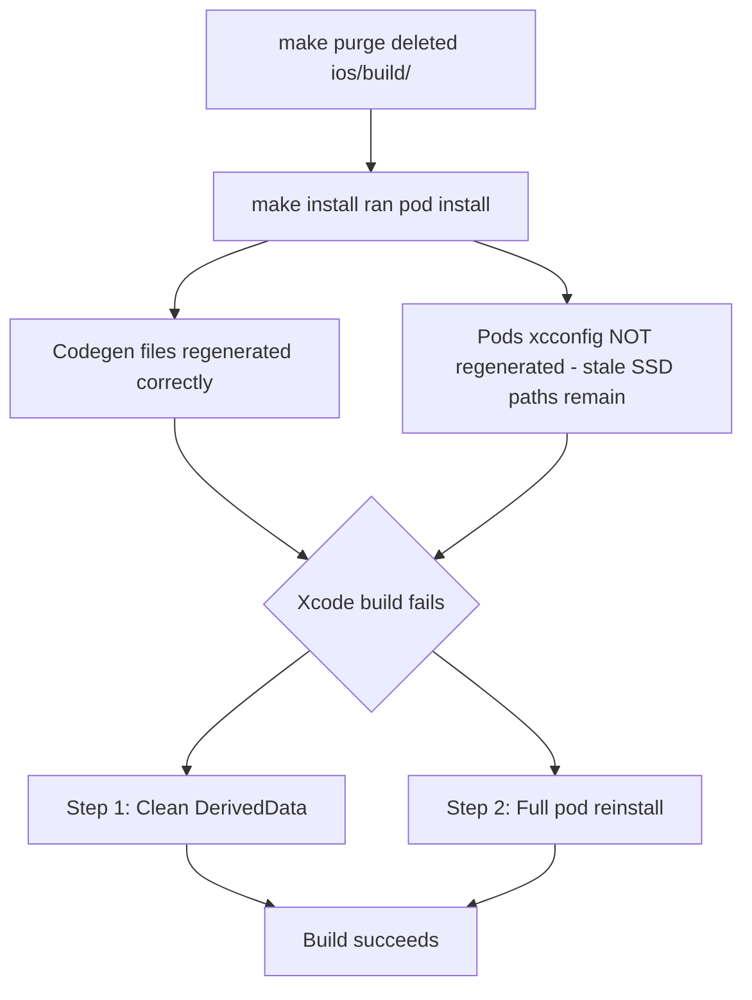

# iOS Build Fix After Purge Plan

## Problem Summary

After running `make purge` (which deleted `ios/build/`) and then `make install` (which ran `yarn install` + `pod install`), the iOS build fails with:

```
Build input file cannot be found: '.../ios/build/generated/ios/ReactCodegen/RCTThirdPartyComponentsProvider.mm'
```

## Root Causes

Two issues found:

### Issue 1 — Xcode DerivedData stale cache

The Codegen files in [`ios/build/generated/ios/ReactCodegen/`](ios/build/generated/ios/ReactCodegen/) **do exist on disk** — they were successfully regenerated by `pod install`. However, Xcode's DerivedData has a cached project state from before `make purge`, and the build system is confused by the file deletion/recreation cycle.

### Issue 2 — Stale `HERMES_CLI_PATH` in Pods xcconfig files

The CocoaPods-generated xcconfig files still reference the old SSD path:

| File | Stale Line |
|------|------------|
| [`ios/Pods/Target Support Files/Pods-FrontendBlogMobile/Pods-FrontendBlogMobile.debug.xcconfig:7`](ios/Pods/Target Support Files/Pods-FrontendBlogMobile/Pods-FrontendBlogMobile.debug.xcconfig) | `HERMES_CLI_PATH = /Volumes/MySSD/work/frontend-blog-mobile/node_modules/hermes-compiler/hermesc/osx-bin/hermesc` |
| [`ios/Pods/Target Support Files/Pods-FrontendBlogMobile/Pods-FrontendBlogMobile.release.xcconfig:7`](ios/Pods/Target Support Files/Pods-FrontendBlogMobile/Pods-FrontendBlogMobile.release.xcconfig) | `HERMES_CLI_PATH = /Volumes/MySSD/work/frontend-blog-mobile/node_modules/hermes-compiler/hermesc/osx-bin/hermesc` |

These were generated during the initial `pod install` when the project was on the SSD. Since `make install` ran `pod install` with existing `ios/Pods/` directory, CocoaPods may have performed an incremental update without regenerating all xcconfig files.

The correct path should be:
```
/Users/porter/Developer/frontend-blog-mobile/node_modules/hermes-compiler/hermesc/osx-bin/hermesc
```

## Fix Steps

### Step 1 — Clean Xcode DerivedData

```bash
rm -rf ~/Library/Developer/Xcode/DerivedData/FrontendBlogMobile-*
```

This clears Xcode's cached build state so it re-reads the project from disk, finding the regenerated Codegen files.

### Step 2 — Regenerate Pods xcconfigs (fix stale HERMES_CLI_PATH)

```bash
cd ios && rm -rf Pods Podfile.lock && pod install && cd ..
```

This forces a full CocoaPods reinstall, regenerating all xcconfig files with correct paths for the current project location.

### Step 3 — Build iOS

```bash
cd ios && xcodebuild -workspace FrontendBlogMobile.xcworkspace -scheme FrontendBlogMobile -configuration Debug -sdk iphonesimulator -destination 'platform=iOS Simulator,name=iPhone 16' build
```

Or open in Xcode: `make xcode` then Product → Build (⌘B).

## Verification

| Check | Command |
|-------|---------|
| DerivedData cleaned | `ls ~/Library/Developer/Xcode/DerivedData/FrontendBlogMobile-*` should return `No such file or directory` |
| No stale SSD paths | `grep -r "/Volumes/MySSD" ios/Pods/Target\ Support\ Files/Pods-FrontendBlogMobile/` should return nothing |
| Codegen files exist | `ls ios/build/generated/ios/ReactCodegen/RCTThirdPartyComponentsProvider.mm` should show the file |
| Xcode build succeeds | `xcodebuild ... build` exits with `BUILD SUCCEEDED` |

## Mermaid Flow


