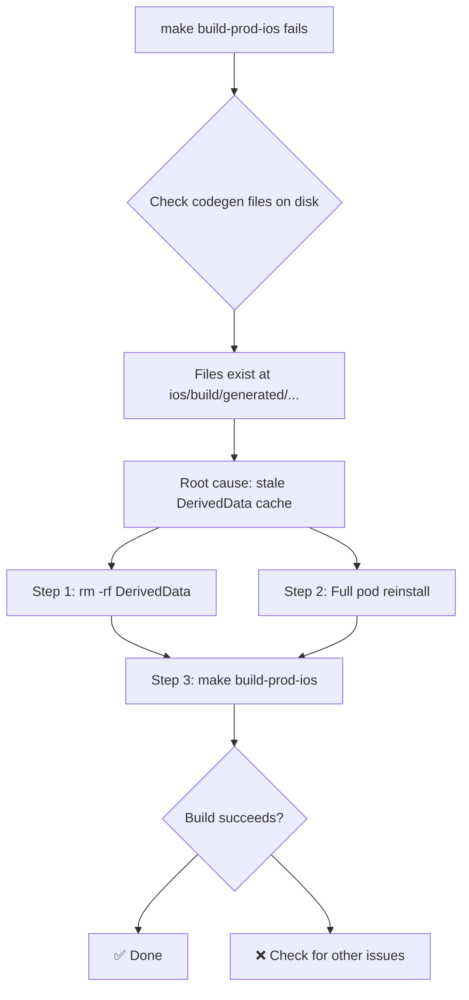

# iOS ReactCodegen Build Fix Plan

## Problem Summary

`make build-prod-ios` fails with **8 compilation errors** in the `ReactCodegen` target (from Pods).

### Error Messages

```
error: Build input file cannot be found: '.../ios/build/generated/ios/ReactCodegen/react/renderer/components/rnscreens/States.cpp'
error: Build input file cannot be found: '.../ios/build/generated/ios/ReactCodegen/rnsvg/rnsvg-generated.mm'
error: Build input file cannot be found: '...' (6 more similar errors)
```

The error says: _"Did you forget to declare this file as an output of a script phase or custom build rule which produces it?"_

### Root Cause

**Stale Xcode DerivedData cache.** The codegen files **do exist on disk** at the correct paths:

- `ios/build/generated/ios/ReactCodegen/rnsvg/rnsvg-generated.mm` ✅ exists
- `ios/build/generated/ios/ReactCodegen/react/renderer/components/rnscreens/States.cpp` ✅ exists
- `ios/build/generated/ios/ReactCodegen/rnworklets/rnworklets-generated.mm` ✅ exists
- (all 8 files confirmed present)

However, Xcode's DerivedData has a cached build graph that doesn't match the current project state. The `ReactCodegen` podspec has a **"Generate Specs" script phase** (at `ios/build/generated/ios/ReactCodegen/ReactCodegen.podspec:88`) that runs `script_phases.sh` to generate codegen files, but:

1. The script phase only declares `${DERIVED_FILE_DIR}/react-codegen.log` as an output — not the individual `.cpp`/`.mm` files
2. Xcode's build system sees the `.cpp`/`.mm` files listed as source files in the target, but doesn't see a script phase that declares them as outputs
3. When DerivedData is stale (from a previous build cycle), the build system fails to recognize these files

This is a known Xcode build system behavior with React Native's codegen, particularly after:

- Running `make clean` (which deletes `ios/build/` and DerivedData partially)
- Moving the project between drives (SSD → internal)
- Running `make purge` or similar cache-clearing operations

## Fix Steps

### Step 1: Clean Xcode DerivedData

```bash
rm -rf ~/Library/Developer/Xcode/DerivedData/FrontendBlogMobile-*
```

This clears Xcode's cached build state so it re-reads the project from disk. The codegen files already exist, so once DerivedData is cleaned, the build system will discover them.

### Step 2: Force Full Pod Reinstall

```bash
cd ios && rm -rf Pods Podfile.lock && pod install && cd ..
```

This:

- Regenerates all Pods xcconfig files with correct absolute paths (fixes any stale `/Volumes/MySSD/` references)
- Re-runs the React Native codegen script during `pod install`
- Regenerates the `ReactCodegen` podspec and its script phases

### Step 3: Rebuild iOS Production Archive

```bash
make build-prod-ios
```

### Step 4: Verify

| Check               | Command / Action                                                                       |
| ------------------- | -------------------------------------------------------------------------------------- |
| DerivedData cleaned | `ls ~/Library/Developer/Xcode/DerivedData/FrontendBlogMobile-*` returns "No such file" |
| Pods reinstalled    | `ls ios/Pods/Pods.xcodeproj` shows the file                                            |
| Codegen files exist | `ls ios/build/generated/ios/ReactCodegen/rnsvg/rnsvg-generated.mm` shows the file      |
| Build succeeds      | `make build-prod-ios` exits with code 0                                                |

## Mermaid Flow



## Rollback

If the fix doesn't work:

1. Run `make doctor` to check for stale SSD paths
2. Check for any `HERMES_V1_ENABLED` define issues in Pods xcconfig files
3. Try `make reset-ios` (which also cleans node_modules)
