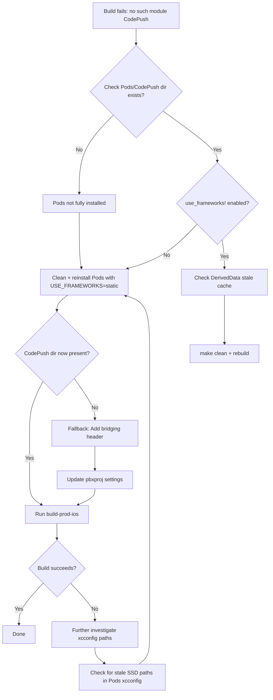

# iOS CodePush Build Failure — Root Cause Analysis & Fix Plan

## 1. Problem Summary

Building a production iOS archive fails with:

```
AppDelegate.swift:6:8: error: no such module 'CodePush'
import CodePush
       ^
```

## 2. Root Cause Analysis

After investigating the project structure, here are the key findings:

### 2.1 CodePush is an Objective-C library, not a Swift module

The [`react-native-code-push`](node_modules/react-native-code-push/) package provides:

- [`CodePush.podspec`](node_modules/react-native-code-push/CodePush.podspec) — declares `source_files = 'ios/CodePush/*.{h,m}'`
- Source files exist at [`node_modules/react-native-code-push/ios/CodePush/`](node_modules/react-native-code-push/ios/CodePush/) (e.g., `CodePush.h`, `CodePush.m`, `CodePushConfig.m`, etc.)

Since CodePush is **Objective-C**, the Swift `import CodePush` syntax at [`AppDelegate.swift:6`](ios/FrontendBlogMobile/AppDelegate.swift:6) requires one of:

1. The pod to be built as a **framework** (via `use_frameworks!`)
2. A **bridging header** that imports `CodePush.h`
3. A **modulemap** for the static library

### 2.2 Podfile uses conditional `use_frameworks!`

The [`Podfile`](ios/Podfile:11-15) has:

```ruby
linkage = ENV['USE_FRAMEWORKS']
if linkage != nil
  use_frameworks! :linkage => linkage.to_sym
end
```

If `USE_FRAMEWORKS` is not set during `pod install`, pods are built as **static libraries**, and `import CodePush` in Swift will fail.

### 2.3 CodePush files missing from `ios/Pods/CodePush/`

The [`ios/Pods/`](ios/Pods/) directory contains:

- `CodePush.podspec.json` in `Local Podspecs/` ✅
- `CodePush/` target support files in `Target Support Files/` ✅
- **NO `CodePush/` source directory** at the top level ❌

While its dependencies (`Base64/`, `JWT/`, `SSZipArchive/`) ARE installed, CodePush itself was not fully copied into the Pods directory. This could be due to:

- An incomplete `pod install` run
- Manual deletion of the directory
- Stale DerivedData cache referencing a prior successful build

### 2.4 Missing Bridging Header

Searching [`ios/`](ios/) for any bridging header or `SWIFT_OBJC_BRIDGING_HEADER` setting returns **no results**. The project has no bridging header that would expose ObjC headers to Swift.

## 3. Fix Options

### Option A: Re-install Pods with `USE_FRAMEWORKS=static` (Recommended)

Set the `USE_FRAMEWORKS` environment variable so CodePush is built as a static framework, making `import CodePush` work in Swift.

**Pros:**

- No code changes needed
- Fixes the missing `ios/Pods/CodePush/` directory issue
- `static` linkage avoids dynamic framework complications

**Steps:**

1. Clear DerivedData
2. Delete `ios/Pods/` and `ios/Podfile.lock`
3. Re-run `pod install` with `USE_FRAMEWORKS=static`

### Option B: Add a Bridging Header

Create `ios/FrontendBlogMobile/FrontendBlogMobile-Bridging-Header.h` with:

```objc
#import <CodePush/CodePush.h>
```

Then update project build settings to reference it.

**Pros:**

- Explicit, standard Swift-ObjC interop pattern
- No dependency on `use_frameworks!` setting

**Cons:**

- Requires modifying `project.pbxproj`
- More manual steps

### Option C: Use `@objc` Import via Objective-C wrapper

Replace the `import CodePush` in `AppDelegate.swift` with an Objective-C helper class that wraps `CodePush.bundleURL()`.

**Pros:**

- Clean separation
- No bridging header needed

**Cons:**

- More code to write
- Unnecessary complexity

## 4. Recommended Fix: Option A (Re-install Pods with USE_FRAMEWORKS)

### Step-by-step Implementation

1. **Clean build artifacts and DerivedData:**

   ```bash
   make clean
   rm -rf ~/Library/Developer/Xcode/DerivedData/FrontendBlogMobile-*
   ```

2. **Remove stale Pods:**

   ```bash
   cd ios && rm -rf Pods Podfile.lock && cd ..
   ```

3. **Re-install Pods with `USE_FRAMEWORKS=static`:**

   ```bash
   cd ios && USE_FRAMEWORKS=static pod install && cd ..
   ```

4. **Verify CodePush pod is installed:**
   - Check `ios/Pods/CodePush/` directory exists
   - Check `ios/Pods/Pods.xcodeproj` includes CodePush target

5. **Build the production archive:**
   ```bash
   make build-prod-ios
   ```
   (or `make build-ios`)

### If Option A fails, fall back to Option B:

1. **Create bridging header** at `ios/FrontendBlogMobile/FrontendBlogMobile-Bridging-Header.h`

2. **Update `project.pbxproj`** to set `SWIFT_OBJC_BRIDGING_HEADER` build setting

3. **Verify build**

## 5. Mermaid Flow



## 6. Files to Modify

| File                                                                                                   | Action                   | Notes                                          |
| ------------------------------------------------------------------------------------------------------ | ------------------------ | ---------------------------------------------- |
| [`ios/Pods/`](ios/Pods/)                                                                               | Delete + reinstall       | Temporary fix for missing CodePush dir         |
| [`ios/Podfile.lock`](ios/Podfile.lock)                                                                 | Delete + regenerate      | Will be regenerated by `pod install`           |
| [`ios/FrontendBlogMobile/FrontendBlogMobile-Bridging-Header.h`](ios/FrontendBlogMobile/)               | **Create** (if fallback) | Only if Option A fails                         |
| [`ios/FrontendBlogMobile.xcodeproj/project.pbxproj`](ios/FrontendBlogMobile.xcodeproj/project.pbxproj) | **Modify** (if fallback) | Add `SWIFT_OBJC_BRIDGING_HEADER` build setting |
