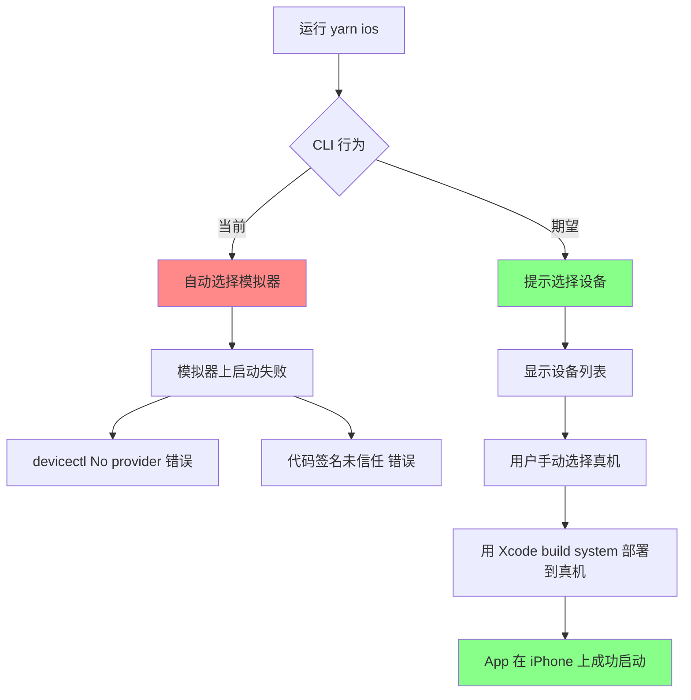

# iOS Launch Error — CLI Auto-Selects Simulator Instead of Prompting Device Selection

## Actual Scenario

| Context | Detail |
|---------|--------|
| Xcode 直接 Build + Run 到真机 | ✅ **成功** |
| 命令行 `yarn ios` 或 `react-native run-ios` | ❌ **失败** |
| 期望行为 | 命令行应**提示选择设备**（模拟器/真机），而不是自动选择 |
| 实际行为 | CLI 自动选择模拟器，然后因签名问题启动失败 |

---

## Error Analysis

### 错误日志中的关键信息

```
error Failed to launch the app on simulator
```

CLI 自动选择了**模拟器**作为目标，但：

1. 模拟器上 bundle ID `org.reactjs.native.example.FrontendBlogMobile` 是默认模板值，Xcode 16+ 对模拟器也有签名校验
2. 模拟器未信任该开发者证书
3. Xcode 16 的 `devicectl` 工具有兼容性问题

### Xcode 能成功的原因

Xcode 直接运行时：
- 自动处理设备选择（你手动选了真机）
- 自动管理签名和 Provisioning Profile
- 使用成熟的 `simctl`/`CoreDevice` API

CLI (`react-native run-ios`) 运行时：
- 没有指定 `--device` 参数，默认选择模拟器
- 在 Xcode 16+ 上使用 `devicectl` 管理设备，出现 `No provider was found`
- 模拟器上的代码签名校验失败

---

## Fix Plan

### Step 1 — 修改 `package.json` 添加真机命令

修改 [`package.json`](package.json:7) 中的 `ios` 脚本，添加交互模式和真机模式：

```jsonc
// scripts section of package.json
"ios": "react-native run-ios",                    // 模拟器（默认）
"ios:device": "react-native run-ios --device",    // 列出设备供选择
"ios:interactive": "react-native run-ios --interactive"  // 交互式选择
```

### Step 2 — 修改 Makefile 添加真机 target

当前 [`Makefile:56-57`](Makefile:56) 只有 `dev-ios`（模拟器），需要添加真机 target：

```makefile
dev-ios: env-dev ## Build & run on iOS Simulator
	yarn ios

dev-ios-device: env-dev ## Build & run on iOS Device (prompt to select)
	yarn ios:device
```

`--device` 不带参数会列出所有可用设备（包括真机和模拟器）供选择。带设备名则直接指定目标。

### Step 2 — 修复 Bundle ID（可选但推荐）

即使你用真机，也建议将 [`PRODUCT_BUNDLE_IDENTIFIER`](ios/FrontendBlogMobile.xcodeproj/project.pbxproj:278) 从默认值改为 `com.tarsier.blog`：

**Debug 配置** (line 278):
```diff
- PRODUCT_BUNDLE_IDENTIFIER = "org.reactjs.native.example.$(PRODUCT_NAME:rfc1034identifier)";
+ PRODUCT_BUNDLE_IDENTIFIER = com.tarsier.blog;
```

**Release 配置** (line 309):
```diff
- PRODUCT_BUNDLE_IDENTIFIER = "org.reactjs.native.example.$(PRODUCT_NAME:rfc1034identifier)";
+ PRODUCT_BUNDLE_IDENTIFIER = com.tarsier.blog;
```

> ⚠️ 注意：修改 Bundle ID 后，Xcode 需要重新生成 Provisioning Profile。因为 Xcode 已经能成功 Build 到真机，所以 Xcode 应该会自动处理。

### Step 3 — 添加 DISPLAY_NAME 构建变量

[`Info.plist`](ios/FrontendBlogMobile/Info.plist:10) 中使用 `$(DISPLAY_NAME)`，但这个变量未在 Xcode 项目中定义。在 [`project.pbxproj`](ios/FrontendBlogMobile.xcodeproj/project.pbxproj) 的 Debug 和 Release 配置中添加：

```diff
  DEVELOPMENT_TEAM = PK28T343BP;
+ DISPLAY_NAME = Tarsier;
```

### Step 4 — 测试验证

执行以下命令验证修复：

```bash
# 交互式选择设备
yarn ios

# 或直接指定真机（替换为你的 iPhone 名称）
yarn ios -- --device "你的iPhone名字"
```

---

## Verification Checklist

| # | Check | How |
|---|-------|-----|
| 1 | CLI 提示选择设备 | 运行 `yarn ios` 后看到设备列表（包含你的 iPhone 和模拟器） |
| 2 | 选择真机后启动成功 | App 在 iPhone 上成功打开 |
| 3 | Bundle ID 已更新（可选） | `grep PRODUCT_BUNDLE_IDENTIFIER ios/FrontendBlogMobile.xcodeproj/project.pbxproj` 显示 `com.tarsier.blog` |
| 4 | DISPLAY_NAME 已添加 | `grep DISPLAY_NAME ios/FrontendBlogMobile.xcodeproj/project.pbxproj` 显示 `Tarsier` |

---

## Mermaid Flow



---

## Files to Modify

| File | Change | Line |
|------|--------|------|
| [`package.json`](package.json:7) | 添加 `ios:device` 和 `ios:interactive` 脚本 | 7 |
| [`Makefile`](Makefile:56) | 添加 `dev-ios-device` target | ~58 |
| [`ios/FrontendBlogMobile.xcodeproj/project.pbxproj`](ios/FrontendBlogMobile.xcodeproj/project.pbxproj) | 修改 `PRODUCT_BUNDLE_IDENTIFIER` (可选但推荐) | 278, 309 |
| [`ios/FrontendBlogMobile.xcodeproj/project.pbxproj`](ios/FrontendBlogMobile.xcodeproj/project.pbxproj) | 添加 `DISPLAY_NAME = Tarsier;` | ~264, ~296 |

---

## 注意

**Xcode 能 Build 成功说明你的开发者证书、Provisioning Profile 和设备注册都是正常的。** 问题只是 CLI 的行为——它自动选了模拟器而不是给你选择设备的机会。修改 `package.json` 中的 `ios` 脚本就能解决。
