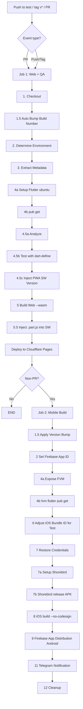
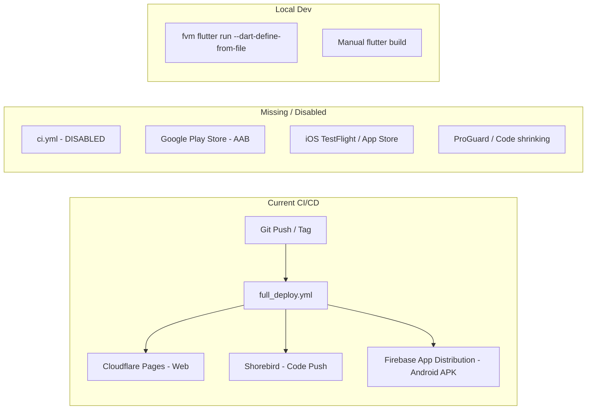
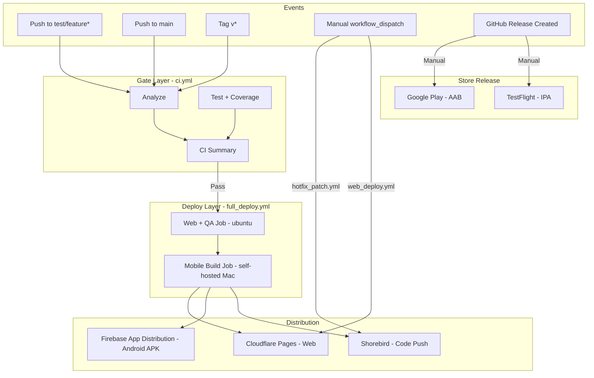
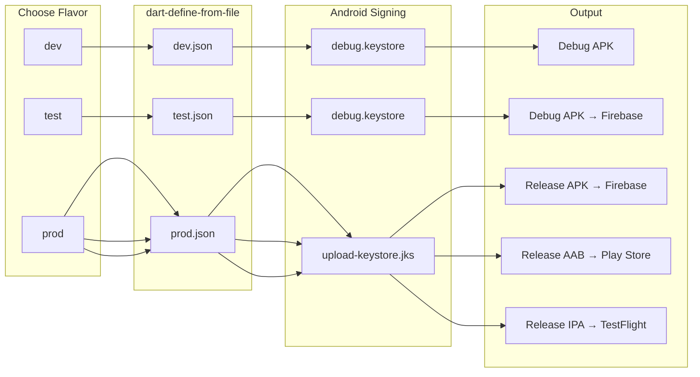

# JoyMini Flutter App — Build Variants & CI/CD Plan

## Overview

This document analyzes the existing [`JoyMini_Flutter_App`](/Users/porter/Developer/JoyMini_Flutter_App) project and provides an actionable plan for:

1. **Build Variants** — how dev/test/prod flavors are configured, packaged, and signed
2. **CI/CD Pipeline** — current architecture, gaps, and improvements

---

## Part 1: Build Variants

### 1.1 Current Flavor System

The project uses [`--dart-define-from-file`](https://flutter.dev/docs/development/tools/flavor) with three JSON config files at [`lib/core/config/env/`](lib/core/config/env):

| Config              | [`dev.json`](/Users/porter/Developer/JoyMini_Flutter_App/lib/core/config/env/dev.json) | [`test.json`](/Users/porter/Developer/JoyMini_Flutter_App/lib/core/config/env/test.json) | [`prod.json`](/Users/porter/Developer/JoyMini_Flutter_App/lib/core/config/env/prod.json) |
| ------------------- | -------------------------------------------------------------------------------------- | ---------------------------------------------------------------------------------------- | ---------------------------------------------------------------------------------------- |
| **FLAVOR**          | `dev`                                                                                  | `dev` ⚠️ BUG                                                                             | `prod`                                                                                   |
| **API_BASE_URL**    | `dev-api.joyminis.com`                                                                 | `api.joyminis.com`                                                                       | `api.joyminis.com`                                                                       |
| **APP_ID_SUFFIX**   | `.test`                                                                                | `.test`                                                                                  | _(empty)_                                                                                |
| **APP_NAME_SUFFIX** | `(Test)`                                                                               | `(Test)`                                                                                 | _(empty)_                                                                                |
| **LOG_HTTP**        | `true`                                                                                 | `true`                                                                                   | `false`                                                                                  |
| **Intended use**    | Local development                                                                      | Staging/QA                                                                               | Production                                                                               |

**Important:** The [`test.json`](/Users/porter/Developer/JoyMini_Flutter_App/lib/core/config/env/test.json) has `"FLAVOR": "dev"` — this appears to be a copy-paste bug. It should be `"FLAVOR": "test"`.

### 1.2 Android Package Names & App Names

Defined in [`android/app/build.gradle.kts`](/Users/porter/Developer/JoyMini_Flutter_App/android/app/build.gradle.kts:56):

| Environment | Android Application ID     | Android Display Name | iOS Bundle ID              |
| ----------- | -------------------------- | -------------------- | -------------------------- |
| **dev**     | `com.porter.joyminis.test` | `JoyMini(Test)`      | `com.porter.joyminis.test` |
| **test**    | `com.porter.joyminis.test` | `JoyMini(Test)`      | `com.porter.joyminis.test` |
| **prod**    | `com.porter.joyminis`      | `JoyMini`            | `com.porter.joyminis`      |

The app ID is dynamically constructed in [`build.gradle.kts:56`](/Users/porter/Developer/JoyMini_Flutter_App/android/app/build.gradle.kts:56):

```kotlin
applicationId = "com.porter.joyminis$appIdSuffix"
```

The app name is dynamically set via [`resValue`](https://developer.android.com/studio/write/resource-values) at line 59:

```kotlin
resValue("string", "app_name", "JoyMini$appNameSuffix")
```

### 1.3 Android Signing Configs

Defined in [`android/app/build.gradle.kts:76-92`](/Users/porter/Developer/JoyMini_Flutter_App/android/app/build.gradle.kts:76):

| Signing Config | Source                                                                                                                                   | Used For                                             |
| -------------- | ---------------------------------------------------------------------------------------------------------------------------------------- | ---------------------------------------------------- |
| **release**    | [`android/key.properties`](/Users/porter/Developer/JoyMini_Flutter_App/android/key.properties) (CI-decoded from secret)                  | Prod CI builds, manual `flutter build apk --release` |
| **debug**      | [`android/app/debug.keystore`](/Users/porter/Developer/JoyMini_Flutter_App/android/app/debug.keystore) with `android`/`android` password | Dev local runs, Test CI builds                       |

The template file [`key.properties.demo`](/Users/porter/Developer/JoyMini_Flutter_App/android/key.properties.demo) shows the expected format:

```properties
storePassword=xxxx
keyPassword=xxxxx
keyAlias=xxxxx
storeFile=xxxxxx
```

### 1.4 Current Build Commands (Local Development)

From [`tool/dev.sh`](/Users/porter/Developer/JoyMini_Flutter_App/tool/dev.sh):

```bash
fvm flutter run --dart-define-from-file=lib/core/config/env/dev.json
```

For test/prod locally:

```bash
# Test
fvm flutter run --dart-define-from-file=lib/core/config/env/test.json

# Prod (needs key.properties locally)
fvm flutter build apk --release --dart-define-from-file=lib/core/config/env/prod.json
```

**`key.properties`** is gitignored in `.gitignore` and manually created from [`key.properties.demo`](/Users/porter/Developer/JoyMini_Flutter_App/android/key.properties.demo) with real credentials.

---

## Part 2: CI/CD Architecture

### 2.1 Current Workflows

All workflows are in [`.github/workflows/`](/Users/porter/Developer/JoyMini_Flutter_App/.github/workflows/):

| Workflow                                                                                                   | Status                           | Triggers                                                  | Jobs                                               | Output                                                    |
| ---------------------------------------------------------------------------------------------------------- | -------------------------------- | --------------------------------------------------------- | -------------------------------------------------- | --------------------------------------------------------- |
| [`full_deploy.yml`](/Users/porter/Developer/JoyMini_Flutter_App/.github/workflows/full_deploy.yml)         | **Active**                       | push to `test`, tag `v*`, PR to `main`/`test`, manual     | 1. Web + QA (ubuntu) → 2. Mobile (self-hosted Mac) | Web: Cloudflare Pages; Android: Firebase App Distribution |
| [`ci.yml`](/Users/porter/Developer/JoyMini_Flutter_App/.github/workflows/ci.yml)                           | **DISABLED**                     | only `workflow_dispatch` (push/PR triggers commented out) | Analyze → Test → Summary                           | GitHub check status                                       |
| [`web_deploy.yml`](/Users/porter/Developer/JoyMini_Flutter_App/.github/workflows/web_deploy.yml)           | **Active**                       | Manual (`workflow_dispatch`)                              | Build & deploy web                                 | Cloudflare Pages                                          |
| [`hotfix_patch.yml`](/Users/porter/Developer/JoyMini_Flutter_App/.github/workflows/hotfix_patch.yml)       | **Active**                       | Manual (`workflow_dispatch`)                              | Shorebird patch                                    | Code push to active apps                                  |
| [`android_deploy.yml1`](/Users/porter/Developer/JoyMini_Flutter_App/.github/workflows/android_deploy.yml1) | **DISABLED** (`.yml1` extension) | Not active                                                | Build APK + upload artifact                        | APK artifact                                              |
| [`web_rollback.yml`](/Users/porter/Developer/JoyMini_Flutter_App/.github/workflows/web_rollback.yml)       | Not reviewed                     | N/A                                                       | N/A                                                | N/A                                                       |

### 2.2 `full_deploy.yml` — Main Pipeline Flow



**Environment Detection Logic** ([`full_deploy.yml:63-89`](/Users/porter/Developer/JoyMini_Flutter_App/.github/workflows/full_deploy.yml:63)):

| Condition                             | Env File    | is_prod | CF Project         | Firebase App ID                |
| ------------------------------------- | ----------- | ------- | ------------------ | ------------------------------ |
| Pull Request                          | `test.json` | `false` | `joymini-web-test` | `FIREBASE_ANDROID_APP_ID_TEST` |
| Push to `main` or tag `v*`            | `prod.json` | `true`  | `joymini-web`      | `FIREBASE_ANDROID_APP_ID_PROD` |
| Push to other branches (e.g., `test`) | `test.json` | `false` | `joymini-web-test` | `FIREBASE_ANDROID_APP_ID_TEST` |

**Credentials Handling** ([`full_deploy.yml:223-247`](/Users/porter/Developer/JoyMini_Flutter_App/.github/workflows/full_deploy.yml:223)):

- **Prod**: Decodes `ANDROID_KEYSTORE_BASE64` → `upload-keystore.jks`, writes `key.properties` from secrets
- **Test**: Decodes `DEBUG_KEYSTORE_BASE64` → `debug.keystore`, writes debug credentials to `key.properties`

### 2.3 CI/CD Distribution Targets



---

## Part 3: Issues & Gaps Found

### 🔴 Critical Issues

| #   | Issue                                                                                                            | Location                                                                                                     | Impact                                                       |
| --- | ---------------------------------------------------------------------------------------------------------------- | ------------------------------------------------------------------------------------------------------------ | ------------------------------------------------------------ |
| 1   | [`test.json`](/Users/porter/Developer/JoyMini_Flutter_App/lib/core/config/env/test.json:2) has `"FLAVOR": "dev"` | [`lib/core/config/env/test.json`](/Users/porter/Developer/JoyMini_Flutter_App/lib/core/config/env/test.json) | Test environment incorrectly identifies as `dev` in app code |
| 2   | [`ci.yml`](/Users/porter/Developer/JoyMini_Flutter_App/.github/workflows/ci.yml) triggers disabled               | [`.github/workflows/ci.yml`](/Users/porter/Developer/JoyMini_Flutter_App/.github/workflows/ci.yml)           | No standalone CI gate for PRs before deploy                  |
| 3   | ProGuard disabled in release                                                                                     | [`build.gradle.kts:97-98`](/Users/porter/Developer/JoyMini_Flutter_App/android/app/build.gradle.kts:97)      | APK size larger, code not obfuscated                         |

### 🟡 Improvement Opportunities

| #   | Issue                                       | Location                                                                                                   | Impact                                                                                                   |
| --- | ------------------------------------------- | ---------------------------------------------------------------------------------------------------------- | -------------------------------------------------------------------------------------------------------- |
| 4   | iOS builds with `--no-codesign`             | [`full_deploy.yml:269`](/Users/porter/Developer/JoyMini_Flutter_App/.github/workflows/full_deploy.yml:269) | iOS not distributable — compile-only verification                                                        |
| 5   | No Google Play Store pipeline               | Not present                                                                                                | Cannot submit AAB to Play Store via CI                                                                   |
| 6   | `android_deploy.yml1` has `.yml1` extension | [`.github/workflows/`](/Users/porter/Developer/JoyMini_Flutter_App/.github/workflows/)                     | Dead file, should be cleaned up                                                                          |
| 7   | No local Makefile for build shortcuts       | Not present                                                                                                | Developer must remember fvm/flutter commands                                                             |
| 8   | Shorebird builds APK not AAB                | [`full_deploy.yml:260`](/Users/porter/Developer/JoyMini_Flutter_App/.github/workflows/full_deploy.yml:260) | Shorebird only supports APK (`--artifact apk`) — this is correct for code push, but Play Store needs AAB |

### 🟢 Already Working Well

- Robust flavor system with dynamic `applicationId` and `app_name` via dart-define
- Firebase App Distribution for both test and prod Android APKs
- Auto version bump via `github.run_number`
- Comprehensive cleanup in CI (credentials removed after build)
- Telegram notifications with QR code for install
- Shorebird integrated for hot patches (code-only updates)
- FVM (Flutter Version Manager) for reproducible Flutter SDK versions

---

## Part 4: Recommended Actions (Todo List)

### Phase A: Fix Existing Issues

- [ ] **A1**: Fix [`test.json`](/Users/porter/Developer/JoyMini_Flutter_App/lib/core/config/env/test.json) — change `"FLAVOR": "dev"` to `"FLAVOR": "test"`
- [ ] **A2**: Re-enable [`ci.yml`](/Users/porter/Developer/JoyMini_Flutter_App/.github/workflows/ci.yml) — uncomment push/PR triggers so every commit runs analyze + test before deploy
- [ ] **A3**: Enable ProGuard in release builds — set `isMinifyEnabled = true` and `isShrinkResources = true` in [`build.gradle.kts:97-98`](/Users/porter/Developer/JoyMini_Flutter_App/android/app/build.gradle.kts:97), review [`proguard-rules.pro`](/Users/porter/Developer/JoyMini_Flutter_App/android/app/proguard-rules.pro) for any missing keep rules
- [ ] **A4**: Remove dead file [`android_deploy.yml1`](/Users/porter/Developer/JoyMini_Flutter_App/.github/workflows/android_deploy.yml1) (delete or rename properly if needed)

### Phase B: Add Missing Capabilities

- [ ] **B1**: Create Makefile in JoyMini root with common commands:
  - `make dev` → `fvm flutter run --dart-define-from-file=lib/core/config/env/dev.json`
  - `make test` → `fvm flutter run --dart-define-from-file=lib/core/config/env/test.json`
  - `make build-android-prod` → `fvm flutter build apk --release --dart-define-from-file=lib/core/config/env/prod.json`
  - `make build-aab` → `fvm flutter build appbundle --release --dart-define-from-file=lib/core/config/env/prod.json`
  - `make analyze` → `fvm flutter analyze`
  - `make test` → `fvm flutter test`
  - `make clean` → `fvm flutter clean`
- [ ] **B2**: Add Google Play Store release workflow (new `.github/workflows/playstore-release.yml`):
  - Triggered by manually creating a GitHub Release or tagging `v*.*.*-release`
  - Builds AAB (not APK) with `flutter build appbundle --release`
  - Signs with upload keystore
  - Uploads AAB to Google Play Console via [`google-play-github-uploader`](https://github.com/r0adkll/upload-google-play) or manual download
  - Note: Google Play publishing requires a Google Play Developer API setup (service account)
- [ ] **B3**: Set up iOS signing for TestFlight distribution:
  - Install Apple Distribution certificate in self-hosted runner's Keychain
  - Configure App Store Connect API Key in GitHub secrets
  - Optionally enable `altool` upload in CI
- [ ] **B4**: Add AAB to Firebase Distribution (optional, for testers who want bundle format)

### Phase C: Enhance Developer Experience

- [ ] **C1**: Add `.fvmrc` validation — ensure `.fvmrc` exists and matches Flutter SDK constraint in [`pubspec.yaml`](/Users/porter/Developer/JoyMini_Flutter_App/pubspec.yaml:22)
- [ ] **C2**: Document local development setup in README (if not already present)
- [ ] **C3**: Consider adding [`fastlane`](https://fastlane.tools) for mobile build automation if more platforms are needed

---

## Part 5: Architecture Diagrams

### 5.1 Proposed Full CI/CD Pipeline



### 5.2 Build Variants Decision Flow



---

## Part 6: Execution Order

The recommended order of execution, based on priority:

1. **Fix bugs first** — A1 (FLAVOR in test.json), A2 (re-enable CI), A3 (ProGuard), A4 (cleanup dead file)
2. **Add dev tooling** — B1 (Makefile) for developer convenience
3. **Extend CI/CD** — B2 (Play Store AAB workflow), B3 (iOS signing), B4 (optional AAB distribution)
4. **Polish** — C1-C3 documentation and automation improvements

---

## Part 7: Questions for Discussion

1. **Play Store publishing**: Do you want CI to automatically upload AAB to Google Play Console, or manually download and upload?
2. **iOS signing**: Do you have an Apple Developer account and distribution certificate? This is needed to enable iOS distribution.
3. **ProGuard obfuscation**: Any libraries that might break with ProGuard enabled? The current [`proguard-rules.pro`](/Users/porter/Developer/JoyMini_Flutter_App/android/app/proguard-rules.pro) already has Amplify rules.
4. **Branch strategy**: Current CI pattern is `push to test` → deploy test, `push to main` → deploy prod. Is this the intended workflow?
