# Language Switch Refetch Fix Plan (v2)

## Problem

When the user switches the app language (e.g., English → Chinese), the article list on the home page does NOT automatically re-fetch to display content in the new language. This affects **both iOS and Android**.

## Root Cause Analysis

### Evidence

1. **TabBar labels DO update** on language switch — these use `useTranslation()` from `react-i18next` (proven working from previous fix)
2. **Article list does NOT update** on language switch — this uses `useCurrentLanguage()` which is an alias for `useAppLanguage()` — a custom hook using `useState` + direct `i18n.on('languageChanged')` subscription

### Why `useAppLanguage()` fails

The custom hook in [`src/lib/i18n/index.ts:137-151`](src/lib/i18n/index.ts:137) uses the older pattern:

```tsx
const [lang, setLang] = useState<string>(i18n.language || defaultLocale);
useEffect(() => {
  const handleLanguageChanged = (lng: string) => setLang(lng);
  i18n.on('languageChanged', handleLanguageChanged);
  return () => i18n.off('languageChanged', handleLanguageChanged);
}, []);
return lang;
```

`react-i18next`'s `useTranslation()` (v14+) uses React 18's official [`useSyncExternalStore`](https://react.dev/reference/react/useSyncExternalStore), which is more reliable for external store subscriptions than `useState` + `useEffect`. This explains why TabBar labels work but the article list doesn't.

### Secondary Issues

1. **HomeScreen pagination effect** ([`src/screens/HomeScreen.tsx:216-222`](src/screens/HomeScreen.tsx:216)) has an identity check that prevents state updates when the server returns the same article IDs with translated content:

   ```tsx
   if (
     prev.length === articlesData.items.length &&
     prev[0]?.id === articlesData.items[0]?.id
   ) {
     return prev; // Skips update! Returns stale data.
   }
   ```

2. **Lang-change effect resets allArticles** ([`src/screens/HomeScreen.tsx:154`](src/screens/HomeScreen.tsx:154)) via `setAllArticles([])`, which causes an empty-list flash during re-fetch. Better to keep old data until new data arrives.

3. **ArchiveScreen has NO lang-change effect at all** — relies solely on RTK Query param detection.

## Fix Strategy

### Primary Fix: Delegate `useAppLanguage()` to `useTranslation()`

Instead of modifying all 10 components individually, fix the `useAppLanguage()` hook itself to delegate to `useTranslation()`:

```tsx
// BEFORE (src/lib/i18n/index.ts:137-151)
export function useAppLanguage(): string {
  const [lang, setLang] = useState<string>(i18n.language || defaultLocale);
  useEffect(() => {
    const handleLanguageChanged = (lng: string) => setLang(lng);
    i18n.on('languageChanged', handleLanguageChanged);
    return () => i18n.off('languageChanged', handleLanguageChanged);
  }, []);
  return lang;
}

// AFTER
export function useAppLanguage(): string {
  const { i18n: i18nInstance } = useTranslation();
  return i18nInstance.language;
}
```

This is a **single-file change** that fixes ALL 10 components simultaneously:

- [`HomeScreen.tsx`](src/screens/HomeScreen.tsx:145)
- [`ArticleListScreen.tsx`](src/screens/ArticleListScreen.tsx:53)
- [`ArchiveScreen.tsx`](src/screens/ArchiveScreen.tsx:55)
- [`SearchScreen.tsx`](src/screens/SearchScreen.tsx:48)
- [`CategoryListScreen.tsx`](src/screens/CategoryListScreen.tsx:39)
- [`TagListScreen.tsx`](src/screens/TagListScreen.tsx:45)
- [`TagArticlesScreen.tsx`](src/screens/TagArticlesScreen.tsx:42)
- [`CategoryArticlesScreen.tsx`](src/screens/CategoryArticlesScreen.tsx:43)
- [`ArticleDetailScreen.tsx`](src/screens/ArticleDetailScreen.tsx:81)
- [`CategoryFilter.tsx`](src/components/blog/CategoryFilter.tsx:71)

### Secondary Fix 1: Add `refetch()` to lang-change effects

Add explicit `refetch()` call as a safety net in lang-change effects so re-fetch is guaranteed even if RTK Query doesn't detect the param change.

Files:

- [`HomeScreen.tsx:150-157`](src/screens/HomeScreen.tsx:150) — Add `refetch()`, remove `setAllArticles([])`
- [`ArticleListScreen.tsx:91-95`](src/screens/ArticleListScreen.tsx:91) — Add `refetch()`
- [`CategoryArticlesScreen.tsx:47-53`](src/screens/CategoryArticlesScreen.tsx:47) — Add `refetch()`, remove `setAllArticles([])`
- [`ArchiveScreen.tsx`](src/screens/ArchiveScreen.tsx) — Add new lang-change `useEffect` with `refetch()`
- [`CategoryListScreen.tsx`](src/screens/CategoryListScreen.tsx) — Add new lang-change `useEffect` with `refetch()`
- [`TagListScreen.tsx`](src/screens/TagListScreen.tsx) — Add new lang-change `useEffect` with `refetch()`
- [`TagArticlesScreen.tsx`](src/screens/TagArticlesScreen.tsx) — Add new lang-change `useEffect` with `refetch()`
- [`SearchScreen.tsx`](src/screens/SearchScreen.tsx) — Add new lang-change `useEffect` with `refetch()`
- [`ArticleDetailScreen.tsx`](src/screens/ArticleDetailScreen.tsx) — Add new lang-change `useEffect` with `refetch()`
- [`CategoryFilter.tsx`](src/components/blog/CategoryFilter.tsx) — Add new lang-change `useEffect` with `refetch()`

### Secondary Fix 2: Remove identity check in HomeScreen pagination

Remove the stale identity check at [`src/screens/HomeScreen.tsx:216-222`](src/screens/HomeScreen.tsx:216):

```tsx
// BEFORE
setAllArticles(prev => {
  if (
    prev.length === articlesData.items.length &&
    prev[0]?.id === articlesData.items[0]?.id
  ) {
    return prev; // PROBLEM: Skips update when server returns same IDs
  }
  return articlesData.items;
});

// AFTER
setAllArticles(_prev => articlesData.items);
```

### Secondary Fix 3: Don't reset `allArticles` in lang-change effect

Remove `setAllArticles([])` from lang-change effects to prevent empty-list flash:

```tsx
// BEFORE (HomeScreen.tsx:150-157)
useEffect(() => {
  if (prevLangRef.current !== lang) {
    prevLangRef.current = lang;
    setPage(1);
    setAllArticles([]); // ← Causes empty flash
    setSelectedCategoryId(null);
  }
}, [lang]);

// AFTER
useEffect(() => {
  if (prevLangRef.current !== lang) {
    prevLangRef.current = lang;
    setPage(1);
    setSelectedCategoryId(null);
    refetch();
  }
}, [lang]);
```

## Files to Modify

### Primary (1 file)

| File                                                 | Change                                            |
| ---------------------------------------------------- | ------------------------------------------------- |
| [`src/lib/i18n/index.ts`](src/lib/i18n/index.ts:137) | Delegate `useAppLanguage()` to `useTranslation()` |

### Secondary — Add `refetch()` safety net (10 files)

| File                                                                                        | Change                                       |
| ------------------------------------------------------------------------------------------- | -------------------------------------------- |
| [`src/screens/HomeScreen.tsx:150-157`](src/screens/HomeScreen.tsx:150)                      | Add `refetch()`, remove `setAllArticles([])` |
| [`src/screens/HomeScreen.tsx:216-222`](src/screens/HomeScreen.tsx:216)                      | Remove identity check in pagination effect   |
| [`src/screens/ArticleListScreen.tsx:91-95`](src/screens/ArticleListScreen.tsx:91)           | Add `refetch()` to lang reset effect         |
| [`src/screens/CategoryArticlesScreen.tsx:47-53`](src/screens/CategoryArticlesScreen.tsx:47) | Add `refetch()`, remove `setAllArticles([])` |
| [`src/screens/ArchiveScreen.tsx`](src/screens/ArchiveScreen.tsx)                            | Add new lang-change effect with `refetch()`  |
| [`src/screens/CategoryListScreen.tsx`](src/screens/CategoryListScreen.tsx)                  | Add new lang-change effect with `refetch()`  |
| [`src/screens/TagListScreen.tsx`](src/screens/TagListScreen.tsx)                            | Add new lang-change effect with `refetch()`  |
| [`src/screens/TagArticlesScreen.tsx`](src/screens/TagArticlesScreen.tsx)                    | Add new lang-change effect with `refetch()`  |
| [`src/screens/SearchScreen.tsx`](src/screens/SearchScreen.tsx)                              | Add new lang-change effect with `refetch()`  |
| [`src/screens/ArticleDetailScreen.tsx`](src/screens/ArticleDetailScreen.tsx)                | Add new lang-change effect with `refetch()`  |
| [`src/components/blog/CategoryFilter.tsx`](src/components/blog/CategoryFilter.tsx)          | Add new lang-change effect with `refetch()`  |

## Data Flow After Fix

```mermaid
flowchart LR
    A[User switches language] --> B[LanguageSwitcher]
    B --> C[i18n.changeLanguage zh]
    C --> D[useTranslation triggers re-render]
    D --> E[useAppLanguage returns new lang]
    E --> F[queryParams includes new lang]
    F --> G[RTK Query detects params change]
    G --> H[Re-fetch with new lang param]
    G --> I[refetch safety net fires]
    H --> J[Server returns translated articles]
    I --> J
    J --> K[articlesData updates]
    K --> L[displayArticles shows new data]
    L --> M[UI updates - user sees translated content]
```



## Execution Order

1. **Fix `useAppLanguage()` in i18n/index.ts** — single change that fixes all 10 components
2. **TypeScript verification** — ensure zero compilation errors
3. **One-by-one add `refetch()` safety nets** — start with HomeScreen, then propagate to all screens
4. **TypeScript verification** — ensure zero compilation errors after all changes
5. **Test on both platforms** — verify language switch triggers re-fetch

## Risk Assessment

| Risk                                              | Likelihood | Mitigation                                                                      |
| ------------------------------------------------- | ---------- | ------------------------------------------------------------------------------- |
| Circular dependency in i18n/index.ts              | Low        | `useTranslation()` is a hook called at runtime, not module init                 |
| TypeScript errors from removed imports            | Low        | Will verify with `npx tsc --noEmit`                                             |
| Double re-fetch (RTK param detection + refetch()) | Medium     | The `refetch()` call is a safety net; RTK Query deduplicates in-flight requests |
| Empty list flash during re-fetch                  | Low        | Removed `setAllArticles([])` — old data shown until new data arrives            |
