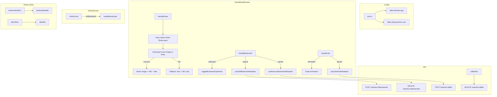

# Plan: Connect Like / Bookmark / Share to API

## Current State Analysis

### 1. Bookmark (收藏) — Partially Connected

| Location | Status | Details |
|----------|--------|---------|
| [`ArticleDetailScreen.tsx:126`](../src/screens/ArticleDetailScreen.tsx:126) | ⚠️ Local only | `handleBookmark` calls `toggleBookmarkOptimistic` (Redux) which updates local state + MMKV cache. Has a `// TODO: Call API to persist bookmark` comment. |
| [`HomeScreen.tsx:361`](../src/screens/HomeScreen.tsx:361) | ❌ Not wired | `ArticleCard` rendered without `onBookmark` prop, so bookmark star icon is not even visible on HomeScreen cards. |
| [`bookmarks.ts`](../src/api/endpoints/bookmarks.ts:38) | ✅ Exists | RTK Query `addBookmark` / `removeBookmark` mutation endpoints exist but not used on these screens. |

### 2. Like (点赞) — Not Connected at All

| Location | Status | Details |
|----------|--------|---------|
| [`ArticleDetailScreen.tsx:133`](../src/screens/ArticleDetailScreen.tsx:133) | ❌ Animation only | `handleLike` only runs a local scale-bounce animation. No API call. |
| API Endpoints | ❌ Missing | No like/unlike API endpoint defined anywhere in the codebase. |

### 3. Share (分享) — Implemented but Wrong URL + No Image

| Location | Status | Details |
|----------|--------|---------|
| [`ArticleDetailScreen.tsx:148`](../src/screens/ArticleDetailScreen.tsx:148) | ⚠️ Wrong domain | Uses `https://tarsierlabs.com/blog/${slug}` — incorrect domain. |
| Share Image | ❌ Not supported | RN built-in `Share.share()` cannot attach images; need `react-native-share`. |

---

## Action Items

### Task 0: Add WEB_URL to env config (统一管理网站域名)

**Problem:** `https://tarsier.app` is hardcoded in multiple places.

**Changes in [`src/lib/env.ts`](../src/lib/env.ts):**
1. Add `WEB_URL: string` to the `EnvConfig` interface
2. Set `DEV_CONFIG.WEB_URL = 'https://dev.tarsier.app'` (or dev equivalent)
3. Set `PROD_CONFIG.WEB_URL = 'https://tarsier.app'`
4. Export `env.WEB_URL`

**Update consumers:**
- [`src/navigation/RootNavigator.tsx:250`](../src/navigation/RootNavigator.tsx:250): Replace hardcoded `'https://tarsier.app'` with `env.WEB_URL`
- [`src/screens/ArticleDetailScreen.tsx:154`](../src/screens/ArticleDetailScreen.tsx:154): Use `env.WEB_URL + '/article/' + article.slug`

### Task 1: Fix Share URL

**Changes in [`ArticleDetailScreen.tsx:148`](../src/screens/ArticleDetailScreen.tsx:148):**
- Use `env.WEB_URL` + `/article/${article.slug}` instead of hardcoded domain

### Task 2: Connect Bookmark API in ArticleDetailScreen

**Changes in [`ArticleDetailScreen.tsx`](../src/screens/ArticleDetailScreen.tsx):**
1. Import `useAddBookmarkMutation`, `useRemoveBookmarkMutation` from [`bookmarks.ts`](../src/api/endpoints/bookmarks.ts)
2. Modify `handleBookmark`:
   - Keep optimistic `toggleBookmarkOptimistic` dispatch for instant UI feedback
   - Fire RTK Query mutation (`addBookmark` or `removeBookmark`) to persist to server

### Task 3: Wire Bookmark Button on HomeScreen ArticleCards

**Changes in [`HomeScreen.tsx`](../src/screens/HomeScreen.tsx):**
1. Add `bookmarkedIds` selector from Redux store
2. Import `toggleBookmarkOptimistic`, `useAddBookmarkMutation`, `useRemoveBookmarkMutation`
3. Create `handleBookmark` callback
4. Pass `onBookmark` and `isBookmarked` to `ArticleCard`

### Task 4: Create Like API Endpoint + Redux Slice

**New files:**
- [`src/api/endpoints/likes.ts`](../src/api/endpoints/likes.ts): RTK Query mutations
  - `likeArticle`: `POST /api/v1/frontend/blog/articles/:id/like`
  - `unlikeArticle`: `DELETE /api/v1/frontend/blog/articles/:id/like`
- [`src/store/slices/likesSlice.ts`](../src/store/slices/likesSlice.ts): Redux slice with
  - `likedIds: Record<string, boolean>` state
  - Optimistic toggle + MMKV cache

### Task 5: Connect Like Button in ArticleDetailScreen

**Changes in [`ArticleDetailScreen.tsx`](../src/screens/ArticleDetailScreen.tsx):**
1. Import like mutation + Redux actions
2. Add `isLiked` state synced from Redux `likedIds`
3. Modify `handleLike` to call like/unlike API mutation (keep animation)

### Task 6: Integrate react-native-share for Image Attachment (分享图片/Logo)

**Why:** RN built-in `Share.share()` cannot attach images. To share article cover or app logo, need `react-native-share`.

**1. Install dependency:**
```bash
yarn add react-native-share
cd ios && pod install
```

**2. Create [`src/lib/utils/share.ts`](../src/lib/utils/share.ts):**
- Download article cover image to temp cache directory using `fetch` + RNFS or similar
- Fallback to app logo if no cover image
- Call `react-native-share`'s `Share.open()` with image file + URL + title

**3. Replace [`ArticleDetailScreen.tsx:148`](../src/screens/ArticleDetailScreen.tsx:148) `handleShare`:**
- Use `react-native-share` instead of RN `Share`
- Download cover image → share with image + URL + title
- Fallback to text+URL only if download fails

---

## Architecture



## Priority Order

1. **Task 0** — Add `WEB_URL` to env config + update consumers
2. **Task 1** — Fix share URL
3. **Task 2** — Connect bookmark API in ArticleDetailScreen
4. **Task 3** — Wire bookmark button on HomeScreen
5. **Task 4 + 5** — Create like API + connect in ArticleDetailScreen
6. **Task 6** — Integrate `react-native-share` for image attachment
