# Mobile Performance Remediation Plan

> **Adapted from the web blog performance plan for the React Native mobile app (`frontend-blog-mobile`)**

## Overview

This plan addresses performance issues in the React Native mobile app, derived from the web blog's Lighthouse/PageSpeed Insights audit findings but adapted for mobile-specific concerns (bundle size, image optimization, startup time, accessibility, scroll performance).

Each item links to exact source files and provides a clear fix strategy.

---

## P0 — Immediate Fixes (High Impact, Low Risk)

### P0-A: Resize Logo PNG to Actual Display Size

**Issue:** [`src/components/layout/Header.tsx:124-127`](../src/components/layout/Header.tsx:124) uses `require('@assets/logo.png')` displayed at **28×28** px via the `logo` style at [`Header.tsx:246-248`](../src/components/layout/Header.tsx:246). Need to verify actual asset dimensions vs display size.

**Action:**

1. Check actual dimensions of [`assets/logo.png`](../assets/logo.png) (run `file assets/logo.png && sips -g pixelWidth -g pixelHeight assets/logo.png`)
2. If oversized (e.g., > 64×64), resize to 56×56 (2x for Retina at 28×28 display) using `sips -z 56 56 assets/logo.png --out assets/logo-small.png`
3. Update reference in [`Header.tsx:124-127`](../src/components/layout/Header.tsx:124) to use the smaller asset, or replace in-place

**Also check:** [`assets/bootsplash/logo.png`](../assets/bootsplash/logo.png) and Retina variants (`logo@2x.png`, `logo@3x.png`, `logo@4x.png`) — these are for the native splash screen and may need separate optimization.

**Files:**

- [`src/components/layout/Header.tsx:124-127`](../src/components/layout/Header.tsx:124) — Image source reference
- [`src/components/layout/Header.tsx:246-248`](../src/components/layout/Header.tsx:246) — Logo style (28×28)
- [`assets/logo.png`](../assets/logo.png) — Logo asset to potentially replace

---

### P0-B: Optimize Default Image Fetch Width for Mobile Viewports

**Issue:** [`AppImage.tsx:105`](../src/components/core/AppImage.tsx:105) hardcodes `imageWidth = 640` and [`image.ts:21`](../src/lib/utils/image.ts:21) defines `DEFAULT_WIDTH = 640`. On a typical phone viewport (375-430px), article cards occupy ~90vw = 337-387px. Fetching 640px images means ~1.5-1.8x more pixels than needed, consuming bandwidth and slowing LCP.

**Action:** Reduce the default image width to better match mobile viewports.

```diff
// src/lib/utils/image.ts:21
- const DEFAULT_WIDTH = 640;
+ const DEFAULT_WIDTH = 480;
```

Also update the default in AppImage to use a smarter value based on `useWindowDimensions` or pass it explicitly:

```diff
// src/components/core/AppImage.tsx:105
- imageWidth = 640,
+ imageWidth = 480,
```

**Better alternative:** Make AppImage aware of screen width via `useWindowDimensions` and set `imageWidth` to `Math.round(screenWidth * 0.95)` for article cards. But this would require making the component less pure — start with reducing the constant.

**Files:**

- [`src/lib/utils/image.ts:21`](../src/lib/utils/image.ts:21) — `DEFAULT_WIDTH` constant
- [`src/components/core/AppImage.tsx:105`](../src/components/core/AppImage.tsx:105) — Default `imageWidth` prop

---

### P0-C: Add Accessibility Roles to Article Card Titles

**Issue:** [`ArticleCard.tsx:191-201`](../src/components/blog/ArticleCard.tsx:191) renders article titles as plain `<Text>` without `accessibilityRole="header"`. Screen reader users cannot navigate between articles by heading level. The page has a header (HomeScreen Header at [`Header.tsx:161`](../src/components/layout/Header.tsx:161) with `accessibilityRole="header"`) but article cards are not semantically linked.

**Action:** Add `accessibilityRole="header"` to article card title Text element.

```diff
// src/components/blog/ArticleCard.tsx:191-201
- <Text
+ <Text
+   accessibilityRole="header"
    style={[
      styles.title,
      { color: colors.textPrimary ?? colors.text },
      compact && styles.compactTitle,
      featured && styles.featuredTitle,
    ]}
    numberOfLines={compact ? 2 : featured ? 3 : 3}
  >
```

**File:** [`src/components/blog/ArticleCard.tsx:191`](../src/components/blog/ArticleCard.tsx:191)

---

## P1 — Code Changes (Medium Risk, Require Testing)

### P1-A: Defer Sentry Initialization After Critical Paint

**Issue:** [`App.tsx:145`](../App.tsx:145) calls `initSentry()` inside the `useEffect` init block at [`App.tsx:138-158`](../App.tsx:138). This eagerly initializes the Sentry React Native SDK (~30-50 KB native module overhead + JS bundle size) during the critical startup path, competing for CPU time with navigation setup and first-screen rendering.

**Action:** Defer Sentry initialization using `InteractionManager.runAfterInteractions` to run after navigation animations and first paint complete:

```diff
// App.tsx:138-158
const init = async () => {
  try {
    store.dispatch(restoreSession());

-   initSentry();
+   // Defer Sentry initialization until after the first screen is fully rendered
+   // and all navigation animations have settled.
+   InteractionManager.runAfterInteractions(() => {
+     initSentry();
+   });

    logger.info('[App] App initialization complete');
    addBreadcrumb('App initialized', 'app');
  } catch (error) {
    // ...
  }
};
```

**Note:** `InteractionManager` is already imported in [`ArticleDetailScreen.tsx:36`](../src/screens/ArticleDetailScreen.tsx:36) but not in [`App.tsx`](../App.tsx). Need to add the import.

**File:** [`App.tsx:145`](../App.tsx:145)

---

### P1-B: Enable Metro `inline-requires` for Production

**Issue:** [`babel.config.js`](../babel.config.js) uses only `module:@react-native/babel-preset` without setting `inline-requires`. This means Metro bundles all modules as eagerly-evaluated top-level imports, increasing startup time as the JS VM must parse and execute all module code before the first screen renders.

**Action:** Enable `inline-requires` in the production babel config to transform module imports into inline `require()` calls only when the imported value is actually used:

```diff
// babel.config.js
module.exports = {
- presets: ['module:@react-native/babel-preset'],
+ presets: [
+   ['module:@react-native/babel-preset', {
+     inlineRequires: true,
+   }],
+ ],
  plugins: [
    // ... existing plugins
  ],
};
```

`inlineRequires: true` is safe for production — it's the default in React Native 0.74+. This can shave **15-25% off initial JS execution time**.

**Note:** Keep `inlineRequires` enabled at all times (dev + prod) since Metro's hot-reload handles it transparently.

**File:** [`babel.config.js:2`](../babel.config.js:2)

---

### P1-C: Lazy-Load Heavy Screens in RootNavigator

**Issue:** [`RootNavigator.tsx:64-79`](../src/navigation/RootNavigator.tsx:64) eagerly imports all screen components at the top of the module. Heavy screens like `ArticleDetailScreen` (MarkdownRenderer, comment system, video) and `SettingsScreen` are loaded even on the Home tab, adding to the initial bundle size.

**Action:** Use `React.lazy()` with `Suspense` to defer loading of non-critical screens:

```tsx
// RootNavigator.tsx — replace static imports
const ArticleDetailScreen = React.lazy(
  () => import('@/screens/ArticleDetailScreen'),
);
const SettingsScreen = React.lazy(() => import('@/screens/SettingsScreen'));
const SearchScreen = React.lazy(() => import('@/screens/SearchScreen'));
const AuthScreen = React.lazy(() => import('@/screens/AuthScreen'));
const ArchiveScreen = React.lazy(() => import('@/screens/ArchiveScreen'));
const StatsScreen = React.lazy(() => import('@/screens/StatsScreen'));
const PrivacyPolicyScreen = React.lazy(
  () => import('@/screens/PrivacyPolicyScreen'),
);
```

Wrap the `RootStack.Navigator` screens with `<Suspense fallback={null}>` or a minimal loading indicator.

**Note:** Keep home tab screens (HomeScreen, ArticleListScreen) as static imports since they're needed immediately.

**Files:**

- [`src/navigation/RootNavigator.tsx:64-79`](../src/navigation/RootNavigator.tsx:64) — static imports
- [`src/navigation/RootNavigator.tsx:328-359`](../src/navigation/RootNavigator.tsx:328) — Screen registrations

---

### P1-D: Make AppImage Network-Quality-Aware

**Issue:** [`useNetworkQuality.ts`](../src/lib/hooks/useNetworkQuality.ts) already provides `imageSize` ('thumbnail' | 'medium' | 'large' | 'original') based on connection type. However, [`AppImage.tsx:109`](../src/components/core/AppImage.tsx:109) hardcodes `size: 'medium'` in the `getArticleImageUrl` call at line 125. The `AppImage` component doesn't accept or use the network quality to dynamically adjust image sizing.

**Action:** Add optional `networkQuality` prop to `AppImage` and pass it from `ArticleCard` (which already receives `networkQuality` from [`HomeScreen.tsx:396`](../src/screens/HomeScreen.tsx:396)):

1. Add `networkQuality?: NetworkQuality` prop to [`AppImage.tsx`](../src/components/core/AppImage.tsx)
2. Pass `networkQuality.imageSize` to `getArticleImageUrl()` instead of hardcoded `'medium'`
3. Also adjust `imageWidth` based on quality: 320 for thumbnail, 480 for medium, 640 for large, 1280 for original
4. Pass `networkQuality` from [`ArticleCard.tsx:124`](../src/components/blog/ArticleCard.tsx:124) down to `AppImage`

**Files:**

- [`src/components/core/AppImage.tsx:109,125`](../src/components/core/AppImage.tsx:109) — hardcoded size/width
- [`src/components/blog/ArticleCard.tsx:124,133`](../src/components/blog/ArticleCard.tsx:124) — passes `priority` but not `networkQuality`
- [`src/screens/HomeScreen.tsx:396`](../src/screens/HomeScreen.tsx:396) — passes `networkQuality` to ArticleCard

---

## P2 — Code Changes (Lower Risk, Nice-to-Have)

### P2-A: Investigate Always-Mounted Video Resource Usage

**Issue:** [`VideoPlayer.tsx:69-82`](../src/components/features/VideoPlayer.tsx:69) always mounts the `<Video>` component when an article has video content, even though it starts paused. On Android, [`ExoPlayer codecs are pre-warmed`](../src/components/features/VideoPlayer.tsx:6) during idle scrolling. However, with many visible video articles in a FlatList, this could mean multiple active decoder instances consuming memory and GPU resources.

**Action:**

1. Audit whether the always-mounted Video approach causes memory pressure by profiling on a low-end Android device with 10+ visible video articles
2. If confirmed, add a throttling mechanism: only mount Video for the 3 cards closest to the viewport center, and unmount for cards outside +-3 screen heights
3. Alternatively, switch to `paused={true}` + `source={{ uri: videoUri }}` deferred setting — set source to null until play is pressed, so ExoPlayer doesn't initialize decoders

**Note:** This depends on the Android ExoPlayer codec race condition workaround being resolved in newer react-native-video versions.

**Files:**

- [`src/components/features/VideoPlayer.tsx:69-82`](../src/components/features/VideoPlayer.tsx:69) — always-mounted Video
- [`src/components/features/VideoPlayer.tsx:1-19`](../src/components/features/VideoPlayer.tsx:1) — comments explaining the design

---

### P2-B: Reduce Render Re-creation in HomeScreen FlatList

**Issue:** [`HomeScreen.tsx:383-405`](../src/screens/HomeScreen.tsx:383) creates the `renderArticleItem` callback with `useCallback` but its dependency array includes `[handleArticlePress, handleBookmark, bookmarkedIds, prefetchArticle]`. The `bookmarkedIds` object reference changes on any bookmark toggle, causing ALL visible article items to re-render (though `React.memo` on ArticleCard mitigates this).

**Action:** Use a ref for `bookmarkedIds` similar to how `networkQualityRef` is already used:

```diff
// HomeScreen.tsx:130-132
const networkQualityRef = useRef(networkQuality);
networkQualityRef.current = networkQuality;

+ const bookmarkedIdsRef = useRef(bookmarkedIds);
+ bookmarkedIdsRef.current = bookmarkedIds;

// Then in renderArticleItem deps, replace bookmarkedIds with bookmarkedIdsRef
```

This prevents unnecessary FlashList/FlatList re-renders across all visible cards when a single bookmark changes.

**File:** [`src/screens/HomeScreen.tsx:383-405`](../src/screens/HomeScreen.tsx:383)

---

### P2-C: Investigate Large Bundle Chunks with Metro Bundle Analysis

**Issue:** Similar to the web's P2-C, the mobile app may have large JS bundle chunks. Metro doesn't have webpack-style chunk splitting, but we can analyze bundle composition.

**Action:**

1. Run bundle analysis: `npx react-native bundle --platform android --dev false --entry-file index.js --bundle-output /tmp/android.bundle --assets-dest /tmp/assets && npx metro-bundle-size /tmp/android.bundle`
2. Alternatively, add `@react-native/metro-config` `server.experimentalImportBundleSupport` if targeting Hermes
3. Check individual package sizes in `package.json` — heavy packages like `react-native-video`, `react-native-markdown-display`, `@sentry/react-native` contribute significantly

**File:** [`package.json:17-51`](../package.json:17) — dependencies

---

### P2-D: Logo Asset Size Audit

**Issue:** The logo at `assets/logo.png` is used in the Header at 28×28px but may be much larger source dimensions.

**Action:**

1. Run `file assets/logo.png && sips -g pixelWidth -g pixelHeight assets/logo.png` to check actual dimensions
2. If > 64px on the longest side, resize to 56×56px (2x Retina for 28×28 display) or optimize with `pngquant`
3. Also check bootsplash logo assets at `assets/bootsplash/logo*.png` — these are used for the native splash screen

**Files:**

- [`assets/logo.png`](../assets/logo.png) — Header logo
- [`assets/bootsplash/`](../assets/bootsplash/) — Splash screen logos

---

## P3 — External/Infrastructure Configuration (No Code Change)

### P3-A: Extend CDN Cache TTL on `img.joyminis.com`

**Issue:** Same as web plan. Cloudflare CDN serves images with potentially short `Cache-Control` max-age. Since the mobile app uses Cloudflare Image Resizing (`/cdn-cgi/image/` URLs), both web and mobile benefit from longer cache TTLs.

**Action:** In Cloudflare Dashboard → Rules → Page Rules (or Cache Rules), add a rule for `img.joyminis.com/*`:

- **Cache Level:** Standard
- **Edge Cache TTL:** 1 year (or minimum 30 days)
- **Browser Cache TTL:** 1 year

This benefits all clients (web, mobile, API) that fetch images from the CDN.

**Note:** This is a manual Cloudflare configuration, not a code change.

---

## Dependency Graph

```
P0-A (logo resize) ← independent
P0-B (image width 640→480) ← independent
P0-C (accessibility roles) ← independent
P1-A (Sentry defer) ← independent
P1-B (inline-requires) ← independent
P1-C (lazy-loaded screens) ← independent
P1-D (network-quality-aware images) ← depends on P0-B (image width change)
P2-A (video resource audit) ← independent, investigative
P2-B (render optimization) ← independent
P2-C (bundle analysis) ← independent, investigative
P2-D (logo size check) ← part of P0-A, audit step
P3-A (CDN cache TTL) ← independent, manual config
```

P0 and P1 items are high priority and can be worked on independently. P2 items are nice-to-have or investigative.

---

## Implementation Record

| #    | Task                                     | Status         | Files Modified                                                                                                     | Notes                                |
| ---- | ---------------------------------------- | -------------- | ------------------------------------------------------------------------------------------------------------------ | ------------------------------------ |
| P0-A | Resize logo PNG to display size          | 🔲 Not Started | [`Header.tsx:124`](../src/components/layout/Header.tsx:124), [`assets/logo.png`](../assets/logo.png)               | Verify dimensions first              |
| P0-B | Reduce default image width 640→480       | 🔲 Not Started | [`image.ts:21`](../src/lib/utils/image.ts:21), [`AppImage.tsx:105`](../src/components/core/AppImage.tsx:105)       | Low risk, direct impact              |
| P0-C | Add accessibility roles to article cards | 🔲 Not Started | [`ArticleCard.tsx:191`](../src/components/blog/ArticleCard.tsx:191)                                                | Simple accessibility win             |
| P1-A | Defer Sentry init after critical paint   | 🔲 Not Started | [`App.tsx:145`](../App.tsx:145)                                                                                    | Needs InteractionManager import      |
| P1-B | Enable Metro inline-requires             | 🔲 Not Started | [`babel.config.js:2`](../babel.config.js:2)                                                                        | 15-25% JS startup reduction          |
| P1-C | Lazy-load heavy screens                  | 🔲 Not Started | [`RootNavigator.tsx:64-79`](../src/navigation/RootNavigator.tsx:64)                                                | Keep HomeTab screens eager           |
| P1-D | Network-quality-aware AppImage           | 🔲 Not Started | [`AppImage.tsx`](../src/components/core/AppImage.tsx), [`ArticleCard.tsx`](../src/components/blog/ArticleCard.tsx) | Leverages existing useNetworkQuality |
| P2-A | Investigate always-mounted video         | 🔲 Investigate | [`VideoPlayer.tsx:69`](../src/components/features/VideoPlayer.tsx:69)                                              | Profile first, then decide           |
| P2-B | Reduce FlatList render re-creation       | 🔲 Not Started | [`HomeScreen.tsx:383-405`](../src/screens/HomeScreen.tsx:383)                                                      | Use ref for bookmarkedIds            |
| P2-C | Bundle analysis & optimization           | 🔲 Investigate | N/A (analysis)                                                                                                     | Run metro-bundle-size                |
| P2-D | Logo asset size audit                    | 🔲 Audit       | [`assets/logo.png`](../assets/logo.png)                                                                            | Prerequisite for P0-A                |
| P3-A | Extend CDN cache TTL                     | 🔲 Manual      | Cloudflare Dashboard                                                                                               | Shared infra with web                |

---

## Summary: Priority Execution Timeline

| Priority | Task                                     | Impact                             | Category  |
| -------- | ---------------------------------------- | ---------------------------------- | --------- |
| **P0-A** | Resize logo PNG                          | ⚡ ~20-50KB asset savings          | Assets    |
| **P0-B** | Reduce default image width 640→480       | ⚡ ~25% smaller mobile images      | Images    |
| **P0-C** | Add accessibility roles to article cards | ♿ Screen reader navigation        | A11y      |
| **P1-A** | Defer Sentry init after critical paint   | ⏳ ~50-100ms startup improvement   | Startup   |
| **P1-B** | Enable Metro inline-requires             | ⏳ ~15-25% JS execution reduction  | Bundle    |
| **P1-C** | Lazy-load heavy screens                  | 📦 ~30% initial bundle reduction   | Bundle    |
| **P1-D** | Network-quality-aware AppImage           | ⚡ Adaptive image sizing           | Images    |
| **P2-A** | Investigate always-mounted video         | ⚡ Potential memory savings        | Video     |
| **P2-B** | Reduce FlatList re-renders               | ⚡ Scrolling perf improvement      | Rendering |
| **P2-C** | Bundle analysis                          | 📦 Identify top chunk contributors | Analysis  |
| **P2-D** | Logo asset size audit                    | 🔍 Verify P0-A prerequisite        | Audit     |
| **P3-A** | Extend CDN cache TTL                     | ⚡ ~99% cache hit rate             | CDN       |

---

## Mermaid: Execution Dependency Graph

```mermaid
flowchart TD
    P0A[P0-A: Resize Logo PNG] --> P2D[P2-D: Logo Size Audit]
    P0B[P0-B: Reduce Image 640→480] -.-> P1D[P1-D: Network-Quality-Aware Images]
    P0C[P0-C: Accessibility Roles]
    P1A[P1-A: Defer Sentry Init]
    P1B[P1-B: Metro inline-requires]
    P1C[P1-C: Lazy-Load Screens]
    P1D[P1-D: Network-Quality Images] --> P0B
    P2A[P2-A: Video Resource Audit]
    P2B[P2-B: Reduce FlatList Re-renders]
    P2C[P2-C: Bundle Analysis]
    P3A[P3-A: CDN Cache TTL]

    style P0A fill:#d4edda
    style P0B fill:#d4edda
    style P0C fill:#d4edda
    style P1A fill:#cce5ff
    style P1B fill:#cce5ff
    style P1C fill:#cce5ff
    style P1D fill:#cce5ff
    style P2A fill:#fff3cd
    style P2B fill:#fff3cd
    style P2C fill:#fff3cd
    style P2D fill:#fff3cd
    style P3A fill:#e2e3e5
```


