# Comprehensive Fix Plan

## Problem Summary

1. **Tab切换闪"暂无数据"** — `useFocusEffect` + `refetch()` 调用后，即使identity guard存在，FlatList `data` prop仍因旧的 `allArticles` 被清空/替换导致闪烁
2. **下拉刷新loading不显示** — `await refetch()` 从缓存同步返回，React合并setState，spinner不显示
3. **Empty/Error UI太乱** — `EmptyState` 组件有80px圆形容器、300px minHeight，太"重"
4. **视频内容不显示** — ArticleCard不处理 `meta.video.hlsUrl` / `meta.video.poster`
5. **没有使用blurhash** — ArticleCard展示图片时没有blurhash占位过渡

## Solution

### 核心原则

| 场景 | 行为 |
|------|------|
| Tab切换 | **不做任何操作**，依赖RTK Query缓存（`keepUnusedDataFor: 60s`），数据保持不变，零闪烁 |
| 初始加载 | Skeleton显示，数据到达后替换 |
| 下拉刷新 | `refetch()` fire-and-forget + `useEffect(isFetching)` 控制spinner显示 |
| 错误/空状态 | 使用新的 `EmptyContent` 组件（无圆形容器、无minHeight） |
| 视频文章 | 展示poster封面 + "🎬"角标，不实现播放 |
| 图片加载 | blurhash解码为占位图，淡出过渡 |

---

## Files to Modify

| # | File | Action | Changes |
|---|------|--------|---------|
| 1 | `src/components/core/EmptyContent.tsx` | **Create** | 新组件 — 无圆形容器、无minHeight |
| 2 | `src/screens/HomeScreen.tsx` | **Modify** | 移除useFocusEffect + identity guard；修复onRefresh；替换EmptyState→EmptyContent；简化pagination useEffect |
| 3 | `src/screens/TagListScreen.tsx` | **Modify** | 移除useFocusEffect + identity guard + stableTags；修复onRefresh；替换EmptyState→EmptyContent |
| 4 | `src/screens/CategoryListScreen.tsx` | **Modify** | 同上 |
| 5 | `src/components/blog/ArticleCard.tsx` | **Modify** | 添加blurhash占位 + 视频文章poster指示 |
| 6 | `src/lib/utils/blurhash.ts` | **Create** | blurhash解码 → base64 PNG data URI 工具函数 |
| 7 | Package.json | **Modify** | 添加 `blurhash` 依赖 |

---

### Step 1: Install `blurhash` package

```bash
npm install blurhash
```

纯JS包，无原生依赖，提供 `decode(hash, width, height) => Uint8ClampedArray`

---

### Step 2: Create `src/lib/utils/blurhash.ts`

将blurhash解码为base64 PNG data URI，可在React Native `<Image>`中渲染。

```ts
import { decode } from 'blurhash';

/**
 * Decodes a BlurHash string into a base64 PNG data URI.
 * Uses a minimal inline PNG encoder to avoid Canvas dependency.
 * Caches results globally to avoid re-decoding on re-renders.
 */
const blurhashCache = new Map<string, string>();
const CACHE_MAX = 100;

export function blurhashToDataUri(hash: string, width = 32, height = 32): string | null {
  const key = `${hash}:${width}:${height}`;
  if (blurhashCache.has(key)) {
    // LRU: move to end
    const val = blurhashCache.get(key)!;
    blurhashCache.delete(key);
    blurhashCache.set(key, val);
    return val;
  }

  try {
    const pixels = decode(hash, width, height);
    const dataUri = encodePixelsToPngDataUri(pixels, width, height);
    
    // Evict oldest if over limit
    if (blurhashCache.size >= CACHE_MAX) {
      const oldestKey = blurhashCache.keys().next().value;
      if (oldestKey) blurhashCache.delete(oldestKey);
    }
    blurhashCache.set(key, dataUri);
    return dataUri;
  } catch {
    return null;
  }
}

function encodePixelsToPngDataUri(pixels: Uint8ClampedArray, w: number, h: number): string {
  // Build a raw 32-bit-per-pixel bitmap from RGBA pixel data
  // Then encode as a minimal PNG (IHDR + IDAT + IEND)
  // ... (implementation uses zlib-like deflate via pako or manual)
}
```

**Note**: The PNG encoding implementation will use a minimal inline approach — either bundling a small subset of pako (deflate) or using `react-native` compatible base64+raw encoding.

---

### Step 3: Create `EmptyContent` component

Following [`EMPTY_STATE_UI_DESIGN.md`](file:///Volumes/MySSD/work/JoyMini_Nest_Monorepo/docs/blog/design/EMPTY_STATE_UI_DESIGN.md) spec:

```tsx
// src/components/core/EmptyContent.tsx
interface EmptyContentProps {
  icon?: string;       // Emoji string, e.g. "📚", "🏷️"
  title: string;
  description?: string;
  actionLabel?: string;
  onAction?: () => void;
}

export function EmptyContent({ icon, title, description, actionLabel, onAction }: EmptyContentProps) {
  return (
    <View style={styles.container}>
      {icon && <Text style={styles.icon}>{icon}</Text>}
      <Text style={styles.title}>{title}</Text>
      {description && <Text style={styles.description}>{description}</Text>}
      {actionLabel && onAction && (
        <TouchableOpacity onPress={onAction} style={styles.actionButton}>
          <Text style={styles.actionText}>{actionLabel}</Text>
        </TouchableOpacity>
      )}
    </View>
  );
}

const styles = StyleSheet.create({
  container: {
    alignItems: 'center',
    paddingVertical: 80,
    paddingHorizontal: 32,
  },
  icon: {
    fontSize: 48,
    marginBottom: 16,
  },
  title: {
    fontSize: 18,
    fontWeight: '600',
    textAlign: 'center',
    marginBottom: 8,
  },
  description: {
    fontSize: 14,
    textAlign: 'center',
    lineHeight: 20,
    marginBottom: 20,
  },
  actionButton: { /* ... */ },
  actionText: { color: colors.primary, fontWeight: '600' },
});
```

Key differences from old `EmptyState`:
- ❌ No 80×80 circular icon container with background color
- ❌ No `minHeight: 300`
- ❌ No heavy button styling (rounded rect, min-width 160px)
- ✅ Simple emoji text (48px font)
- ✅ Centered with `paddingVertical: 80`
- ✅ Uses plain `TouchableOpacity` + `Text` for action (no border/background)

---

### Step 4: Modify `HomeScreen.tsx`

**Remove** (lines 31, 92, 127-131):
- `import { useFocusEffect } from '@react-navigation/native';`
- `prevArticleIdsRef` ref and usage
- `useFocusEffect(useCallback(() => { refetch(); }, [refetch]))`

**Simplify** pagination useEffect (lines 147-168):
```ts
// Before: identity guard + prevArticleIdsRef
useEffect(() => {
  if (articlesData?.items) {
    if (page === 1) {
      setAllArticles(articlesData.items);
    } else {
      setAllArticles(prev => {
        const existingIds = new Set(prev.map(a => a.id));
        const newItems = articlesData.items.filter(a => !existingIds.has(a.id));
        if (newItems.length === 0) return prev;
        return [...prev, ...newItems];
      });
    }
  }
}, [articlesData, page]);
```

**Fix** onRefresh (lines 239-244):
```ts
// Before: await refetch() — synchronous from cache, spinner never shows
const onRefresh = useCallback(async () => {
  setRefreshing(true);
  setPage(1);
  await refetch();
  setRefreshing(false);
}, [refetch]);

// After: fire-and-forget + useEffect(isFetching)
const onRefresh = useCallback(() => {
  setRefreshing(true);
  setPage(1);
  refetch();
}, [refetch]);

useEffect(() => {
  if (!isFetching) setRefreshing(false);
}, [isFetching]);
```

**Replace** EmptyState with EmptyContent in renderEmpty() (lines 274-312):
- Error state: `EmptyContent` with icon="⚠️", title, description, action="Retry" → refetch
- Empty state: `EmptyContent` with icon="📭", title, description

---

### Step 5: Modify `TagListScreen.tsx`

**Remove**:
- `useFocusEffect` import and hook
- `prevTagIdsRef` ref
- `stableTags` state — use `tags` directly
- Identity guard useEffect

**Fix** onRefresh: same pattern — fire-and-forget + `useEffect(isFetching)`

**Replace** EmptyState with EmptyContent:
- Error: icon="⚠️" + "Unable to load tags" + retry action
- Empty: icon="🏷️" + "No tags yet"

---

### Step 6: Modify `CategoryListScreen.tsx`

Same pattern as TagListScreen:
- Remove `useFocusEffect`, `prevCategoryIdsRef`, `stableCategories`
- Use `categories` directly
- Fix onRefresh
- Replace EmptyState with EmptyContent

---

### Step 7: Modify `ArticleCard.tsx` — Video + Blurhash

**Video handling** ("视频先不显示"):
- Check `article.meta?.video?.hlsUrl` existence
- If video exists, use `meta.video.poster` or `meta.video.posterWebp` as the cover image (preferring poster over regular coverImage)
- Add small "🎬" badge overlay (top-right corner of image)

```tsx
// In image URL selection logic:
const hasVideo = !!article.meta?.video?.hlsUrl;
const imageUrl = hasVideo
  ? (article.meta?.video?.posterWebp || article.meta?.video?.poster || regularImageUrl)
  : regularImageUrl;
```

**Blurhash implementation**:
- Read `article.meta?.images?.blurhash` or `article.meta?.blurhash`
- Decode to data URI using `blurhashToDataUri()`
- Show decoded blurhash as `<Image>` placeholder (absolute overlay behind the actual image)
- Use `useState` + `onLoad` callback on actual `<Image>` to track load state
- Fade out blurhash overlay with opacity transition when loaded

```tsx
const [imageLoaded, setImageLoaded] = useState(false);
const blurhashUri = useMemo(() => {
  const hash = article.meta?.images?.blurhash || article.meta?.blurhash;
  if (!hash || !networkQuality.showBlurhash) return null;
  return blurhashToDataUri(hash);
}, [article.meta, networkQuality.showBlurhash]);
```

Wiring into `useNetworkQuality`:
- Already has `showBlurhash: boolean` — skip blurhash on slow connections
- Only decode/show blurhash when `showBlurhash` is true

---

## Detailed File Change Specifications

### HomeScreen.tsx

| Line Range | Current | Change To |
|-----------|---------|-----------|
| 24 | `import React, { useCallback, useRef, useState, useEffect }` | Keep (useRef still needed for debounceRef) |
| 31 | `import { useFocusEffect } from '@react-navigation/native';` | **Remove** entire line |
| 89-92 | `prevArticleIdsRef` + `[refreshing, refreshing]` `[allArticles, setAllArticles]` | Keep state, remove `prevArticleIdsRef` |
| 127-131 | `useFocusEffect(useCallback(() => { refetch(); }, [refetch]))` | **Remove** entire block |
| 147-168 | Identity guard useEffect | **Simplify** — remove identity check, use straightforward setAllArticles |
| 239-244 | `onRefresh` with `await refetch()` | **Change** to fire-and-forget + add `useEffect` watching `isFetching` |
| 274-312 | `renderEmpty()` with `EmptyState` | **Replace** with `EmptyContent` |
| Imports | `import { EmptyState }` | **Change** to `import { EmptyContent }` |

### TagListScreen.tsx

| Line Range | Current | Change To |
|-----------|---------|-----------|
| 12 | `import { useFocusEffect }` | **Remove** entire line |
| 60-62 | `stableTags`, `prevTagIdsRef`, `refreshing` | Remove `stableTags`, `prevTagIdsRef`; keep `refreshing` |
| 64-68 | `useFocusEffect(useCallback(() => { refetch(); }, [refetch]))` | **Remove** entire block |
| 70-79 | Identity guard useEffect | **Remove** entire block |
| 81-85 | `onRefresh` with `await refetch()` | **Change** to fire-and-forget + useEffect(isFetching) |
| 148-216 | All references to `stableTags` → `tags` | **Change** `stableTags` to `tags` |
| 203-215 | `EmptyState` in error/empty | **Replace** with `EmptyContent` |

### CategoryListScreen.tsx

| Line Range | Current | Change To |
|-----------|---------|-----------|
| 12 | `import { useFocusEffect }` | **Remove** entire line |
| 55-57 | `stableCategories`, `prevCategoryIdsRef`, `refreshing` | Remove `stableCategories`, `prevCategoryIdsRef`; keep `refreshing` |
| 59-63 | `useFocusEffect(useCallback(() => { refetch(); }, [refetch]))` | **Remove** entire block |
| 65-74 | Identity guard useEffect | **Remove** entire block |
| 76-80 | `onRefresh` with `await refetch()` | **Change** to fire-and-forget + useEffect(isFetching) |
| 136+ | `stableCategories || []` → `categories || []` | **Change** all `stableCategories` to `categories` |
| 155-165 | `EmptyState` in error/empty | **Replace** with `EmptyContent` |
| Imports | `import { EmptyState }` | **Change** to `import { EmptyContent }` |

### ArticleCard.tsx

| Line Range | Current | Change To |
|-----------|---------|-----------|
| Imports | `import React from 'react'` | Add `import { useState, useMemo } from 'react'` |
| 57-58 | Props destructuring | No change needed |
| 63-80 | `imageUrl` useMemo | Add `hasVideo` check, prefer poster if video exists |
| 82 | After `timeAgo` | Add blurhash state + decoding |
| 117-143 | Image render block | Wrap Image in container with blurhash overlay, add onLoad handler |

---

## Execution Order

1. `npm install blurhash` → add dependency
2. Create `src/lib/utils/blurhash.ts` — blurhash decoding utility
3. Create `src/components/core/EmptyContent.tsx` — minimal empty state component
4. Modify `src/screens/HomeScreen.tsx` — remove useFocusEffect + identity guard, fix onRefresh, replace EmptyState
5. Modify `src/screens/TagListScreen.tsx` — same pattern
6. Modify `src/screens/CategoryListScreen.tsx` — same pattern
7. Modify `src/components/blog/ArticleCard.tsx` — blurhash placeholder + video poster
8. TypeScript compilation check (`npx tsc --noEmit`)
9. Run on device/simulator to verify

---

## Architecture Diagram

```mermaid
flowchart TD
    subgraph "Tab Switch (No-Op)"
        A[User taps another tab] --> B[React Navigation renders cached screen]
        B --> C[RTK Query data unchanged - keepUnusedDataFor 60s]
        C --> D[Zero re-render, zero flash]
    end

    subgraph "Pull-to-Refresh"
        E[User pulls down] --> F[setRefreshing true]
        F --> G[refetch fire-and-forget]
        G --> H{isFetching?}
        H -->|true| I[RefreshControl shows spinner]
        H -->|false| J[useEffect: setRefreshing false]
        J --> K[Spinner hides]
    end

    subgraph "Image Loading with Blurhash"
        L[ArticleCard renders] --> M[Check blurhash from meta.images.blurhash]
        M --> N[Decode to data URI via blurhashToDataUri]
        N --> O[Show blurhash as Image overlay]
        O --> P[Real Image loads in background]
        P --> Q[onLoad callback → setImageLoaded true]
        Q --> R[Blurhash overlay fades out opacity 1→0]
    end

    subgraph "Empty/Error States"
        S[No data or error] --> T{isLoading?}
        T -->|Yes| U[Show ArticleListSkeleton]
        T -->|No| V{isError?}
        V -->|Yes| W[EmptyContent ⚠️ + retry]
        V -->|No| X[EmptyContent 📭 + message]
    end
```


