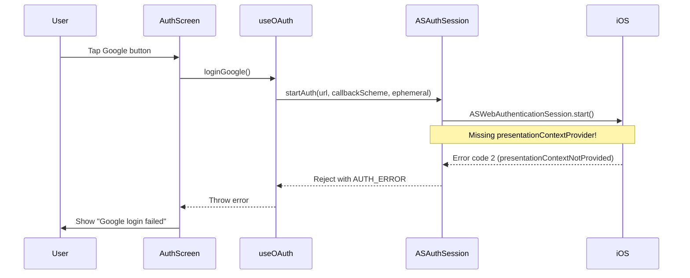

# Google OAuth Fix Plan

## Root Cause

The error `The operation couldn't be completed. (com.apple.AuthenticationServices.WebAuthenticationSession error 2.)` corresponds to **`ASWebAuthenticationSessionError.presentationContextNotProvided`** (iOS 13+).

**Why this happens:**

In iOS 13+, `ASWebAuthenticationSession` requires a `presentationContextProvider` conforming to `ASWebAuthenticationPresentationContextProviding` to be set. This tells iOS which window/UIViewController to present the authentication UI from.

The current [`ASAuthSession.swift`](ios/ASAuthSession.swift) does **not** set `session.presentationContextProvider`, causing the session to fail immediately on iOS 13+ devices with error code 2.



## Fix 1: Native Swift — Add Presentation Context Provider

**File:** [`ios/ASAuthSession.swift`](ios/ASAuthSession.swift)

- Make the class conform to `ASWebAuthenticationPresentationContextProviding`
- Implement `presentationAnchor(for:)` to return the key window
- Set `session.presentationContextProvider = self`

```swift
// Add to class declaration
class ASAuthSession: RCTEventEmitter, ASWebAuthenticationPresentationContextProviding {

    // Add method
    func presentationAnchor(for session: ASWebAuthenticationSession) -> ASPresentationAnchor {
        return ASPresentationAnchor()
    }

    // Inside startAuth(), before session.start()
    session.presentationContextProvider = self
```

For React Native, the proper `presentationAnchor` implementation needs to find the key window from the shared `UIApplication`:

```swift
func presentationAnchor(for session: ASWebAuthenticationSession) -> ASPresentationAnchor {
    guard let windowScene = UIApplication.shared.connectedScenes
        .first(where: { $0.activationState == .foregroundActive }) as? UIWindowScene,
        let window = windowScene.windows.first(where: { $0.isKeyWindow })
    else {
        // Fallback — create a new window (shouldn't happen in practice)
        return UIWindow()
    }
    return window
}
```

## Fix 2: JS Error Handling — Check `err.code` Not Just `err.message`

**File:** [`src/screens/AuthScreen.tsx`](src/screens/AuthScreen.tsx)

The three OAuth handlers (`handleGoogleLogin`, `handleFacebookLogin`, `handleAppleLogin` at lines 218–264) currently check:
```tsx
if (err?.message !== 'User cancelled login') {
```

The native Swift module rejects with:
- `code: "CANCELLED"` + `message: "User cancelled login"` for `.canceledLogin`
- `code: "AUTH_ERROR"` + `message: error.localizedDescription` for other errors
- `code: "INVALID_URL"` + `message: "Invalid authorization URL"` for invalid URL
- `code: "NO_CALLBACK"` + `message: "No callback URL received"` for missing callback

The message check works for the current values but is fragile. Change to:
```tsx
if (err?.code !== 'CANCELLED') {
```

This properly catches all cancellation codes regardless of localized message.

## Files to Modify

| # | File | Change |
|---|------|--------|
| 1 | [`ios/ASAuthSession.swift`](ios/ASAuthSession.swift) | Add `ASWebAuthenticationPresentationContextProviding` conformance + set `presentationContextProvider` |
| 2 | [`src/screens/AuthScreen.tsx`](src/screens/AuthScreen.tsx) | Change `err?.message !== 'User cancelled login'` → `err?.code !== 'CANCELLED'` in all 3 OAuth handlers |

## Verification Checklist

- [ ] Build and run on iOS 13+ device/simulator
- [ ] Tap Google button → Safari overlay should appear showing Google login
- [ ] Complete Google login → should navigate back successfully
- [ ] Cancel the login (swipe down) → should NOT show error
- [ ] Test on iOS 12 device if available (should still work without `presentationContextProvider`)
