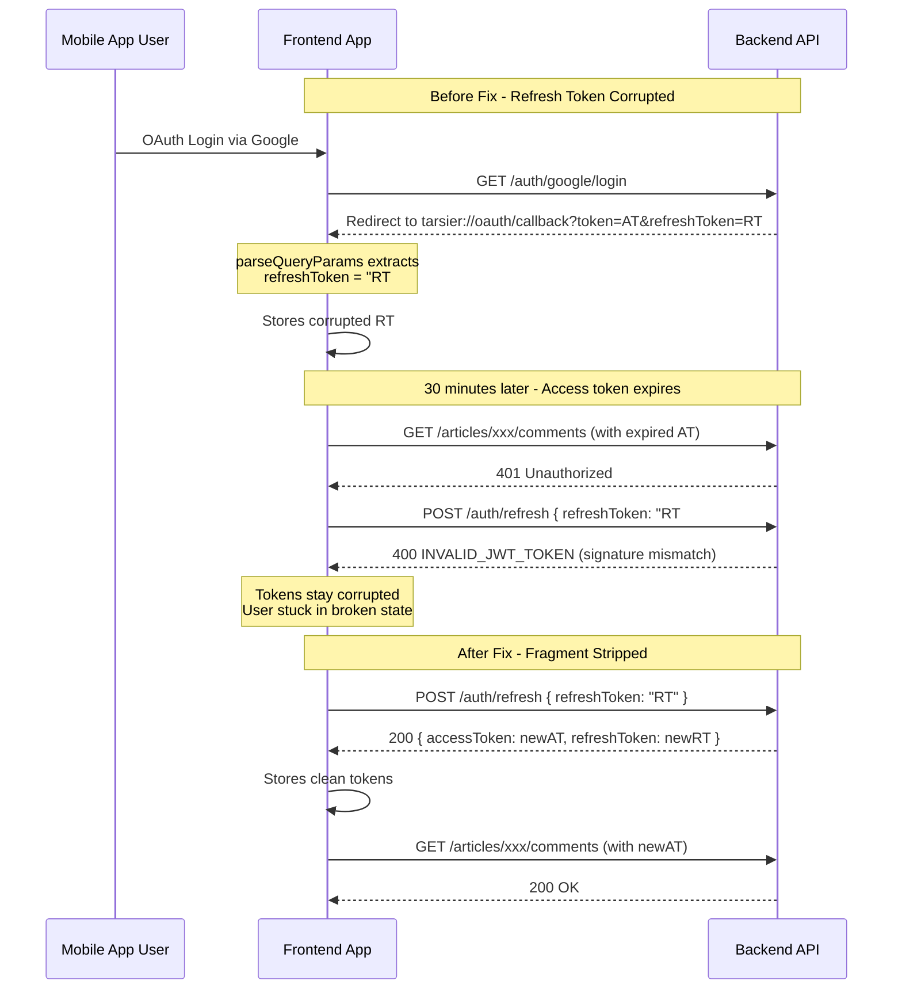

# OAuth Refresh Token Fragment Corruption & Auth Integration Fix

## Issue Summary

Three distinct problems were identified from the server error logs and manual testing:

1. **Primary Bug — Refresh token has `#_` fragment suffix** causing `INVALID_JWT_TOKEN` (code 20062) on refresh
2. **Secondary Bug — 401 handling doesn't clean up corrupted tokens** leaving user permanently broken
3. **Data Issue — Article ID `cmotio5lh005umi8zi6dl3jh9` returns 404** (not found on server)

---

## Bug 1: OAuth Callback URL Fragment Not Stripped (CRITICAL)

### Root Cause

In [`src/lib/hooks/useOAuth.ts:29-37`](../src/lib/hooks/useOAuth.ts:29), the `parseQueryParams` function uses `URLSearchParams` on the raw callback URL without stripping the URL **fragment** (`#...`) first.

```typescript
function parseQueryParams(url: string): Record<string, string> {
  const queryStart = url.indexOf('?');
  if (queryStart === -1) return {};
  const params: Record<string, string> = {};
  new URLSearchParams(url.slice(queryStart)).forEach((value, key) => {
    params[key] = value;
  });
  return params;
}
```

### How It Happens

1. User authenticates via Google/Facebook/Apple OAuth
2. Backend redirects to `tarsier://oauth/callback?token=xxx&refreshToken=yyy#_`
   - The `#_` fragment is added by some OAuth providers (Google's `#_=_` pattern) as a security measure
3. iOS [`ASAuthSession`](../ios/ASAuthSession.swift:54) returns `callbackURL.absoluteString` — the **full URL including fragment**
4. `parseQueryParams` is called with the full URL:
   - `url.indexOf('?')` finds the `?`
   - `url.slice(queryStart)` = `?token=xxx&refreshToken=yyy#_`
   - `new URLSearchParams('?token=xxx&refreshToken=yyy#_')` treats `#_` as part of the last value
   - **Result:** `refreshToken` = `"yyy#_"` instead of `"yyy"`
5. The corrupted `yyy#_` token is stored in MMKV via `storage.set('auth_refresh_token', ...)`
6. When the access token expires (30min lifetime), the app tries to refresh using the corrupted token
7. Server rejects with **`INVALID_JWT_TOKEN`** (code 20062) — the `#_` makes the JWT signature invalid

### Trace in Logs

```
POST /api/v1/auth/refresh  →  400
refreshToken: "...m5mTyDgvkhuw6VXnW3mY7nWTebsMTLK4Gs2bfueotKI#_"
                               ↑↑↑ corrupted suffix
```

### Fix

Strip the URL fragment (`#...`) before parsing query parameters. Add a fragment removal step:

In [`src/lib/hooks/useOAuth.ts`](../src/lib/hooks/useOAuth.ts:29), modify `parseQueryParams`:

```typescript
function parseQueryParams(url: string): Record<string, string> {
  // Strip URL fragment (#...) before parsing query params
  // OAuth providers like Google append #_ or #_=_ to the callback URL
  const fragmentStart = url.indexOf('#');
  const cleanUrl = fragmentStart !== -1 ? url.slice(0, fragmentStart) : url;
  
  const queryStart = cleanUrl.indexOf('?');
  if (queryStart === -1) return {};
  const params: Record<string, string> = {};
  new URLSearchParams(cleanUrl.slice(queryStart)).forEach((value, key) => {
    params[key] = value;
  });
  return params;
}
```

---

## Bug 2: 401 Handler Doesn't Clean Up Corrupted Tokens (MEDIUM)

### Root Cause

In [`src/api/baseApi.ts:179-181`](../src/api/baseApi.ts:179), the `catch` block in the 401 refresh flow silently discards the error without cleaning up corrupted tokens:

```typescript
try {
  const refreshResult = await rawBaseQuery(
    { url: '/api/v1/auth/refresh', method: 'POST', body: { refreshToken } },
    api, extraOptions,
  );
  // ... token extraction and retry ...
} catch {
  // Token refresh failed — don't retry
}
```

### Impact

When the refresh fails (due to the `#_` corruption or any other reason):
1. The corrupted `auth_refresh_token` stays in MMKV
2. The expired `auth_access_token` stays in MMKV
3. Every subsequent API call fails with 401
4. The app tries to refresh every time, fails every time
5. User is stuck in a broken auth state until they manually log out and re-login
6. No user-facing error feedback, no auto-recovery

### Fix

Clear both tokens from storage when the refresh attempt fails, and dispatch a `logout` action to reset Redux state:

In [`src/api/baseApi.ts`](../src/api/baseApi.ts), modify the 401 handling to:

```typescript
if (result.error && result.error.status === 401) {
  const refreshToken = storage.getString(REFRESH_TOKEN_KEY);
  if (refreshToken) {
    try {
      const refreshResult = await rawBaseQuery(
        { url: '/api/v1/auth/refresh', method: 'POST', body: { refreshToken } },
        api, extraOptions,
      );

      if (refreshResult.data) {
        // Extract and store new tokens (existing code)...
      } else {
        // Refresh returned non-2xx — tokens are invalid/expired
        console.warn('[API] Token refresh failed — clearing stored tokens');
        storage.delete(AUTH_TOKEN_KEY);
        storage.delete(REFRESH_TOKEN_KEY);
        // Optionally dispatch logout to reset Redux state
        // api.dispatch(logout());
      }
    } catch (error) {
      // Network error during refresh — also clean up
      console.warn('[API] Token refresh error — clearing stored tokens', error);
      storage.delete(AUTH_TOKEN_KEY);
      storage.delete(REFRESH_TOKEN_KEY);
      // api.dispatch(logout());
    }
  } else {
    // No refresh token available — user needs to re-authenticate
    console.warn('[API] 401 but no refresh token — clearing access token');
    storage.delete(AUTH_TOKEN_KEY);
  }
}
```

> **Note:** Import `logout` from `@/store/slices/authSlice` if dispatching Redux actions.

---

## Bug 3: Article Not Found (404) — Data/Environment Issue (LOW)

### What Happened

Server log shows:
```
GET /api/v1/frontend/blog/articles/cmotio5lh005umi8zi6dl3jh9/comments?page=1&pageSize=20
Response: 404 "Article not found"
```

The article with ID `cmotio5lh005umi8zi6dl3jh9` doesn't exist on the server (or was deleted).

### Analysis

The frontend code correctly:
1. Fetches the article by slug via `useGetArticleBySlugQuery` ([`ArticleDetailScreen.tsx:79-85`](../src/screens/ArticleDetailScreen.tsx:79))
2. Uses `article.id` from the response to fetch comments ([`ArticleDetailScreen.tsx:96`](../src/screens/ArticleDetailScreen.tsx:96))
3. Passes the article ID to `useCommentsInfiniteQuery` ([`useCommentsInfiniteQuery.ts:62`](../src/lib/hooks/useCommentsInfiniteQuery.ts:62))

This 404 is not a frontend code bug but rather a **data/environment issue** — the article was likely deleted from the database after the app cached/fetched it, or exists in a different environment.

### Recommendation

No code change needed. The app handles this gracefully — the `ArticleDetailScreen` shows its error state with retry button. However, if this happens frequently during navigation (e.g., article deleted while user is reading), a toast notification would improve UX.

---

## Bug 4: Manual Test Used Wrong HTTP Method (USER ERROR — NOT A CODE BUG)

### What Happened

The manual test at the bottom of the log shows:
```
Request URL: https://dev-api.joyminis.com/api/v1/frontend/blog/articles/cmotio5gk005dmi8zxi5grmwy/comments
Request Method: POST
Status Code: 401 Unauthorized
```

The user tested the comments endpoint with **POST** instead of **GET**. The app code correctly uses GET for fetching comments and POST only for creating comments.

**This is not a code bug** — it's a test error. The 401 is because the access token was expired and refresh failed (due to Bug 1).

---

## Verification Flow



---

## Files to Modify

| File | Change | Priority |
|------|--------|----------|
| [`src/lib/hooks/useOAuth.ts`](../src/lib/hooks/useOAuth.ts:29) | Strip URL fragment before parsing query params | **HIGH** |
| [`src/api/baseApi.ts`](../src/api/baseApi.ts:179) | Clear corrupted tokens on refresh failure | **MEDIUM** |

---

## Testing Checklist

1. **Unit test `parseQueryParams`:** Add test cases for URLs with:
   - No fragment (normal case)
   - Fragment `#_` (Google OAuth)
   - Fragment `#_=_` (alternative pattern)
   - No query params
   - Multiple query params

2. **Integration test OAuth flow end-to-end:**
   - Simulate callback URL with `#_` fragment
   - Verify tokens are stored without fragment
   - Verify token refresh succeeds

3. **Integration test 401 recovery:**
   - Simulate expired token
   - Simulate refresh failure
   - Verify tokens are cleared from MMKV
   - Verify subsequent API calls trigger re-auth
