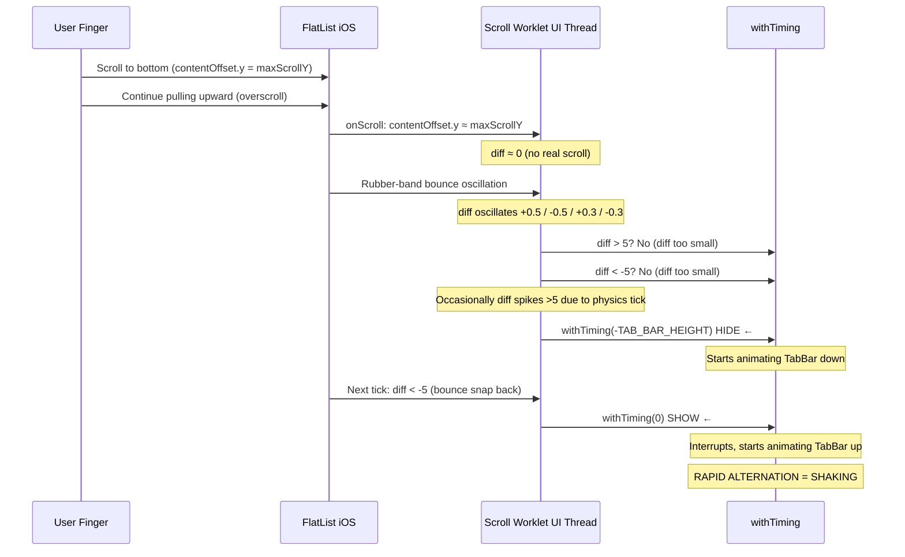

# HomeScreen Overscroll Jitter Fix Plan

## Problem Summary

**Reported behavior:** After scrolling to the bottom of the homepage (FlatList), continuing to pull upward with the finger causes the page to "shake" or "jitter" violently.

**Observed on:** iOS (default `bounces={true}` behavior on ScrollView/FlatList).

---

## Root Cause Analysis

### The Scroll-Driven Animation System

[`HomeScreen.tsx`](../src/screens/HomeScreen.tsx:242) uses a `useAnimatedScrollHandler` worklet that runs on the UI thread to drive two animations based on scroll direction:

1. **CategoryFilter** — slides up/down via `catFilterTranslateY`
2. **TabBar** — slides up/down via `tabBarTranslateY` (shared through `ScrollContext`)

The direction detection logic (lines 263–273):

```typescript
onScroll: (event) => {
  const diff = currentY - lastScrollY.value;

  if (diff > 5 && currentY > SCROLL_THRESHOLD) {
    // Scrolling down → hide CategoryFilter and TabBar
    catFilterTranslateY.value = withTiming(-CAT_FILTER_HEIGHT, { duration: 200 });
    tabBarTranslateY.value = withTiming(-TAB_BAR_HEIGHT, { duration: 200 });
  } else if (diff < -5) {
    // Scrolling up → show CategoryFilter and TabBar
    catFilterTranslateY.value = withTiming(0, { duration: 200 });
    tabBarTranslateY.value = withTiming(0, { duration: 200 });
  }

  lastScrollY.value = currentY;
},
```

### What Happens During Bottom Overscroll

When the user scrolls to the end of the list and keeps pulling upward on iOS:



**The critical insight:** During the rubber-band bounce at the bottom boundary:

1. `contentOffset.y` is at or near `maxScrollY` (contentSize.height - layoutMeasurement.height)
2. The bounce physics create small oscillations in `contentOffset.y`
3. These oscillations cause `diff` to sporadically exceed `±5` in alternating directions
4. Each time `diff` exceeds the threshold, `withTiming` is called with conflicting target values
5. The rapid interruption of running animations creates the visual shaking/jittering

### Why Other Screens Don't Have This Issue

| Screen | Scroll Component | Scroll-Driven Animations | Affected? |
|--------|-----------------|-------------------------|-----------|
| `HomeScreen` | `Animated.FlatList` | CategoryFilter + TabBar hide/show | **Yes** |
| `ArticleListScreen` | Plain `FlatList` | None | No |
| `SearchScreen` | Plain `FlatList` | None | No |
| `BookmarksScreen` | Plain `FlatList` | None | No |
| `TagArticlesScreen` | Plain `FlatList` | None | No |
| `CategoryArticlesScreen` | Plain `FlatList` | None | No |

---

## Fix Strategy

### Three Issues Identified & Addressed

| # | Issue | Status | Fix |
|---|-------|--------|-----|
| 1 | **Overscroll jitter** at bottom bounce | ✅ Fixed | Overscroll boundary detection skips `withTiming` during bounce |
| 2 | **White flash** when TabBar starts/stops animating | ✅ Fixed | Added `backgroundColor: colors.background` to TabBar `Animated.View` wrapper |
| 3 | **White TabBar visible** during scroll (worse when faster) | ✅ Fixed | Replaced `maxHeight` + `overflow:hidden` with `position:absolute` + `translateY` |

---

### Issue 2: White Flash When TabBar Animates (Already Fixed)

**Root cause:** The `Animated.View` wrapper in [`RootNavigator.tsx`](../src/navigation/RootNavigator.tsx:199) had no `backgroundColor`. When `maxHeight` animates from 60→0 (hiding), the wrapper's visible area shrinks, revealing whatever is behind it — typically a white background from the native view.

**Fix:** Added `backgroundColor: colors.background` to the wrapper's inline style.

---

### Issue 3: White TabBar Visible During Scroll — position:absolute + translateY

**Root cause:** The scroll handler calls `withTiming` on **every** scroll event where `diff > 5`. Since scroll fires at 60fps, `withTiming(-TAB_BAR_HEIGHT, { duration: 200 })` is called ~60 times/second. Each call **restarts the animation timer** (200ms from "now"). The animation never completes because the deadline keeps extending.

```
Time 0ms:   withTiming(-60, 200ms)  → completes at t=200ms
Time 16ms:  withTiming(-60, 200ms)  → restarts, completes at t=216ms
Time 32ms:  withTiming(-60, 200ms)  → restarts, completes at t=232ms
... (repeats every 16ms while scrolling)
Time 500ms: withTiming(-60, 200ms)  → last restart, completes at t=700ms
```

Result: TabBar remains partially visible for **700ms** instead of **200ms**. Faster scrolling = more restarts = TabBar visible longer.

#### The Fix: `position: absolute` + `translateY`

Instead of animating `maxHeight` (a layout property that triggers recalculation), we:

1. **Remove the TabBar from normal layout flow** — `position: absolute` at `bottom: 0`
2. **Animate `translateY`** — a GPU-composited property, no layout recalculation
3. **Clip with `overflow: hidden`** — when the TabBar translates down off-screen, the clipped area stays invisible

**Why this eliminates the white bar:**

- `maxHeight` is a **layout** property — animating it causes repeated layout calculations, and the white area behind the shrinking view becomes visible
- `translateY` is a **compositing** property — the GPU handles it in a separate layer, no layout recalc. The view's frame remains at the same position, but the visual content slides within it
- Since the wrapper is `position: absolute`, it no longer occupies space in the normal flow, so no content below it gets shifted

#### Files to Modify

| File | Change |
|------|--------|
| [`src/navigation/RootNavigator.tsx`](../src/navigation/RootNavigator.tsx:176) | Change `tabBarAnimatedStyle` from `maxHeight` to `transform: [{ translateY }]`, make wrapper `position: absolute` with fixed height |
| [`src/screens/HomeScreen.tsx`](../src/screens/HomeScreen.tsx:268) | Change `tabBarTranslateY` target from `-TAB_BAR_HEIGHT` (negative=hide up) to `TAB_BAR_HEIGHT` (positive=hide down) |

#### Detailed Changes

##### Change 1 — [`src/navigation/RootNavigator.tsx`](../src/navigation/RootNavigator.tsx:183)

**`tabBarAnimatedStyle`** (lines 184–186):
```typescript
// BEFORE: animates maxHeight (layout property)
const tabBarAnimatedStyle = useAnimatedStyle(() => ({
  maxHeight: Math.max(0, TAB_BAR_VISIBLE_HEIGHT + tabBarTranslateY.value),
  overflow: 'hidden',
}));

// AFTER: animates translateY (GPU-composited property)
const tabBarAnimatedStyle = useAnimatedStyle(() => ({
  transform: [{ translateY: tabBarTranslateY.value }],
}));
```

**`Animated.View` wrapper** (lines 199–204):
```typescript
// BEFORE: inline backgroundColor, tabBarAnimatedStyle drives maxHeight
<Animated.View
  style={[
    styles.tabBarWrapper,
    { backgroundColor: colors.background },
    tabBarAnimatedStyle,
  ]}
>

// AFTER: backgroundColor stays, animated style is now translateY
<Animated.View
  style={[
    styles.tabBarWrapper,
    { backgroundColor: colors.background },
    tabBarAnimatedStyle,
  ]}
>
```

**`styles.tabBarWrapper`** (lines 352–356):
```typescript
// BEFORE: just zIndex
tabBarWrapper: {
  zIndex: 100,
},

// AFTER: position: absolute at bottom, fixed height, overflow hidden
tabBarWrapper: {
  position: 'absolute',
  bottom: 0,
  left: 0,
  right: 0,
  height: TAB_BAR_VISIBLE_HEIGHT,
  overflow: 'hidden',
  zIndex: 100,
},
```

##### Change 2 — [`src/screens/HomeScreen.tsx`](../src/screens/HomeScreen.tsx:268)

**Scroll worklet hide target:**
```typescript
// BEFORE: negative = translate up (out of frame, toward top)
tabBarTranslateY.value = withTiming(-TAB_BAR_HEIGHT, { duration: 200 });

// AFTER: positive = translate down (off-screen below bottom)
tabBarTranslateY.value = withTiming(TAB_BAR_HEIGHT, { duration: 200 });
```

#### How It Works Visually

```
Normal (translateY: 0):
┌─────────────────────────┐  ← screen top
│                         │
│   (scrollable content)  │
│                         │
├─────────────────────────┤  ← screen bottom
│  TabBar (visible)       │  ← wrapper at bottom:0, height: 60
│  [Home] [Tags] [Cat]... │
└─────────────────────────┘

Hidden (translateY: 60):
┌─────────────────────────┐  ← screen top
│                         │
│   (scrollable content)  │
│                         │
├─────────────────────────┤  ← screen bottom
│  (empty — clipped)      │  ← wrapper still at bottom:0, height: 60
│                         │      but content translated down 60px
└─────────────────────────┘
     ↓  TabBar rendered here (visual position, clipped by overflow:hidden)
```

---

## Files Modified (Summary)

| # | File | Change | Status |
|---|------|--------|--------|
| 1 | [`src/screens/HomeScreen.tsx`](../src/screens/HomeScreen.tsx) | Add overscroll boundary detection in scroll worklet (lines 248–260) | ✅ Done |
| 2 | [`src/navigation/RootNavigator.tsx`](../src/navigation/RootNavigator.tsx) | Add `backgroundColor: colors.background` to TabBar wrapper (line 197) | ✅ Done |
| 3 | [`src/navigation/RootNavigator.tsx`](../src/navigation/RootNavigator.tsx) | Replace `maxHeight` with `transform: translateY`, make wrapper `position: absolute` with fixed height | ✅ Done |
| 4 | [`src/screens/HomeScreen.tsx`](../src/screens/HomeScreen.tsx) | Change `tabBarTranslateY` from `-TAB_BAR_HEIGHT` to `TAB_BAR_HEIGHT` | ✅ Done |

---

## Testing

1. **On iOS simulator/device:**
   - Scroll to the bottom of the HomeScreen feed
   - Continue pulling upward (overscroll) — verify no shaking
   - Scroll back up — verify CategoryFilter and TabBar reappear normally
   - Scroll down — verify CategoryFilter and TabBar hide normally
   - **Scroll fast** — verify TabBar disappears quickly, no white bar lingering
   - Pull-to-refresh at the top — verify it still works

2. **Edge cases:**
   - Empty list (no articles): verify no shaking when attempting to scroll
   - List with only a few items (content smaller than viewport): verify no shaking
   - Rapid scrolling up and down: verify animations remain smooth
   - Category filter change while at bottom: verify pagination works correctly

3. **Regression:**
   - Verify TabBar hide/show still works on the Home tab
   - Verify TabBar is correctly positioned at bottom on all tabs
   - Verify no content is hidden behind the absolute-positioned TabBar
   - Verify no new console errors
