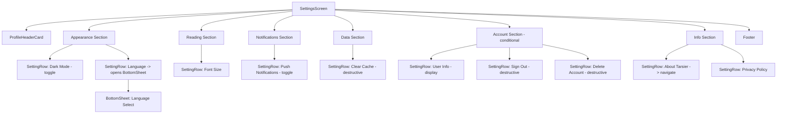

# SettingsScreen Redesign Plan — "大气" Premium UX Overhaul

## Current Problems

- Flat, generic list of rows resembling iOS system settings — no brand personality
- Small typography (15px labels, 14px values, 12px uppercase headers) feels cramped
- Icons at 20px without background containers get visually lost
- Section cards have only 12px radius and weak shadows — look cheap
- No user profile focal point at top of screen
- No decorative elements, brand accents, or visual hierarchy
- Destructive actions not clearly distinguished until text color changes

## Design Goals ("大气" = Grand / Premium / Atmospheric)

1. **Create a visual anchor** — profile header card at top
2. **Elevate icon presentation** — icon-in-circle container pattern (like modern macOS/Android settings)
3. **Improve typography scale** — larger labels, better hierarchy
4. **Premium card styling** — larger radius, refined shadows, brand accents
5. **Brand identity injection** — use gold/amber brand color (`#d68a29`) as accent
6. **Clear action distinction** — navigation rows, toggle rows, destructive rows each visually distinct
7. **Better spacing & breathing room**
8. **Footer with app version** for polish

---

## Detailed Changes

### 1. Profile Header Section (new)

Positioned at the very top of the ScrollView, before any section groups.

**Authenticated state:**
```
┌──────────────────────────────────────┐
│  ┌────┐                              │
│  │ 👤 │  Porter                      │
│  │    │  porter@email.com            │
│  └────┘                              │
└──────────────────────────────────────┘
```
- Large circular avatar (56px) with user initial or user icon
- Name in 20px semibold, email in 14px secondary
- Tapping navigates to profile or shows account options
- Card with brand gold left border accent (3px)

**Unauthenticated state:**
```
┌──────────────────────────────────────┐
│  ┌────┐  Sign in to sync your data   │
│  │ 👤 │  → Sign In                   │
│  └────┘                              │
└──────────────────────────────────────┘
```

### 2. Redesigned SettingRow Component

| Property | Current | New |
|----------|---------|-----|
| Icon size | 20px | 20px (within 36px circle) |
| Icon container | none | 36×36 circle, `bgSecondary` fill |
| Label font size | 15px | 16-17px |
| Label font weight | 400 | 500 (medium) |
| Row padding vertical | `spacing.md` (8) | `spacing.md`+2 (10) |
| Chevron icon | 16px | 18px |

**Visual distinction by row type:**
- **Navigation rows**: icon circle uses `bgSecondary`, chevron on right
- **Toggle rows**: icon circle uses `bgBrandPrimary` tint, Switch on right
- **Destructive rows**: icon circle uses `bgErrorSecondary` tint, red label

### 3. Section Headers

| Property | Current | New |
|----------|---------|-----|
| Font size | 12px | 13px |
| Font weight | 600 | 700 |
| Letter spacing | 0.5 | 0.8 |
| Left decoration | none | 3px brand-colored vertical bar |
| Padding top | `spacing.md` (8) | `spacing.xl` (16) |
| Padding bottom | `spacing.sm` (6) | `spacing.sm` (6) |

Implementation: add a `View` with 3px width, `colors.utilityBrand500`, rounded 2px before the header text.

### 4. Card Styling Refresh

| Property | Current | New |
|----------|---------|-----|
| Border radius | 12px (`radiusXl`) | 16px (`radius2xl`) |
| Horizontal margin | `spacing.lg` (12) | `spacing.xl` (16) |
| Bottom margin | `spacing.md` (8) | 12px |
| Shadow (iOS) | color: #000, opacity: 0.05 | color: brand tint, opacity: 0.08, radius: 8 |
| Shadow (Android) | elevation: 2 | elevation: 3 |

### 5. Typography Scale

- Section headers: 13px, 700 weight, 0.8 letter-spacing, uppercase
- Setting labels: 16px (17px for primary), 500 weight
- Setting values: 14px, 400 weight, secondary color
- Destructive labels: 16px, 500 weight, `#EF4444` or `colors.textErrorPrimary`
- Profile name: 20px (`textXl`), 600 weight (`semibold`)
- Profile email: 14px (`textSm`), 400 weight

### 6. Switch / Toggle Styling

Keep the Switch component but enhance colors:
- Track ON: `colors.utilityBrand500` (gold `#d68a29`) at 80% opacity
- Track OFF: `colors.borderSecondary`
- Thumb ON: `colors.utilityBrand500`
- Thumb OFF: white

### 7. Destructive Action Section

Group Sign Out and Delete Account together with:
- Icon circles tinted with `bgErrorSecondary` (`#fee4e2` light / `#7a271a` dark)
- Text colored `textErrorPrimary`
- A subtle red left border accent on the section card

### 8. Bottom Sheet Enhancements

- Increase title font to 18px semibold
- Add checkmark circle animation
- Better row spacing with 14px padding vertical
- Selected item gets brand background tint

### 9. Footer Info

Add a footer at the bottom of ScrollView:
```
Tarsier v1.0.0
Made with ❤️
```
- Centered, 12px, `textQuaternary` color
- Padding top: 24px, bottom: 8px

---

## File Changes

### Primary file to modify:
- `src/screens/SettingsScreen.tsx` — complete rewrite of the UI component, keeping logic/handlers intact

### No other files need changes:
- No new dependencies required
- All colors/icons/spacing already exist in the design token system
- No navigation changes needed

---

## Component Architecture

```
SettingsScreen
├── ScrollView
│   ├── ProfileHeaderCard           ← NEW
│   │   ├── AvatarCircle (56px)
│   │   ├── UserInfo (name, email)
│   │   └── SignInPrompt (if not auth)
│   │
│   ├── SectionHeader (Appearance)
│   ├── SectionCard
│   │   ├── SettingRow (Dark Mode) [toggle]
│   │   └── SettingRow (Language) [navigation]
│   │
│   ├── SectionHeader (Reading)
│   ├── SectionCard
│   │   └── SettingRow (Font Size) [navigation]
│   │
│   ├── SectionHeader (Notifications)
│   ├── SectionCard
│   │   └── SettingRow (Push Notifications) [toggle]
│   │
│   ├── SectionHeader (Data)
│   ├── SectionCard
│   │   └── SettingRow (Clear Cache) [navigation/destructive]
│   │
│   ├── SectionHeader (Account) [conditional]
│   ├── SectionCard [with red accent] [conditional]
│   │   ├── SettingRow (Signed in as...) [display]
│   │   ├── SettingRow (Sign Out) [destructive]
│   │   └── SettingRow (Delete Account) [destructive]
│   │
│   ├── SectionHeader (Info)
│   ├── SectionCard
│   │   ├── SettingRow (About Tarsier) [navigation]
│   │   └── SettingRow (Privacy Policy) [navigation]
│   │
│   └── FooterText (version info)   ← NEW
│
└── BottomSheet (Language Select)
```

---

## Mermaid: Visual Flow



---

## Implementation Steps

1. **Refactor `SettingRow`** — add `iconBg` prop for circle background color, increase icon size, update layout
2. **Create `ProfileHeaderCard`** — new component within the same file, handles auth/unauthenticated states
3. **Update `SectionHeader`** — add left brand accent bar, increase font size/weight
4. **Update card styles** — increase borderRadius to 16, improve shadows
5. **Reorder sections** — profile first, then move account section styling
6. **Add destructive section accent** — red tint for Sign Out / Delete Account
7. **Add footer** — version info text
8. **Update BottomSheet** — better typography and selection styling
9. **Polish Switch colors** — use brand gold for active track

---

## Key Design Token Usage

| Token | Usage |
|-------|-------|
| `front.radius2xl` (16) | Card border radius |
| `front.textXl` (20) | Profile name |
| `front.textSm` (14) | Profile email, setting values |
| `front.textMd` (16) | Setting labels |
| `front.spacingXl` (16) | Card horizontal margin |
| `colors.utilityBrand500` | Brand gold accent, switch active |
| `colors.bgSecondary` | Icon circle background |
| `colors.bgBrandPrimary` | Toggle icon tint |
| `colors.bgErrorSecondary` | Destructive icon tint |
| `colors.textErrorPrimary` | Destructive text |
| `colors.textQuaternary` | Footer text |
