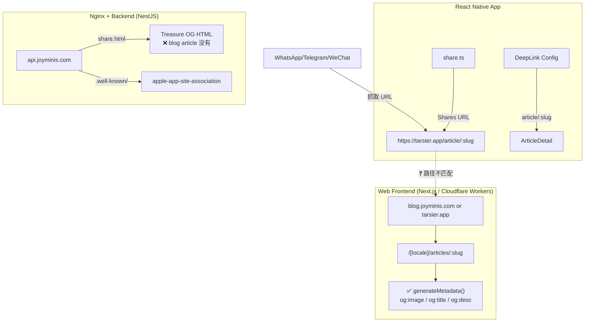

# Plan: Fix Share Preview + Deep Link to Open App

## Current Architecture Overview



## Problems Found

### Problem 1: Share URL path mismatch (Critical)
- RN 分享的 URL: `https://tarsier.app/article/:slug` (单数 `article`)
- Next.js 实际路由: `https://tarsier.app/:locale/articles/:slug` (复数 `articles` + locale 前缀)
- 结果: 聊天软件抓取时拿到 404 或错误页面，看不到 OG 图片

### Problem 2: AASA file needs verification
- 当前 AASA 内容 (`nginx/html/.well-known/apple-app-site-association`):
  ```json
  {"appID": "PK28T343BP.com.tarsier.blog", "paths": ["/article/*", ...]}
  ```
- 需要验证:
  - `PK28T343BP` 是否为正确的 Apple Team ID
  - AASA 文件是否正确部署到 `https://tarsier.app/.well-known/apple-app-site-association`
- **注意**: 当前 Nginx prod 配置只服务 `api.joyminis.com`，而 `tarsier.app` 是 Cloudflare Worker
  - 所以 AASA 需要部署到 Cloudflare Worker 或 Cloudflare Pages 的静态目录，而不是 Nginx

### Problem 3: Share URL domain clarification needed
- RN `WEB_URL` 是 `https://tarsier.app` (prod) / `https://dev.tarsier.app` (dev)
- Next.js frontend-blog env: `NEXT_PUBLIC_SITE_URL = 'https://blog.joyminis.com'`
- 需要确认 `tarsier.app` 和 `blog.joyminis.com` 是否指向同一个 Cloudflare Worker

---

## Two Possible Solutions

### Solution A: Align share URL to match Next.js route (推荐)

修改 RN 的分享 URL 为 `https://tarsier.app/en/articles/:slug`，或者在 Next.js 加 rewrite。

#### Approach A1: Fix share URL in RN app (simplest)

只需两步:
1. 修改 [`src/lib/utils/share.ts`](../src/lib/utils/share.ts:60) 中 `shareUrl` 为 `env.WEB_URL/en/articles/${article.slug}`
2. 修改 [`src/navigation/RootNavigator.tsx`](../src/navigation/RootNavigator.tsx:287) 中 deeplink 路径为 `articles/:slug`

**缺点**: 硬编码 `en` locale，非英文用户分享的链接预览始终是英文

#### Approach A2: Add Next.js rewrite for `/article/:slug` → `/:locale/articles/:slug` (better)

在 Next.js 的 `next.config.ts` 或 middleware 中添加 rewrite 规则:
```
/article/:slug → /en/articles/:slug
```
这样 RN 保持现有分享 URL 不变，Next.js 自动 rewrite 到正确路由，OG 标签正常工作。

**优点**: RN 端无需改动，支持未来 Web 端路由调整

### Solution B: Create blog share.html endpoint in NestJS (类似 Flutter 做法)

模仿 `share.controller.ts` 的做法，在 NestJS 后端新增一个文章分享 HTML 端点:
- `GET /api/v1/frontend/blog/articles/share.html?slug=xxx`
- 从数据库查文章，生成带 OG 标签的完整 HTML
- 返回给聊天软件爬虫

然后:
1. 修改 RN 分享 URL 为 `https://api.joyminis.com/share.html?slug=xxx`
2. 或者 Nginx 加 rewrite: `/article/:slug` → NestJS share endpoint

**缺点**: 多一次后端查询，和 Next.js 的 OG 实现重复

---

## Recommended Plan: Solution A2 (Next.js rewrite)

### Step 1: Clarify domain routing
确认 `tarsier.app` 是否指向 Cloudflare Worker（frontend-blog Next.js 应用）。如果是，直接进行 Step 2。

### Step 2: Add Next.js rewrite rule
在 [`apps/frontend-blog/next.config.ts`](../apps/frontend-blog/next.config.ts) 或 middleware 添加:
```
/article/:slug → /en/articles/:slug
```

### Step 3: Verify AASA deployment
确认 AASA 文件部署在 Cloudflare Worker/Pages 的静态输出目录，确保 `https://tarsier.app/.well-known/apple-app-site-association` 可访问。

### Step 4: Update React Native deep link config
修改 [`src/navigation/RootNavigator.tsx`](../src/navigation/RootNavigator.tsx:287) 添加 `article/:slug` 和 `articles/:slug` 两个路径映射到 `ArticleDetail`。

### Step 5: Android App Links
在 [`android/app/src/main/AndroidManifest.xml`](../android/app/src/main/AndroidManifest.xml) 添加 intent filter，并部署 `assetlinks.json`。

### Step 6: Test end-to-end
- 分享文章到微信/WhatsApp → 确认看到图片预览
- 点击链接 → 确认打开 App 并跳转到对应文章
