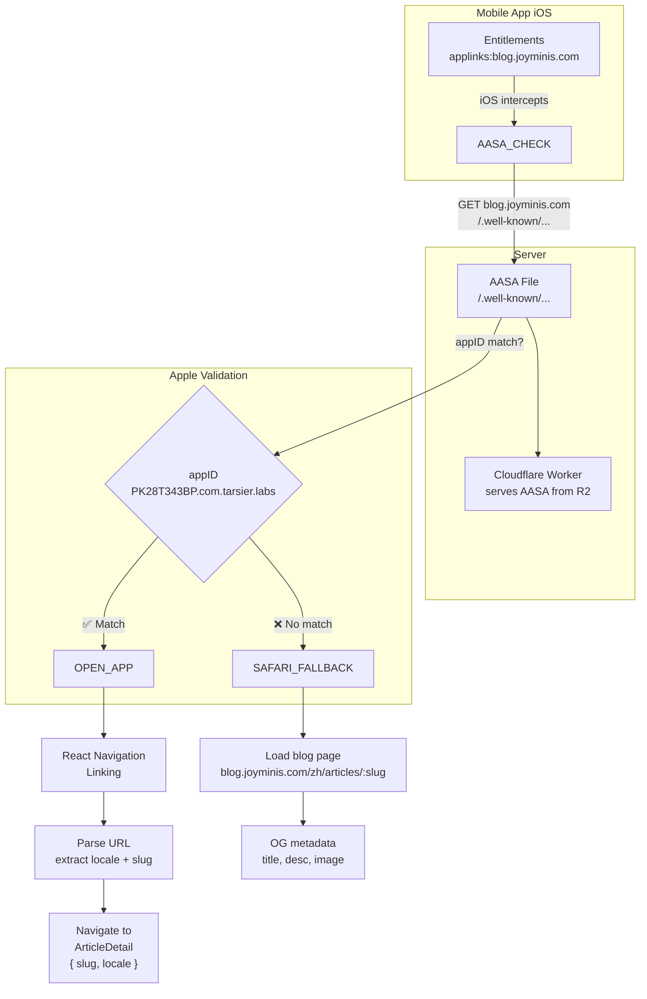
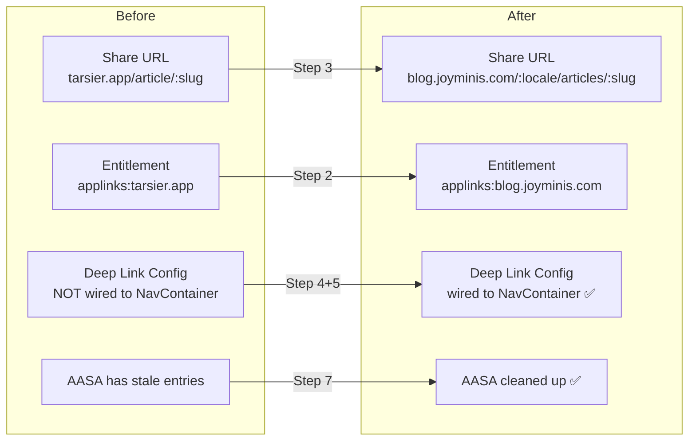

# Universal Links Implementation Plan

## Overview

Implement Apple Universal Links so article share links (`https://blog.joyminis.com/{locale}/articles/{slug}`) open the Tarsier Labs app directly when installed, falling back to the blog web page when not installed.

## Architecture

```
┌─────────────────────────────────────────────────────────────┐
│                      Data Flow                              │
├─────────────────────────────────────────────────────────────┤
│                                                             │
│  Share (RN App)                                             │
│  ┌──────────────────────┐                                   │
│  │ shareArticle(article)│                                   │
│  │ → blog.joyminis.com/ │                                   │
│  │   zh/articles/:slug  │                                   │
│  └──────────┬───────────┘                                   │
│             │                                               │
│             ▼                                               │
│  ┌──────────────────────┐                                   │
│  │ iOS System Share API │                                   │
│  └──────────┬───────────┘                                   │
│             │                                               │
│        Friend clicks link                                   │
│             │                                               │
│             ▼                                               │
│  ┌──────────────────────┐      ┌─────────────────────────┐  │
│  │ Apple Verification   │─────▶│ Cloudflare Worker: GET  │  │
│  │ Layer: Checks AASA   │◀────│ /.well-known/...        │  │
│  │ at blog.joyminis.com │      │ Returns AASA JSON       │  │
│  └──────────┬───────────┘      └─────────────────────────┘  │
│             │                                                │
│      ┌──────┴──────┐                                        │
│      ▼              ▼                                        │
│  App Installed   App NOT installed                           │
│      │              │                                        │
│      ▼              ▼                                        │
│  Opens App →    Safari →                                    │
│  Linking event  blog.joyminis.com/:locale/articles/:slug     │
│  → Parse slug                                                │
│  → Navigate to                                                │
│    ArticleDetail                                              │
└─────────────────────────────────────────────────────────────┘
```

## Files to Modify (in this repo)

| # | File | Action | Description |
|---|------|--------|-------------|
| 1 | [`src/lib/env.ts`](../src/lib/env.ts) | Modify | Change `WEB_URL` from `https://tarsier.app` → `https://blog.joyminis.com` |
| 2 | [`ios/FrontendBlogMobile/FrontendBlogMobile.entitlements`](../ios/FrontendBlogMobile/FrontendBlogMobile.entitlements) | Modify | Change `applinks:tarsier.app` → `applinks:blog.joyminis.com` |
| 3 | [`src/lib/utils/share.ts`](../src/lib/utils/share.ts) | Modify | Update share URL format to `{WEB_URL}/{locale}/articles/{slug}` |
| 4 | [`src/screens/ArticleDetailScreen.tsx`](../src/screens/ArticleDetailScreen.tsx) | Modify | Pass `lang` to `shareArticle()` call |
| 5 | [`src/navigation/types.ts`](../src/navigation/types.ts) | Modify | Add optional `locale` param to `ArticleDetail` |
| 6 | [`src/navigation/RootNavigator.tsx`](../src/navigation/RootNavigator.tsx) | Modify | Update deep link path to `:locale/articles/:slug`, export linking config |
| 7 | [`App.tsx`](../App.tsx) | Modify | Import and pass `linking` prop to `NavigationContainer` |
| 8 | [`src/screens/ArticleDetailScreen.tsx`](../src/screens/ArticleDetailScreen.tsx) | Modify | Use `route.params.locale` for article language if provided |

## Files to Modify (in JoyMini_Nest_Monorepo)

| # | File | Action | Description |
|---|------|--------|-------------|
| 9 | [`frontend-blog/public/.well-known/apple-app-site-association`](../../../../Volumes/MySSD/work/JoyMini_Nest_Monorepo/apps/frontend-blog/public/.well-known/apple-app-site-association) | Modify | Clean up stale `A1B2C3D4E5` entries |
| 10 | [`nginx/html/.well-known/apple-app-site-association`](../../../../Volumes/MySSD/work/JoyMini_Nest_Monorepo/nginx/html/.well-known/apple-app-site-association) | Modify | Sync with Worker AASA changes |

## Detailed Steps

### Step 1: Update `WEB_URL` in env config

**File**: [`src/lib/env.ts`](../src/lib/env.ts)

Change prod `WEB_URL`:
```typescript
// Before
WEB_URL: 'https://tarsier.app',

// After
WEB_URL: 'https://blog.joyminis.com',
```

Also update dev `WEB_URL` for consistency (if `dev.tarsier.app` also routes to the blog worker — verify first):
```typescript
// Before (staging config doesn't exist; dev config)
WEB_URL: 'https://dev.tarsier.app',

// After — keep as-is unless a dev blog.joyminis.com subdomain exists
WEB_URL: 'https://dev.tarsier.app', // unchanged
```

> **Note**: Dev environment Universal Links won't work via tunnel (Apple needs public HTTPS domain). Dev testing is done via production build on device.

**⚠️ Impact check**: `WEB_URL` is used in:
- [`share.ts`](../src/lib/utils/share.ts): share URL generation ✅ (will update in Step 3)
- [`RootNavigator.tsx`](../src/navigation/RootNavigator.tsx:251): linking prefix ✅ (will update in Step 5)

### Step 2: Update iOS Entitlements

**File**: [`ios/FrontendBlogMobile/FrontendBlogMobile.entitlements`](../ios/FrontendBlogMobile/FrontendBlogMobile.entitlements)

```xml
<!-- Before -->
<key>com.apple.developer.associated-domains</key>
<array>
    <string>applinks:tarsier.app</string>
</array>

<!-- After -->
<key>com.apple.developer.associated-domains</key>
<array>
    <string>applinks:blog.joyminis.com</string>
</array>
```

This tells iOS to intercept any `https://blog.joyminis.com/*` URL and check the AASA file. If the AASA validates, iOS opens the app.

### Step 3: Fix Share URL Format

**File**: [`src/lib/utils/share.ts`](../src/lib/utils/share.ts)

**Problem**: Current share URL is `{WEB_URL}/article/{slug}` which:
1. Doesn't include locale prefix (blog routes are `/:locale/articles/:slug`)
2. Uses singular `article` instead of plural `articles`
3. No locale means OG preview and deep link won't match actual route structure

**Solution**: Pass `locale` parameter to `shareArticle()` and use it in URL construction.

**Changes to [`src/lib/utils/share.ts`](../src/lib/utils/share.ts):**
```typescript
// Before
export async function shareArticle(article: FrontendArticle): Promise<void> {
  const shareUrl = `${env.WEB_URL}/article/${article.slug}`;

// After
export async function shareArticle(
  article: FrontendArticle,
  locale?: string,
): Promise<void> {
  const lang = locale || env.DEFAULT_LOCALE;
  const shareUrl = `${env.WEB_URL}/${lang}/articles/${article.slug}`;
```

**Changes to [`src/screens/ArticleDetailScreen.tsx`](../src/screens/ArticleDetailScreen.tsx):**
```typescript
// Line ~212-215, before
const handleShare = useCallback(async () => {
  if (!article) return;
  await shareArticle(article);
}, [article]);

// After
const handleShare = useCallback(async () => {
  if (!article) return;
  await shareArticle(article, lang);
}, [article, lang]);
```

### Step 4: Wire NavigationContainer linking prop

**File**: [`App.tsx`](../App.tsx)

**Problem**: The `linking` config is defined in [`RootNavigator.tsx:250-296`](../src/navigation/RootNavigator.tsx:250) but **never passed** to `NavigationContainer`. This means deep link events are never processed by React Navigation.

**Solution**: Import and pass the `linking` config.

```typescript
// In App.tsx, add import
import RootNavigator, { linking } from '@/navigation/RootNavigator';

// Update NavigationContainer (line ~103-109)
<NavigationContainer
  ref={navigationRef}
  linking={linking}             // ← ADD THIS
  onReady={() => {
    addBreadcrumb('Navigation ready', 'navigation');
  }}
  onStateChange={handleStateChange}
>
```

This single change enables:
- ✅ Cold start: `Linking.getInitialURL()` handled automatically by React Navigation
- ✅ Warm start: `Linking.addEventListener('url')` handled automatically by React Navigation
- ✅ URL parsing according to the config paths
- ✅ Navigation to the correct screen with extracted params

### Step 5: Update Deep Link Path Config

**File**: [`src/navigation/RootNavigator.tsx`](../src/navigation/RootNavigator.tsx)

**Problem**: Current deep link path is `article/:slug` (singular, no locale). Blog routes use `/:locale/articles/:slug` (plural, with locale).

**Solution**: Update the linking config to match the article's URL format.

```typescript
// Before (line ~286-291)
ArticleDetail: {
  path: 'article/:slug',
  parse: {
    slug: (slug: string) => slug,
  },
},

// After
ArticleDetail: {
  path: ':locale/articles/:slug',
  parse: {
    slug: (slug: string) => slug,
    locale: (locale: string) => locale,
  },
},
```

Also update the comment at the top of the file:

```typescript
// Deep linking (line ~29-36):
// Before:
// - tarsier://article/{slug} → ArticleDetail
//
// After:
// - https://blog.joyminis.com/{locale}/articles/{slug} → ArticleDetail
// - tarsier://article/{slug} → ArticleDetail (legacy)
```

### Step 6: Add locale param to ArticleDetail + Screen

**File**: [`src/navigation/types.ts`](../src/navigation/types.ts)

```typescript
// Before (line ~23)
ArticleDetail: { slug: string; articleId?: string };

// After
ArticleDetail: { slug: string; locale?: string; articleId?: string };
```

**File**: [`src/screens/ArticleDetailScreen.tsx`](../src/screens/ArticleDetailScreen.tsx)

Update the locale/language resolution at the top of the component:

```typescript
// Before (line ~81)
const lang = useCurrentLanguage();

// After
const lang = route.params?.locale ?? useCurrentLanguage();
```

This ensures that when a Universal Link is opened (e.g., `https://blog.joyminis.com/zh/articles/how-to`), the article is fetched in Chinese (`zh`) matching the shared link's locale, not the user's current app language setting.

### Step 7: Clean Up AASA Files

**File**: [`frontend-blog/public/.well-known/apple-app-site-association`](../../../../Volumes/MySSD/work/JoyMini_Nest_Monorepo/apps/frontend-blog/public/.well-known/apple-app-site-association)

Remove stale entries (`A1B2C3D4E5` — placeholder/test Team IDs). Keep only `PK28T343BP.com.tarsier.labs` with `"*"` wildcard.

```json
{
  "applinks": {
    "apps": [],
    "details": [
      {
        "appID": "PK28T343BP.com.tarsier.labs",
        "paths": [
          "*",
          "NOT /_next/*",
          "NOT /__/*"
        ]
      }
    ]
  }
}
```

> **Why `"*"` wildcard?** Because all blog pages have locale prefix (e.g., `/zh/articles/...`, `/en/...`). Apple's path prefix matching can't match `/{locale}/articles/*` patterns. Using `"*"` delegates all path matching to the RN Linking handler, which parses the URL regex-style.

**File**: [`nginx/html/.well-known/apple-app-site-association`](../../../../Volumes/MySSD/work/JoyMini_Nest_Monorepo/nginx/html/.well-known/apple-app-site-association)

Apply the same cleanup. While `api.joyminis.com` (served by Nginx) is not the Universal Links domain, keeping them in sync avoids confusion.

### Step 8: Re-deploy Cloudflare Worker

Run deployment to publish updated AASA file:

```bash
cd /Volumes/MySSD/work/JoyMini_Nest_Monorepo
./deploy/blog-cloudflare.sh --env production
```

### Step 9: Verify End-to-End

```bash
# 1. AASA accessible at correct domain
curl -sI https://blog.joyminis.com/.well-known/apple-app-site-association
# Expect: HTTP/2 200, content-type: application/json

# 2. AASA JSON valid
curl -s https://blog.joyminis.com/.well-known/apple-app-site-association | python3 -m json.tool

# 3. Blog page accessible (fallback)
curl -sI https://blog.joyminis.com/zh/articles/test-slug
# Expect: HTTP/2 200

# 4. Share URL format matches
echo "https://blog.joyminis.com/zh/articles/how-to-universal-links"
# Should open app on iOS when installed
```

## Verification on Device

1. Build and install app on iOS device (or simulator)
   - `make run-ios` or archive via Xcode
2. Open Notes app → type: `https://blog.joyminis.com/zh/articles/test`
3. Long-press link → should show "Open in Tarsier Labs" (or "Tarsier")
4. Tap link → app should open and navigate to article detail
5. Uninstall app → tap link → should open Safari and show blog page

## Mermaid: State Machine



## Risk Assessment

| Risk | Impact | Mitigation |
|------|--------|------------|
| Apple CDN caches old AASA for up to 24h | Delayed Universal Links after update | Restart iOS device to trigger cache clear; use `Cache-Control: max-age=3600` (1h) |
| Wrong Content-Type on AASA | Apple silently ignores AASA, no error | Verify with curl: `content-type: application/json` |
| Path mismatch between share URL and blog route | Broken OG preview + no app open | Use Next.js rewrite as safety net (optional, already covered by `"*"` wildcard) |
| Dev environment can't test Universal Links | Can't iterate quickly | Test only with production build on real device; no dev workaround |
| Multiple domains in entitlements | Need to update if adding new domains | Keep single `applinks:blog.joyminis.com` for now; add others later if needed |

## Summary


