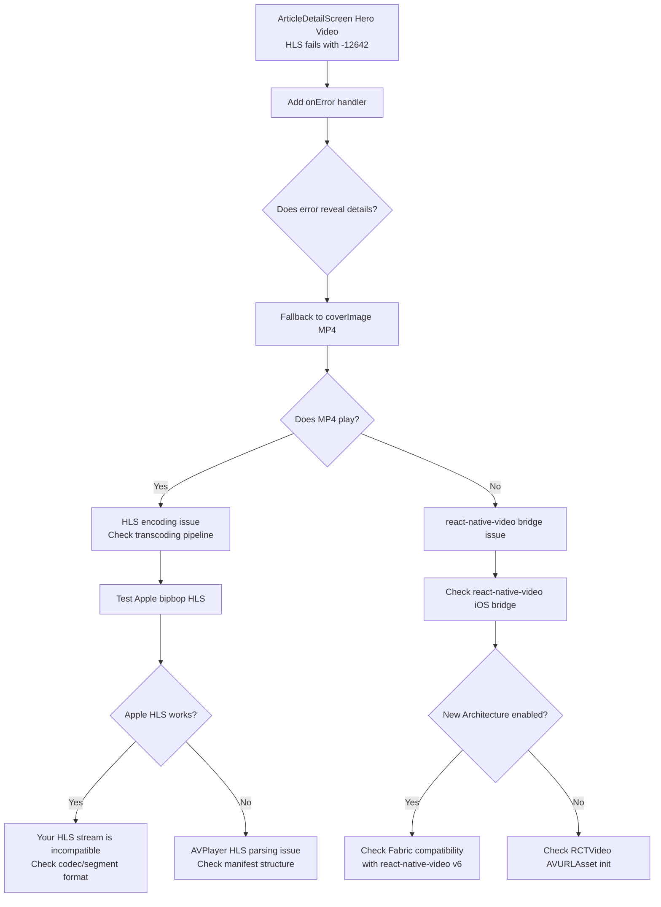

# iOS Video Playback Error -12642 Diagnosis & Fix Plan

## Architecture Analysis: Why iOS Native Fails While H5 Works

### Current State (Post-Log Analysis)

From actual API response log:
```json
{
  "coverImage": "https://img.joyminis.com/.../4c66f3e5-9242-448e-958c-25f9131f8c51.mp4",
  "meta": {
    "video": {
      "hlsUrl": "https://img.joyminis.com/.../hls/master.m3u8",
      "poster": "https://img.joyminis.com/.../poster.jpg"
    }
  }
}
```

**Confirmed working:**
- ✅ `hlsUrl` is a full absolute URL with `https://` — NOT a protocol-relative URL
- ✅ `coverImage` is a real `.mp4` file — NOT a JPEG/WebP image
- ✅ `source={{ uri: hlsUrl }}` syntax is used correctly everywhere
- ✅ ArticleCard's MP4 fallback (`coverImage`) is valid since it points to a real video

### Data Flow Architecture

```
┌─────────────────────────────────────────────────────────────────────┐
│                        Backend API                                   │
│  GET /api/v1/frontend/blog/articles/:slug                            │
│  └─ response.meta.video.hlsUrl = "https://.../master.m3u8"          │
│  └─ response.coverImage      = "https://.../original.mp4"           │
└──────────────────────────┬──────────────────────────────────────────┘
                           │
                           ▼
┌─────────────────────────────────────────────────────────────────────┐
│                    ArticleDetailScreen.tsx                           │
│                                                                      │
│  Line 313: {article.meta?.video?.hlsUrl ? (                         │
│  Line 315:   <Video                                                  │
│  Line 317:     source={{ uri: article.meta.video.hlsUrl }}          │
│  Line 319:     poster={...}                                         │
│  Line 321:     controls                                              │
│  Line 322:     resizeMode="contain"                                  │
│  Line 323:   />                                                      │
│  Line 324: ) : null}                                                 │
│                                                                      │
│  ⚠ CRITICAL: NO onError handler                                     │
│  ⚠ CRITICAL: NO HLS→MP4 fallback                                    │
└──────────────────────────┬──────────────────────────────────────────┘
                           │
                           ▼
┌─────────────────────────────────────────────────────────────────────┐
│              react-native-video v6 (JS → Native Bridge)              │
│                                                                      │
│  Video.tsx (library internal)                                        │
│  └─ Passes URI string to native module                               │
│     └─ RCTVideoManager (iOS)                                         │
│        └─ AVURLAsset *asset = [AVURLAsset URLAssetWithURL:url]      │
│           └─ AVPlayerItem *item = ...                                │
│              └─ AVPlayer                                                │
└──────────────────────────┬──────────────────────────────────────────┘
                           │
                           ▼
┌─────────────────────────────────────────────────────────────────────┐
│              AVFoundation (iOS Native)                                │
│                                                                      │
│  AVPlayer loads HLS manifest (master.m3u8)                           │
│  └─ Parses variant streams                                           │
│  └─ Selects appropriate bitrate                                      │
│  └─ Downloads .ts or .m4s segments                                   │
│  └─ Attempts to decode video frames                                  │
│                                                                      │
│  If any step fails → CoreMedia -12642                                 │
│  Possible causes:                                                     │
│  1. HLS manifest references incompatible codec profile               │
│  2. Segment container format not supported by AVPlayer               │
│  3. CDN returns incorrect Content-Type for .m3u8                     │
│  4. HLS AES-128 key retrieval fails                                  │
│  5. Timestamp discontinuity in segments                              │
└─────────────────────────────────────────────────────────────────────┘
```

### Root Cause Analysis

The most likely scenario based on architecture:

```
User taps article → navigates to ArticleDetailScreen
  → Hero Video mounts with HLS URL
  → User taps play (controls)
  → AVPlayer loads master.m3u8
  → AVPlayer picks a variant stream
  → Variant stream's codec/segment format is incompatible
  → CoreMedia -12642
  → ❌ No onError → user sees black box
  → ❌ No fallback → never tries coverImage (MP4)
```

### Key Differences: H5 vs iOS Native

| Aspect | H5 Browser | iOS AVPlayer |
|--------|-----------|-------------|
| HLS manifest parsing | Uses MediaSource + SourceBuffer | Native AVAsset parser |
| Codec negotiation | Falls back to different decoder | Strict format requirements |
| MIME type resolution | HEAD request + content-type sniffing | Requires correct Content-Type |
| Error tolerance | Forgiving (skips bad segments) | Strict (fails on first bad segment) |
| Debug visibility | Browser DevTools network tab | Console logs only (if configured) |

## Diagnosis Steps (Priority Order)

### Step 1: Add onError + HLS→MP4 Fallback to ArticleDetailScreen

**Files:** [`src/screens/ArticleDetailScreen.tsx`](src/screens/ArticleDetailScreen.tsx)

**Changes:**
1. Add state for video error handling: `videoError`, `useMp4Fallback`
2. Add `onError` callback that:
   - Logs the full error object
   - Falls back to `article.coverImage` (which is a real .mp4 file)
3. Conditionally render: if fallback active, use `source={{ uri: article.coverImage }}`

**Expected outcome:** If MP4 fallback works, the user at least gets video playback. The error details reveal if it's HLS-specific.

### Step 2: Test with Known-Good Public HLS Stream

Use Apple's official HLS test stream:
```
https://devstreaming-cdn.apple.com/videos/streaming/examples/img_bipbop_adv_example_fmp4/master.m3u8
```

**If public HLS works:** The issue is specific to your HLS encoding/CDN configuration
**If public HLS also fails:** The issue is in react-native-video v6 iOS bridge layer

### Step 3: If Public HLS Also Fails — Diagnose react-native-video Bridge

- Check `ios/Podfile.lock` for react-native-video version details
- Check if using New Architecture (Fabric) — react-native-video v6 may have different behavior
- Check iOS native RCTVideo source for how it initializes AVURLAsset
- Check if `AVURLAssetPreferPreciseDurationAndTimingKey` or other options are needed

### Step 4: Add URL Sanitization Utility

Create [`src/lib/utils/video.ts`](src/lib/utils/video.ts) with:
- `sanitizeVideoUrl(url: string): string` — ensures absolute URL
- `getVideoType(url: string): 'hls' | 'mp4' | 'unknown'`

### Step 5: Add onError to MarkdownRenderer Inline Videos

**Files:** [`src/components/blog/MarkdownRenderer.tsx`](src/components/blog/MarkdownRenderer.tsx)

### Step 6: Add Granular Playback Logging

- Log exact URL value at the moment of playback start (not just during render)
- Log the native error object structure from `onError`

### Step 7: List-Page Video Playback

The render log shows `hasVideo=false` for all list articles. Evaluate if the list API should include `meta.video` or if video playback should stay detail-only.

---

## Mermaid: Diagnosis Decision Tree



## Summary of Files to Modify

| File | Change |
|------|--------|
| [`src/screens/ArticleDetailScreen.tsx`](src/screens/ArticleDetailScreen.tsx) | Add onError + HLS→MP4 fallback to hero video |
| [`src/components/blog/MarkdownRenderer.tsx`](src/components/blog/MarkdownRenderer.tsx) | Add onError handler to inline videos |
| `src/lib/utils/video.ts` (new) | URL sanitization utility |
| [`src/components/blog/ArticleCard.tsx`](src/components/blog/ArticleCard.tsx) | Verify fallback, add playback-point logging |
